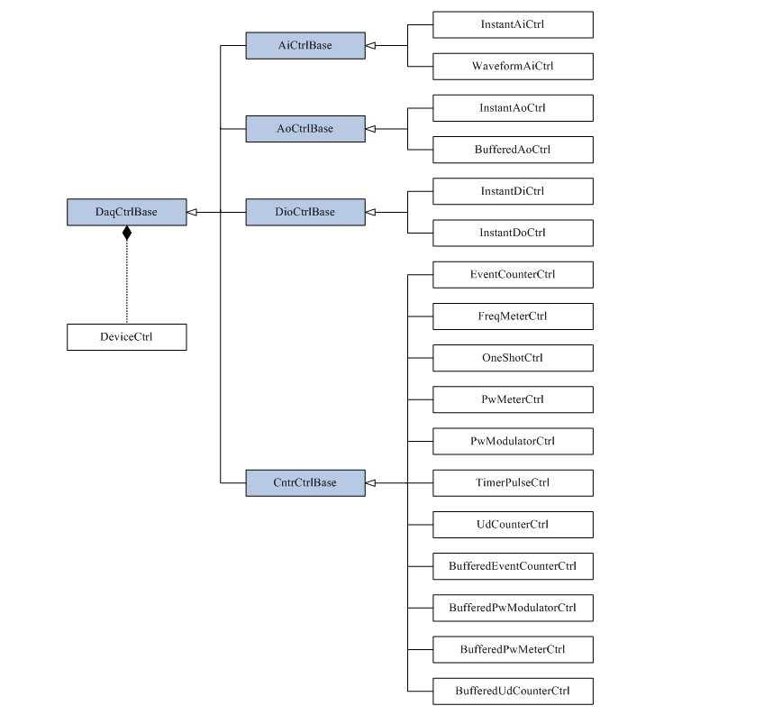

# 组件

组件样式类库 (CSCL) 应用面向组件的概念，根据功能封装了我们提供给用户的很多 API ，形成了许多具有重点功能的组件，组成了一个组件库。
每个组件都有其属性、方法和时间，都符合自然语言的使用习惯

从系统图中可以看到，常用功能封装 17 个组件：

* `AiCtrlBase` 模拟输入控制基础： 
  * `InstantAiCtrl` _即时模拟输入控制_ 
  * `WaveformAiCtrl` _波模拟输入控制_
* `AoCtrlBase` 模拟输出控制基础：
  * `InstantAoCtrl` _即时模拟输出控制_
  * `BufferedAoCtrl` _带缓冲的模拟输出控制_
* `DioCtrlBase` 数字输入输出控制基础
  * `InstanatDiCtrl` _即时数字输入控制_
  * `InstantDoCtrl` _即时数字输出控制_
* `CntrCtrlBase` 计数器控制基础：
  * `EventCounterCtrl` _事件计数器控制_
  * `FreqMeterCtrl` __
  * `OneShotCtrl` __
  * `PwMeterCtrl` __
  * `PwModulatorCtrl` __
  * `TimerPulseCtrl` __
  * `UdCounterCtrl` __
  * `BufferedEventCounterCtrl` __
  * `BufferedPwModulatorCtrl` __
  * `BufferedPwMeterCtrl` __
  * `BufferedUdCounterCtrl` __

资源管理器中可以查看到设备，

* IRQ : 中断请求，用于执行硬件中断请求动作。

## 访问模式

在 DAQNavi 中，无论您将使用设备那些功能，过程都是通过属性 `SelectedDevice` 选择设备，然后运行该功能。

设备的访问权限管理是指选择 `SelectedDevice` 时如何访问设备。
不同的访问模式为设备操作提供了不同的权限。
有三种访问模式：

* Read Only (只读模式)
* Write (写模式)

## PCI 设备

对于 PCI 设备，可以通过卡上的拨号开关设置其各自的主板 ID 。

* 主板 ID 默认为 0
* 对于支持版 ID 的设备，建议您使用非零板 ID ，以避免因插槽更改或其他情况导致设备编号更改
* 使用非零板 ID 时，一个型号的多张卡的板 ID 不应相同
* 只有当新设备的主板 ID 与同类型的其他设备的主板 ID 不同时，才会安排新设备

| SW1     | 3     | 2     | 1     | 0     |
|---------|-------|-------|-------|-------|
| BoardID | ID3   | ID2   | ID1   | ID0   |
| 0       | `ON`  | `ON`  | `ON`  | `ON`  |
| 1       | `ON`  | `ON`  | `ON`  | `OFF` |
| 2       | `ON`  | `ON`  | `OFF` | `ON`  |
| 3       | `ON`  | `ON`  | `OFF` | `OFF` |
| 4       | `ON`  | `OFF` | `ON`  | `ON`  |
| 5       | `ON`  | `OFF` | `ON`  | `OFF` |
| 6       | `ON`  | `OFF` | `OFF` | `ON`  |
| 7       | `ON`  | `OFF` | `OFF` | `OFF` |
| 8       | `OFF` | `ON`  | `ON`  | `ON`  |
| 9       | `OFF` | `ON`  | `ON`  | `OFF` |
| 10      | `OFF` | `ON`  | `OFF` | `ON`  |
| 11      | `OFF` | `ON`  | `OFF` | `OFF` |
| 12      | `OFF` | `OFF` | `ON`  | `ON`  |
| 13      | `OFF` | `OFF` | `ON`  | `OFF` |
| 14      | `OFF` | `OFF` | `OFF` | `ON`  |
| 15      | `OFF` | `OFF` | `OFF` | `OFF` |

