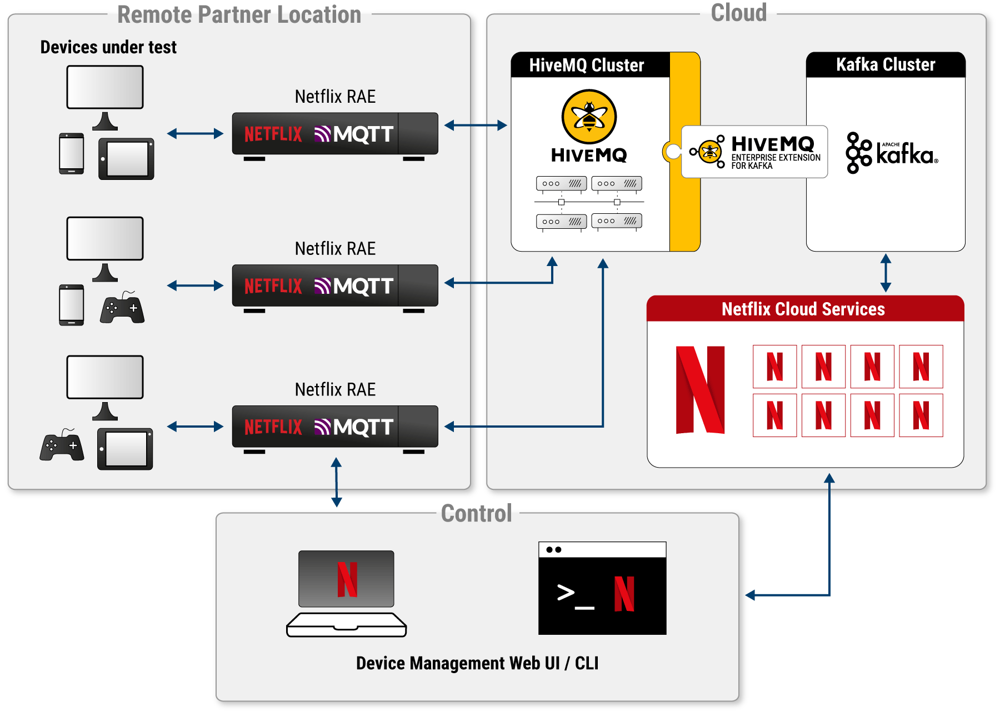

# [Netflix relies on HiveMQ to run the Netflix app certification process _Netflix](https://www.hivemq.com/case-studies/netflix/) 依靠 HiveMQ 运行 Netflix 应用程序认证流程_

With 222 million subscribers in over 190 countries, Netflix is not only the largest streaming platform in the world but also the industry leader in reliability and ease of use. 
One of the big advantages Netflix offers its members is the convenience of watching content on hundreds of different types of TV devices along with browsers and mobile devices. 
To ensure that all those TV devices deliver the flawless user experience that Netflix members enjoy, the Partner Infrastructure team at Netflix provides infrastructure to test and certify each device before onboarding the device to the Netflix application. 
After certification, continued monitoring in the field guarantees that devices remain in line with Netflix’s quality standards. 
HiveMQ plays a central role in helping Netflix achieve the robust and scalable bidirectional communication the device certification process requires.

Netflix 在 190 多个国家/地区拥有 2.22 亿用户，不仅是世界上最大的流媒体平台，而且在可靠性和易用性方面处于行业领先地位。
Netflix 为其会员提供的一大优势是可以方便地在数百种不同类型的电视设备以及浏览器和移动设备上观看内容。
为确保所有这些电视设备都能为 Netflix 会员提供完美的用户体验，Netflix 的合作伙伴基础架构团队提供了基础架构，以便在将设备加入 Netflix 应用程序之前测试和认证每台设备。
获得认证后，现场持续监控可确保设备始终符合 Netflix 的质量标准。
HiveMQ 在帮助 Netflix 实现设备认证过程所需的强大且可扩展的双向通信方面发挥着核心作用。

> "The adoption of HiveMQ has allowed us to move to a new paradigm of testing. 
> Previously, all testing required a user to navigate to a website and manually launch tests. 
> With the MQTT architecture that HiveMQ supports, we have made testing automatable via a modern CLI. 
> This approach enables much more scalable testing and continuous integration that has empowered quite a few teams both inside and outside of Netflix."
> 
> Benson Ma, Senior Software Engineer, Netflix

> "HiveMQ 的采用使我们能够转向新的测试模式。
> 以前，所有测试都需要用户导航到网站并手动启动测试。
> 借助 HiveMQ 支持的 MQTT 架构，我们可以通过现代 CLI 使测试自动化。 
> 这种方法实现了更具可扩展性的测试和持续集成，这为 Netflix 内外的许多团队提供了支持。"
> 
> Benson Ma, Senior Software Engineer, Netflix

Working together with leading consumer electronics companies around the globe also means that the Partner Infrastructure team must efficiently handle fluctuations in the certification load. 
For example, when electronics stores in the US roll out new models around the holidays season, that translates to October through November being a peak certification season. 
In that time frame, any delays or downtime in the certification process can lead to product-release delays and loss of revenue on the part of Netflix and the partner.

与全球领先的消费电子公司合作也意味着合作伙伴基础架构团队必须有效地处理认证负载的波动。
例如，当美国的电子商店在假期期间推出新型号时，这意味着 10 月到 11 月是认证高峰期。
在此时间范围内，认证过程中的任何延迟或停机都可能导致 Netflix 和合作伙伴的产品发布延迟和收入损失。

“_In some partner scenarios, multiple partners work in collaboration._ 
There could be an OEM in Korea and an integrator in India. 
The device can be in one network and the trigger for the automated test on another network in another country.” 
explains Inder Singh, Senior Software Engineer at Netflix.

“_在某些合作伙伴场景中，多个合作伙伴协同工作。_
韩国可能有 OEM，印度可能有集成商。
该设备可以在一个网络中，并在另一个国家的另一个网络上触发自动测试。”
Netflix 高级软件工程师 Inder Singh 解释道。

## Netflix Device Management Platform Architecture _Netflix 设备管理平台架构_

The [Netflix Device Management Platform](https://netflixtechblog.com/towards-a-reliable-device-management-platform-4f86230ca623) is designed to give developers a consistent way to deploy and execute automated tests on Netflix-ready devices. 
At the remote partner location, the Partner Infrastructure team provides a customized embedded computer called the Reference Automation Environment (RAE). 
Each RAE comes preinstalled with multiple Netflix services to detect, onboard, and collect information from the devices that connect to the RAE. 
Due to the constrained nature of the RAE and the devices being tested, MQTT is used for all communication with the RAE. 
Platform users can interact with the cloud services and the services on the RAEs through a web browser or command line interface (CLI).

[Netflix 设备管理平台](https://netflixtechblog.com/towards-a-reliable-device-management-platform-4f86230ca623) 旨在为开发人员提供一种在 Netflix 就绪设备上部署和执行自动化测试的一致方式。
在远程合作伙伴位置，合作伙伴基础架构团队提供了一个定制的嵌入式计算机，称为参考自动化环境 (RAE)。
每个 RAE 都预装了多个 Netflix 服务，用于检测、载入和收集来自连接到 RAE 的设备的信息。
由于 RAE 和被测试设备的限制性质，MQTT 用于与 RAE 的所有通信。
平台用户可以通过 Web 浏览器或命令行界面 (CLI) 与云服务和 RAE 上的服务进行交互。

Several considerations led Netflix to choose the MQTT protocol for use in the platform. 
Key features included MQTT’s support for hierarchical topics, client authentication/authorization, per-topic access control lists (ACL), bi-directional request/response message patterns, and the ability to handle unreliable network connections. 
All of these elements are crucial for the business use cases the Device Management Platform fulfills.

几个考虑因素导致 Netflix 选择在平台中使用 MQTT 协议。
主要功能包括 MQTT 对分层主题的支持、客户端身份验证授权、每个主题的访问控制列表 (ACL)、双向请求响应消息模式以及处理不可靠网络连接的能力。
所有这些元素对于设备管理平台实现的业务用例至关重要。

The Device Management Platform encompasses numerous cloud services that orchestrate tests, execute commands, collect logging information, pump metrics, and more. 
In keeping with Netflix’s internal adoption and support of Apache Kafka as the standard tooling for message queues, the cloud services on the platform implement Kafka-based message processing. 
For consistency and ease of development, the Device Management Platform also utilizes a custom-built authorization system that is part of the Netflix infrastructure. 
In the resulting architecture, the MQTT-based services on the RAE and the Kafka-based services in the Netflix cloud need to continuously send and receive information between each other.

设备管理平台包含众多云服务，可协调测试、执行命令、收集日志记录信息、泵指标等。
为了与 Netflix 内部采用和支持 Apache Kafka 作为消息队列的标准工具保持一致，平台上的云服务实现了基于 Kafka 的消息处理。
为了保持一致性和易于开发，设备管理平台还利用了定制的授权系统，该系统是 Netflix 基础设施的一部分。
在由此产生的架构中，RAE 上基于 MQTT 的服务和 Netflix 云中基于 Kafka 的服务需要在彼此之间不断地发送和接收信息。

To establish the necessary bridge between the MQTT and Kafka protocols, the Partner Infrastructure team deploys a five-node HiveMQ Enterprise MQTT Broker with the HiveMQ Enterprise Extension for Kafka. 
To accomodate integration with the Netflix authorization system, the team leveraged HiveMQ’s flexible extension framework to design a bespoke HiveMQ security extension. 
The custom HiveMQ extension enables users to interact with the platform via web browser or CLI while using the supported Netflix authorization system. 
The HiveMQ bridge allows MQTT messages from the field to be directly converted to Kafka records in the cloud. 
Conversely, Kafka messages from the cloud are mapped to the appropriate MQTT topics on the RAE. 
The RAE and device session identifiers are embedded in the topic of each MQTT message, which allows the Netflix custom HiveMQ extension to apply topic ACLs to precisely control which RAEs and devices each partner can see and interact with.

为了在 MQTT 和 Kafka 协议之间建立必要的桥梁，合作伙伴基础架构团队部署了一个带有 HiveMQ Enterprise Extension for Kafka 的五节点 HiveMQ Enterprise MQTT Broker。
为了适应与 Netflix 授权系统的集成，该团队利用 HiveMQ 灵活的扩展框架来设计定制的 HiveMQ 安全扩展。
自定义 HiveMQ 扩展使用户能够通过 Web 浏览器或 CLI 与平台交互，同时使用支持的 Netflix 授权系统。
HiveMQ 桥允许来自现场的 MQTT 消息直接转换为云端的 Kafka 记录。
相反，来自云端的 Kafka 消息被映射到 RAE 上的适当 MQTT 主题。
RAE 和设备会话标识符嵌入在每个 MQTT 消息的主题中，这允许 Netflix 自定义 HiveMQ 扩展应用主题 ACL 来精确控制每个合作伙伴可以看到哪些 RAE 和设备并与之交互。

## Automated event-sourced testing with MQTT, HiveMQ, and Kafka _使用 MQTT、HiveMQ 和 Kafka 进行自动化的事件源测试_

At Netflix, building the best solution is a process of continuous research and innovation. 
Initially, the Partner Infrastructure team used an IoT cloud platform as the transport plane backing the Device Management Platform. 
However, as they scaled up, difficulties arose with the cloud platform’s support for MQTT. 
Issues included dropped MQTT messages, limited scalability of device connection rates, and restrictions on MQTT message size.

在 Netflix，构建最佳解决方案是一个不断研究和创新的过程。
最初，合作伙伴基础架构团队使用物联网云平台作为支持设备管理平台的传输平面。
然而，随着规模的扩大，云平台对 MQTT 的支持出现了困难。
问题包括 MQTT 消息丢失、设备连接速率的可扩展性有限以及 MQTT 消息大小的限制。

After investigating alternative MQTT broker solutions, Netflix conducted internal stress tests with an on-premise MQTT broker, the HiveMQ Enterprise MQTT broker, and their existing IoT cloud service as the control. 
The following month-long benchmarking tested approximately 1,000 Netflix Resource Automation Environments (RAE) with 5,000 clients per RAE. 
Ramp-up time was 1 minute with traffic of 100 messages per second and message sizes ranging from 256 KB to 1MB per message. 
In addition to being the only broker that provided 100% support for all features of the MQTT protocol, the HiveMQ broker was the most performant on each of the benchmarks. 
Based on the in-house evaluation results, Netflix selected HiveMQ as the MQTT broker for their Device Management Platform.

在调查了替代 MQTT 代理解决方案后，Netflix 使用本地 MQTT 代理、HiveMQ Enterprise MQTT 代理及其现有的物联网云服务作为控制进行了内部压力测试。
接下来为期一个月的基准测试测试了大约 1,000 个 Netflix 资源自动化环境 (RAE)，每个 RAE 有 5,000 个客户端。
加速时间为 1 分钟，流量为每秒 100 条消息，消息大小为每条消息 256 KB 到 1MB。
除了是唯一一个对 MQTT 协议的所有功能提供 100% 支持的代理之外，HiveMQ 代理在每个基准测试中都是性能最高的。
根据内部评估结果，Netflix 选择 HiveMQ 作为其设备管理平台的 MQTT 代理。

Netflix relies on HiveMQ to handle the bidirectional movement of data between the MQTT-based services on the RAE, the Kafka-based services in the cloud, and the platform users (CLI or web UI). 
With the combination of MQTT, HiveMQ, Apache Kafka and the custom HiveMQ security extension the team created to perform authorization-based topic routing, the Partner Infrastructure team accomplishes truly bidirectional and effective device management at scale.

Netflix 依靠 HiveMQ 来处理 RAE 上基于 MQTT 的服务、云中基于 Kafka 的服务以及平台用户（CLI 或 Web UI）之间的双向数据移动。
通过结合 MQTT、HiveMQ、Apache Kafka 和团队创建的自定义 HiveMQ 安全扩展来执行基于授权的主题路由，合作伙伴基础设施团队实现了真正的双向和有效的大规模设备管理。

## Achieving scalable, reliable, and secure device management _实现可扩展、可靠和安全的设备管理_

Gracefully managing the large number of devices that manufacturers submit to Netflix for certification is a significant technical challenge. 
For the Partner Infrastructure team, it is absolutely critical to keep device information up to date so that testing runs properly. 
Since the adoption of HiveMQ, the team has been very satisfied with their results and feels that HiveMQ has met all their business requirements. 
The fluid horizontal scalability of the HiveMQ broker easily handles bursts in demand and HiveMQ’s Kafka integration is a perfect fit for achieving the reliable bidirectional communication the Netflix device certification process requires.

妥善管理制造商提交给 Netflix 进行认证的大量设备是一项重大的技术挑战。
对于合作伙伴基础架构团队来说，让设备信息保持最新以确保测试正常运行是绝对关键的。
自从采用 HiveMQ 以来，团队对他们的结果非常满意，觉得 HiveMQ 已经满足了他们所有的业务需求。
HiveMQ 代理的流畅水平可扩展性可以轻松处理突发需求，而 HiveMQ 的 Kafka 集成非常适合实现 Netflix 设备认证过程所需的可靠双向通信。

Inder Singh confirms: 
_“Reliability is critical to us. 
We haven’t encountered any performance issues using the HiveMQ broker. 
With our new form of testing, all we need to do is provide the partners with the certs and they keep those certs on their tools and then enable remote automation on a device that could be anywhere.”_

Inder Singh 证实： 
_“可靠性对我们来说至关重要。
我们在使用 HiveMQ 代理时没有遇到任何性能问题。
使用我们新的测试形式，我们需要做的就是向合作伙伴提供证书，他们将这些证书保存在他们的工具上，然后在可以在任何地方的设备上启用远程自动化。”_

Helping 400+ consumer electronics and TV operator partners scale their Netflix certification and testing on 1,000+ devices at any given time (in locations around the world) is a complex undertaking. 
The use of HiveMQ has allowed the Partner Infrastructure team to streamline data transport in the Device Management Platform into a flat and reliable mesh (previously data exchange was point-to-point and multi-point). 
This topology has enormous implications for simplifying device test execution, edge monitoring, and data collection from the RAE. 
One such benefit is that the team can now enable continuous integration workflows for both internal use and partners. 
Additionally, being able to extend HiveMQ functionality with a custom extension has opened the possibility for all authorized participants to securely interact with the platform - effectively scaling the platform’s evolution.

帮助 400 多家消费电子产品和电视运营商合作伙伴在任何特定时间（在世界各地）在 1000 多台设备上扩展其 Netflix 认证和测试是一项复杂的任务。
HiveMQ 的使用使合作伙伴基础架构团队能够将设备管理平台中的数据传输简化为平坦且可靠的网格（以前的数据交换是点对点和多点）。
这种拓扑结构对于简化设备测试执行、边缘监控和从 RAE 收集数据具有巨大的意义。
这样的好处之一是团队现在可以为内部使用和合作伙伴启用持续集成工作流。
此外，能够使用自定义扩展来扩展 HiveMQ 功能为所有授权参与者提供了与平台安全交互的可能性——有效地扩展了平台的发展。

Benson Ma sums up: 
_“The adoption of HiveMQ has allowed us to move to a new paradigm of testing. 
Previously, all testing required a user to navigate to a website and manually launch tests. 
With the MQTT architecture that HiveMQ supports, we have made testing automatable via a modern CLI. 
This approach enables much more scalable testing and continuous integration that has empowered quite a few teams both inside and outside of Netflix.”_

Benson Ma 总结： 
_“HiveMQ 的采用使我们能够转向新的测试范式。
以前，所有测试都需要用户导航到网站并手动启动测试。
借助 HiveMQ 支持的 MQTT 架构，我们可以通过现代 CLI 使测试自动化。
这种方法实现了更具可扩展性的测试和持续集成，这为 Netflix 内外的许多团队提供了支持。”_
