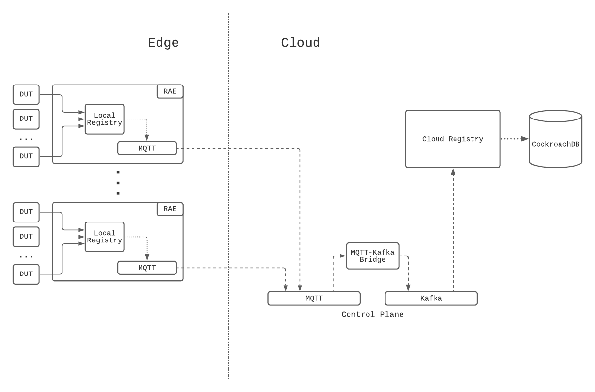

# [Towards a Reliable Device Management Platform](https://netflixtechblog.com/towards-a-reliable-device-management-platform-4f86230ca623) _迈向可靠的设备管理平台_

> By Benson Ma, Alok Ahuja

## Introduction _引言_

At Netflix, hundreds of different device types, from streaming sticks to smart TVs, are tested every day through automation to ensure that new software releases continue to deliver the quality of the Netflix experience that our customers enjoy. 
In addition, Netflix continuously works with its partners (such as Roku, Samsung, LG, Amazon) to port the Netflix SDK to their new and upcoming devices (TVs, smart boxes, etc), to ensure the quality bar is reached before allowing the Netflix application on the device to go out into the world. 
The Partner Infrastructure team at Netflix provides solutions to support these two significant efforts by enabling device management at scale.

在 Netflix，从流媒体棒到智能电视的数百种不同设备类型每天都通过自动化进行测试，以确保新软件版本继续提供我们客户所享受的 Netflix 体验质量。
此外，Netflix不断与其合作伙伴（如 Roku，Samsung，LG，Amazon）合作，将Netflix SDK移植到他们新的和即将推出的设备（电视，智能盒子等），以确保在允许设备上的Netflix应用进程走向世界之前达到质量标准。
Netflix 的合作伙伴基础架构团队通过启用大规模设备管理来提供支持这两项重大工作的解决方案。

## Background _背景_

To normalize the diversity of networking environments across both the Netflix and Partner networks and create a consistent and controllable computing environment on which users can run regression and Netflix application [certification testing for devices](), the Partner Infrastructure team provides a customized embedded computer called the Reference Automation Environment (RAE). 
Complementing the hardware is the software on the RAE and in the cloud, and bridging the software on both ends is a bi-directional control plane. 
Together, they form the Device Management Platform, which is the infrastructural foundation for [Netflix Test Studio]() (NTS). 
Users then effectively run tests by connecting their devices to the RAE in a plug-and-play fashion.

为了规范 Netflix 和合作伙伴网络中网络环境的多样性，并创建一个一致且可控的计算环境，用户可以在其上运行回归和 Netflix 应用进程 [设备认证测试]()，合作伙伴基础设施团队提供了一款称为参考自动化环境 （RAE） 的定制嵌入式计算机。
与硬件相辅相成的是RAE和云端的软件，两端的软件桥接是双向控制平面。
它们共同构成了设备管理平台，这是 [Netflix Test Studio]() (NTS) 的基础设施。
然后，用户通过以即插即用的方式将他们的设备连接到 RAE 来有效地运行测试。

The platform allows for effective device management at scale, and its feature set is broadly divided into two areas:

该平台允许大规模有效的设备管理，其功能集大致分为两个领域：

1. Provide a service-level abstraction for controlling devices and their environments (hardware and software topologies).

2. Collect and aggregate information and state updates for all devices attached to the RAEs in the fleet. 
    In this blog post, we will focus on the latter feature set.

1. 为控制设备及其环境（硬件和软件拓扑）提供服务级抽象。

2. 收集和汇总连接到队列中 RAE 的所有设备的信息和状态更新。
   在这篇博文中，我们将重点关注后一个功能集。

Over the lifecycle of a device connected to the RAE, the device can change attributes at any time. 
For example, when running tests, the state of the device will change from “available for testing” to “in test.” In addition, because many of these devices are pre-production devices and thus subject to frequent firmware changes, attributes that are generally static in production devices can sometimes change as well, such as the MAC address and the Electronic Serial Number (ESN) assigned to the Netflix installation on the device. 
As such, it is very critical to be able to keep device information up to date for device tests to work properly. 
In the Device Management Platform, this is achieved by having device updates be event-sourced through the control plane to the cloud so that NTS will always have the most up-to-date information about the devices available for testing. 
The challenge, then, is to be able to ingest and process these events in a scalable manner, i.e., scaling with the number of devices, which will be the focus of this blog post.

在连接到 RAE 的设备的整个生命周期中，设备可以随时更改属性。
For example, when running tests, the state of the device will change from “available for testing” to “in test.” In addition, because many of these devices are pre-production devices and thus subject to frequent firmware changes, attributes that are generally static in production devices can sometimes change as well, such as the MAC address and the Electronic Serial Number (ESN) assigned to the Netflix installation on the device. 
As such, it is very critical to be able to keep device information up to date for device tests to work properly. 
In the Device Management Platform, this is achieved by having device updates be event-sourced through the control plane to the cloud so that NTS will always have the most up-to-date information about the devices available for testing. 
The challenge, then, is to be able to ingest and process these events in a scalable manner, i.e., scaling with the number of devices, which will be the focus of this blog post.

## System Setup _系统设置_

### Architecture _架构_

The following diagram summarizes the architecture description:

The RAE is configured to be effectively a router that devices under test (DUTs) are connected to. 
On the RAE, there exists a service called the Local Registry, which is responsible for detecting, onboarding, and maintaining information about all devices connected to the LAN side of the RAE. 
When a new hardware device is connected, the Local Registry detects and collects a set of information about it, such as networking information and ESN. 
At periodic intervals, the Local Registry probes the device to check on its connection status. 
As the device attributes and properties change over time, these changes are saved into the Local Registry and simultaneously published upstream to the Device Management Platform’s control plane. 
In addition to attribute changes, a complete snapshot of the device record is published upstream by the Local Registry at regular intervals as a form of state reconciliation. 
These checkpoint events enable faster state reconstruction by consumers of the data feed while guarding against missed updates.

On the cloud side, a service called the Cloud Registry ingests the device information updates published by the Local Registry instance, processes them, and subsequently pushes materialized data into a datastore backed by CockroachDB. 
CockroachDB is chosen as the backing data store since it offered SQL capabilities, and our data model for the device records was normalized. 
In addition, unlike other SQL stores, CockroachDB is designed from the ground up to be horizontally scalable, which addresses our concerns about Cloud Registry’s ability to scale up with the number of devices onboarded onto the Device Management Platform.

### Control Plane _控制面板_

