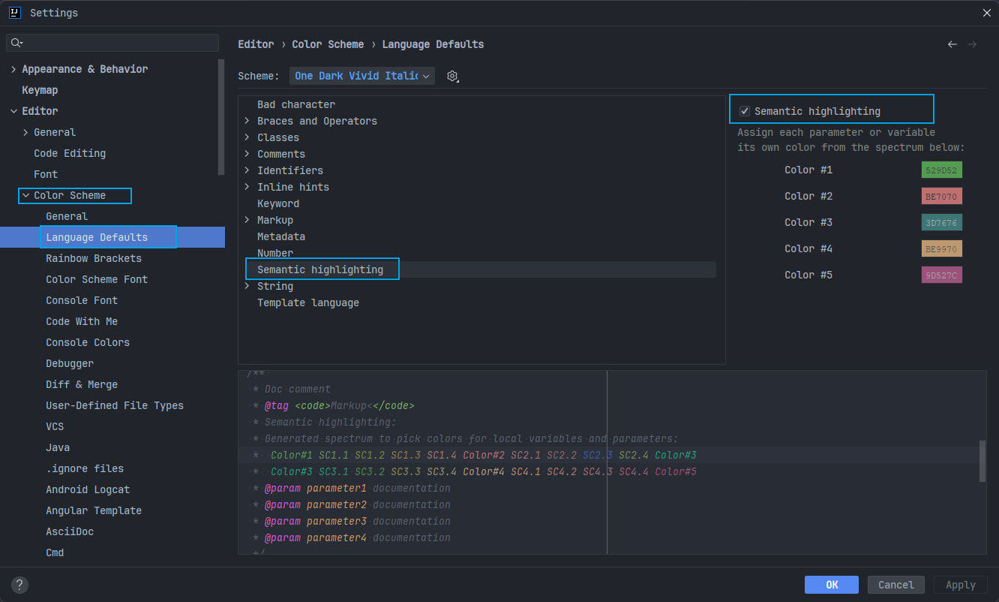

# Tutorials

* `XXX Best Practice`
* `Best Programming Resource`

Java: https://www.youtube.com/@java/playlists

## 必读书籍

* 《代码大全》
* 《程序员修炼之道》
* 《计算机的构造和解释》
* 《算法导论》
* 《重构》
* 《人月神话》
* 《代码整洁之道》
* 《Effective C++》 《More Effective C++》
* 《Unix 编程艺术》 《Unix 高级环境编程》
* The C Programming Language by Kernighan and Ritchie
* Introduction to Algorithms by Cormen, Leiserson, Rivest & Stein
* Design Patterns by the Gang of Four
* Refactoring: Improving the Design of Existing Code
* The Mythical Man Month
* The Art of Computer Programming by Donald Knuth
* Compilers: Principles, Techniques and Tools by Alfred V. Aho, Ravi Sethi and Jeffrey D. Ullman
* Gödel, Escher, Bach by Douglas Hofstadter
* Clean Code: A Handbook of Agile Software Craftsmanship by Robert C. Martin
* CODE by Charles Petzold
* Programming Pearls by Jon Bentley
* Working Effectively with Legacy Code by Michael C. Feathers
* Peopleware by Demarco and Lister
* Coders at Work by Peter Seibel
* Surely You're Joking, Mr. Feynman!
* Effective Java 2nd edition
* Patterns of Enterprise Application Architecture by Martin Fowler
* The Little Schemer
* The Seasoned Schemer
* Why's (Poignant) Guide to Ruby
* The Inmates Are Running The Asylum: Why High Tech Products Drive Us Crazy and How to Restore the Sanity
* The Art of Unix Programming
* Test-Driven Development: By Example by Kent Beck
* Practices of an Agile Developer
* Don't Make Me Think
* Agile Software Development, Principles, Patterns, and Practices by Robert C. Martin
* Domain Driven Designs by Eric Evans
* The Design of Everyday Things by Donald Norman
* Modern C++ Design by Andrei Alexandrescu
* Best Software Writing I by Joel Spolsky
* The Practice of Programming by Kernighan and Pike
* Pragmatic Thinking and Learning: Refactor Your Wetware by Andy Hunt
* Software Estimation: Demystifying the Black Art by Steve McConnel
* The Passionate Programmer (My Job Went To India) by Chad Fowler
* Hackers: Heroes of the Computer Revolution
* Algorithms + Data Structures = Programs
* Writing Solid Code
* JavaScript - The Good Parts
* Getting Real by 37 Signals
* Foundations of Programming by Karl Seguin
* Computer Graphics: Principles and Practice in C (2nd Edition)
* Thinking in Java by Bruce Eckel
* The Elements of Computing Systems
* Refactoring to Patterns by Joshua Kerievsky
* Modern Operating Systems by Andrew S. Tanenbaum
* The Annotated Turing
* Things That Make Us Smart by Donald Norman
* The Timeless Way of Building by Christopher Alexander
* The Deadline: A Novel About Project Management by Tom DeMarco
* The C++ Programming Language (3rd edition) by Stroustrup
* Patterns of Enterprise Application Architecture
* Computer Systems - A Programmer's Perspective
* Agile Principles, Patterns, and Practices in C# by Robert C. Martin
* Growing Object-Oriented Software, Guided by Tests
* Framework Design Guidelines by Brad Abrams
* Object Thinking by Dr. David West
* Advanced Programming in the UNIX Environment by W. Richard Stevens
* Hackers and Painters: Big Ideas from the Computer Age
* The Soul of a New Machine by Tracy Kidder
* CLR via C# by Jeffrey Richter
* The Timeless Way of Building by Christopher Alexander
* Design Patterns in C# by Steve Metsker
* Alice in Wonderland by Lewis Carol
* Zen and the Art of Motorcycle Maintenance by Robert M. Pirsig
* About Face - The Essentials of Interaction Design
* Here Comes Everybody: The Power of Organizing Without Organizations by Clay Shirky
* The Tao of Programming
* Computational Beauty of Nature
* Writing Solid Code by Steve Maguire
* Philip and Alex's Guide to Web Publishing
* Object-Oriented Analysis and Design with Applications by Grady Booch
* Effective Java by Joshua Bloch
* Computability by N. J. Cutland
* Masterminds of Programming
* The Tao Te Ching
* The Productive Programmer
* The Art of Deception by Kevin Mitnick
* The Career Programmer: Guerilla Tactics for an Imperfect World by Christopher Duncan
* Paradigms of Artificial Intelligence Programming: Case studies in Common Lisp
* Masters of Doom
* Pragmatic Unit Testing in C# with NUnit by Andy Hunt and Dave Thomas with Matt Hargett
* How To Solve It by George Polya
* The Alchemist by Paulo Coelho
* Smalltalk-80: The Language and its Implementation
* Writing Secure Code (2nd Edition) by Michael Howard
* Introduction to Functional Programming by Philip Wadler and Richard Bird
* No Bugs! by David Thielen
* Rework by Jason Freid and DHH
* JUnit in Action

## Framework

* [EasyMock](./tdd/easymock/Easy%20Mock/Overview.md)
* [Lombok](./tdd/lombok/Lombok/Overview.md)
* [The Checker Framework](./tdd/checkerframework/Checker%20Framework/Overview.md)
* [Apache Commons]()

* Spring Framework Dependencies: [https://start.spring.io/actuator/info](https://start.spring.io/actuator/info)

---

[Objenesis](http://objenesis.org/)

# Excellent Literature

* [How to Write an Equality Method in Java](./tdd/lombok/Lombok/How%20to%20Write%20an%20Equality%20Method%20in%20Java.md)
* [Understanding Java Records From Java 16](./tdd/lombok/Lombok/Understanding%20Java%20Records%20From%20Java%2016.md)
* [Logging exceptions in Java](https://www.loggly.com/blog/logging-exceptions-in-java/)

* https://xlinux.nist.gov/dads/HTML/zeroaryfunc.html#:~:text=Definition%3AA%20functionthat%20takes%20no%20arguments.%20Also%20known%20asnullary,with%20external%20variables%29%20must%20be%20a%20constant%20function.
* https://xlinux.nist.gov/dads/HTML/function.html
* https://xlinux.nist.gov/dads/
* https://xlinux.nist.gov/

* [用户系统设计:三户模型&三层身份模型](https://www.biaodianfu.com/customer-user-account-model.html)
* [The Tripartite Identity Pattern](http://habitatchronicles.com/2008/10/the-tripartite-identity-pattern/)
* [哈希一致性算法](https://zhuanlan.zhihu.com/p/129049724#:~:text=%E4%B8%80%E8%87%B4%E6%80%A7hash%E7%AE%97%E6%B3%95%E6%AD%A3%E6%98%AF%E4%B8%BA%E4%BA%86%E8%A7%A3%E5%86%B3%E6%AD%A4%E7%B1%BB%E9%97%AE%E9%A2%98%E7%9A%84%E6%96%B9%E6%B3%95%EF%BC%8C%E5%AE%83%E5%8F%AF%E4%BB%A5%E4%BF%9D%E8%AF%81%E5%BD%93%E6%9C%BA%E5%99%A8%E5%A2%9E%E5%8A%A0%E6%88%96%E8%80%85%E5%87%8F%E5%B0%91%E6%97%B6%EF%BC%8C%E8%8A%82%E7%82%B9%E4%B9%8B%E9%97%B4%E7%9A%84%E6%95%B0%E6%8D%AE%E8%BF%81%E7%A7%BB%E5%8F%AA%E9%99%90%E4%BA%8E%E4%B8%A4%E4%B8%AA%E8%8A%82%E7%82%B9%E4%B9%8B%E9%97%B4%EF%BC%8C%E4%B8%8D%E4%BC%9A%E9%80%A0%E6%88%90%E5%85%A8%E5%B1%80%E7%9A%84%E7%BD%91%E7%BB%9C%E9%97%AE%E9%A2%98%E3%80%82%201.,%E7%8E%AF%E5%BD%A2Hash%E7%A9%BA%E9%97%B4%20%E6%8C%89%E7%85%A7%E5%B8%B8%E7%94%A8%E7%9A%84hash%E7%AE%97%E6%B3%95%E6%9D%A5%E5%B0%86%E5%AF%B9%E5%BA%94%E7%9A%84key%E5%93%88%E5%B8%8C%E5%88%B0%E4%B8%80%E4%B8%AA%E5%85%B7%E6%9C%892%5E32%E6%AC%A1%E6%96%B9%E4%B8%AA%E6%A1%B6%E7%9A%84%E7%A9%BA%E9%97%B4%E4%B8%AD%EF%BC%8C%E5%8D%B30~%20%282%5E32%29-1%E7%9A%84%E6%95%B0%E5%AD%97%E7%A9%BA%E9%97%B4%E4%B8%AD%E3%80%82)
* [Spark-Streaming反压（back-pressure）](https://zhuanlan.zhihu.com/p/45954932)
* [实时流处理系统反压机制（BackPressure）综述](https://zhuanlan.zhihu.com/p/38157397)

## 高可用，高并发

* [基于四层网络协议的 LVS 解决方案](components/LVS/LVS%20高可用%20高并发%20负载均衡.md)

## 疑问点

* 对于生命周期的概念，是否对应映射到容器，使得对象数据与生命周期隔离会不会更合适；
* 枚举引入二进制

## 微服务设计原则

> **隔离系统变化点**；

* 高内聚，低耦合；
* 高度自治：开发、测试、构建、部署、运行、发布（无状态）；
* 以业务为中心；
* 弹性设计（容错、隔离、降级）；
* 自动化（CI、CD）；
* 粒度把控（按照业务逻辑来）；

> **AKF**
> 
> `x` 轴：水平复制；
> `y` 轴：业务拆分（拆分成更小的服务）；
> `z` 轴：数据分片（按照业务类型，地区等；

> **QPS(Queries Per Second, 每秒查询率)** 
> 
> (2000/300)
> 
> 服务器每秒处理查询的数量；
> 
> **TPS(Transactions Per Second, 每秒事务率)**
> 
> 服务器每秒处理事务的数量；

### 接口设计原则

* Restful 风格（Http)

    重在**资源**；
    * 协议 超文本传输协议
    * 域名 `api.domain_name.com`
    * 版本 `v1`
    * 路径 建议使用名词
    * 动作
        * `post` 新增
        * `put` 修改（传输修改记录的全量数据）
        * `patch` 修改（仅传输修改的具体部分）
        * `delete` 删除
        * `get` 查询

### 接口安全

* CIA：
    * 保密性（脱敏）
    * 完整性（防止篡改）
    * 可用性

* 数据层面：防止 SQL 注入
    * 过滤（`jsoup` 框架）
    * `spring-htmlUtils` 预防 `xss`
    * 人机交互、token 防止 `csrf` 攻击

* 数据权限控制（水平越权、垂直越权）

> MyBatis `$` 直接拼接 `#` 

> `xss` 攻击
> 
> 提交内容含有 `JavaScript` 脚本；
> 
> `csrf` 跨站伪装请求
> 
> **`xss` vs `csrf`**
> 
> `xss` 在正常请求中执行了恶意代码，用户数据没有过滤、转义；
> `csrf` 冒充登录信息，没有防范不信任的调用；

> `Referer` 
> 
> HTTP 请求头的一部分；
> 表示来源；用于防盗链、防止恶意请求；

### 日志

* dao 层异常，不用打日志， `catch` 抛出；
* service 层打印异常日志，覆盖详细信息；
* controller 层捕获异常，包装成状态码；
* dto 抽象到公共层(common, 二方库)；

## 通用项目结构

-> project-name
-----> .github
-----> ci
-----> design
-----> docs
-----> scripts
-----> scr
-----> pom.xml
-----> README.md

## Spring

* exception & business error & verify parameters
* exception in lambda
* logger
* java modules
* source code
* Record and design patterns
  * https://howtodoinjava.com/java/basics/builder-pattern-for-java-records/

------

1. 制品管理
2. 持续集成持续部署
3. code review
4. 测试组件
5. [Java Language Updates](https://docs.oracle.com/en/java/javase/20/language/java-language-changes.html#GUID-6459681C-6881-45D8-B0DB-395D1BD6DB9B)
6. [OSGI](https://docs.osgi.org/)

## [有状态 VS 无状态](https://www.redhat.com/zh/topics/cloud-native-apps/stateful-vs-stateless?msclkid=d4a8b346d07d11eca80a98acca934298)

## My IDEA Plugins

* ~~Infinitest~~
* ExcelReader
* GitToolBox
* Grep Console
* Ideolog
* JenkinsControl
* MapStruct Support
* Maven Helper
* PlantUML integration
* Rainbow Brackets
* String Manipulation
* Translation
* UnitVisualizer

IDEA Keymap

| HotKey                         | -                                     |
|:-------------------------------|---------------------------------------|
| `ctrl` + `ctrl`                | Run Anything                          |
| `ctrl` + <code>`</code>        | VCS Operations                        |
| `ctrl` + `shift` + `F10`       | Run context configuration from editor |
| `ctrl` + `shift` + `r`         | Run Maven Goal                        |
| `ctrl` + `F12`                 | Inherited members                     |
| `ctrl` + `I`                   | Anonymous Classes                     |
| `ctrl` + `shift` + `F12`       | Hide All Windows                      |
| `ctrl` + `alt` + `L`           | Reformat Code                         |
| `ctrl` + `h`                   | view interface implements             |
| `ctrl` + `alt` + `shift` + `t` | Refactor This Windows                 |
| `ctrl` + `alt` + `b`           | Navigate to implementation            |
| `ctrl` + `alt` + `n`           | Inline...                             |
| `ctrl` + `alt` + `v`           | Introduce Variable...                 |

* Linux install Idea Create Desktop Entry... : double `Shift` + Desktop or `Tools` -> `Create Desktop Entry..`

* 不同变量不同颜色标识:

