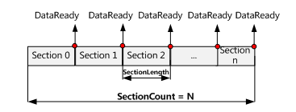
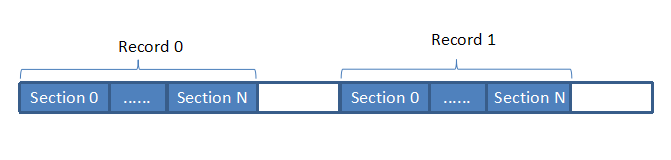

# `Record` 提供管理数据缓冲区参数（如 section length 、 section 等）的接口

* 属性
  * `SectionLength` 获取或设置缓冲**模拟输入**、**模拟输出**的数据节的长度
    
    在模拟输入缓冲中，数据缓冲区分为一系列用于发送 `DataReady` 事件的部分， `SectionLength` 设置在发送 `DataReady` 事件之前应该获取每个信道的样本数。
    当每个信道对 `SectionLength` 数据的大小进行采样时，驱动进程将发送 `DataReady` 事件，以通知用户应用进程数据已经准备好读取。
    
    在模拟输出缓冲中，数据缓冲也分为一系列用于发送 `DataTransmit` 事件的部分， `SectionLength` 设置在发送 `DataTransmit` 事件之前输出每个信道的样本数。
    当每个信道输出一定大小的 `SectionLength` 数据时，驱动进程将发送 `DataTransmission` 事件，已通知用户应用进程数据已输出。
    
    > **备注：**
    > 在高速数据采集中，用户数据缓冲区分为几个部分。 `SectionLength` 是每个节(`section`)的长度。
    > 下图说明了模拟输入缓冲的**节**`section` 长度：
    > 
    > 
    > 当每个信道采样一个 `SectionLength` 大小的数据时，将触发 `DataReady` 事件。
    
  * `SectionCount` 获取或设置缓冲**模拟输入**、**模拟输出**的数据部分的计数
    
    属性的非零值标识有限采集（单缓冲模拟输入）。
    
    属性的零值标识无限获取（流式处理模拟输入）。
    
    > **备注：**
    > * 对于有限采集，此 `SectionCount` 属性指定要采集的数据**节**(`section`)计数，在获取指定的数据**节**(`section`)计数后，操作将自动停止。
    > * 对于无限采集，此 `SectionCount` 属性为 `0` ，操作将由 `Stop` 方法或触发信号停止。
    
  * `Cycles` 获取或设置缓冲**模拟输入**的数据记录的循环计数
    
    记录是在时域中连续的一系列数据。
    
    **如果设备不支持重新触发功能，此属性将被忽略，并且始终为 `1` 。**
    
    对于支持重新触发功能的设备：
    * 属性的**非零值**表示有限采样（单缓冲模拟输入）
    * 属性的**零值**表示无限获取（流式处理模拟输入）
    
    > **备注：**
    > 记录是在时域中连续的一系列数据。
    > 
    > 只有支持重触发功能的设别才能生成多条记录。
    > 用户调用 `Start` 方法后，在满足启动触发条件之前，设备不会获取数据。
    > 如果在设备采集数据时置位停止触发信号，则数据采集将停止，设备将开始等待下一个启动触发信号被置位。
    > 每次通过触发信号启动和停止数据采集时，都会生成新的数据记录。
    > 
    > 下图显示了两条数据记录：
    > 
