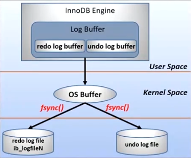
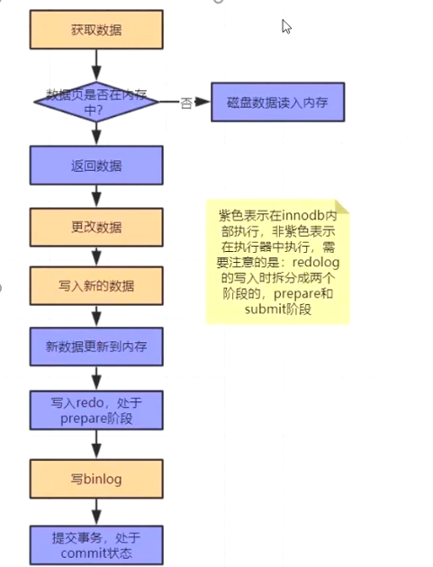

# 服务器参数

## `general`

* `datadir=data_path` : 数据文件的目录
* `socket=socket_path` : `mysql.socket` 表示 server 和 client 在同一台服务器，并且使用 `localhost` 进行连接，就会使用 socket 进行连接
* `pid_file=mysql_pid_path` : 存储 MySQL 的 PID
* `port=port_num` : MySQL 服务端口号
* `default_storage_engine=INNODB` : MySQL 默认存储引擎
* `skip-grant-tables` : 忘记 MySQL 用户名密码的时候，可以在配置文件中设置该参数，跳过权限表验证，免密登录 MySQL

## `character`

* `character_set_client` : 客户端数据的字符集
* `charactor_set_connection` : MySQL 处理客户端发送的信息时，会把数据连接转成连接的字符集格式
* `charactor_set_results` : MySQL 发送给客户端的结果集所用的字符集
* `charactor_set_database` : 数据库默认字符集
* `charactor_set_server` : MySQL server 默认字符集

## `connection`

* `max_connections` : MySQL 的最大链接数，如果数据库的并发连接请求比较大，调高设置
* `max_user_connections` : 限制每个用户的连接个数
* `back_log` : MySQL 能够暂存的连接数量（当 MySQL 的线程在一个很短时间内得到非常多的连接请求时，就会起作用，如果 MySQL 连接数量达到 `max_connections` 时，新的请求会被暂存到堆栈中，以等待某一个连接释放资源，如果超过 `back_log` 则不再接受连接资源
* `wait_timeout` : MySQL 在关闭一个非交互的连接之前需要等待的时长
* `interactive_timeout` : 关闭一个交互连接之前需要等待的秒数

## `log`

> ACID
> 
> * A(atomicity 原子性): 通过 `undo log` 实现；
> 
> * C(consistency 一致性): 通过原子性(A)、隔离性(I)、持久性(D)实现；
> 
> * I(isolation 隔离性): 通过锁实现
> 
> * D(durability 持久性): 通过 `redo log` 实现
> 
> 
> `redo log` （前滚日志）: 用来保证**持久性**，属于 InnoDB 级别数据发生修改；
> InnoDB 引擎先将记录写入 `redo log` (通过 `fsync` 异步写入写入磁盘)，更新内存，此时更新完成，同时 InnoDB 引擎在合适的时机记录操作到磁盘中()；
> `redo log` 是**固定大小**，循环写入； `redo log` （**两阶段提交**）保证 InnoDB 即使发生异常也不会丢失记录，叫做 `crash-safe` ；
> 
>   `redo log` 有三种写入 Log files 机制：1. `0` : 提交的记录，以每秒为单位写入 `OS Buffer` ，并调用 `fsync` 刷入磁盘； 2. `1` : 每次提交时写入 `OS Buffer` ，并调用 `fsync` 刷入硬盘； 3. `2` : 每次提交写入 `OS Buffer` ，每秒调用 `fsync` 刷入磁盘；
> 
> 
> 
> 
> 
> `undo log` （回滚日志）: 用来保证**原子性**，实现多个版本并发控制（简称： `MVCC` ），属于 InnoDB 级别；
> 在操作数据之前，先将数据备份到一个地方（ `undo log` 中）；然后修改数据，如果出现了错误或者用户执行了 `rollback` 语句，系统利用 `undo log` 中备份的数据恢复到事务开始之前的状态（两阶段提交）；
> `undo log` 是**逻辑日志**（ `delete` 操作， `undo log` 记录对应 `insert` ； `insert` 操作， `undo log` 记录对应 `delete` ； `update` 操作， `undo log` 记录相反的 `update` ）；
> 
> 
> `binlog` : 属于 MySQL server 级别，服务端日志文件；
> 主要做 MySQL 功能层面的事情；
> 
> 
> **`binlog` vs `redo log`**
> 
> * `redo log` 是 InnoDB 独有， `binlog` 所有引擎都可以使用；
> * `redo log` 是物理日志，记录的是在某个数据页上做了什么的**修改**， `binlog` 是逻辑日志，记录的是语句的**原始逻辑**；
> * `redo log` 是循环写的，体积一定， `bin_log` 是**追加**写入（顺序写入，速度快），不会覆盖原有日志；
> 
> 
> 
> 
> **两阶段提交** `prepare` `commit` ： 保证 `redo log` 与 `binlog` 内容一致，系统异常可以恢复到正常状态；
> 保证最终一致性；

* `log_err` : 指定错误日志文件名称，用于记录当 MySQL 异常信息
* `log_bin` : 是否开启二进制日志
* `log_bin_basename` : 指定二进制日志存储路径
* `binlog_do_db` : 指定将更新记录到二进制日志的数据库
* `binlog_ignore_db` : 指定不将更新记录到二进制日志的数据库
* `sync_binlog` : 指定多少次写日志后同步磁盘
* `general_log` : 是否开启查询日志记录
* `general_log_file` : 指定查询日志文件，用于记录所有的查询语句
* `slow_query_log` : 是否开启慢查询日志记录
* `slow_query_log_file` : 指定慢查询日志文件名称，用于记录耗时比较长的查询语句
* `long_query_time` : 设置慢查询的时间，超过设置时间记录到日志
* `log_show_admin_statements` : 是否将管理语句写入慢查询日志

> sql 语句类型：
> 
> * `ad-hoc` : 即席查询；要求尽可能快的得到查询结果；
> 
> * `执行计划；任务处理；

## `cache`

* `key_buffer_size` : 索引缓存区大小，只对 MyISAM 存储引擎表有效

* `query cache` : 查询缓存（MySQL 8.0 已作废）
    * `query_cache_size` : 查询缓存的大小

        `show variables like '%Qcache%';` 查看缓存的相关属性：
        * `Qcache_free_blocks` : 缓存中相邻内存块的个数；如果值比较大，那么查询缓存中碎片比较多；
        * `Qcache_free_memory` : 查询缓存中剩余的内存大小；
        * `Qcache_hits` : 表示有多少次命中缓存；
        * `Qcache_inserts` : 表示有多少次未命中而插入；
        * `Qcache_lowman_prunes` : 多少条 `query` 因为内存不足而被内存交换
        * `Qcache_queries_in_cache` : 当前 `cache` 中缓存的 `query` 数量；
        * `Qcache_total_blocks` : 当前 `cache` 中 `block` 的数量；
    * `query_cache_limit` : 超出此大小的查询将不被缓存
    * `query_cache_main_res_unit` : 缓存块最小大小
    * `query_cache_type` : 缓存类型，决定缓存查询类型
        * `0` : 禁用
        * `1` : 缓存所有结果；除非 SQL 语句中使用 `sql_no_cache` 禁用查询缓存
        * `2` : 表示只缓存 `select` 语句中通过 `sql_cache` 指定需要缓存的查询
* `sort_buffer_size` : 每个需要排序的线程分配该大小的缓冲区
* `max_allowed_packet` : 限制 server 接受的数据包大小（最大 `32M` ）
* `join_buffer_size` : 关联缓存大小
* `thread_cache_size` : 服务器线程缓存；表示可以重新利用保存在缓存中线程数量
    * `Threads_cached` : 当前线程缓存中空闲线程数量；
    * `Threads_connected` : 当前已建立连接的数量；
    * `Threads_created` : 最近一次服务启动后创建过的线程数量；（值比较大，服务器会一直再创建线程）
    * `Threads_running` : 当前激活的线程数；

## `InnoDB`

* `innodb_buffer_pool_size` : 该参数指定大小的内存来缓冲数据和索引，最大可以设置为物理内存的 `80%`
* `innodb_flush_log_at_trx_commit` : 主要控制 InnoDB 将 `log buffer` 中的数据写入日志文件并 `flush` 磁盘的时间点；值分别为： `0`, `1`, `2`
* `innodb_thread_concurrency` : 设置 InnoDB 线程的并发数；默认为 `0` 表示不受限制；如果设置建议跟服务器 CPU 核心数一致，或者是核心数的两倍
* `innodb_log_buffer_size` : 此参数确定日志文件所用的内存大小；以 `M` 为单位
* `innodb_log_file_size` : 此参数确定日志文件的大小；以 `M` 为单位
* `innodb_log_files_in_group` : 以循环方式将日志文件写入多个文件中
* `innodb_file_per_table` : 确定为每张表分配一个新的文件
* `read_buffer_size` : MySQL 读入缓冲区大小；对表进行顺序扫描的请求将分配到一个读入缓冲区
* `read_rnd_buffer_size` : MySQL 随机读的缓冲区大小
