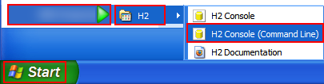
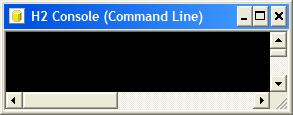

# Quickstart *快速开始*

## Embedding H2 in an Application *将H2嵌入到应用程序中*

This database can be used in embedded mode, or in server mode. 
To use it in embedded mode, you need to:

该数据库可以在嵌入式模式下使用，也可以在服务器模式下使用。
要在**嵌入模式下使用**它，你需要：

----

* Add the `h2*.jar` to the classpath (H2 does not have any dependencies)
* Use the JDBC driver class: `org.h2.Driver`
* The database URL `jdbc:h2:~/test` opens the database `test` in your user home directory
* A new database is automatically created

* 将 `h2.jar` 添加到类路径（H2 没有任何依赖项）
* 使用 JDBC 驱动类： `org.h2.Driver`
* 数据库 URL `jdbc:h2:~test` 在你的用户主目录中打开数据库 `test`
* 自动创建一个新数据库

----

## The H2 Console Application *H2控制台应用程序*

The Console lets you access a SQL database using a browser interface.

控制台允许你使用浏览器界面访问 SQL 数据库。

----

If you don't have Windows XP, or if something does not work as expected, please see the detailed description in the [Tutorial](http://h2database.com/html/tutorial.html).

如果您没有使用 Windows XP，或者某些功能无法按预期工作，请参阅 [Tutorial](../03%20Tutorial/Tutorial.md) 中的详细说明。

----

### Step-by-Step *一步步*

#### Installation *安装*

Install the software using the Windows Installer (if you did not yet do that).

使用 Windows Installer 安装软件（如果您还没有这样做的话）。

----

#### Start the Console *启动控制台*

Click [Start], [All Programs], [H2], and [H2 Console (Command Line)]:

单击 [Start]、 [All Programs]、 [H2] 和 [H2 Console (Command Line)] ：

----

A new console window appears:

出现一个新的控制台窗口：

----

Also, a new browser page should open with the URL [http://localhost:8082](http://localhost:8082/). 
You may get a security warning from the firewall. 
If you don't want other computers in the network to access the database on your machine, you can let the firewall block these connections. 
Only local connections are required at this time.

此外，应该打开一个带有 URL [http:localhost:8082](http://localhost:8082/) 的新浏览器页面。
您可能会收到来自防火墙的安全警告。
如果您不希望网络中的其他计算机访问您计算机上的数据库，则可以让防火墙阻止这些连接。
此时只需要本地连接。

----

#### Login *登录*

Select [Generic H2] and click [Connect]:

选择 [Generic H2] ，点击 [Connect] ：

----

You are now logged in.

您现在已登录。

----

#### Sample *样本*

Click on the [Sample SQL Script]:

点击 [Sample SQL Script] ：

----

The SQL commands appear in the command area.

SQL 命令出现在命令区域中。

----

#### Execute *执行*

Click [Run]

点击 [Run]

----

On the left side, a new entry TEST is added below the database icon. 
The operations and results of the statements are shown below the script.

在左侧，在数据库图标下方添加了一个新条目 TEST 。
语句的操作和结果显示在脚本下方。

----

#### Disconnect *断开*

Click on [Disconnect]:

点击 [Disconnect] ：

----

to close the connection.

关闭连接。

----

#### End *结尾*

Close the console window. 
For more information, see the [Tutorial](http://h2database.com/html/tutorial.html). 

----

关闭控制台窗口。
有关详细信息，请参阅 [Tutorial](../03%20Tutorial/Tutorial.md) 。

----
