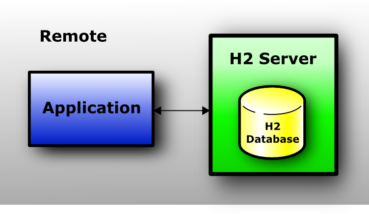

## Connection Modes *连接模式*

The following connection modes are supported:

支持以下连接方式：

---

* Embedded mode (local connections using JDBC)
* Server mode (remote connections using JDBC or ODBC over TCP/IP)
* Mixed mode (local and remote connections at the same time)

* 嵌入式模式（使用 JDBC 的本地连接）
* 服务器模式（使用 JDBC 或 ODBC over TCP/IP 的远程连接）
* 混合模式（本地和远程同时连接）

---

### Embedded Mode *嵌入式模式*

In embedded mode, an application opens a database from within the same JVM using JDBC.
This is the fastest and easiest connection mode.
The disadvantage is that a database may only be open in one virtual machine (and class loader) at any time.
As in all modes, both persistent and in-memory databases are supported.
There is no limit on the number of database open concurrently, or on the number of open connections.

在嵌入式模式下，应用程序使用 JDBC 从同一 JVM 中打开数据库。
这是最快和最简单的连接模式。
缺点是一个数据库在任何时候都只能在一个虚拟机（和类加载器）中打开。
与所有模式一样，持久数据库和内存数据库均受支持。

---

In embedded mode I/O operations can be performed by application's threads that execute a SQL command.
The application may not interrupt these threads, it can lead to database corruption, because JVM closes I/O handle during thread interruption.
Consider other ways to control execution of your application.
When interrupts are possible the [`async`](https://h2database.com/html/advanced.html#file_system):
file system can be used as a workaround, but full safety is not guaranteed.
It's recommended to use the client-server model instead, the client side may interrupt own threads.

在嵌入式模式下， I/O 操作可以由执行 SQL 命令的应用程序线程执行。
应用程序可能不会中断这些线程，它会导致数据库损坏，因为 JVM 在线程中断期间关闭 I/O 句柄。
考虑使用其他方法来控制应用程序的执行。
当中断可能时 [`async`]()
文件系统可用作解决方法，但不能保证完全安全。
建议改用客户端-服务器模型，客户端可能会中断自己的线程。

---

### Server Mode *服务器模式*

When using the server mode (sometimes called remote mode or client/server mode), an application opens a database remotely using the JDBC or ODBC API.
A server needs to be started within the same or another virtual machine, or on another computer.
Many applications can connect to the same database at the same time, by connecting to this server.
Internally, the server process opens the database(s) in embedded mode.

使用服务器模式（有时称为远程模式或客户端服务器模式）时，应用程序使用 JDBC 或 ODBC API 远程打开数据库。
服务器需要在同一台虚拟机或另一台虚拟机中或另一台计算机上启动。
通过连接到此服务器，许多应用程序可以同时连接到同一个数据库。
在内部，服务器进程以嵌入模式打开数据库。

---

The server mode is slower than the embedded mode, because all data is transferred over TCP/IP.
As in all modes, both persistent and in-memory databases are supported.
There is no limit on the number of database open concurrently per server, or on the number of open connections.

服务器模式比嵌入式模式慢，因为所有数据都是通过 TCP/IP 传输的。
与所有模式一样，持久数据库和内存数据库均受支持。
每台服务器同时打开的数据库数量或打开的连接数量没有限制。

---

