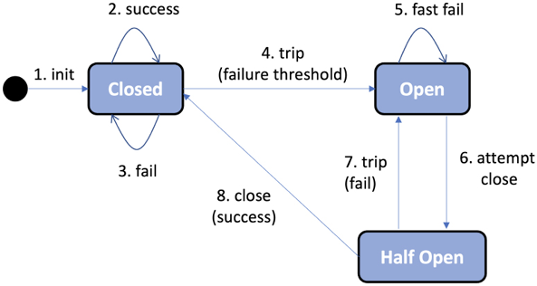

= Spring Cloud
Hui.Liu <mexn-0808@outlook.com>
:toc: left
:toclevels: 5
:toc-title: 目录

使用 Spring Cloud 实现：

* 服务发现： Netflix Eureka、 Spring Cloud LoadBalancer
* 服务网关 Spring Cloud Gateway、Spring Security OAuth
* 配置中心 Spring Cloud Config
* 熔断 Resilience4j
* 分布式追踪 Micrometer Tracing and Zipkin

== Netflix Eureka

[TIP]
--
**DNS 服务发现**：

微服务的每个实例都在 DNS 服务器中以相同的名称注册其 IP 地址。
当客户端请求 DNS 名称的 IP 地址时，DNS 服务器返回已注册实例的 IP 地址列表。
客户端使用此 IP 地址列表以循环方式向微服务实例发送请求。

DNS 客户端逐个尝试接收到的 IP 地址，直到找到一个有效的 IP 地址（通常是列表中的第一个）。
DNS 客户端通常会保留**一个**工作 IP 地址；它不对每个请求应用循环方法。
典型的 DNS 服务器实现和 DNS 协议本身都不适合处理不断出现和消失的易失性微服务实例。
--

当跟踪许多微服务实例时，必须考虑以下因素：

* 新实例可以在任何时间点启动
* 现有实例可能在任意时间点停止响应并最终崩溃
* 一些失败的实例可能在一段时间后恢复正常，并且应该再次开始接受流量，而未恢复实例则不会，而是直接重路由中删除
* 某些微服务实例可能需要一段时间才能启动：仅仅因为它们可以接受 HTTP 请求并不意味着流量应该路由到它们
* 意外的网络分区和其他与网络相关的错误随时可能发生

=== Spring Cloud 的 Netflix Eureka 服务发现

服务发现流程：

. 每当微服务实例启动时，它都会将自己**注册**到其中一台 Eureka 服务器；
. 每个微服务实例会定期向 Eureka 服务器发送**心跳**消息，告诉 Eureka 服务器微服务实例可以正常接受请求
. 客户端使用 Eureka 客户端库，该库定期向 Eureka 服务询问有关可用服务的信息
. 当客户端需要向另一个微服务发送请求时，客户端库中已经有可用实例的列表，并且可以选择其中一个，而无需询问发现服务器；通常，可用实例以循环的方式选择

Spring Cloud 抽象了如何与发现服务(Netflix Eureka 等)进行通信，并提供了一个名为 ``DiscoveryClient`` 的接口。
``DiscoveryClient`` 用于与发现服务交互，以获取有关可用服务和实例的信息。
``DiscoveryClient`` 接口实现能够自动向发现服务注册 Spring Boot 应用进程。

Netflix Eureka 客户端依赖： ``spring-cloud-starter-netflix-eureka-client``

Spring Cloud 带有一个抽象(``LoadBalancerClient`` 接口)，用于希望通过**负载均衡器**向发现服务中注册的实例发出请求的客户端。
可以将标准反应式 HTTP 客户端 ``WebClient`` 配置为使用 ``LoadBalancerClient`` 实现。
通过将 ``@LoadBalanced`` 注解添加到返回 ``WebClient.Builder`` 对象的 ``@Bean`` 声明中， ``LoadBalancerClient`` 实现将作为 ``ExchangeFilterFunction`` 注入到 ``Builder`` 实例中。

==== 设置 Netflix Eureka 服务器

== Spring Cloud Gateway

== 保护 API 访问

如何使用 HTTPS 放置外部访问 API ；
如何使用 OAuth 2.0 和 OpenID Connect 验证和授权用户和客户端应用进程访问 API ；

[TIP]
--
**认证**vs**授权**

身份认证是通过验证用户提供的凭证(如用户名和密码)来识别用户。
授权是关于向经过身份验证的用户授权对 API 各个部分的访问权限。
--

OAuth 2.0 是一个开放的**授权委托**标准；
OpenID Connect 是 OAuth 2.0 的附加组件，使的客户端应用进程能够根据**授权服务器**执行的身份验证来验证用户身份。

=== OAuth 2.0

OAuth 2.0 是一个广泛公认的**开放授权标准**，使用户能够同意第三方客户端应用程序以用户的名义访问受保护的资源。

授予第三方客户端应用进程以用户名义执行操作的权限称为**授权委派**。

概念：

* **资源所有者(Resource Owner)**：最终用户
* **客户端(Client)**：想以最终用户名义调用受保护 API 的第三方客户端应用程序
* **资源服务器(Resource Server)**：公开的需要保护的 API 资源
* **授权服务器(Authorization Server)**：授权服务器在资源所有者(**最终用户**)通过身份验证后向客户端颁发令牌；用户信息的管理和用户身份验证通常在后台委托给**身份提供商(Identity Provider IdP)**

客户端在授权服务器中注册，并被赋予**客户端 ID**和**客户端密码**。
客户端密码必须像密码一样受到客户端的保护。
客户端使用一组允许的重定向 URI 进行注册，在用户通过身份验证后，授权服务器将使用 URI 将已颁发的授权代码和令牌发送会客户端应用。

用户永远不必向客户端应用透露其**凭证**。
用户可以同一客户端应用代表用户访问特定 API 。
**访问令牌**表示一组受时间限制的访问权限，在 OAuth 2.0 术语中表示为**范围**。
授权服务器可以向客户端应用颁发**刷新令牌**；客户端应用使用刷新令牌获取新的令牌，而无需用户参与。

=== OpenID Connect (OIDC)

OpenID Connect (OIDC) 是 OAuth 2.0 的一个附加组件使客户端应用程序能够验证用户身份。
OIDC 添加了一个额外的令牌(ID token)，客户端应用进程**在完成授权流程后从授权服务器获取该令牌**。

ID token 编码为 JSON Web Token(JWT)，并包含许多声明(例如：用户 ID和电子邮件地址)。
ID token 使用 JSON web 签名进行数字签名。
即：客户端应用可以通过使用来自__授权服务器__的**公钥**验证数字签名来信任 ID token 中的信息。

根据规范，访问令牌也可以按照与 ID token 相同的方式进行编码和签名，是非强制性的。
重要的是： OIDC 定义了一个端点，一种重建端点 URL 的标准化方法，例如请求授权码和令牌或获取公钥以验证数字签名的 JWT 。
最后，定义了一个 `user-info` 端点，可用于获取经过身份验证的用户的额外信息。

出于测试目的，将向系统环境中添加本地 OAuth 2.0 授权服务器。
与授权服务器的所有外部通信都将通过网关进行路由。
网关和产片复合服务充当 OAuth 2.0 资源服务器，即需要有效的 OAuth 2.0 访问令牌才能允许访问。

为了减少验证访问令牌的开销，假设它们被编码为已签名的 JWT ，并且授权服务器公开了一个端点，资源服务器可以使用该端点来访问验证签名所需的公钥，也称为 **JSON Web Key Set**(简称：**`jwk-set`**)。

image::images/image-2024-01-12-14-26-36-328.png[]

=== 使用 HTTPS 加密通信

. 创建证书：创建自签证书
+
自签证书：
+
[source,shell]
----
keytool -genkeypair -alias localhost -keyalg RSA -keysize 2048 -storetype PKCS12 -keystore edge.p12 -validity 3650
----

. 配置网关：使用证书配置网关使用 HTTPS
+
配置 ``application.yml`` 使用 HTTPS：
+
[source,yaml]
----
server:
  port: 8443
  ssl:
    key-store-type: PKCS12
    key-store: classpath:keystore/edge.p12
    key-store-password: password
    key-alias: localhostserver:
  port: 8443
  ssl:
    key-store-type: PKCS12
    key-store: classpath:keystore/edge.p12
    key-store-password: password
    key-alias: localhost
----

=== 保护对服务发现服务器的访问

使用 HTTP 基本身份验证限制对服务发现 Netflix Eureka 上的 API 和网页的访问。
即要求用户提供用户名和密码才可以访问。

==== Eureka 服务器

. 添加 Spring Security 依赖：
+
[source,groovy]
----
implementation 'org.springframework.boot:spring-boot-starter-security'
----

. 添加 ``SecurityConfig`` 安全配置类
.. 用户定义：
+
[source,jshelllanguage]
----
@Bean
public InMemoryUserDetailsManager userDetailsManager() {
    UserDetails user = User.withDefaultPasswordEncoder()
            .username(username)
            .password(password)
            .roles("USER")
            .build();
    return new InMemoryUserDetailsManager(user);
}
----
.. 将 `username` 和 `password` 从配置文件构造注入：
+
[source,jshelllanguage]
----
private final String username;
private final String password;

public SecurityConfig(
        @Value("${app.eureka-username}") String username,
        @Value("${app.eureka-password}") String password) {
    this.username = username;
    this.password = password;
}
----
.. 配置 API 需要使用 HTTP 基本身份验证：
+
[source,jshelllanguage]
----
@Bean
public SecurityFilterChain configure(HttpSecurity http) throws Exception {
    http.authorizeHttpRequests(authorize ->
                    authorize.anyRequest().authenticated())
            .httpBasic(Customizer.withDefaults())
            .formLogin(Customizer.withDefaults());

    return http.build();
}
----
.. 将用户凭证添加到配置文件 `application.yml` :
+
[source,yaml]
----
app:
  eureka-username: u
  eureka-password: p
----

==== Eureka 客户端

凭证可以在 Eureka 服务器的连接 URL 中指定。
在客户端配置文件 `application.yml` 中设置：
+
[source,yaml]
----
app:
  eureka-username: u
  eureka-password: p
  eureka-server: localhost
eureka:
  client:
    service-url:
      defaultZone: http://${app.eureka-username}:${app.eureka-password}@${app.eureka-server}:8761/eureka/
----

=== 添加授权服务器

== 配置中心 Spring Cloud Config Server

使用 Spring Cloud Config Server 将所有微服务的配置文件放在一个中央配置存储库中。

=== Spring Cloud Config Server 简介

使用配置服务时考虑的选项：

* 选择配置存储库的存储类型
+
Spring Cloud Config Server 支持多种存储类型：

** Git 仓库
** 本地文件系统
** HashiCorp Vault
** JDBC 数据库

* 确定初始客户端连接：无论是与配置服务还是发现服务
+
有两种方式，各有利弊：

. 默认情况下，客户端连接首先到配置服务器检索配置，根据配置连接到发现服务以注册自身
+
首先连接配置服务的一个问题是：配置服务可能会成为单点故障。
在使用 Kubernetes 中可以通过在 Kubernetes 运行多个容器来避免单点故障。
. 客户端首先连接到发现服务以查找配置服务，然后连接到配置服务获取配置

* 保护配置：防止对 API 进行未经授权的访问，避免在配置存储库中以文本形式存储敏感信息
+
从运行时的角度看，配置服务不需要通过网关暴露给外部；
在开发过程中，能够访问配置服务器打的 API 来检查配置时很有用的。

==== 配置服务器 API

配置服务器公开一个 REST API，其他客户端可以使用该 API 来检索配置。

* ``/actuator``:  所有微服务公开的标准执行器端点
* ``/encrypt`` 和 ``/decrypt``: 用于加密和解密敏感信息的端点
* ``/{microservice}/{profile}``: 返回指定微服务的指定 Spring 配置文件的配置

=== 使用 Spring Cloud Config Server

将注解 ``@EnableConfigServer`` 添加到应用程序类中。
在 ``application.yml`` 指定配置文件存储库： ``spring.cloud.config.server.native.searchLocations``

添加路由规则：
[source,yaml]
----
- id: config-server
  uri: ${spring.cloud.config.uri}
  predicates:
  - Path=/config/**
  filters:
  - RewritePath=/config/(?<segment>.*), /$\{segment}
----

如果配置文件中使用加密值，则需要在其前面加上前缀 ``{cipher}`` 并将其包裹在 `''` 中。

== Resilience4j 提高弹性

使用 Resilience4j 使微服务更具有弹性，减轻错误并从错误中恢复。
使用 Resilience4j 最大程度地减少响应缓慢或无响应的下游微服务在同步通信微服务的大规模系统环境中可能造成的伤害。
Resilience4j 中的熔断器与时间限制器和重试机制一起使用，防止最常见的两种情况：

* 微服务开始响应缓慢或根本不响应
* 偶尔随机失败的请求

=== 熔断器简洁

熔断器主要特点：

* 如果一个熔断器监测到太多故障，会断开其连接，即不允许新的调用
* 当连接断开时，断路器将执行快速故障逻辑；
* 一段时间后，熔断器将半开，允许新调用查看导致故障的问题是否消失；如果熔断器检测到新的故障，再次断开连接并返回到快速故障处理逻辑；

Resilience4j 以多种方式在运行时公开有关熔断的信息：

* 可以使用微服务的执行器运行状况端点 ``/actuator/health`` 监控熔断器当前状态
* 熔断器还会再执行器端点上发布时间，例如 ``/actuator/circuitbreakerevents``
* 熔断器与 Spring Boot 的指标系统集成，可以使用它将指标发布到 Prometheus 等监控工具

使用标准 Spring Boot 配置文件配置 Resilience4j 熔断器中的逻辑，配置参数：

* ``slidingWindowType``: 配置使用的滑动窗口类型
+
Resilience4j使用滑动窗口计算最近的事件来做出决定是否需要熔断；
滑动窗口可以基于**固定的调用次数(`COUNT_BASED`)**或**固定的经过时间**
* ``slidingWindowSize``: 处于关闭状态的调用次数，用于判断是否打开熔断
* ``failureRateThresold`` 熔断器调用失败打开的阈值（百分比为单位）
* ``automaticTransitionFromOpenToHalfOpenEnabled``: 确定等待期结束后，断路器是否自动转换为半开状态；否则，它将等待期结束后等待第一次调用，直到转换为半开状态
* ``waitDurationInOpenState``: 指定熔断再打开状态下保持多长时间，即在转换为半开状态之前；
* ``permittedNumberOfCallsInHalfOpenState``: 处于半开状态的调用次数，用于确定连接是再次打开还是返回到正常的状态
* ``ignoreExceptions``: 用于指定不应计为故障的异常；预期的业务异常（未找到或输入无效）是熔断器应忽略的典型异常
* ``registerHealthIndicator = true``: 使 Resilience4j 能够使用有关其熔断器状态的信息跳虫运行状态端点
* ``allowHealthIndicatorToFail = false``: 告知 Resilience4j 不要影响运行状况端点的状态；即使组件的某个熔断器处于打开或半打开状态，运行状态端点仍将报告 ``UP``.

配置 Spring Boot Actuator 添加 Resilience4j 在影响其运行状况端点的请求时生成熔断器运行状态信息：
``management.health.circuitbreakers.enabled: true``

==== 时间限制器

熔断器在处理缓慢或无响应服务时，超时机制可能会有帮助；
Resilience4j 的超时机制称为 **TimeLimiter** ，可以使用标准 Spring Boot 配置文件进行配置。

* ``timeoutDuration``: 指定 **TimeLimiter** 实例在抛出超时异常之前等待调用完成的时间

==== 重试机制

重试机制对于随机和汉奸的故障（临时网络故障等）非常有用。
重试机制可以简单地多次重试失败的请求，并在尝试之间设置可配置的延迟。
使用重试机制的一个重要的限制是：**重试的服务必须是幂等的**，即使用相同的请求参数调用服务一次或多次得到的结果相同。

当涉及事件和指标时， Resilience4j 以与熔断器相同的方式公开重试信息，但不提供任何运行状况信息。
重试事件可在 ``actuator`` 端点上访问 `/actuator/retryevents` 。

配置参数：

* ``maxAttempts``: 放弃之前的重试次数，包括第一次调用
* ``waitDuration``: 下一次重试之前的等待时间
* ``retryExceptions``: 将触发重试的异常列表
+
通常只会在 ``InternalServerError`` (即 HTTP 请求以 ``500`` 状态码响应)时触发重试。

== 分布式跟踪

使用分布式跟踪更好地了解微服务间的下作。

Micrometer Tracing 用于收集跟踪信息， Zipkin 将用于该信息的存储和可视化。

使用 Micrometer Tracing 和 Zipkin 进行分布式跟踪，来自完整的信息工作流的跟踪信息称为**跟踪**或**跟踪树**，树的字部份（例如基本工作单元）称为 `span` (跨度) 。
跨度可以由构成跟踪的子跨度组成。
元数据可以作为称为标签的键值添加到跟踪机器跨度中。
Zipkin UI 可以可视化跟踪树及其跨度。

Micrometer Tracing 用于收集跟踪信息，在对其他微服务的调用中传播跟踪上下文（例如：跟踪ID和跨度ID），并将跟踪信息导出到 Zipkin 等跟踪分析工具。
跟踪信息的处理由**跟踪器(tracer)**在后台完成。
Micrometer Tracing 支持基于 **OpenTelemetry** 或 **OpenZipkin Brave** 的**跟踪器(tracer)**自动配置。
将跟踪信息导出到跟踪分析工具中是由**报告器(reporter)**完成。

默认情况下，跟踪标头使用**W3C 跟踪上下文**标头(https://www.w3.org/TR/trace-context/)在微服务之间传播，最重要的是 ``traceparent`` 标头。
可以配置为使用 OpenZipkin 的 **B3** 标头。

[TIP]
--
**W3C跟踪 ``tranceparent`` 上下文标头**

``traceparent:"00-2425f26083814f66c985c717a761e810-fbec8704028cfb20-01"``

标头值 ``tranceparent`` 包含四个部分，用 ``-`` 分隔：

* ``00``: 表示使用的版本；使用当前规范将始终为 ``00``
* ``242...810``: trace(追踪) ID
* ``fbe...b20``: span(跨度) ID
* ``01``: 最后一部分包含各种标志；当前规范支持的唯一标志是名为 **``sampled``** 的标志，其值为 ``01`` ；这意味着调用方正在记录此请求的追踪数据；我们将配置微服务以记录所有请求的追踪数据，因此此值始终为 ``01``
--

[TIP]
--
**OpenZipkin Brave B3 标头**：

[source,text]
----
X-B3-TraceId:"64436ea679e8eb6e6fa028bb3459e703"
X-B3-SpanId:"120678270898ddd5"
X-B3-ParentSpanId:"3c431d3d01987c22"
X-B3-Sampled:"1"
----
--

Spring Boot 自动为传入流量创建跟踪和跨度（传入的 **HTTP 请求**和 **Spring Cloud Stream 接收的消息**）；
如果传入请求包含**跟踪 ID **，则在**创建跨度时将使用**它；
如果没有，将创建一个**新的跟踪 ID **；
跟踪 ID 和跨度 ID 会作为 HTTP 请求或使用 Spring Cloud Stream 发送消息自动传播到传出流量。

如果需要，可以以编程方式添加额外信息，通过自定义跨度或添加自定义标记到微服务的所有跨度。
这是通过使用 Micrometer Observability(https://micrometer.io/docs/observation) 及其 Observation API 来完成。

Micrometer Tracing 与 Spring Boot 3 的初始版本在支持反应式客户端中的分布式跟踪仿麦呢存在一些__限制__。
*需要添加解决方法*。

Zipkin 原生支持将跟踪信息存储在内存中或数据库(例如 Apache Cassandra、Elasticsearch、MySQL 等)；
支持的扩展参阅: https://zipkin.io/pages/extensions_choices.html 。

=== 使用分布式追踪

使用步骤：

==== 1. 将跟踪器实现和报告器依赖添加到构建文件

==== 2. 将 Zipkin 服务器添加到 Docker Compose 文件中
==== 3. 配置微服务以将跟踪信息发送到 Zipkin
==== 4. 针对缺乏响应式客户端支持的情况添加解决方法
==== 5. 添加用于在现有跨度中创建自定义跨度和自定义标签的代码
