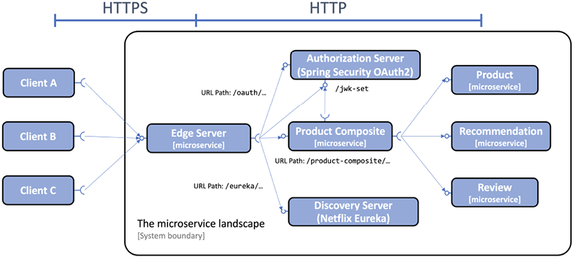

= Spring Cloud
Hui.Liu <mexn-0808@outlook.com>
:toc: left
:toclevels: 5
:toc-title: 目录

使用 Spring Cloud 实现：

* 服务发现： Netflix Eureka、 Spring Cloud LoadBalancer
* 服务网关 Spring Cloud Gateway、Spring Security OAuth
* 配置中心 Spring Cloud Config
* 熔断 Resilience4j
* 分布式追踪 Micrometer Tracing and Zipkin

== Netflix Eureka

[TIP]
--
**DNS 服务发现**：

微服务的每个实例都在 DNS 服务器中以相同的名称注册其 IP 地址。
当客户端请求 DNS 名称的 IP 地址时，DNS 服务器返回已注册实例的 IP 地址列表。
客户端使用此 IP 地址列表以循环方式向微服务实例发送请求。

DNS 客户端逐个尝试接收到的 IP 地址，直到找到一个有效的 IP 地址（通常是列表中的第一个）。
DNS 客户端通常会保留**一个**工作 IP 地址；它不对每个请求应用循环方法。
典型的 DNS 服务器实现和 DNS 协议本身都不适合处理不断出现和消失的易失性微服务实例。
--

当跟踪许多微服务实例时，必须考虑以下因素：

* 新实例可以在任何时间点启动
* 现有实例可能在任意时间点停止响应并最终崩溃
* 一些失败的实例可能在一段时间后恢复正常，并且应该再次开始接受流量，而未恢复实例则不会，而是直接重路由中删除
* 某些微服务实例可能需要一段时间才能启动：仅仅因为它们可以接受 HTTP 请求并不意味着流量应该路由到它们
* 意外的网络分区和其他与网络相关的错误随时可能发生

=== Spring Cloud 的 Netflix Eureka 服务发现

服务发现流程：

. 每当微服务实例启动时，它都会将自己**注册**到其中一台 Eureka 服务器；
. 每个微服务实例会定期向 Eureka 服务器发送**心跳**消息，告诉 Eureka 服务器微服务实例可以正常接受请求
. 客户端使用 Eureka 客户端库，该库定期向 Eureka 服务询问有关可用服务的信息
. 当客户端需要向另一个微服务发送请求时，客户端库中已经有可用实例的列表，并且可以选择其中一个，而无需询问发现服务器；通常，可用实例以循环的方式选择

Spring Cloud 抽象了如何与发现服务(Netflix Eureka 等)进行通信，并提供了一个名为 ``DiscoveryClient`` 的接口。
``DiscoveryClient`` 用于与发现服务交互，以获取有关可用服务和实例的信息。
``DiscoveryClient`` 接口实现能够自动向发现服务注册 Spring Boot 应用进程。

Netflix Eureka 客户端依赖： ``spring-cloud-starter-netflix-eureka-client``

Spring Cloud 带有一个抽象(``LoadBalancerClient`` 接口)，用于希望通过**负载均衡器**向发现服务中注册的实例发出请求的客户端。
可以将标准反应式 HTTP 客户端 ``WebClient`` 配置为使用 ``LoadBalancerClient`` 实现。
通过将 ``@LoadBalanced`` 注解添加到返回 ``WebClient.Builder`` 对象的 ``@Bean`` 声明中， ``LoadBalancerClient`` 实现将作为 ``ExchangeFilterFunction`` 注入到 ``Builder`` 实例中。

==== 设置 Netflix Eureka 服务器

== Spring Cloud Gateway

== 保护 API 访问

如何使用 HTTPS 放置外部访问 API ；
如何使用 OAuth 2.0 和 OpenID Connect 验证和授权用户和客户端应用进程访问 API ；

[TIP]
--
**认证**vs**授权**

身份认证是通过验证用户提供的凭证(如用户名和密码)来识别用户。
授权是关于向经过身份验证的用户授权对 API 各个部分的访问权限。
--

OAuth 2.0 是一个开放的**授权委托**标准；
OpenID Connect 是 OAuth 2.0 的附加组件，使的客户端应用进程能够根据**授权服务器**执行的身份验证来验证用户身份。

=== OAuth 2.0

OAuth 2.0 是一个广泛公认的**开放授权标准**，使用户能够同意第三方客户端应用程序以用户的名义访问受保护的资源。

授予第三方客户端应用进程以用户名义执行操作的权限称为**授权委派**。

概念：

* **资源所有者(Resource Owner)**：最终用户
* **客户端(Client)**：想以最终用户名义调用受保护 API 的第三方客户端应用程序
* **资源服务器(Resource Server)**：公开的需要保护的 API 资源
* **授权服务器(Authorization Server)**：授权服务器在资源所有者(**最终用户**)通过身份验证后向客户端颁发令牌；用户信息的管理和用户身份验证通常在后台委托给**身份提供商(Identity Provider IdP)**

客户端在授权服务器中注册，并被赋予**客户端 ID**和**客户端密码**。
客户端密码必须像密码一样受到客户端的保护。
客户端使用一组允许的重定向 URI 进行注册，在用户通过身份验证后，授权服务器将使用 URI 将已颁发的授权代码和令牌发送会客户端应用。

用户永远不必向客户端应用透露其**凭证**。
用户可以同一客户端应用代表用户访问特定 API 。
**访问令牌**表示一组受时间限制的访问权限，在 OAuth 2.0 术语中表示为**范围**。
授权服务器可以向客户端应用颁发**刷新令牌**；客户端应用使用刷新令牌获取新的令牌，而无需用户参与。

=== OpenID Connect (OIDC)

OpenID Connect (OIDC) 是 OAuth 2.0 的一个附加组件使客户端应用程序能够验证用户身份。
OIDC 添加了一个额外的令牌(ID token)，客户端应用进程**在完成授权流程后从授权服务器获取该令牌**。

ID token 编码为 JSON Web Token(JWT)，并包含许多声明(例如：用户 ID和电子邮件地址)。
ID token 使用 JSON web 签名进行数字签名。
即：客户端应用可以通过使用来自__授权服务器__的**公钥**验证数字签名来信任 ID token 中的信息。

根据规范，访问令牌也可以按照与 ID token 相同的方式进行编码和签名，是非强制性的。
重要的是： OIDC 定义了一个端点，一种重建端点 URL 的标准化方法，例如请求授权码和令牌或获取公钥以验证数字签名的 JWT 。
最后，定义了一个 `user-info` 端点，可用于获取经过身份验证的用户的额外信息。

出于测试目的，将向系统环境中添加本地 OAuth 2.0 授权服务器。
与授权服务器的所有外部通信都将通过网关进行路由。
网关和产片复合服务充当 OAuth 2.0 资源服务器，即需要有效的 OAuth 2.0 访问令牌才能允许访问。

为了减少验证访问令牌的开销，假设它们被编码为已签名的 JWT ，并且授权服务器公开了一个端点，资源服务器可以使用该端点来访问验证签名所需的公钥，也称为 **JSON Web Key Set**(简称：**`jwk-set`**)。

=== 使用 HTTPS 加密通信

. 创建证书：创建自签证书
+
自签证书：
+
[source,shell]
----
keytool -genkeypair -alias localhost -keyalg RSA -keysize 2048 -storetype PKCS12 -keystore edge.p12 -validity 3650
----

. 配置网关：使用证书配置网关使用 HTTPS
+
配置 ``application.yml`` 使用 HTTPS：
+
[source,yaml]
----
server:
  port: 8443
  ssl:
    key-store-type: PKCS12
    key-store: classpath:keystore/edge.p12
    key-store-password: password
    key-alias: localhostserver:
  port: 8443
  ssl:
    key-store-type: PKCS12
    key-store: classpath:keystore/edge.p12
    key-store-password: password
    key-alias: localhost
----

=== 保护对服务发现服务器的访问

使用 HTTP 基本身份验证限制对服务发现 Netflix Eureka 上的 API 和网页的访问。
即要求用户提供用户名和密码才可以访问。

==== Eureka 服务器

. 添加 Spring Security 依赖：
+
[source,groovy]
----
implementation 'org.springframework.boot:spring-boot-starter-security'
----

. 添加 ``SecurityConfig`` 安全配置类
.. 用户定义：
+
[source,jshelllanguage]
----
@Bean
public InMemoryUserDetailsManager userDetailsManager() {
    UserDetails user = User.withDefaultPasswordEncoder()
            .username(username)
            .password(password)
            .roles("USER")
            .build();
    return new InMemoryUserDetailsManager(user);
}
----
.. 将 `username` 和 `password` 从配置文件构造注入：
+
[source,jshelllanguage]
----
private final String username;
private final String password;

public SecurityConfig(
        @Value("${app.eureka-username}") String username,
        @Value("${app.eureka-password}") String password) {
    this.username = username;
    this.password = password;
}
----
.. 配置 API 需要使用 HTTP 基本身份验证：
+
[source,jshelllanguage]
----
@Bean
public SecurityFilterChain configure(HttpSecurity http) throws Exception {
    http.authorizeHttpRequests(authorize ->
                    authorize.anyRequest().authenticated())
            .httpBasic(Customizer.withDefaults())
            .formLogin(Customizer.withDefaults());

    return http.build();
}
----
.. 将用户凭证添加到配置文件 `application.yml` :
+
[source,yaml]
----
app:
  eureka-username: u
  eureka-password: p
----

==== Eureka 客户端

凭证可以在 Eureka 服务器的连接 URL 中指定。
在客户端配置文件 `application.yml` 中设置：
+
[source,yaml]
----
app:
  eureka-username: u
  eureka-password: p
  eureka-server: localhost
eureka:
  client:
    service-url:
      defaultZone: http://${app.eureka-username}:${app.eureka-password}@${app.eureka-server}:8761/eureka/
----

=== 添加授权服务器

