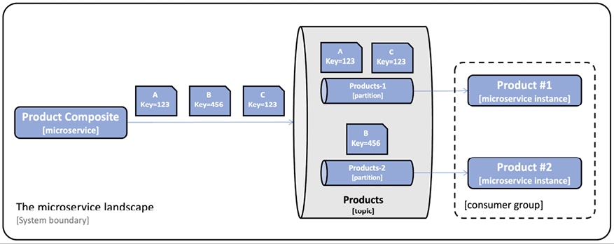

= 反应式开发
Hui.Liu <mexn-0808@outlook.com>
:toc: left
:toclevels: 5
:toc-title: 目录

开发反应式微服务，即开发非阻塞同步 REST API 和异步事件驱动服务。

== 非阻塞 REST API 与事件驱动的异步服务对比

微服务开发过程中，何时使用非阻塞同步 API 以及何时使用事件驱动的异步服务并不总是很明显。
一般来说，构建微服务健壮且可扩展，重要的是**使其尽可能自治**（例如，最小化依赖）；也称为**松耦合**。
__因此事件的异步消息传递**优于**非阻塞同步 API__：因为微服务仅依赖于运行时对消息系统的访问，而不依赖对许多其他微服务的同步访问。

同步 API 可能更有利的情况：

* 最终用户等待响应的读取操作
* 客户端平台更适合使用同步 API （移动应用、SPA Web 应用）
* 将其他服务集成场景：很难跨组织使用一致通用消息传递系统

在当前应用场景下，使用以下内容：

* 产品组合微服务公开的创建、读取、删除接口将基于**非阻塞同步 API**
* 核心微服务提供的读取接口将开发为**非阻塞同步 API**，因为最终用户等待其响应
* 核心微服务提供的创建和删除服务将开发为**事件驱动的异步服务**，即监听每个微服务专用注意的创建和删除事件
* 产品组合微服务提供的用于创建和删除聚合产品新戏的**非阻塞同步 API**将发布有关主题的创建和删除事件；
** 发布成功，返回 `202` (**已接受**)：表示请求已被接受，但尚未完全处理。
** 失败，返回错误响应

== 非阻塞同步 REST API

=== Reactor 项目

响应式在Spring 5 中基于 Project Reactor 实现；
Project Reactor 基于**响应式流规范(http://www.reactive-streams.org)**标准构建；
Project Reactor 为 Spring WebFlux 、 Spring WebClient 和 Spring Data 提供响应式和非阻塞支持。

Project Reactor 中的核心数据类型是 ``Flux`` ``Mono``:

* ``Flux``: 用于处理 0..n个元素的流
* ``Mono``: 用于处理为空或最多返回一个元素的流

. 流的处理由订阅流并请求其内容的**订阅者**启动
. 对流中元素逐个操作处理
. 处理结束时调用 ``onComplete`` 订阅者上的方法，*通知订阅者流已结束*。

=== Spring Data for MongoDB 实现非阻塞

. 修改依赖项
+
[source,groovy]
----
implementation 'org.springframework.boot:spring-boot-starter-data-mongodb-reactive'
----
. 变更持久化基类为反应式 ``ReactiveCrudRepository``
. 更改自定义查找方法返回为 ``Mono`` 或 ``Flux``

==== 对测试的影响

测试方法必须等待**返回**的响应对象中可用的响应。

* 使用 ``block()`` 方法显示调用等待响应可用
* 使用 Project Reactor 中的帮助器类 ``StepVerifier`` 声明可验证的异步事件序列

=== Spring Data for JPA 处理阻塞代码

使用 JPA 访问关系数据库，没有支持非阻塞编程模型；
相反，我们可以使用调度进程运行阻塞代码，调度进程能够在具有有限线程数的专用线程池中的线程上运行阻塞代码；
对阻塞代码使用线程池可避免耗尽微服务的可用线程，并避免影响微服务中的并发非阻塞处理(如果有)。

. 配置一个调度调度线程池 bean
. 将命名的调度程序注入到需要使用的实现类中
. 在方法中使用调度线程池运行任务

== 事件驱动的异步服务

=== 处理消息传递方面的挑战

为了实现事件驱动的创建和删除服务，将使用 *Spring Cloud Stream*。

该编程模型基于函数式范式，其中实现 ``java.util.function`` 包中函数接口(`Supplier` `Function` `Consumer`)就可以链接在一起，以执行基于事件的解耦处理。
若需要从非函数式代码外部触发基于函数式的处理，可以使用帮助器类 ``StreamBridge``

.例如：将 HTTP 请求正文发布到主题：
[source,java]
----
@Autowired
private StreamBridge streamBridge;
@PostMapping
void sampleCreateAPI(@RequestBody String body) {
    streamBridge.send("topic", body);
}
----

.例如：消费事件
[source,java]
----
@Bean
public Consumer<String> mySubscriber() {
    return s -> System.out.println("ML RECEIVED: " + s);
}
----

Spring Cloud Stream 可以独立与所使用的消息系统而使用(例如：RabbitMQ\Apache Kafka)。

主要挑战：

* 消费者组
* 重试与死信队列
* 顺序保证和分区

==== 消费者组

如果增加了消费者的实例数量（例如启动了两个 product 微服务实例）则多个消费者实例都会消费相同的消息。
将导致一条消息被处理两次，进而导致数据库中出现重复或其他意外的不一致。

通过引入消费者组(**consumer group**)来解决同一微服务的多个实例间只有一个实例来处理每条消息。

在 Spring Cloud Stream 中，可以在消费端配置消费组；例如配置产品服务：

[source, yaml]
----
spring:
  cloud:
    stream:
      bindings:
        messageProcessor-in-0:
          destination: products
          group: productsGroup
----

配置中需要了解以下内容：

* 默认情况下， Spring Cloud Stream 应用命名约定将配置绑定到函数；对于发送到函数的消息，绑定名称为 ``<functionName>-in-<index>``
** ``functionName`` 是函数的名称（示例中为: `messageProcessor``）
** ``index`` 设置为 ``0`` ，除非函数需要多个输入或输出参数；我们不会使用多参数函数，因此在示例中 ``index`` 将始终设置为 ``0``
** 对于传出消息，绑定名称约定为 ``<functionName>-out-<index>``
* ``destination`` 属性指定将从中使用消息的主题名称；本例为 ``products``
* ``group`` 属性指定要将微服务示例添加到的用户组；示例中为 ``productsGroup`` ；即意味着发送到 `products` 主题的消息仅有 Spring Cloud Stream 投递到产品微服务的其中一个实例

==== 重试与死信队列

如果消费者处理消息失败，可能会为失败的消息重新排队，直到成功处理。
如果消息内容无效，也称为**消息中毒**，该消息将阻止消费者处理其他消息，直到被手动删除。
如果失败是由临时问题造成（例如临时网路错误）则经过多次重试后，处理可能会成功。

必须可以指定重试次数，直到将消息移动到另一个存储以进行故障分析和纠正。
失败的消息通常会移至称为**死信队列**的专用队列。
为了避免在临时故障期间基础设施过载，必须能够配置重试的频率，最好增加每次重试之间的时间长度。

在 Spring Cloud Stream 中以下配置可以在消费者端进行。

.对 product 微服务配置消息重试与死信队列：
[source,yaml]
----
spring.cloud.stream.bindings.messageProcessor-in-0.consumer:
  maxAttempts: 3
  backOffInitialInterval: 500
  backOffMaxInterval: 1000
  backOffMultiplier: 2.0
spring.cloud.stream.rabbit.bindings.messageProcessor-in-0.consumer:
  autoBindDlq: true
  republishToDlq: true
spring.cloud.stream.kafka.bindings.messageProcessor-in-0.consumer:
  enableDlq: true
----

上述示例中指定 Spring Cloud Stream 在将消息放入死信队列之前应执行 3 次重试，第一次重试在 500ms 后重试，另外两次尝试将在 1000ms 后尝试。

启用死信队列是特定于实现的，因此有具体针对 RabbitMQ 配置与针对 Kafka 的配置。

==== 顺序保证和分区

如果业务逻辑要求消息按照发送的顺序被消费和处理，就不能为每个消费者使用多个实例来提高处理性能。

可以使用**分区**来确保消息按照发送时的顺序传递，但不会损失性能和可扩展性。

在大多数情况下，**只有影响相同业务实体的消息**才需要严格的消息处理顺序。
例如：影响产品 ID 为 1 的产品邮件可以独立于影响产品 ID 为 2 的产品的邮件进行处理；这意味着，只需要保证具有相同产品 ID 的邮件的顺序。

解决此问题的方法是为每条消息指定一个**键**，消息传递系统可以使用该**键**来保证在具有相同**键**的消息之间保持顺序。
这可以通过在主题中引入子主题(也称为**分区**)来解决。
_邮件系统根据邮件的键将邮件放在特定的分区中。_

具有相同**键**的邮件始终在同一分区中，消息系统只需要保证同一分区中消息的传递顺序。
为了确保消息的顺序，我们在用户组中为每个分区配置一个用户实例。
通过增加分区的数量，可以允许消费者增加其实例数量。
这样可以提高消息处理性能，而不会丢失消息顺序。

在 Spring Cloud Stream 中，这需要在发布者和消费者端进行配置。
在发布服务器端，*必须指定分区的键和数量*。

.例如：对产品复合服务：
[source,yaml]
----
spring.cloud.stream.bindings.products-out-0.producer:
  partition-key-expression: headers['partitionKey']
  partition-count: 2
----

此配置意味着分区键将从消息头的 ``partitionKey`` 中获取，并且使用两个分区。

每个消费者可以指定要从哪个分区消费消息。

.例如：产品服务分区配置：
[source,yaml]
----
spring.cloud.stream.bindings.messageProcessor-in-0:
  destination: products
  group: productsGroup
  consumer:
    partitioned: true
    instance-index: 0
----

此配置告诉 Spring Cloud Stream ，此实例仅消费分区编号为 ``0`` (即第一个分区)的消息。

=== 定义主题和事件

Spring Cloud Stream 基于发布订阅模式，其中发布者将消息发布到主题，订阅者订阅主题获取消息。

消息系统处理通常由标头和正文组成的消息。
事件是描述已发生的事情的消息。
对于事件，消息正文可用于描述**事件的类型**、**事件数据**以及**事件发生时间**。

本示例中，事件定义如下：

* 事件类型：创建、删除
* 标识数据的键：产品等的相关主键
* 数据元素：即事件中的实际数据
* 时间戳：描述事件发生的时间
