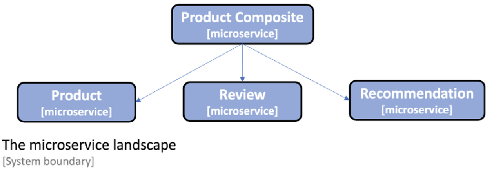

= In Action
Hui.Liu <mexn-0808@outlook.com>
:toc: left
:toclevels: 5
:toc-title: 目录

== 案例产品组件服务

用于学习的微服务案例：

产品组件服务由三个核心微服务组成，即 `Product`(产品) `Review`(评价) `Recommendation`(推荐) ，所有这些服务都处理一种类型的资源和一个复合的资源。
微服务称为 `ProductComposite` 服务，聚合来自三个核心微服务的信息。

=== 产品(Product)服务

产品服务管理产品信息并描述每个产品的以下属性：

.产品信息
|===
|Field|Describe

|Product ID |产品主键
|Name |产品名称
|Weight |产品重量
|===

=== 评论(Review)服务

评论服务管理产品评论，存储有关每个评论信息：

.评论信息
|===
|Field |Describe

|Product ID |产品主键
|Review ID |评价主键
|Author |评价人
|Subject |主题
|Content |内容
|===

=== 推荐(Recommendation)服务

推荐服务管理产品推荐并存储以下信息关于每条建议：

.推荐信息
|===
|Field |Describe

|Product ID |产品主键
|Recommendation ID |推荐主键
|Author |推荐人
|Rate |推荐率
|Content |推荐内容
|===

=== 产品组件服务

产品组件服务聚合三大核心服务的信息，呈现有关产品如下信息：

. 产品信息：如产品服务中所述
. 指定产品的产品评论列表：如评论服务中所述
. 指定产品的推荐列表：如推荐服务中所述

== 生成微服务骨架

