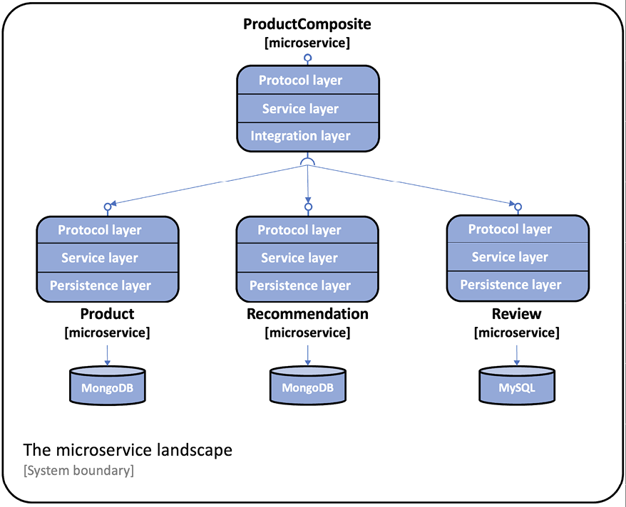

= 持久化
Hui.Liu <mexn-0808@outlook.com>
:toc: left
:toclevels: 5
:toc-title: 目录

将使用 Spring Data 将项目数据保存到 MongoDB 和 MySQL 数据库中。

微服务 `product` `recommendation` 使用 Spring Data for MongoDB；
微服务 `review` 微服务使用 Spring Data for Java Persistence API 访问 MySQL 数据库。

Protocol layer: 处理特定于协议的逻辑；仅由 **api** 项目中的 ``RestController`` 注解和 **util** 项目中的 ``GlobalControllerExceptionHandler`` 组成。
每个微服务的主要功能在于每个微服务的 Service layer。

**product-composite** 包含一个 Integration layer ，用于处理与三个核心微服务的通信。
核心微服务有独立的持久化层，用于与数据通信。

== 添加持久化

除了使用 Spring Data 之外，还使用 Java Bean 映射工具 **MapStruct**，实现 Spring Data 实体对象和 API 领域对象之间的转换变得容易。

=== 添加 MapStruct 依赖项

使用 MapStruct `1.5.5.Final` 版本；
