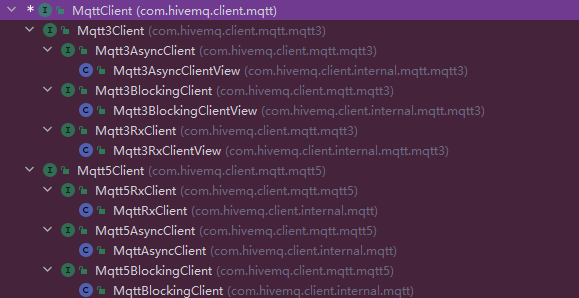

# Hive MQ MQTT Client

## 依赖

```groovy
dependencies {
    implementation 'com.hivemq:hivemq-mqtt-client:1.3.0'
}
```

```xml

<dependency>
    <groupId>com.hivemq</groupId>
    <artifactId>hivemq-mqtt-client</artifactId>
    <version>1.3.0</version>
</dependency>
```

## 客户端



`com.hivemq.client.mqtt.MqttClient`

