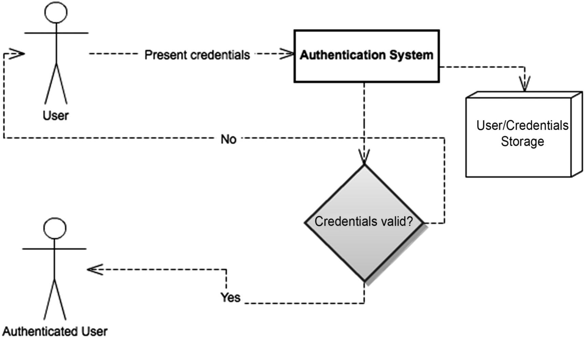
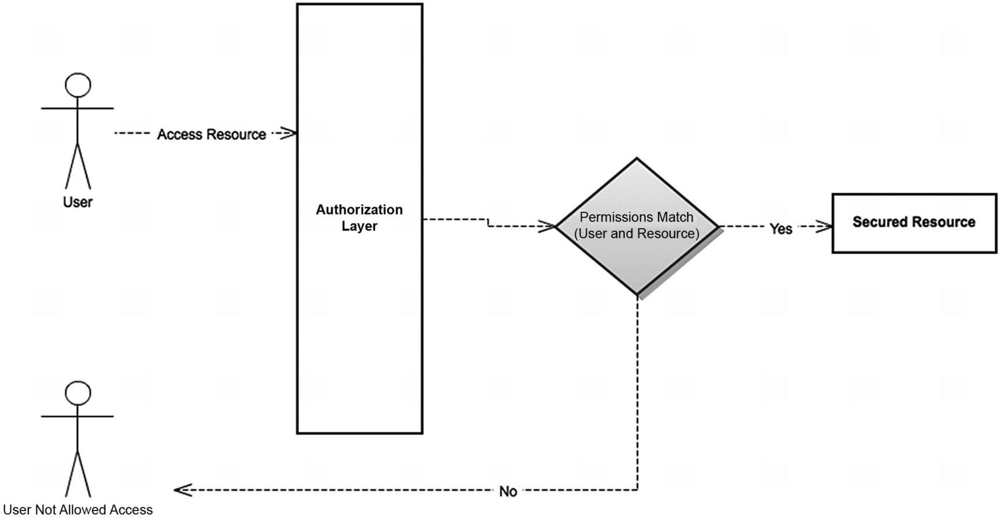
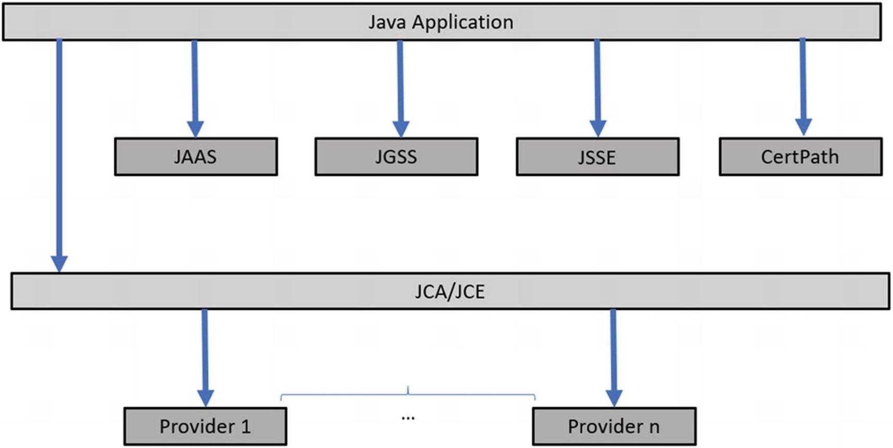

= Spring Security

Spring Security 旨在称为 Java 应用程序的全功能安全解决方案。

在 Spring Security 6 中用于配置安全设置的 ``WebSecurityConfigurerAdapter`` 类已被弃用；
使用基于组件的方法创建 ``SecurityFilterChain`` 类型的 Bean 。
``AuthorizeRequests`` 已被弃用，替换为 ``authorizeHttpRequests`` ；
``AntMatcher`` ``MvcMatcher`` ``RegexMatcher`` 已被弃用，替换为 ``requestMatchers`` 或 ``securityMatchers`` 。

== 1. 安全范围

Spring Security 作用于**应用程序层**领域；
Spring Security 解决应用安全提供三个方面：**身份验证**、**授权**、**访问控制列表(ACL)**。

* *身份验证*：验证尝试访问应用程序的用户或实体身份的过程
+
常见的认证方式：

** **用户名和密码**：用户提供唯一用户名和对应密码
** **多重身份验证(MFA)**：用户提供多种形式身份验证（例如：密码与发送到移动设备的验证码）
** **生物识别身份验证**：用户使用独特物理特征验证身份（例如：指纹、面部识别或虹膜扫描）

+
.简单、标准的身份验证机制

* **授权**：决定用户可以在应用程序中可进行的操作和可访问的资源
+
用户通过**身份验证后**，授权机制会根据预定义的规则和策略控制其权限；
确保用户只能访问有权使用的功能和数据；
+
授权方式：

** **基于角色的访问控制(RBAC)**
+
为用户**分配角色**，并**根据角色授予权限**；
** **基于属性的访问控制(ABAC)**
+
根据用户的特定**属性**或**特征**（例如：职位、部门或位置）授予访问权限；
** **基于规则的访问控制(RuBAC)**
+
以规则为基础的访问控制，根据**预定义的条件**，用于允许或拒绝用户的访问权限（例如：在特定时间范围内或基于某些数据条件授权访问权限）；

+
用户通过身份验证，**仅**意味系统已知该用户并被系统识别；
并不意味着用户可以自由地在该系统中做任何她想做的事情。
保护应用安全的下一个**逻辑步骤**是通过**授权明确**用户可以执行哪些操作以及可以访问哪些资源。

+
.简单的授权过程：经过身份验证的用户尝试访问受保护的资源

* **访问控制列表(ACL)**：管理应用程序中特定资源或对象的访问权和权限
+
通常与**授权**结合使用。
ACL 定义谁有权**访问资源**以及可以对资源执行哪些**操作**；
由**用户或组的列表**及其对特定**资源的相应权限**(**读** **写** **执行**等)组成。

+
ACL 是**授权过程**的一部分；
主要区别在于 ACL 通常在应用程序中以更细粒度级别工作。
**ACL 是__资源__、__用户__和__权限__之间映射的集合**。

==身份验证和授权：一般概念

基本安全概念：

* **用户**：允许使用系统的用户
* **凭证**：用户证明自己身份的方式（密码、证书等凭证）
* **角色**：用户的逻辑分组；以便分组的用户共享应用程序中的一组权限来访问某些资源
* **资源**：需要适当保护以防止未经授权访问的 URL、方法或业务对象等
* **权限**：访问特定资源所需的访问级别
* **加密**：加密敏感信息，使攻击者无法理解信息

加密算法类型：

* **单向加密**：也称为**哈希算法**，产生的是消息摘要，无法逆向得到原文
* **对称加密**：提供两个功能-**加密**(将原文转为密文)/**解密**(将密文转为原文)，加密/解密过程中使用相同的**密钥**
* **公钥加密**：基于**非对称加密**提供-**加密**(使用公钥)/**解密**(使用私钥)

加密可以实现的两个**安全目标**：

* **保密性**：属于一个用户或一组用户的潜在敏感信息仅可由该用户或该组访问
* **完整性**：有效用户发送的数据在发送到服务器或在其存储中时不应被第三方实体更改

=== Java 安全选项

Java 和 Java EE 开箱即用的安全解决方案涵盖的领域从**低级权限系统**到**加密 API **到**身份验证和授权方案**；

Java 提供的安全 API 列表：

* **JCA**(Java Cryptography Architecture)：支持加密算法（包括哈希和数字签名）
* **JCE**(Java Cryptographic Extensions)：主要提供字符串家吗和解密以及堆成密钥生成
* **CertPath**(Java Certification Path API)：提供将**数字证书的验证**和**集成应用程序涨**
* **JSSE**(Java Secure Socket Extension)：提供一组标准化功能，以支持 Java 中客户端和服务器的 SSL 和 TLS 协议
* **JAAS**(Java Authentication and Authorization Service)：提供身份验证和授权服务；提供了一个可插拔系统，可以独立地插入应用进程中
* **Java GSS-API**(Java Generic Security Services)：在通信应用程序之间安全地交换消息

.Java 平台安全架构和元素

Spring Security 主要关注点是**身份验证/授权领域**。
与 JAAS Java API 重叠， 可以一起使用，Spring Security 使用了其中大多数 API 。
