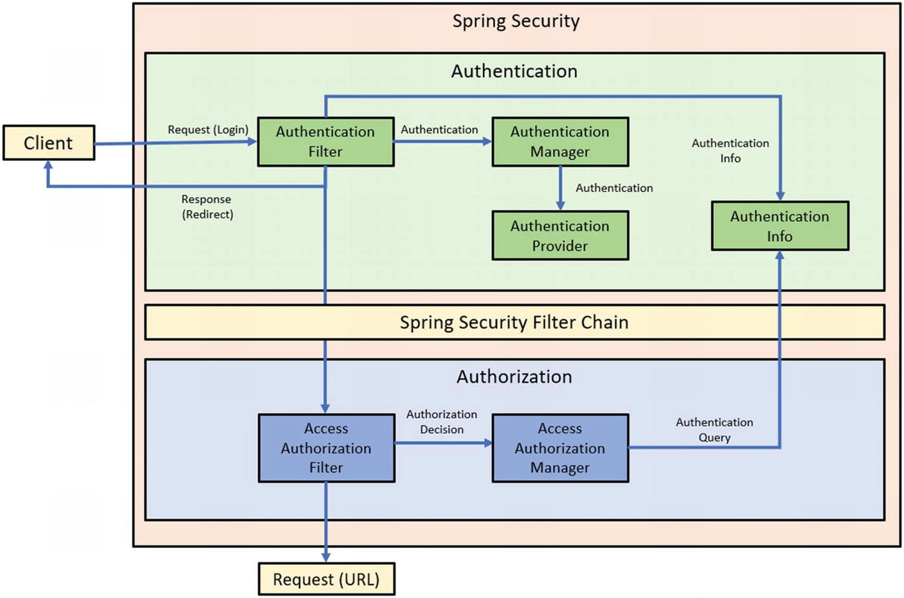

= Spring Security 简介

Spring Security 致力以提供开发人员友好且灵活的方式为 Java 应用程序提供**全套安全服务**的框架。
遵循 Spring Framework 实践，*尝试解决应用程序内的所有安全层*。

== Spring Security 概述

Spring Security 最初是一个非 Spring 项目，最初被称为 Acegi Security System for Spring 。

Spring Security 主要发布日期：

* 2.0.0 (2008-04)
* 3.0.0 (2009-12)
* 4.0.0 (2015-03)
* 5.0.0 (2017-11)
* 5.1.4 (2019-02)
* 6.1.0 (2023-05)

=== Spring Security 6 新增内容

* Spring Boot 3 和 Spring Security 6 基线是 Java 17
* ``WebSecurityConfigurerAdapter`` 类已被弃用和删除，因此现在必须创建一个 ``SecurityFilterChain`` 类型的 bean
* ``authorizeHttpRequests`` 替代 ``authorizeRequests`` 完成对 ``HttpSecurity`` 配置，实现访问控制配置细粒度请求匹配
* ``requestMatchers``/``securityMatchers`` 替代 ``AntMatcher``/``MvcMatcher``/``RegexMatcher`` 用于基于路径的访问控制，允许根据模式或其他条件匹配请求，而无需依赖特定的匹配器

+
Spring Security 5 仍然有效的主要功能：

* 默认 `ContextPath` 为 `/` ；如果需要定义特定的 `contextPath` 或使用 `via` 属性，请使用 `/app_name``（例如： `server.servlet.contextPath=/springbootapp` ）
* 从 3+ 版本开始 CSRF 令牌过滤器默认添加到过滤器链中
* 从 4 版本开始更新用户名和密码为 `username`/`password` 替代 `j_useranme`/`j_password` 参数
* 在 5 版本添加了 CSRF 保护
* 在 5 版本密码编码是强制的
* 从 Servlet 3.0 开始，不再需要 `web.xml` 文件
* 使用 Java 配置更轻松地配置 Spring Security
* 可以通过在 Log4J2 配置文件中将调试级别设置为 `DEBUG`

HTTP、LDAP、JAAS API 和 CAS 是 Spring Security 6 支持集成的一些最重要的技术。

身份验证和授权是 Spring Security 6 中的一些基本功能；
它们是非常重要的功能（允许 Spring Security 应用进程识别和授权用户，放置未授权的访问，并控制用户访问应用进程资源的授权）。

Spring Security 的认证授权流程：

.Spring Security 的认证授权流程

Spring Security 6 项目最重要的模块：

* Core: `spring-security-core.jar`
** `org.springframework.security.core`
** `org.springframework.security.access`
** `org.springframework.security.authentication`
** `org.springframework.security.provisioning`
* Remoting: `spring-security-remoting.jar`
* Web: `spring-security-web.jar`
* Config: `spring-security-config.jar`
* LDAP: `spring-security-ldap.jar`
* OAuth 2.0 Core: `spring-security-oauth2-core.jar`
* OAuth 2.0 Client: `spring-security-oauth2-client.jar`
* OAuth 2.0 JOSE: `spring-security-oauth2-jose.jar`
* OAuth 2.0 Resource Server: `spring-security-oauth2-resource-server.jar`
* ACL: `spring-security-acl.jar`
* CAS: `spring-security-cas.jar`
* Test: `spring-security-test.jar`
* Taglibs: `spring-security-taglibs.jar`

Spring Security 6 源码目录描述：

* `core`(`spring-security-core`): Spring Security 的身份验证和访问控制核心类和接口所在位置
* `remoting`(`spring-security-remoting`): 远程处理类模块
* `aspect`(`spring-security-aspects`): 在 Spring Security 中提供面向切面编程支持
* `config`(`spring-security-config`): 提供 XML 和 Java 配置支持
* `crypto`(`spring-security-crypto`): 提供加密支持
* ``(`spring-security-data`): 支持与 Spring Data 集成
* ``(`spring-security-messaging`): 支持 Spring Security 消息
* ``(``):
* ``(``):
* ``(``):
