= Spring Security 架构与设计

== 1. Spring Security 组成

=== 10_000 英尺高空景观

Spring Security 是一个相对灵活的框架，旨在使开发人员能够轻松地在应用程序中实现安全性。
在一般层面上，它是一个由用于**授予**或**不授予**资源访问权限的**拦截**规则组成的框架。

.Spring Security 一万英尺高空概述
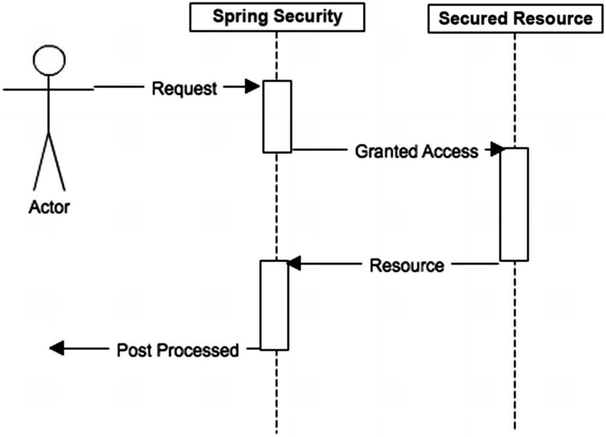

从这个角度看，可以将 Spring Security 视为构建在应用程序之上的**额外层**，**使用确定的安全规则将特定入口点包装到逻辑中**。

=== 1000 千英尺的景观

AOP 和 Servlet 过滤器层面。

Spring Security 拦截器安全模型适用于应用程序的两个主要领域：**URL**和**方法调用**。

Spring Security 围绕应用程序的两个入口点，仅在满足安全约束时才允许访问。
**方法调用**和**基于过滤器的安全性**都依赖于中央**Security Interceptor(安全拦截器)**，其中主要逻辑用于决定是否应该授予访问权限。

.在此视图中，方法调用和 HTTP 请求都尝试访问资源，但是它们必须先经过__安全拦截器__
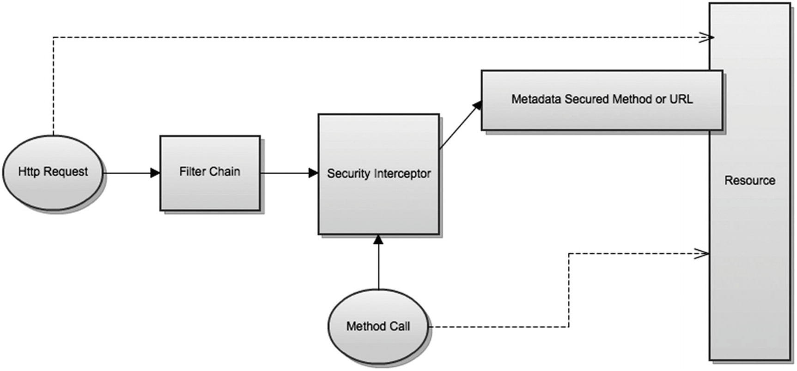

=== 100 英尺景观

Spring Security 内部架构最主要的核心模块是：

* **验证**
* **授权**

.Spring Security 的关键组件
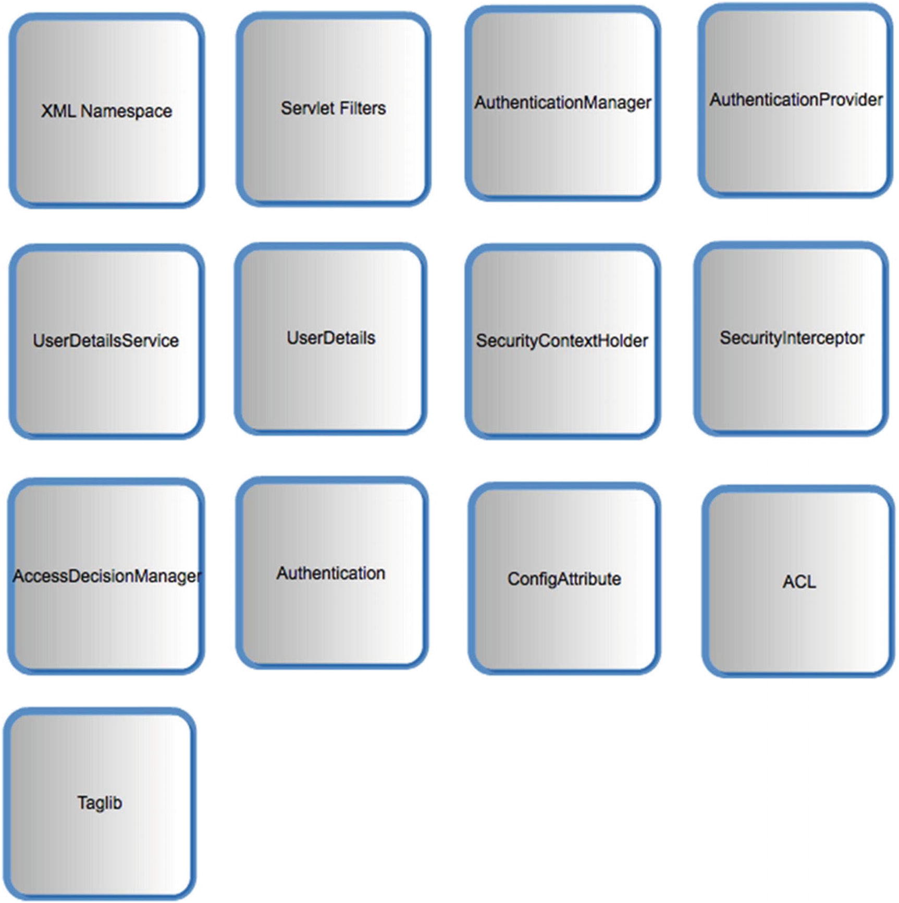

==== Security Interceptor 安全拦截器

Spring Security 框架最重要的组件之一是 `Security Interceptor` 。
在 ``AbstractSecurityInterceptor`` 中实现主要逻辑，并有 ``FilterSecurityInterceptor`` 和 ``MethodSecurityInterceptor`` 两种具体实现， `Security Interceptor` 负责决定是否允许特定请求通过受保护的资源。

* ``MethodSecurityInterceptor`` 处理方法调用的请求
* ``FilterSecurityInterceptor`` 处理 Web URL 的请求

Security Interceptor 有**预处理步骤**和**后处理步骤**。

===== Security Interceptor 预处理步骤

* **预处理步骤**：查看所有请求的资源是否受到某些元信息(或 ``ConfigAttribute``)的保护：
** 如果**不是**，则允许请求继续到达所请求的 URL 或方法
** 如果**是**， Security Interceptor 将从当前 ``SecurityContext`` 中检索 ``Authentication`` 对象

[TIP]
--
**身份验证**:

使用以下方法针对配置的 ``AuthenticationManager`` 对 ``Authentication`` 对象进行**身份验证**。

[source,java]
----
public interface AuthenticationManager {
  Authentication authenticate(Authentication authentication) throws AuthenticationException;
}
----

``AuthenticationManager#authenticate()`` 方法的最主要功能：

* 如果输入表示有效的主体 `Principal` 并且可以验证，则返回值为 `authenticated=true` 的身份验证
* 如果输入表示无效的主体 `Principal` ，则抛出 `AuthenticationException`
* 如果输入无法判断，则返回 `null`

``ProviderManager`` 是 ``AuthenticationManager`` 最常见的实现。
``ProviderManager`` 委托给 ``AuthenticationProvider`` 实例 ``List``。
每个 ``AuthenticationProvider`` 都有机会**指示身份验证成功、失败**，或指示它无法做出决定并允许**下游 ``AuthenticationProvider`` 做出决定**。
如果所有的 ``AuthenticationProvider`` 实例都无法进行身份验证，则身份验证将失败，并出现 ``ProviderNotFoundException`` (是一个特殊的 ``AuthenticationException`` 指示 ``ProviderManager`` 未配置为支持传递到其中的身份验证类型)。

.使用 `ProviderManager` 的 `AuthenticationManager` 层次结构
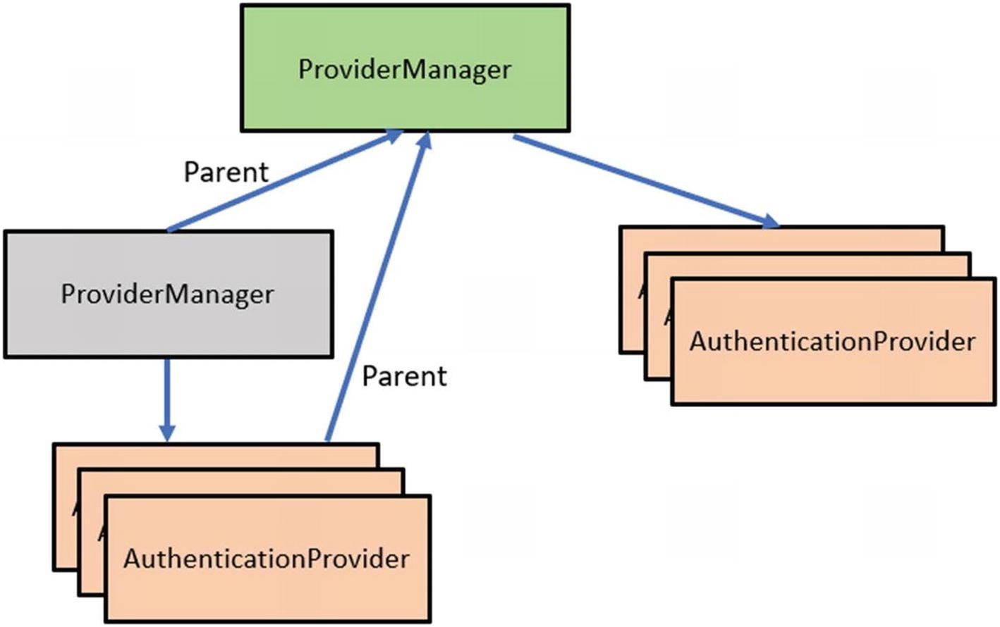
--

* ``Authentication`` 对象通过身份验证后，调用 ``AccessDecisionManager`` 来**确定身份验证的实体最终是否可以访问该资源**
** 如果经过身份验证的实体无法访问资源， ``AccessDecisionManager`` 将引发 ``AccessDeniedException``
** 如果允许 ``Authentication`` 实体访问资源，则 ``Authentication`` 对象将传递给 *``RunAsManager``* (如果已配置)
*** 如果未配置 ``RunAsManager`` 则会调用无操作实现；
** ``RunAsManager`` 返回 `null` (如果未配置为使用)或一个**新的 ``Authentication`` 对象**，该对象包含与原始 ``Authentication`` 对象相同的主体、凭证和授予的颁发机构，以及基于正在使用 ``RUN_AS`` 的新颁发机构集。**新的 ``Authentication`` 对象被放入当前的 ``SecurityContext`` 中**

+
完成此处理后，无论是否使用 ``RUN_AS`` ``Authentication`` 对象， Security Interceptor 都会创建一个新的 *``InterceptorStatusToken``* 其中包含 ``SecurityContext`` 和 ``ConfigAttributes`` 的信息。
**``InterceptorStatusTocken``** 后续将在 Security Interceptor 的**后处理**步骤中使用。

Security Interceptor 已准备好允许访问受保护的资源，它会传递调用，并调用特定到**安全实体(URL或方法)**。

===== Security Interceptor 后处理步骤

调用**安全实体(URL或方法)**返回后，Security Interceptor 的第二阶段后处理开始发挥作用。

如果配置了 ``AfterInvocationManager`` 的 ``decide`` 方法，则仅涉及调用该方法。
在其当前实现中， ``AfterInvocationManager`` 委托给 ``PostInvocationAuthorizationAdvice`` 的实例，该实例最终会筛选返回的对象或在必要时引发 ``AccessDeniedException`` 。
*如果在方法级安全性中使用调用后筛选器，则会出现这种情况*。

Security Interceptor 是 Spring Security 框架的核心。
对 Spring Security 中受保护资源的每次调用都会经过此拦截器。

.Security Interceptor UML 类图
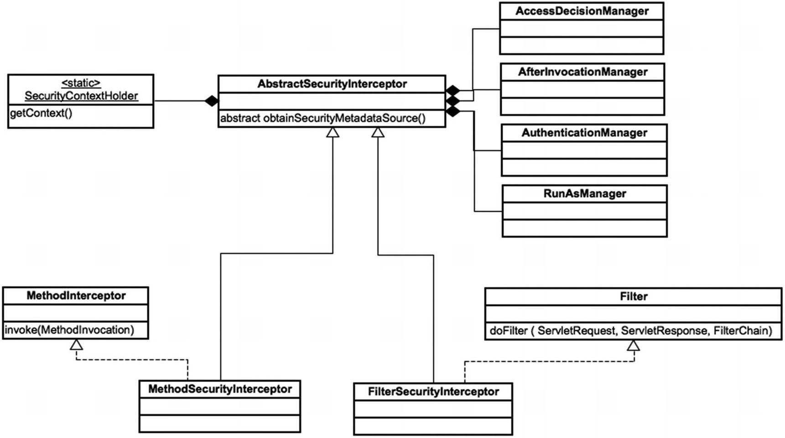

.``AbstractSecurityInterceptor`` 序列图
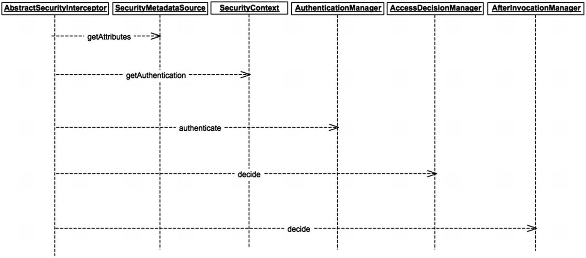

==== XML 命名空间

XML 命名空间对于框架命名空间的一般吸引力和可用想极为重要，但从理论上讲，并不是绝对必要的。
在这里解释在 Spring 中定义自定义命名空间背后的过程，尤其是 Spring Security 命名空间中的元素。

后面将探讨手动配置，但标准情况下不需要它。
注意：*命名空间不过是语法糖，最终仍会得到标准的 Spring Bean 和对象*。

所有与命名空间配置相关的信息都位于 Spring Security 的 **config** 模块中。

Spring Security 命名空间工作方式：

当基于 Spring 的应用程序开始加载时，会查找 XML 配置文件顶部的应用程序上下文的命名空间定义。
找到对 Spring Security 命名空间的引用(``xmlns:security="http://www.springframework.org/schema/security."``)。
使用 ``spring.handlers`` 映射文件中的信息，可以看到处理安全元素的文件是类： ``org.springframework.security,config.SecurityNamespaceHandler`` 。
Spring 为配置文件中使用 Security Namespace 的每个顶级元素调用此类(`SecurityNamespaceHandler`)的 ``parse`` 方法。

.加载 Spring Namespace 的顺序
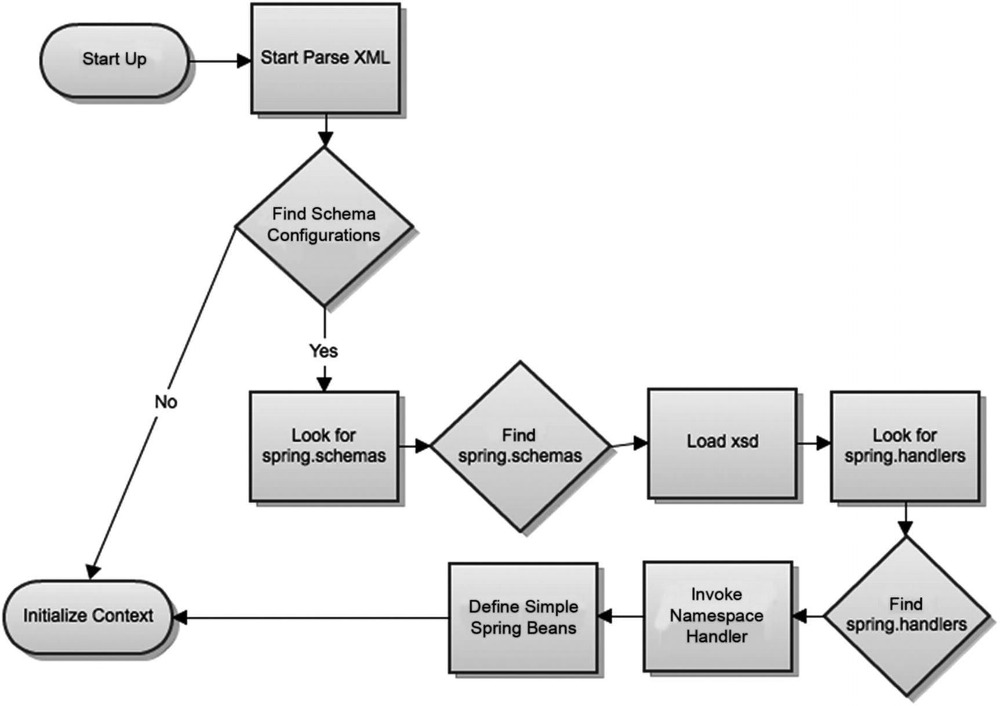

``SecurityNamespaceHandler`` 委托给一系列 ``BeanDefinitionParser`` 对象来单独解析每个顶级元素。
Spring Security 命名空间配置中支持的整个元素列表在类 ``org.springframework.security.config.Elements`` 中定义为常量。

==== 过滤器和过滤器链

过滤器链模型是 Spring Security 用来保护 Web 应用程序过滤器和过滤器链的模型。
此模型构建在**标准 servlet 过滤器**功能之上。
*Spring Security 中的过滤器链由一些单一职责过滤器构成，涵盖了应用程序所需的所有不同的安全约束*。

Spring Security 过滤器由 Spring Bean 组成；但是基于 servlet 的标准 Web 应用并不理解 Spring Bean 。

从容器角度看， Spring Security 是一个单一的过滤器，内部包含很多具有不同用途的过滤器。
*Spring Security 作为 ``FilterChainProxy`` 链中的单个过滤器安装*。

.Spring Security 过滤器概述
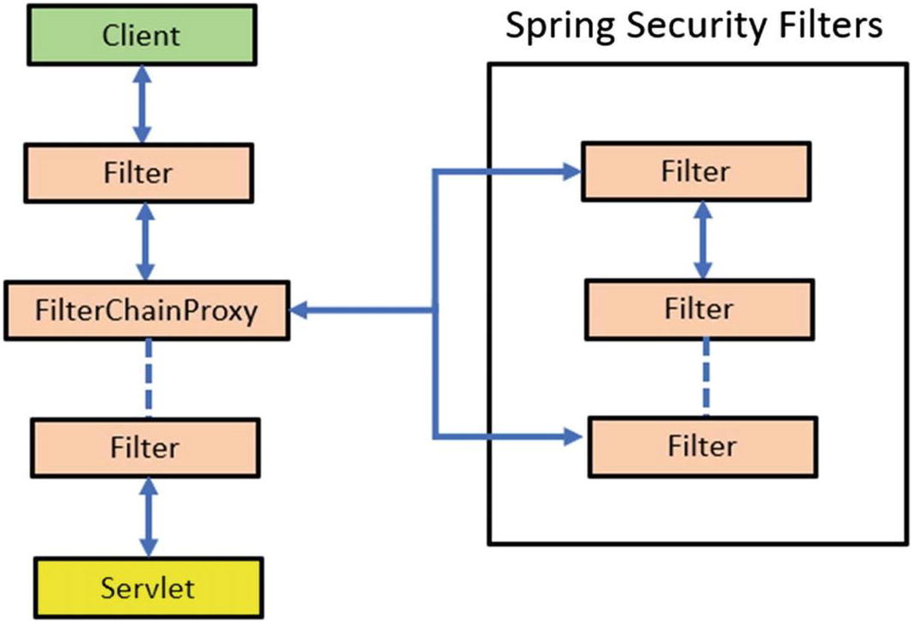

在安全过滤器中， ``DelegatingFilterProxy`` 容器中安装了一个特殊的间接层，该容器不需要是 Spring Bean 。

该流程的工作方式是 ``DelegatingFilterProxy`` 过滤器委托给 ``FilterChainProxy`` ；
``FilterChainProxy`` 始终是一个具有固定名称 ``springSecurityFilterChain`` 的 Bean ；
``FilterChainProxy`` 最终在应用程序中负责以下操作：

* 保护应用程序 URL
* 验证用户提交的用户名和密码
* 重定向到登录表单

.Spring Security 过滤器链概述
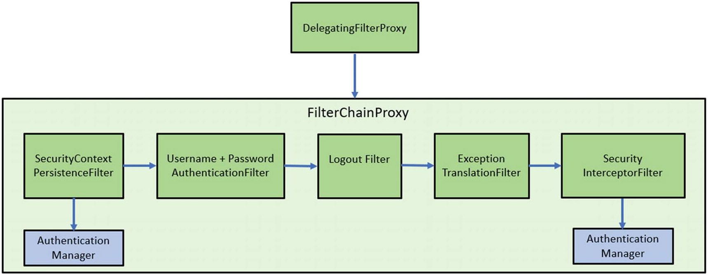

Spring Security 过滤器配置：

Spring Security 过滤器配置通过一个特殊的 servlet 和两个主要的 XML 文件 `web.xml`(从 Servlet 3.0 开始，不再需要 `web.xml`) 和 `applicationContext.xml` 来实现。

需要这个特殊的 servlet 过滤器来跨越标准 servlet API 和生命周期与 Bean 过滤器所在的 Spring 应用进程之间的界限。
这是 ``org.springframework.web.filter.DelegatingFilterProxy`` 的工作。
它在 ``web.xml`` 中定义，使用 ``WebApplicationContextUtils.getWebApplicationContext`` 实用工具方法来检索应用进程的根应用进程上下文。
这两个类来自 Spring Framework 而不是 Spring Security 。

.Spring Security 过滤器配置： `web.xml` 文件中的过滤器与 Spring 应用程序上下文中的 bean 具有相同的名称，以便侦听器可以找到
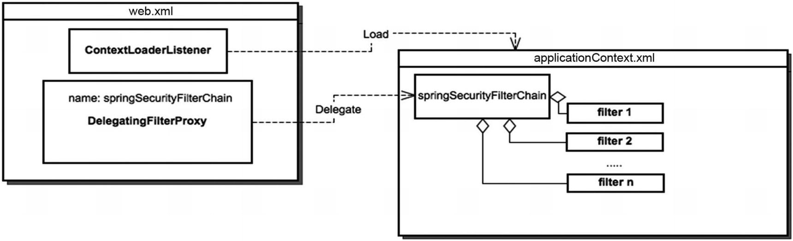

Spring Security 6 中可用的过滤器在 ``org.springframework.security.config.http.SecurityFilters`` 中定义为枚举：

* `CHANNEL_FILTER`:
* `CONCURRENT_SESSION_FILTER`:
* `SECURITY_CONTEXT_FILTER`:
* `LOGOUT_FILTER`:
* `X509_FILTER`:
* `PRE_AUTH_FILTER`:
* `FORM_LOGIN_FILTER`:
* `LOGIN_PAGE_FILTER`:
* `DIGEST_AUTH_FILTER`:
* `BASIC_AUTH_FILTER`:
* `REQUEST_CACHE_FILTER`:
* `SERVLET_API_SUPPORT_FILTER`:
* `JAAS_API_SUPPORT_FILTER`:
* `REMEMBER_ME_FILTER`:
* `ANONYMOUS_FILTER`:
* `SESSION_MANAGEMENT_FILTER`:
* `EXCEPTION_TRANSLATION_FILTER`:
* `FILTER_SECURITY_INTERCEPTOR`:
* `SWITCH_USER_FILTER`:

==== `Authentication` 对象

在 Spring Security 6 中， `Authentication` 接口的两个主要用途：

* `AuthenticationManager` 的输入，用于提供用户为进行身份验证而提供的凭据
+
在此场景中使用时， `isAuthenticated()` 返回 `false`

* 代表当前经过身份验证的用户；可以通过 ``SecurityContext` 获取当前用户的 `authentication`
+
`Authenticaiton` 接口包含以下内容：

** `principal`: 标识用户；使用用户名/密码进行身份验证通常是一个 ``UserDetails`` 实例
** `credentials`: 凭证；通常是密码，在用户通过身份验证后会被清除，确保不会被泄露
** `authorities`: `GrantedAuthority` 实例，是授权用户的高级权限（例如：角色和范围）

`Authentication` 是一个抽象，代表登录系统的实体。

.`Authentication` 层次结构
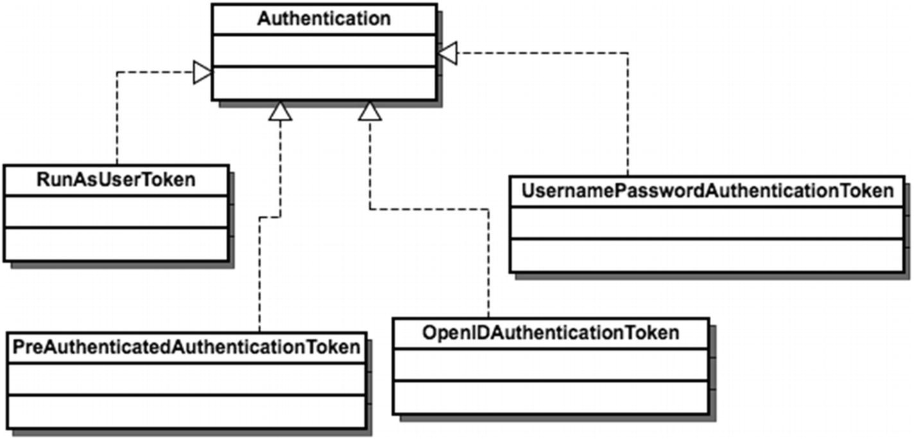

当创建身份验证请求时，将使用 `Authentication` 对象来携带框架的不同层和类、请求数据，并在验证数据时包含经过身份验证的实体并将其存储在 `SecurityContext` 中。

> 例如：当登录到应用程序时，将创建一个新的 `Authentication` 对象，用于存储**用户名**、**密码**和**权限**，它们在技术上分别称为**主体**、**凭证**和**颁发机构**。

框架中一些 `Authentication` 实现：

* `UsernamePasswordAuthenticationToken`: 实现包含经过身份验证用户的用户名和密码信息
+
是整个系统中使用的最常见的身份验证实现，许多 `AuthenticationProvider` 对象直接依赖此类。
* `PreAuthenticatedAuthenticationToken`: 用于处理预身份验证的 `Authentication` 对象
+
预身份验证是**外部系统**处理实际身份验证过程的身份验证；
Spring Security 仅从外部系统的消息中提取主体(用户)信息。
* `RunAsUserToken`: 由 `RunAsManager` 使用
+
当访问的资源包含以前缀 `RUN_AS_` 开头的 `ConfigAttribute` 时， Spring Security 将调用该实现。
如果存在具有此值的 `ConfigAttribute` 则 `RunAsManager` 会将新的 `GrantedAuthorities` 添加到与 `RUN_AS` 值对应的经过身份验证的用户。

==== SecurityContext 和 SecurityContextHolder
==== 认证提供者
==== 访问决策管理器
===== 基于肯定性
===== 基于共识
===== 一致的
==== 访问决策投票者
==== UserDetailsService 和 AuthenticationUserDetailsService
==== 用户详细信息
==== ACL
==== JSP 标签库

== Spring Security 中的良好设计和模式

=== 策略模式
=== 装饰模式
=== SRP
=== DI

