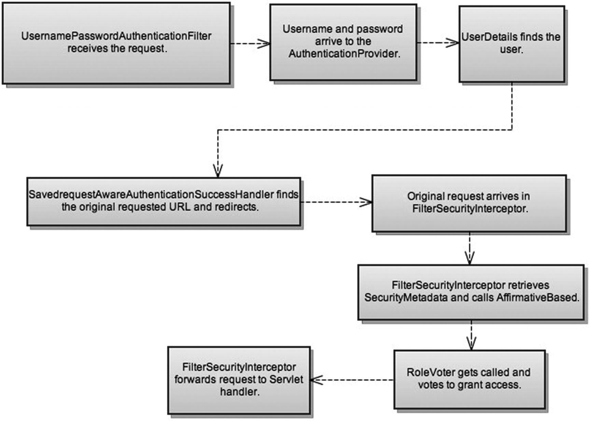

= Web 安全

* 安全过滤器链的内部工作原理
* 定义应用程序中的安全约束的不同元数据选项

[TIP]
--
**Spring Boot Security 依赖项**：

[source,groovy]
----
dependencies {
	implementation 'org.springframework.boot:spring-boot-starter-security'
	testImplementation 'org.springframework.security:spring-security-test'
}
----
--

== 配置 Spring Security 6

在 Web 应用中激活 Spring Security Web 项目配置，需要配置一个特定的 **servlet 过滤器**：负责预处理和后处理请求以及管理所需的安全约束。

* 使用 `@EnableWebSecurity` 启用 Spring Security 6
* 配置 `UserDetailsService` Bean 指定用户信息(基于内存临时用户使用 `InMemoryUserDetailsManager`)
* 使用 `BCryptPasswordEncoder` 配置 `PasswordEncoder` Bean 对用户密码进行编码提高安全性
* 配置 `SecurityFilterChain` Bean 指定使用用户名/密码身份验证机制进行身份验证

=== 配置 `SecurityFilterChain`

Spring Security 支持在请求级别对授权进行建模。

默认情况下， Spring Security 要求对每个请求进行身份验证。
每当使用 `HttpSecurity` 实例时，都必须声明授权规则。

* `authorizeHttpRequests` 配置授权规则
** `requestMatchers()` 指定匹配路径
** `anyRequest()` 指定所有路径

** `permitAll()` 对指定的匹配路径不对路径做安全控制
** `hasRole()` 对指定的匹配路径绑定指定角色可访问
** `denyAll()` 对指定的路径做安全控制

* `logout()` 配置注销
** `logoutSuccessUrl()` 注销成功跳转 url
** `deleteCookies()` 设置注销需要删除的 Cookie 值
** `invalidateHttpSession()` 设置注销时是否需要清空当前 session
** `permitAll()` 允许所有用户进行注销

* `csrf()` 配置跨站点请求伪造(CSRF)[https://docs.spring.io/spring-security/reference/servlet/exploits/csrf.html]
+
要使用 Spring Security CSRF 保护，必须确保正确的 HTTP 方法(PATCH POST PUT DELETE 等)可以修改状态。
** `Customizer.withDefaults()` 使用默认配置

* `formLogin()` 配置登录表单

当向配置的 URL 发送 HTTP 请求时，在 servlet 容器处理该请求后，该请求将到达 `DelegatingFilterProxy` ， `DelegatingFilterProxy` 将处理委托给 `FilterChainProxy` 。

一般来说， Spring Security 使用了很多过滤器；
HTTP 请求过滤器用于执行以下操作：

* 拦截请求
* 检测身份验证（或是否存在的身份验证）
* 重定向到身份验证入口点
* 将请求传递给授权服务器
* 将请求发送到 servlet 或抛出安全异常

Spring Security 6 中重要的过滤器：

* `ForceEagerSessionCreationFilter`
* `ChannelProcessingFilter`
* `WebAsyncManagerIntegrationFilter`
* `SecurityContextPersistenceFilter`
* `HeaderWriterFilter`
* `CorsFilter`
* `CsrfFilter`
* `LogoutFilter`
* `OAuth2AuthorizationRequestRedirectFilter`
* `Saml2WebSsoAuthenticationRequestFilter`
* `X509AuthenticationFilter`
* `AbstractPreAuthenticatedProcessingFilter`
* `CasAuthenticationFilter`
* `OAuth2LoginAuthenticationFilter`
* `Saml2WebSsoAuthenticationFilter`
* `UsernamePasswordAuthenticationFilter`
* `DefaultLoginPageGeneratingFilter`
* `DefaultLogoutPageGeneratingFilter`
* `ConcurrentSessionFilter`
* `DigestAuthenticationFilter`
* `BearerTokenAuthenticationFilter`
* `BasicAuthenticationFilter`
* `RequestCacheAwareFilter`
* `SecurityContextHolderAwareRequestFilter`
* `JaasApiIntegrationFilter`
* `RememberMeAuthenticationFilter`
* `AnonymousAuthenticationFilter`
* `OAuth2AuthorizationCodeGrantFilter`
* `SessionManagementFilter`
* `ExceptionTranslationFilter`
* `AuthorizationFilter`
* `SwitchUserFilter`

Spring Security 6 最重要的过滤器：

* `BasicAuthenticationFilter`: 如果在请求上找到基本身份验证 HTTP 标头，则尝试使用标头的用户名和密码对用户进行身份验证
* `UsernamePasswordAuthenticationFilter`: 如果找到用户名/密码请求参数/ POST 正文，则尝试使用这些值对用户进行身份验证
* `DefaultLoginPageGeneratingFilter`: 启用 Spring Security 时生成默认登录也买你，除非未显式禁用该功能
* `DefaultLogoutPageGeneratingFilter`: 生成注销页面，除非明确禁用该功能
* `FilterSecurityInterceptor`: 执行授权

== 详解 Spring Security 6 过滤器

当浏览器重定向并请求 `/login` 时与第一个请求相同，直接到达 `DefaultLoginPageGenerateFilter` ；
过滤器检测到 `/login` 请求，将登录表单的 HTML 数据直接写入响应对象中。

* 不正确的凭证登录：提交表单后，过滤器将按相同的顺序再次激活
. 请求到达 `UsernamePasswordAuthenticationFilter` 时，过滤器检查该请求是否针对 `/login` ，如果是过滤器分别从 HTTP 请求参数 `username` 和 `password` 中提取用户名和密码身份验证信息。
利用身份验证信息(`username` `password`)创建 `Authentication` 的实现类 `UsernamePasswordAuthenticationToken` 对象，然后将其发送到 `AuthenticationManager`(更确切是 `ProviderManager`)进行身份验证
. `DaoAuthenticationProvider` 是从 `Authentication` 的子类 `UsernamePasswordAuthenticationToken` 对象被调用；
`DaoAuthenticationProvider` 使用 `UserDetailsService` 检索存储的用户；
因为当前是不正确的凭证，所以没有用户拥有此用户名，因此抛出 `UsernameNotFoundException` 异常
. `DaoAuthenticationProvider` 基类 `AbstractUserDetailsAuthenticationProvider` 将异常转换未 `BadCredentialsException` 异常，隐藏应用程序中不存在此用户的事实。将它视为常见的 *用户名-密码组合错误*。
. `UsernamePasswordAuthenticationFilter` 捕获异常；
此过滤器给 `AuthenticationFailureHandler` 的实现实例，该实例又决定将响应重定向到 `/login?error` 。
登录表单将再次显示在浏览器中，并带有错误消息。

* 正确的凭证登录：
. 请求遵循与__不正确的凭证登录__相同的过滤过程，找到 `UserDetailsManager` 的子类 `InMemoryUserDetailsManager` /`JdbcUserDetailsManager` 返回所请求用户名的用户并将其返回 `DaoAuthenticationProvider` 创建一个成功的 `Authentication` 对象
. 验证成功后 `UsernamePasswordAuthenticationFilter` 委托给 `SavedRequestAwareAuthenticationSuccessHandler` 实例，该实例在会话中查找原始请求的 URL 并将响应重定向到该 URL

* 登陆后：请求受保护 URL ；系统中已经有一个经过身份验证的实体，请求到达 `FilterSecurityInterceptor`
. `FilterSecurityInterceptor` 接受到普通受保护 url 的访问请求；
然后 `FilterSecurityInterceptor` 恢复该 URL 所需的凭证
. `AffirmativeBased` 访问决策管理器被调用并调用 `RoleVoter` 投票者；
投票者评估经过身份验证的实体的权限，并将其与访问资源所需的凭证进行比较；
投票者找到匹配项（角色信息位于身份验证机构和资源的配置属性中），因此会使用 `ACCESS_GRANTED` 进行投票
. `FilterSecurityInterceptor` 将请求转发到请求处理链的下一个元素，即 `DispatcherServlet`
. 请求到达控制器 Controller 返回经过验证的页面

.成功的身份验证和授权过程流程

== Spring Security 6 的特殊 URL

在 Spring Security 6 对 Web 安全的支持中定义了一些预配置的 URL 供应用程序使用：

* `/login` 用于应用程序登录表单的 URL ；当需要身份验证时，框架会重定向到此 URL
* `/logout` 用于应用程序注销登录，使相应的会话和 `SecurityContext` 失效

**对应用程序的用户身份验证请求是通过 `http.authorizeRequests()` 方法发出的**。

