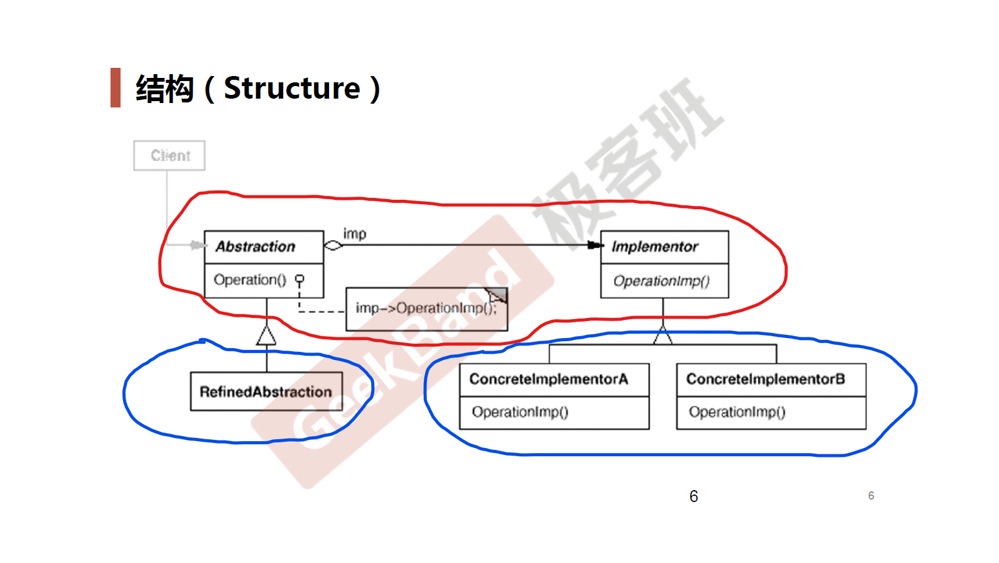

# Bridge *桥模式*

## 动机 (Motivation)

* 由于某些类型的固有的实现逻辑，使得它们具有两个变化的维度，乃至**多个维度的变化**。
* 如何应对这种**多维度的变化**？如何利用面向对象技术来使得类型可以轻松地沿着两个乃至多个方向变化，而不引入额外的复杂度？

## 案例

通信案例， Messager 处理用户登录，发送消息，发送图片；同时还要支持 播放声音、绘制图像、写入数据以及链接网络。
需要支持PC和Mobile的设计。

### 结构化软件设计流程

### 面向对象软件设计流程

##　模式定义

将抽象部分（**业务功能**）与实现部分（**平台实现**）分离，使它们都可以独立地变化。

-- 《设计模式》 GoF

## UML 结构图

## 要点总结

* Bridge 模式使用**对象间的组合关系**解耦了抽象和实现之间固有的**绑定**关系，使得抽象和实现可以沿着各自的维度来变化。所谓抽象和实现沿着**各自维度的变化**，即**子类化**它们。
* Bridge 模式有时候类似于多继承方案，但是多继承方案往往违背单一职责原则（**即一个类只有一个变化的原因**），复用性比较差。 Bridge 模式是比多继承方案更好的解决方法。
* Bridge 模式的应用一般在**两个非常强的变化维度**，有时一个类也有多于两个的变化维度，这时可以**使用 Bridge 的扩展模式**。
