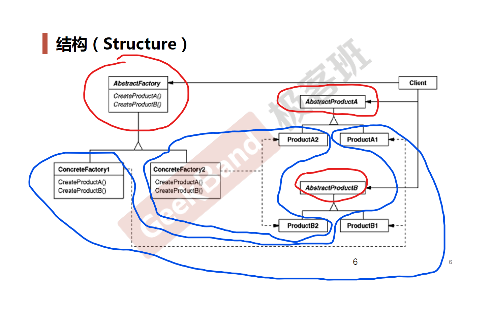

# Abstract Factory *抽象工厂*

## 动机 (Motivation)

* 在软件系统中，经常面临着**一系列相互依赖的对象**的创建工作；同时，由于需求的变化，往往存在更多系列对象的创建工作。
* 如何应对这种变化？如何绕过常规的对象创建方法( `new` )，提供一种**封装机制**来避免客户程序和这种**多系列具体对象创建工作**的紧耦合。

## 案例

数据库访问。

### 结构化软件设计流程

### 面向对象软件设计流程

##　模式定义

提供一个接口，让该接口负责创建一系列**相关或者相互依赖的对象**，无需指定它们具体的类。

-- 《设计模式》 GoF

> 可以把工厂方法和抽象工厂看作一类，工厂方法是抽象工厂的特殊情况。

## UML 结构图

## 要点总结

* 如果没有应对**多系列对象构建**的需求变化，则没有必要使用 Abstract Factory 模式，这时候使用简单的工厂完全可以。
* **系列对象**指的是在某一特定系列下的对象之间有**相互依赖**、或**作用**的关系。不同系列的对象之间不能相互依赖。
* Abstract Factory 模式主要在于应对**新系列**的需求变动。其缺点在于难以应对**新对象**的需求变动。
