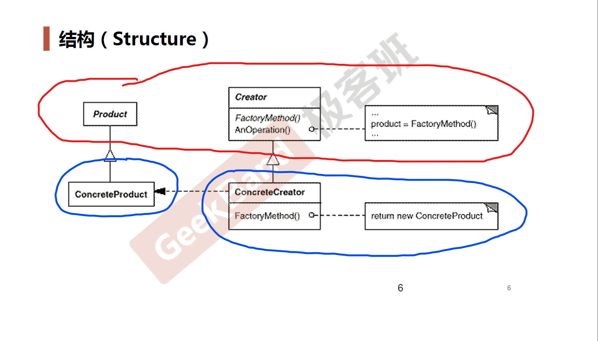

# Factory Method *工厂方法*

## 动机 (Motivation)

* 在软件系统中，经常面临着创建对象的工作；由于**需求的变化**，需要创建的对象的**具体类型经常变化**。
* 如何应对这种变化？如何绕过常规的对象创建方法( `new` )，提供一种**封装机制**来避免客户程序和这种**具体对象创建工作**的紧耦合？

## 案例

文件分割器

### 结构化软件设计流程

> 依赖于抽象，但是抽象依赖于细节

### 面向对象软件设计流程

##　模式定义

定义一个用于**创建对象的接口**，让**子类**决定实例化哪一个类。 Factory Method 使得一个类的**实例化延迟**（**目的：解耦，手段：虚函数**）到子类。

-- 《设计模式》 GoF

> 子类决定实例化是指：工厂子类。

## UML 结构图

## 要点总结

* Factory Method 模式用于**隔离**类对象的**使用者**和**具体类型**之间的耦合关系。面对一个经常变化的具体类型，紧耦合关系( `new` ) 会导致软件的脆弱。
* Factory Method 模式通过面向对象的手法，将所要创建的具体对象工作**延迟到子类**，从而实现一种扩展（而非更改）的策略，较好地解决了这种紧耦合关系。
* Factory Method 模式解决**单个对象**的需求变化。缺点在于要求**创建方法/参数相同**。
