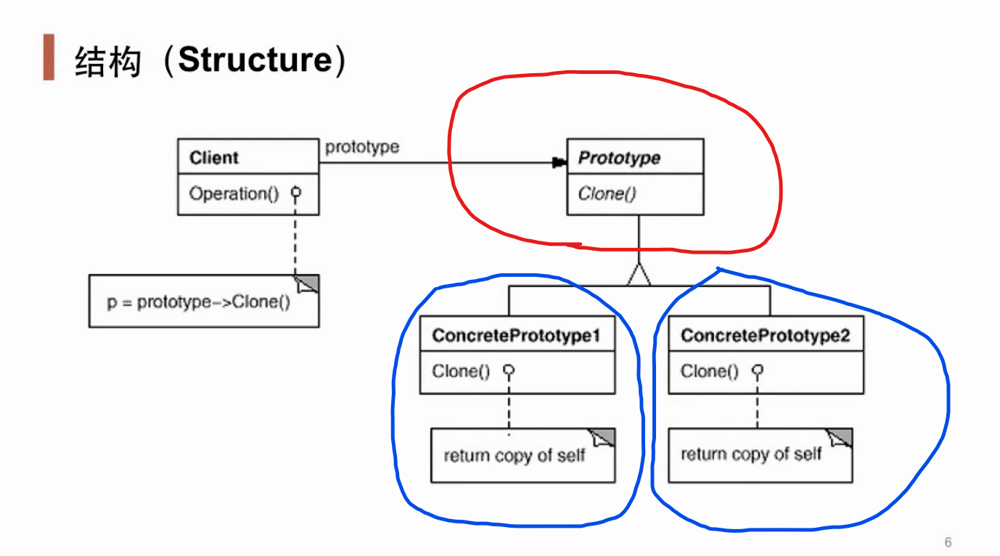

# Prototype *原型模式*

## 动机 (Motivation)

* 在软件系统中，经常面临着**某些结构复杂的对象**的创建工作；由于需求的变化，这些对象经常面临着剧烈的**变化**，但是它们却**拥有比较稳定一致的接口**。
* 如何应对这种变化？如何向**客户程序（使用这些对象的程序）**隔离出**这些易变对象**，从而使得**依赖这些易变对象的客户程序**不随着需求改变而改变？

## 案例

### 结构化软件设计流程

### 面向对象软件设计流程

> 原型对象不可以直接拿来使用，原型对象用于被克隆。
> 
> 将工厂方法的对象抽象和工厂接口合并。

##　模式定义

使用**原型实例**指定创建对象的种类，然后通过**拷贝**（深克隆）这些原型来创建新的对象。

-- 《设计模式》 GoF

> 当创建对象时，需要考虑对象的复杂的中间状态同时希望保留中间状态的时候，考虑原型模式。

## UML 结构图

## 要点总结

* Prototype 模式同样用于隔离类对象的使用者和具体类型（**易变类**）之间的耦合关系，它同样要求这些**易变类**拥有**稳定的接口**。
* Prototype 模式对于**如何创建易变类的实体对象**采用**原型克隆**的方法来做，它使得我们可以非常灵活地动态创建**拥有某些稳定接口**的新对象——所需工作仅仅是注册一个新类的对象（即**原型**），然后在任何需要的地方 Clone 。
* Prototype 模式中的 Clone 方法可以利用某些框架中的**序列化**来实现深拷贝。（Java/C#等）
