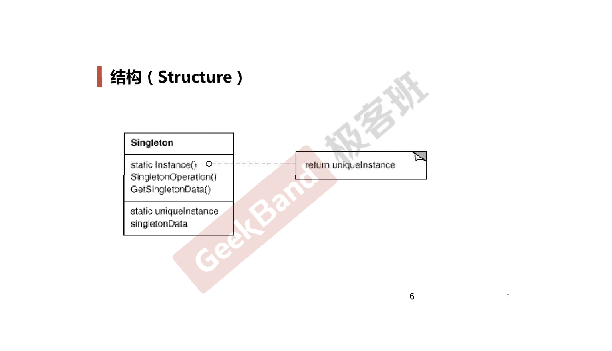

# Singleton *单件/单例模式*

## 动机 (Motivation)

* 在软件系统中，经常有这样一些特殊类，必须保证它们在系统中只存在**一个实例**，才能确保它们的逻辑正确性、以及良好的效率。
* 如何绕过常规的构造器，提供一种机制来保证一个类只有一个实例？
* 这应该是类设计者的责任，而不是使用者的责任。

## 案例

### 结构化软件设计流程

### 面向对象软件设计流程

##　模式定义

保证一个类仅有一个实例，并提供一个该实例的全局访问点。

-- 《设计模式》 GoF

## UML 结构图

## 要点总结

* Singleton 模式中的实例构造器可以设置为 `protedted` 以允许子类派生。
* Singleton 模式一般不要支持拷贝构造函数和 `clone` 接口，因为有可能导致多个对象实例，与 Singleton 模式的初衷违背。
* 如何实现多线程环境下安全的 Singleton ？注意对双检查锁的正确实现。
