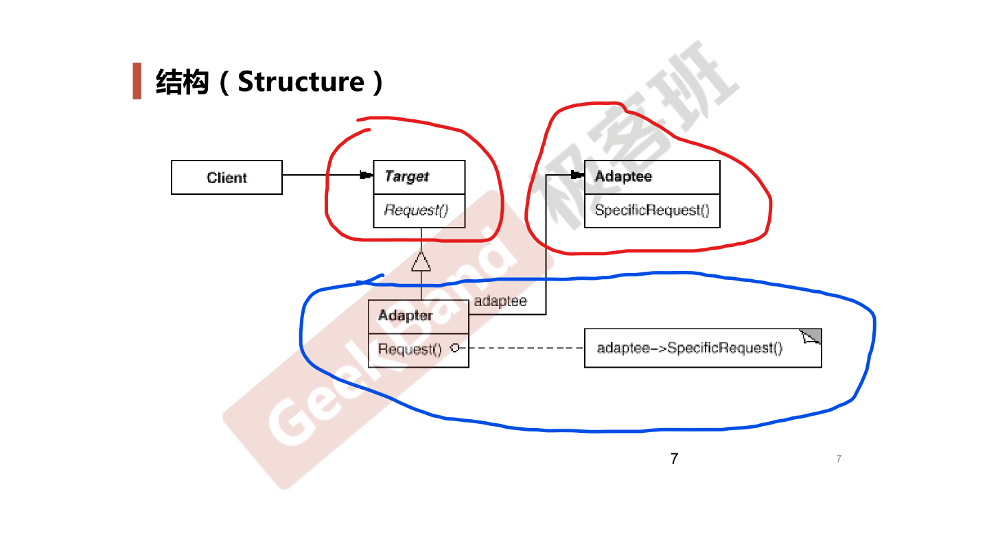

# Adapter *适配器模式*

## 动机 (Motivation)

* 在软件系统中，由于应用环境的变化，常常需要将**一些现存的对象**放在新的环境中应用，但是新环境要求的接口是这些现存对象所不满足的。
* 如何应对这种**迁移的变化**？如何既能利用现有对象的良好实现，同时又能满足新的应用环境所要求的接口？

## 案例

> 继承一个类表明遵循父类的接口规范。

### 结构化软件设计流程

### 面向对象软件设计流程

##　模式定义

将一个类的接口转换成客户希望的另一个接口。 Adapter 模式使得原本由于接口**不兼容**而不能一起工作的那些类可以一起工作。

-- 《设计模式》 GoF

## UML 结构图

## 要点总结

* Adapter 模式主要应用于**希望复用一些现存的类，但是接口又与复用环境要求不一致的情况**，在遗留代码复用、类库迁移等方面非常有用。
* GoF 23 定义了两种 Adapter 模式的实现结构：对象适配器和类适配器。但类适配器采用了**多继承**的实现方式，一般不推荐使用。对象适配器采用**对象组合**的方式，更符合松耦合精神。
* Adapter 模式可以实现的非常灵活，不必拘泥于 GoF 23 中定义的两种结构。例如，完全可以将 Adapter 模式中的**现存对象**作为新的接口方法参数，来达到适配的目的。
