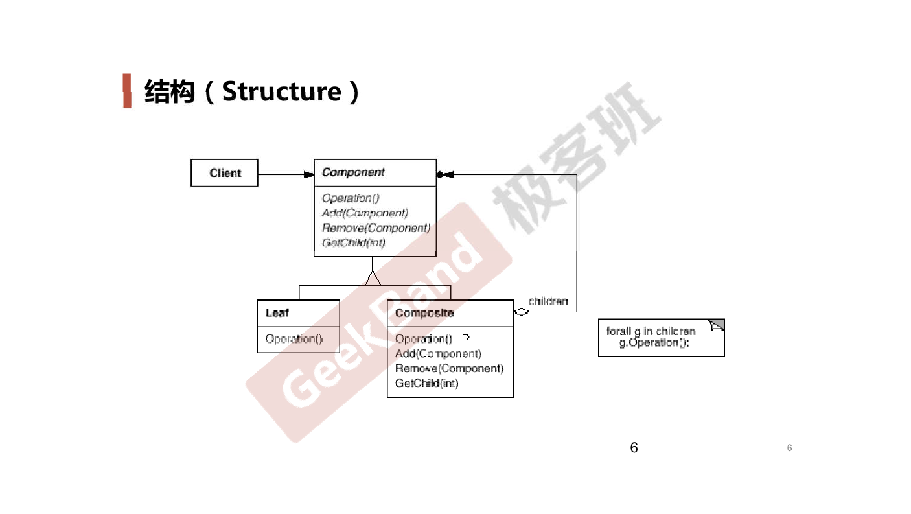

# Composite *组合模式*

## 动机 (Motivation)

* 在软件在某些情况下，客户代码过多地依赖于对象容器复杂的内部实现结构，对象容器内部实现结构（而非抽象接口）的变化将引起客户代码的频繁变化，带来了代码的维护性、扩展性等弊端。
* 如何将**客户代码与复杂的对象容器结构**解耦？让对象容器自己来实现自身的复杂结构，从而使得客户代码就像处理简单对象一样来处理复杂的对象容器？

## 案例

### 结构化软件设计流程

### 面向对象软件设计流程

##　模式定义

将对象组合成**树形结构**以表示**部分-整体**的层次结构。 Composite 使得用户对单个对象和组合对象的使用具有一致性（**稳定**）。

-- 《设计模式》 GoF

## UML 结构图

## 要点总结

* Composite 模式采用树形结构来实现普遍存在的对象容器，从而将**一对多**的关系转化为**一对一**的关系，使得客户代码可以**一致地**（**复用**）处理对象和对象容器，无需关系处理的是单个对象，还是组合的对象。
* 将**客户代码与复杂的对象容器结构**解耦是 Composite 的核心思想，解耦之后，客户代码将与纯粹的抽象接口——而非对象容器的内部实现结构——发生依赖，从而更能**应对变化**。
* Composite 模式在具体实现中，可以让父对象中的子对象反向追溯；如果父对象有频繁的遍历需求，可使用缓存技巧来改善效率。
