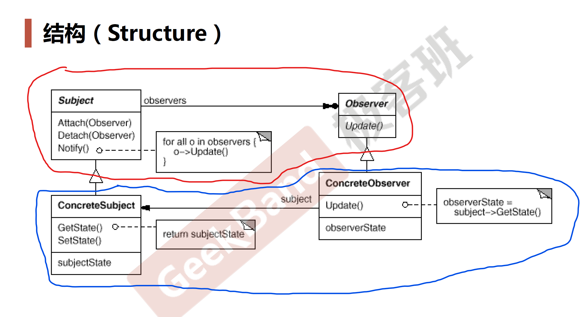

# Observer *观察者模式*

> Observer 观察者模式在一些地方也称为 Event 。

## 动机 (Motivation)

* 在软件构建过程中，我们需要为某些对象建立一种**通知依赖关系** —— 一个对象（目标对象）的状态发生改变，**所有**依赖对象（观察者对象）都将得到通知。
如果这样的依赖关系过于紧密，将使软件不能很好地抵御变化。
* 使用面向对象技术，可以将这种**依赖关系弱化**，并形成一种**稳定的依赖关系**。
从而实现软件体系结构的松耦合。

## 案例

### 结构化软件设计流程

> 违反了**依赖倒置原则(DIP)**
> 
> 高层模块不应该依赖于底层模块，二者都应该依赖于抽象；抽象不应该依赖于实现细节，实现细节应该依赖于抽象。

FileSplitter 是依赖 ProgressBar 具体实现，依赖了实现细节；
不能单纯找父类作为依赖，**去思考具体实现扮演的角色**，这里扮演的是通知

### 面向对象软件设计流程

##　模式定义

定义对象间的一种一对多（**变化**）的依赖关系，以便当一个对象(Subject)的状态发生**改变**时，所有依赖于它的对象都得到通知并自动更新。

-- 《设计模式》 GoF

## UML 结构图

## 要点总结

* 使用面向对象的抽象， Observer 模式使得我们可以**独立**地改变目标与观察者，从而使二者之间的依赖关系达致松耦合。
* 目标**发送通知**时，无需指定观察者，通知（可以携带通知信息作为参数）会**自动传播**。
* 观察者自己决定是否需要订阅通知，**目标对象对此一无所知**。
* Observer 模式是基于事件的 UI 框架中非常常用的设计模式，也是 MVC 模式的一个重要组成部分。

> Java 中 Listener 是观察者模式。
