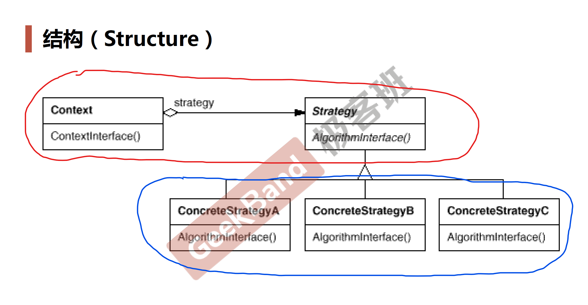

# Strategy *策略模式*

## 动机 (Motivation)

* 在软件构建过程中，某些对象使用的**算法**可能多种多样，经常**改变**，如果将这些算法编码到对象中，将会使对象变得异常复杂；而且有时候支持不使用的算法也是一种性能负担（减少代码段中无效代码的比重）。
* 如何在**运行时**根据需要透明地更改对象的算法？将**算法与对象本身解耦**，从而避免上述问题？

## 案例

### 结构化软件设计流程

[TaxBase](../../../../main/java/org/tutorials/design/patterns/strategy/motivation/TaxBase.java)
[SalesOrder](../../../../main/java/org/tutorials/design/patterns/strategy/motivation/SalesOrder.java)

> 违反了**开闭原则**。
> 
> 对**扩展**开放，对**更改**关闭。
> 类模块应该通过扩展的方式应对变化，而不是直接在类上修改。

### 面向对象软件设计流程

将各个算法，变成算法接口的子类；

[TaxStrategy](../../../../main/java/org/tutorials/design/patterns/strategy/pattern/TaxStrategy.java)
[SalesOrder](../../../../main/java/org/tutorials/design/patterns/strategy/pattern/SalesOrder.java)
新增算法仅需要新增实现接口 `TaxStrategy` 的子类
[CNTax](../../../../main/java/org/tutorials/design/patterns/strategy/pattern/CNTax.java)
[USTax](../../../../main/java/org/tutorials/design/patterns/strategy/pattern/USTax.java)
[DETax](../../../../main/java/org/tutorials/design/patterns/strategy/pattern/DETax.java)
[FRTax](../../../../main/java/org/tutorials/design/patterns/strategy/pattern/FRTax.java)

> 遵循了开放封闭原则，对扩展开放(实现接口)。

##　模式定义

定义一系列算法，把它们一个一个封装起来，并且使它们可**互相替换**（**变化**）。
该模式使得算法可独立于使用它得客户程序（**稳定**）而变化（**扩展**，**子类化**）。

-- 《设计模式》 GoF

## UML 结构图

## 要点总结

* Strategy 及其子类为组件提供了一系列可重用的算法，从而可以使得类型在**运行时**方便地根据需要在各个算法之间进行切换。
* Strategy 模式提供了用**条件按判断语句**以外的另一种选择，消除条件判断语句，就是在解耦合。含有许多条件判断语句的代码通常都需要 Strategy 模式。
* 如果 Strategy 对象没有实例变量，那么各个上下文可以共享同一个 Strategy 对象，从而节省对象开销。
