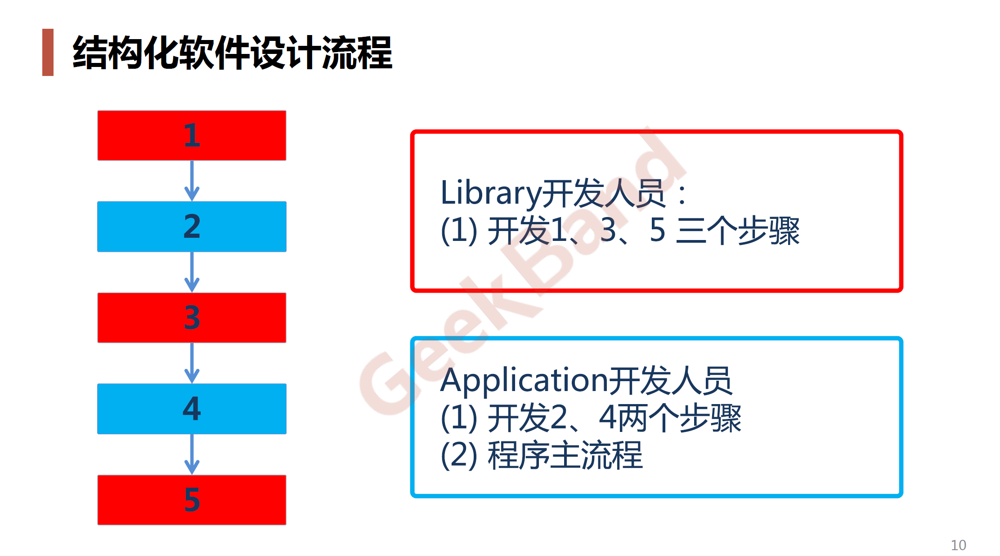
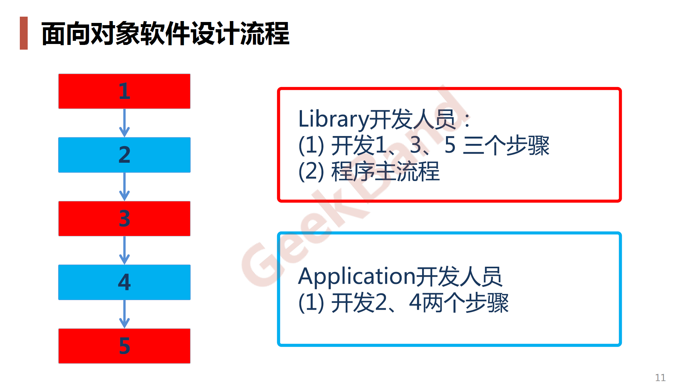
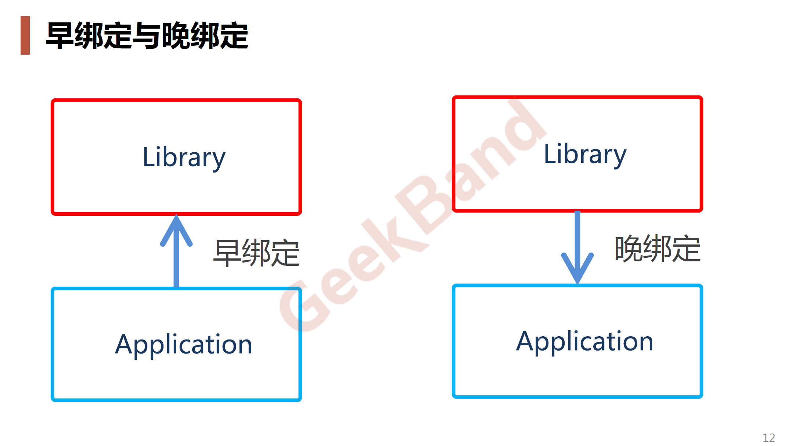
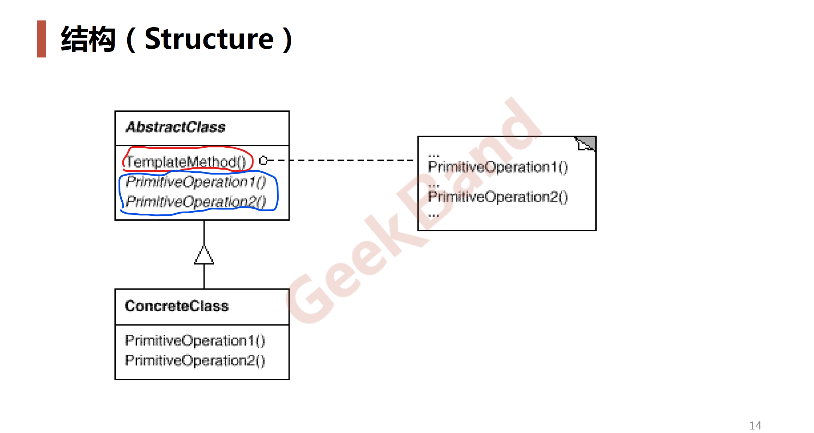

# Template Method *模板方法*

## 动机 (Motivation)

* 在软件**构建**过程中：
  * 对于某一项任务，它常常有**稳定的整体操作结构**，但各个**子步骤**却有很多**改变**的需求；
  * 或者由于**固定**的原因（比如*框架*与*应用*之间的关系）而无法和任务的整体结构**同时**实现。
* 如何在**确定的稳定操作结构**的前提下，来灵活应对各个**子步骤**的改变或者**晚期**实现需求？

## 案例

### 结构化软件设计流程

[Library.java](../../../../main/java/org/tutorials/design/patterns/template_method/motivation/Library.java)

[Application.java](../../../../main/java/org/tutorials/design/patterns/template_method/motivation/Application.java)

### 面向对象软件设计流程

[Library.java](../../../../main/java/org/tutorials/design/patterns/template_method/pattern/Library.java)

[Application.java](../../../../main/java/org/tutorials/design/patterns/template_method/pattern/Application.java)

### 效果

##　模式定义

定义一个操作中的算法骨架（**稳定**），而将一些步骤**延迟**（**变化**）到子类中。
**Template Method** 使得子类可以不改变（**复用**）一个算法的结构即可**重定义**（ `override` 重写）该算法的某些特定步骤。

-- 《设计模式》 GoF

## UML 结构图

* red:稳定
* blue:变化

## 要点总结

* Template Method 模式是一种非常**基础性**的设计模式，在面向对象系统中有着大量的应用。
  它用最简洁的机制（虚函数的多态性）为很多应用程序框架提供了灵活的**扩展**点，是代码复用方面的基本实现结构。
* 除了可以灵活应对子步骤的变化外，**不要调用我，让我来调用你**的反向控制结构是 Template Method 的典型应用。
* 在具体实现方面，被 Template Method 调用的虚方法可以具体实现，也可以没有实现（抽象方法，纯虚方法），但一般推荐将它们设置为 `protedted` 方法。

> **扩展**：多态（子类继承父类对虚函数 override ）
> 
> `protected` ：变化部分的抽象方法，单独作为方法的没有意义（没有对应的函数体）。
