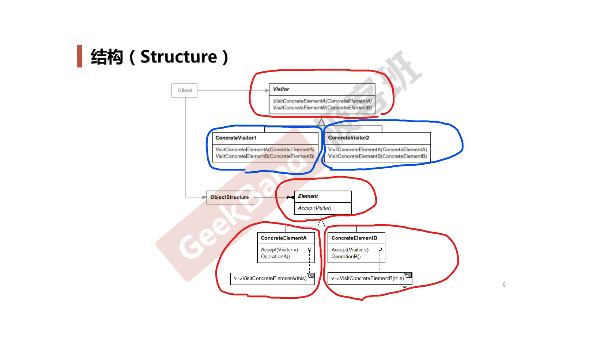

# Visitor *访问器模式*

## 动机 (Motivation)

* 在软件构建过程中，由于需求的改变，某些类层次结构中常常需要增加新的行为（方法），如果直接在基类中做这样的更改，将会给子类带来很繁重的变更负担，甚至破坏原有设计。
* 如何在不更改类层次结构的前提下，在**运行时**根据需要透明地为类层次结构上的各个类动态添加新的操作，从而避免上述问题？

## 案例

### 结构化软件设计流程

### 面向对象软件设计流程

##　模式定义

表示一个作用于某对象结构中的各元素的操作。使得可以在不改变（**稳定**）各元素的类的前提下定义（**扩展**）作用于这些元素的新操作（**变化**）。

-- 《设计模式》 GoF

## UML 结构图

## 要点总结

* Visitor 模式通过所谓**双重分发**(**double dispatch**) 来实现在不更改（不添加新的操作的-编译时） Element 类层次结构的前提下，在运行时透明地为类层次结构上的各个类动态添加新的操作（**支持变化**）。
* 所谓**双重分发**即**Visitor**模式中间包括了两个动态分发（注意其中的多态机制）：第一个为 `accept` 方法的多态辨析；第二个为 `visitElementX` 方法的多态辨析。
* Visitor 模式的最大缺点在于扩展类层次结构（增加新的 Element 子类），会导致 Visitor 类的变化。因此 Visitor 模式适用于 **Element 类层次结构稳定，而其中的操作却经常面临频繁变动**。
