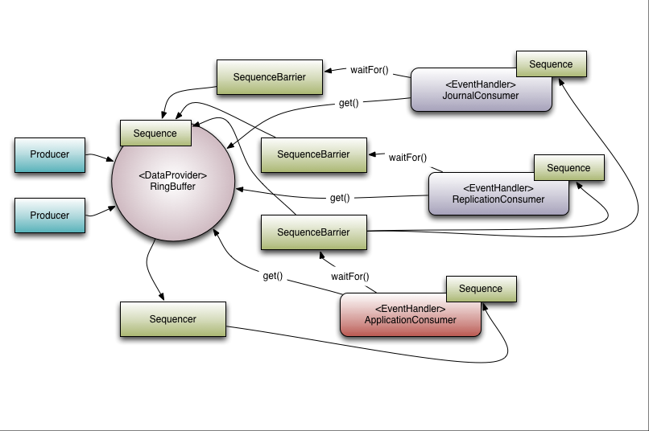

# Disruptor (base: 4.0.0.RC1)

## Disruptor 提供的关键功能：

* Disruptor 中的同一个消息会向所有消费者发送，即**多播能力(Multicast Event)**。

  与队列的最大行为差异，队列只能单个使用者发送单个事件。

* 为**事件预分配内存(Event Preallocation)**，避免运行时因频繁**回收垃圾**与**内存分配**增加开销。

* **可选择无锁(Optionally)**，使用两阶段协议，让多个线程可以同时修改不同元素。

* **缓存行填充，避免伪共享(prevent false sharing)**。

## Disruptor 中的 DDD(Domain-Driven Design) 域对象：

* `Ring Buffer` : 环形缓冲区（必须是2的幂次），通常被认为是 Disruptor 的核心，从 3.0 版本开始， `Ring Buffer` 负责存储和更新 Disruptor 中的数据（**事件**）。 

  对于某些高级用例，它甚至可以完全由用户替换

* `Sequence` : Disruptor 使用 `Sequence` 作为标识特定组件所在位置的方法。每个消费者(**`EventProcessor`**)都像 Disruptor 本身一样维护一个  `Sequence` 。

  大多数并发代码依赖于 `Sequence` 值的移动，因此 `Sequence` 支持 `AtomicLong` 的许多当前功能。

  > 3.0 版本与 2.0 版本之间唯一的真正区别是防止 `Sequence` 和其他变量之间出现伪共享。

* `Sequencer` : `Sequencer` 是 Disruptor 的真正**核心**。

  该接口的两个实现（**单生产者**和**多生产者**）实现了所有并发算法，用于在生产者和消费者之间快速、正确地传递数据。

* `Sequence Barrier` : 序列屏障，由 `Sequencer` 产生，包含对 `Sequencer` 中主要发布者的序列 `Sequence` 和任何依赖的消费者的序列 `Sequence` 的引用。它包含了确定是否有可供消费者处理的事件的逻辑。

* `Wait Strategy` : 等待策略，确定消费者如何等待生产者将事件放入 Disruptor 。

* `Event` : 从生产者传递给消费者的数据单位。事件没有特定的代码表示，因为它完全由用户定义。

* `EventProcessor` : 用于处理来自 Disruptor 的事件的主事件循环，并拥有消费者序列的所有权。

  其有一个名为 `BatchEventProcessor` 的实现，它包含事件循环的有效实现，并将回调使用者提供的 `EventHandler` 接口实现（在线程池内运行 `BatchEventProcessor` 的 `run` 方法）。

* `EventHandler` : 由用户实现并代表 Disruptor 的消费者的接口。

* `Producer` : 调用 Disruptor 以将**事件**放入队列的用户代码。这个概念在代码中也没有具体表示。




> 示例： 图中有3个消费者，即日志记录 `JournalConsumer` （将输入数据写入持久性日志文件）、复制 `ReplicationConsumer` （将输入数据发送到另一台机器以确保存在数据的远程副本）和业务逻辑 `ApplicationConsumer` （真正的处理处理工作）。
> 其中 `JournalConsumer` 和 `ReplicationConsumer` 是可以并行执行。
> 
> * `Producer` 向 Disruptor 的 `Ring Buffer` 中写入事件；
> * 消费者 `JournalConsumer` 和 `ReplicationConsumer` 使用多播方式同时消费 `Ring Buffer` 中的每一个元素，两者都有各自的 `SequenceBarrier` 用来控制当前 `Ring Buffer` 消费进度，并且当不存在可消费事件时如何处理(`Wait Strategy` 等待策略)；
> * 消费者 `ApplicationConsumer` 则是等 `JournalComsumer` 和 `ReplicationConsumer` 对用一个元素消费后，在处理该元素。

## Consumer Dependency Graph 消费者依赖图

为了支持并行处理任务行为在现实世界中的应用，有必要支持消费者之间的协调，通过 `Gating`(闸) 实现。


`Gating` 发生的两个地方：

1. 确保生产者 `Producer` 不会超过消费者 `Consumer` ：
  通过调用 `RingBuffer.addGatingConsumer()` 将相关消费者 `Consumer` 添加到 Disruptor 来处理。

2. 消费者 `Consumer` 之间的协调：
  通过构造一个 `SequenceBarrier` 来实现，它包含来自必须首先完成其处理的组件的序列。


注意： `Sequencer` 与下游消费者的关系。

在消费者之间存在协调是， `Sequencer` 只需要知道作为依赖树(`SequenceBarrier`)的叶节点的使用者的序列。

## Event Pre-allocation 事件预分配

在基于 Java 的系统中，目的是减少由于垃圾回收导致的停顿，为了支持这一点，预先分配 Disruptor 中事件所需的存储空间。
在构建时， `EventFactory` 提供事件对象被 Disruptor 中 `Ring Buffer` 的每个条目调用，提前填充。
在向 Disruptor 发布数据时，API 允许用户获取构造的对象，调用该存储对象上的方法或更新字段。
Disruptor 保证，只要正确实现这些操作，它们就是并发安全的。

## Optionally Lock-free 可选择不加锁

另一个低延迟需求推动的关键实现细节： 使用无锁算法来实现 Disruptor 。

> 所有内存可见性和正确性保证：通过**内存屏障**和**比较交换操作**来实现。

> 在 `BlockingWaitStrategy` 中，只有一个用例需要一个实际的锁。
> 
> 为了以便使用线程可以在等待新事件到达时暂停（许多低延迟系统会使用忙等待来避免因使用锁而引起的抖动，在 CPU 资源受限的情况下忙等待会导致系统性能显著下降）。

## 使用 Disruptor

### 1. 依赖

```xml
<dependency>
  <groupId>com.lmax</groupId>
  <artifactId>disruptor</artifactId>
  <version>4.0.0.RC1</version>
</dependency>
```

### 2. Event Object

事件对象没有具体的约束，满足业务逻辑场景即可。

### 3. Event Factory

用于 Disruptor 预先分配事件对象，事件工厂需要实现 `EventFactory<T>` 接口，重写 `T newInstance()` 方法：

* 使用方法引用： `EventObject::new` ；
* `EventFactory<T>` 接口的显示实现类；

### 4. Consumer

消费者消费事件，需要实现 `EventHandler<T>` 接口，重写 `void onEvent(T event, long sequence, boolean endOfBatch) throws Exception`。

* 使用 lambda 表达式；
* `EventHandler<T>` 接口的显示实现类；

多个消费者之间可以协调配合构成消费链，`Disruptor.handleEventsWith(final EventHandler<? super T>... handlers)` 注册一级消费者，返回 `EventHandlerGroup<T>` 对象，可以继续调用 `EventHandlerGroup` 的 `then(final EventHandler<? super T>... handlers)` 继续注册依赖的消费者。

### 5. Producer

`final class RingBuffer<E> extends RingBufferFields<E> implements Cursored, EventSequencer<E>, EventSink<E>` 发布事件：

* (**不推荐**)`Sequenced` 接口的 `void publish(long sequence)` / `void publish(long lo, long hi)` 发布事件；

  1. 首先通过 `Sequenced` 接口的 `long next()` 获取下一个可以发布的槽位；
  2. 通过 `DataProvider<T>` 接口的 `T get(long sequence)` 获取当前槽位已分配的事件对象；
  3. 设置事件对象属性；
  4. 调用 `Sequenced` 接口的 `void publish(long sequence)` 发布事件；

  > 事件发布比使用简单队列更加复杂。
  > 由于需要事件预分配，需要一个两阶段消息发布方法：在环形缓冲区中声明槽位，然后发布可用数据。
  > * 需要将发布动作包装在 `try`/`finally` 块中；
  > * 如果声明了一个槽(调用 `RingBuffer#next()`)，那么必须发布这个序列；否则会导致 Disruptor 状态损坏；在多生产者环境将导致消费者停止，建议使用 Lambda 表达式或 转换器方式；

* (**推荐的方式**)通过 `RingBuffer` 的写接口 `EventSink<E>` 的 `publishEvent()` `publishEvents()` `tryPublishEvent()` `tryPublishEvents()` 方法使用转换器**EventTranslator**发布事件，支持 Lambda 表达式形式；

  EventTranslator : `EventTranslator<T>` `EventTranslatorOneArg<T, A>` `EventTranslatorTwoArg<T, A, B>` `EventTranslatorThreeArg<E, A, B, C>` `EventTranslatorVararg<E>`

### 6. Clearing Objects From the Ring Buffer 环形缓冲区中对象的清理

当通过 Disruptor 传递数据时，对象的存活事件可能超过预期。
为了避免这种情况的发生，可能有必要在处理事情之后清除它。

实现一个清理程序(`EventHandler`)放置在消费者消费链路的末端清理环形缓冲区内预分配数据的值。

## Dealing With Large Batches 处理大批量

## Batch Rewind

### The Feature

当使用 `BatchEventProcessor` 句柄将事件作为批次处理时，有一个特性可用于从名为 **Batch Rewind** 的异常中恢复。

如果处理可恢复的事件时出现错误，用户可以抛出 `RewindableException` 。
将调用 `BatchRewindStrategy` (而不是通常的 `ExceptionHandler` )来决定序列号是应该回退到重新尝试的批处理的开头，还是重新抛出并委托给 `ExceptionHandler` 。

`BatchRewindStrategy` 默认是 `SimpleBatchRewindStrategy` ，可以通过向 `BatchEventProcessor` 提供不同的策略： `batchEventProcessor.setRewindStrategy(batchRewindStrategy);`

* `BatchRewindStrategy`
  * `NanosecondPauseBatchRewindStrategy` : 该异常将暂停指定数量的 nanos
  * `SimpleBatchRewindStrategy` : 总是倒带的批量倒带策略
  * `EventuallyGiveUpBatchRewindStrategy` : 处理 `rewindableException` 的策略，在进行了指定次数的尝试后，最终将异常委托给 `ExceptionHandler` 

## Tuning Options 调优选项

优化选项主要从：**生产者类型**（单个生产者/多个生产者）与**等待策略**两方面；这两个选项都是在**构建** Disruptor 时设置。

### 生产者类型 `ProducerType`

> Disruptor 提高并发系统性能的最佳方法：**坚持单一写入原则**

`ProducerType.SINGLE`: 为 Disruptor 创建单一事件生产者的 `RingBuffer`
`ProducerType.MULTI`: (默认值) 为 Disruptor 创建支持多个事件生产者的 `RingBuffer`

### 等待策略 `WaitStrategy`

* `WaitStrategy`:
  * `BlockingWaitStrategy` : (默认) 阻塞等待
    
    是可用的等待策略中最慢的，在 CPU 使用方面最保守的
  
  * `SleepingWaitStrategy` : 睡眠等待策略  常用于异步日志记录
  * `YieldingWaitStrategy` : (适用于低延迟系统)谦让等待策略 需要高性能时推荐的等待策略（`EventHandler`(Consumer) 数量低于逻辑处理器总数，例如启用了超线程）
  * `BusySpinWaitStrategy` : (适用于低延迟系统)忙自旋等待策略  延迟表现最好的策略，对部署环境约束最大；

    只有当 `EventHandler` 线程数量低于物理核心数量时，才应该使用这种等待策略（禁用超线程）；
  
  * `PhasedBackoffWaitStrategy` : 
  * `LiteBlockingWaitStrategy` : 
  * `LiteTimeoutBlockingWaitStrategy` : 
  * `TimeoutBlockingWaitStrategy` : 

> 超线程技术： 每个核心分配两套寄存器；
> 
> 如果需要运行两个处理器持续关注的程序，超线程技术开启时，其中一个或两个程序实际看起来会稍微满意一些；

## 参考资料

* [User Guide](https://lmax-exchange.github.io/disruptor/user-guide/index.html)
* [API documentation](https://lmax-exchange.github.io/disruptor/javadoc/index.html)
* [Frequently Asked Questions](https://github.com/LMAX-Exchange/disruptor/wiki/Frequently-Asked-Questions)
* [Developer Guide](https://lmax-exchange.github.io/disruptor/developer-guide/index.html)


* [Disruptor Google Group](https://groups.google.com/g/lmax-disruptor)
* [Disruptor Paper](https://lmax-exchange.github.io/disruptor/disruptor.html) [Disruptor 论文](./disruptor.md)
* [Martin Fowler's Technical Review](https://martinfowler.com/articles/lmax.html)
* [Mechanical Sympathy(Martin Thompson)](https://mechanical-sympathy.blogspot.com/)
* [Bad Concurrency(Michael Barker)](https://bad-concurrency.blogspot.com/)
* [LMAX Staff Blogs](https://www.lmax.com/blog/staff-blogs/)
* [.NET Disruptor Port](https://github.com/disruptor-net/Disruptor-net)
* [LMAX Exchange](https://www.lmax.com/)


* [Disruptor presentation @ QCon SF](https://www.infoq.com/presentations/LMAX/)
* [Introduction to the Disruptor](https://www.slideshare.net/trishagee/introduction-to-the-disruptor)
