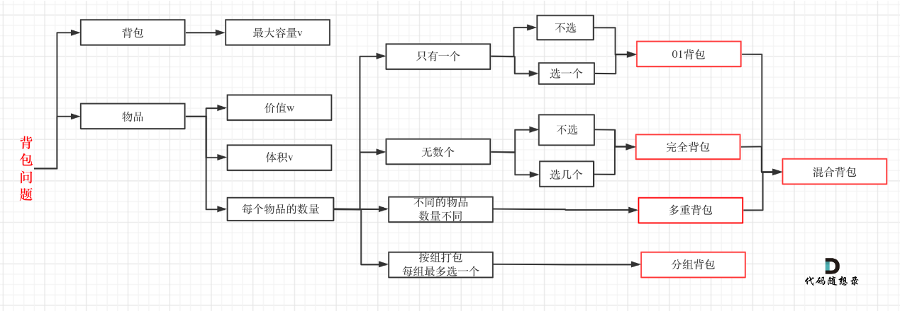

# 背包问题





对于面试，掌握**01背包**和**完全背包**就够用了，最多再来一个多重背包。


**完全背包**是**01背包**变化而来，即：**完全背包的物品数量是无限的。**


## 01 背包问题


> 有 `N` 件物品和一个最多能被重量为 `W` 的背包。
> 
> 第 `i` 件物品的重量是 `weight[i]` ，得到的价值是 `value[i]` 。
> **每个物品只能用一次，**求解将那些物品装入背包里物品价值总和最大。


从底层向上去思考，每一件物品其实只有两个状态，取或者不取，所以可以使用回溯法搜索出所有的情况，时间复杂度是 `O(2^n` ， `n` 表示物品数量。
**暴力的解法是指数级别的时间复杂度。进而才需要动态规划的解法来进行优化！**


**举例：**


背包最大重量为 `4` 。


物品为：


|     | 重量  | 价值  |
|-----|-----|-----|
| 物品0 | 1   | 15  |
| 物品1 | 3   | 20  |
| 物品2 | 4   | 30  |


背包能包的物品最大价值是多少？


### 二维 `dp` 数组 01背包


1. 确定 `dp` 数组以及下标的含义；

  使用二位数组，即**`dp[i][j]` 表示从下标 `[0~i]` 的物品里任意取，放进容量为 `j` 的背包，价值和最大是多少**。

  > `dp[i][j]` : 当下标为 `i` 的物品，重量为 `j` 时的最大价值；

2. 确定递推公式；

  回顾 `dp[i][j]` 含义： 从下标 `[0 ~ i]` 的物品里任意取，放进容量为 `j` 的背包，价值总和最大时多少；

  可以有两个方向推导 `dp[i][j]` ：

  * 由 `dp[i - 1][j]` 推出，即背包容量为 `j` ，里面不放物品 `i` 的最大价值，此时 `dp[i][j]` 就是 `dp[i - 1][j]` ；
  * 由 `dp[i - 1][j - weight[i]]` 推出， `dp[i - 1][j - weight[i]]` 为背包容量为 `j - weight[i]` 的时候不妨物品 `i` 的最大价值， 那么 `dp[i - 1][j - weight[i]] + value[i]` (`valuw[i]` 物品 `i` 的价值)，就是背包放物品 `i` 的最大价值；

  所以递推公式： `dp[i][j] = maxn(dp[i - 1][j], dp[i - 1][j - weight[i]] + value[i]);`

3. `dp` 数组如何初始化；

  递推公式初始化，一定要和 `dp` 数组的定义吻合，否则到递推公式的时候会越来越乱；

  首先从 `dp[i][j]` 的定义出发，如果背包容量 `j` 为 `0` 的话，即 `dp[i][0]` ，无论是选取哪些物品，背包价值总和一定为 `0` 。

  在其他情况时：根据递推公式： `dp[i][j] = max(dp[i - 1][j], dp[i - 1][j - weight[i]] + value[i]);` 可以看出 `i` 是由 `i - 1` 推导出来，那么 `i` 为 `0` 的时候就一定要初始化。

  `dp[0][j]` 即： `i` 为 `0` ，存放编号 `0` 的物品的时候，各个容量的背包能存放的最大价值；

  * 当 `j < weight[0]` 时， `dp[0][j]` 应该是 `0` ，因为背包容量比编号 `0` 的物品重量还小；

  * 当 `j >= weight[o]` 时， `dp[o][j]` 应该是 `value[0]` ，因为背包容量足够放编号 `0` 物品；

  其他下标根据递推公式： `dp[i][j] = max(dp[i - i][j], dp[i-1][j - weight[i]] + value[i]);` 可以看出 `dp[i][j]` 其他下标都会被覆盖；

4. 确定遍历顺序；

  根据递推公式坐标**依赖关系**可以看出：**先遍历物品还是先遍历背包都可以；**

5. 举例推导 `dp` 数组；


### 01背包 理论基础（滚动数组）


**举例：**

背包最大重量为： `4`

物品为： 

|     | 重量  | 价值  |
|-----|-----|-----|
| 物品0 | 1   | 15  |
| 物品1 | 3   | 20  |
| 物品2 | 4   | 30  |

问背包能背的物品最大价值是多少？


#### 一维 `dp` 数组（滚动数组）


在使用二维数组的时候，递推公式： `dp[i][j] = max(dp[i - 1][j], dp[i - 1][j - weight[i]] + value[i]`


可以发现如果把 `dp[i - 1]` 层拷贝到 `dp[i]` 上，表达式完全可以是： `dp[i][j] = max(dp[i][j], dp[i][j - weight[i]] + value[i]);`

更进一步，去掉拷贝过程，使用一个一维数组 `dp[j]` （可以理解是一个滚动数组）；


**动规 5 部曲**

1. 确定 `dp` 数组的定义；

  在一维 `dp` 数组中， `dp[i]` 表示：容量为 `j` 的背包，所背的物品价值可以最大为 `dp[j]` 。

2. 一维 `dp` 数组的递推公式；

  `dp[j]` 为容量为 `j` 的背包所背的最大机制。

  `dp[j]` 可以通过 `dp[j - weight[i]` 推导出来， `dp[j - weight[i]` 表示容量为 `j - weight[i]` 的背包所背的最大价值；

  `dp[j - weight[i]] + value[i]` 表示容量为 `j - 物品 i 重量` 的背包 加上 物品 `i` 的价值；

  此时 `dp[j]` 有两个选择：
  * 取自己 `dp[j]`
  * 取 `dp[j - weight[i]] + value[i]` 

  取两者中的最大者；

  所以递推公式： `dp[j] = max(dp[j], dp[j - weight[i]] + value[i];`

3. 一维 `dp` 数组如何初始化；

  关于初始化，**一定要和 `dp` 数组的定义吻合，否则到递推公示的时候就会越来越乱**。

  `dp[j]` 表示：容量为 `j` 的背包，所背的物品价值可以最大为 `dp[j]` ，那么 `dp[0]` 就应该是 `0` （背包容量为 `0` ，背的物品的价值就是 `0` ）。

  根据递推公式： `dp[j] = max(dp[j], dp[j - weight[i]] + vlaue[i];` `dp` 数组在推导的时候一定是取值最大的数；
  如果题目中的价值都是正整数那么非 `0` 下标初始化为 `0` 就可以，如果题目给的价值有**负数**，那么非 `0` 下标要初始化为负无穷。
  **这样才能让 `dp` 数组在递归公式的过程中取的最大的价值，而不是被初始值覆盖。**

4. 一维 `dp` 数组遍历顺序；

```text
for (int i = 0; i < weight.length(); i++) {
    for (int j = bagWeight; j >= weight[i]; j--) {
        dp[j] = max(dp[j], dp[j - weight[i]] + value[i];
    }
}
```

5. 举例推导 `dp` 数组；

  `0, 15, 15, 20, 35`
