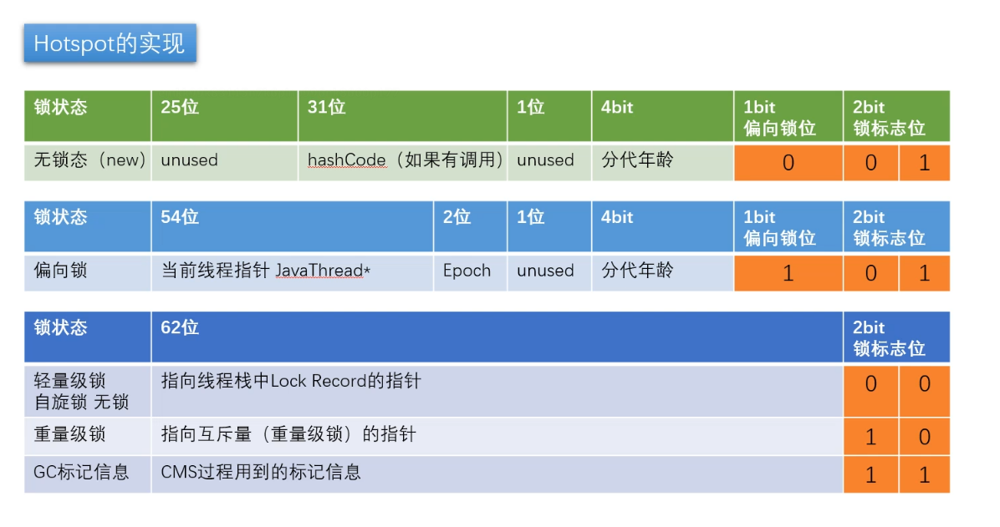
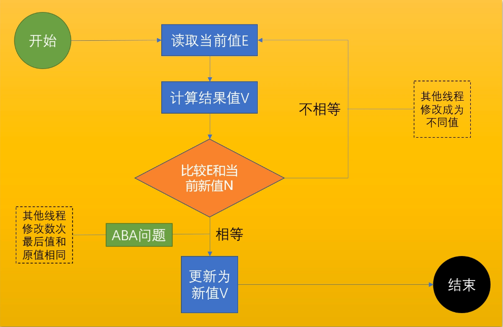
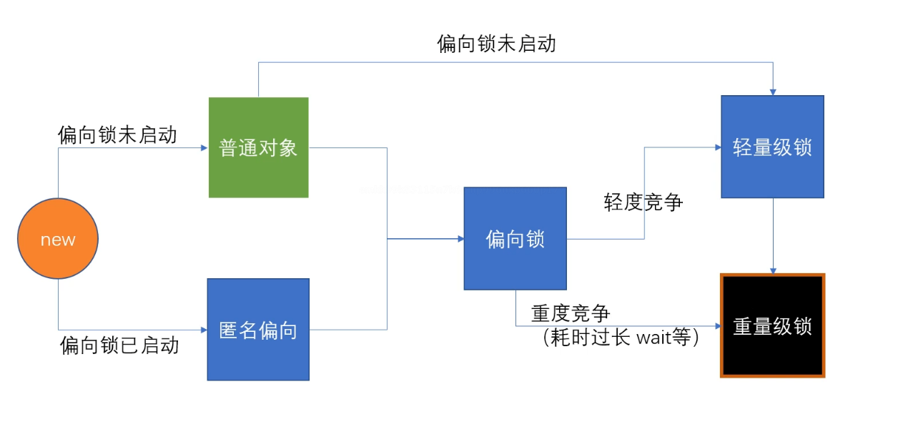

# 并发编程三大特性

## 可见性(`visibility`)

默认情况下一个线程改变一个变量值，另一个线程看不到最新的值；
可见性是线程之间的缓存（不是 Thread Local ）互相之间保持数据一致性（线程缓存与内存中数据保持同步）的一种机制；

* 通过关键字 `volatile` 关键字修饰变量可以使的变量线程间可见；

    `volatile` 修饰引用类型（包括数组）只能保证引用本身的可见性，不能保证内部字段的可见性；
    `volatile` 还可以禁止指令重排序；

* 线程之间一些**语句**会触发内存缓存同步刷新（存在同步 `synchronized` 等关键字）；


> 每个线程运行时，会把变量拷贝一份放在线程自己的缓存；每次读取数据读取的时线程的缓存，不会在重新读；


| CPU 计算单元 ALU 访问： | 速度       |
|------------------|----------|
| Registers        | `1< ns`  |
| L1 cache         | 约 `1ns`  |
| L2 cache         | 约 `3ns`  |
| L3 cache         | 约 `15ns` |
| main memory      | 约 `80ns` |


> **缓存行（Cache Line(64 Byte)）**
> 
> 为了缓存效率更高，根据程序的局部性原理（空间局部性），缓存是按照相邻区域的内存进行缓存（缓存行）；
> 
> 时间局部性原理是指令的缓存，空间局部性原理是数据的缓存；
> 
> 缓存行越大，局部性空间效率越高，读取时间慢；
> 缓存行越小，局部性空间效率越低，读取时间快；
> 通过普遍的工业实践，目前缓存行大小为 `64 Byte` ；

> **缓存一致性**
> 
> MESI Cache 一致性协议是缓存一致性协议的一种（MOSI等）；
> MESI 将缓存行 (Cache Line) 标记为四种状态： `Modified` `Exclusive` `Shared` `Invalid` ；主动进行数据更新；
> 
> `volatile` 低层与 `MESI` 无关；
> 
> 如果变量位于同一行，需要缓存一致性协议保持行内数据的一致，导致效率下降；
> 
> `@Contended` : 保证数据与其他数据不会唯一同一缓存行（仅在 1.8 版本 JDK 可用）； 
> 注解生效需要修改 JVM 运行参数： `-XX:-RestrictContended` 注解才可以生效；

## 有序性(`ordering`)

计算机内存在指令重排序，以提高效率；

乱序执行的**原则**：

* as - if - serial **不影响单线程的最终一致性**

    看上去是序列化执行的，实际上**不影响线程最终一致性**，并不一定顺序执行；

> `this` 对象逸出，所以不要在构造方法中启动线程。


> 美团面试：关于 `Object o = new Object();`
> 
> 1. 请解释以下对象的创建过程？（半初始化）
> 
>     ```text
>     0 new #2 <java/lang/Object>
>     3 dup
>     4 invokespecial #1 <java/lang/Object.<init> : ()V>
>     7 astore_1
>     8 return
>     ```
>     
>     核心代码： `0` `4` `7`
>     
>     `0` 执行后对象处于半初始化状态，属性为默认值；执行完 `4` 对象完成初始化； `7` 将对象与 `this` 建立关联；
> 
>     对象的**引用**存在于**运行的线程栈栈帧**中；
> 
> 2. 加问 `DCL` 与 `volatile` 问题？（指令重排）
> 
>     > `DCL` Double Checked Locking 双重检查锁；（单例模式）
>     
>     `volatile` : 线程可见、禁止指令重排；
> 
>     必须要加 `volatile` 修饰单例对象的引用；
>     因为存在半初始化和指令重排，并发情况下获得锁的线程如果发生了指令重排序，首先建立关联 `7` 在对象初始化 `4` 之前，此时对象引用存在，不再为 `null` 此时其他线程获取到的单例对象不为空但是是半初始化状态的对象；
> 
> 3. 对象在内存中的布局问题？（对象与数组的存储不用）
> 
>     hotspot 中使用（C++实现） `oopDesc` 数据结构代表一个 Java 对象；
> 
>     * **普通对象**由四部分构成： `markword` 标记字、 `klass pointer` 类型指针（指向 `*.class` ，对象在内存中的类型Class对象地址）、 `instance data` 实例数据、 `padding` 对齐
>     * **数组对象**由五部分构成： `markword` 标记字、 `klass pointer` 类型指针（指向 `*.class` ，数组类型在内存中类型Class对象地址）、 `length`(4Byte) 数组 长度、 `instance data` 实例数据、 `padding` 对齐
> 
> 4. 对象头具体包括什么（ `markword` `klasspointer` `synchronized` 锁信息）
> 
>     对象头包括两部分： `markword` `class pointer`
> 
>     ```text
>     java.lang.Object object internals:
>      OFFSET  SIZE   TYPE DESCRIPTION                               VALUE
>           0     4        (object header)                           01 00 00 00 (00000001 00000000 00000000 00000000) (1)
>           4     4        (object header)                           00 00 00 00 (00000000 00000000 00000000 00000000) (0)
>           8     4        (object header)                           e5 01 00 f8 (11100101 00000001 00000000 11111000) (-134217243)
>          12     4        (loss due to the next object alignment)
>     Instance size: 16 bytes
>     Space losses: 0 bytes internal + 4 bytes external = 4 bytes total
>     ```
> 
>     * `markword`: `[0, 8)Byte`
>         
>         
>         * 锁信息
>         * `hashCode` ： Identity Hashcode(是独一无二的 hashCode)
>         * gc 信息
>     * `klass pointer` `[8, 12)Byte`
> 
> 5. 对象怎么定位（直接  间接）
> 
>     * 直接指针 （hotspot 实现方式；优点：直接访问；缺点：GC需要移动对象的时候麻烦；）
>    
>         引用直接**指向实例化对象（堆）**，实例化对象包含**类型指针（方法区）**；
>     * 句柄方式 （优点：对象体积小，垃圾回收时不用频繁改动引用本身；缺点：两次访问；）
>         
>         引用指向一个包含实例数据指针（指向堆空间实际对象）和类型指针（指向方法区）的结构体（堆）
> 
> 6. 对象怎么分配？（栈上-线程本地-Edon-Old）
> 
>     > 多个线程相同一块内存空间分配对象需要经历**同步sync**的过程；
>     > TLAB： 线程启动时在线程Edon中分配一块线程独占区域（空间比较小）；
> 
>     * 首先尝试在**栈**上分配（栈帧弹出自动清理对象，不需要垃圾回收机制，效率极高）；
>         * 对象需要符合：逃逸分析
>         * 对象需要符合：标量替换
>     * 如果体积够大，分配在 Old 老年代（通过 `FGC` 实现对象回收）；
>     * 否则在 TLAB(Thread Local Allocation Buffer, 线程本地分配缓冲区) 中分配；
>     * 如果 TLAB 分配不下分配在 Edon 区（经过GC清理，如果回收释放内存，没有回收放入 S1 ，之后再经过GC清理年龄够了进入 Old 老年代，不够进入 S2，S2再经过GC清理）；
> 
>     > 每次回收一次，年龄增加一次；
> 
> 7. Object o = new Object() 在内存中占用多少字节？
> 
>     （20Byte） 看内存压缩是否开启，内存是否超过32GB；
> 
> 8. 为什么 hotspot 不使用 C++ 对象来代表 Java 对象？
> 
>     C++ 中存在 Virtual Table Pointer 如果每个 Java 对象都有浪费空间；
> 
>     Java 中使用 oop-klass 二元机制；
> 
>     > `new T();` 时首先生成一个 `T.class` C++ 对象(`instanceklass`)（如果已经存在，不会再次生成）；加上 oop 数据结构构成 oop-klass 二元机制；
> 
> 9. Class 对象是在堆还是在方法区？
> 
>     方法区；
> 
>     栈(stack) 存储对象引用；对象本身在（heap）；对象上的 klass （instanceClassOop）（C++对象）在方法区；`instanceClassOop` 中的存在一个指针，指向（heap）中的类对象(`*.class`)（用于反射）；


### happens-before 原则（JVM规定重排序必须遵守的规则）


* 程序次序规则：同一线程内，按照代码出现的顺序，前面的代码先行于后面的代码，准确的说是控制流顺序，因为要考虑到分支和循环结构；
* 管理锁定规则：一个 `unlock` 操作先行发生于后面（时间上）对同一个锁的 `lock` 操作；
* `volatile` 变量规则：对一个 `volatile` 变量的写操作先行发生于后面（时间上）对这个变量的读操作；
* 线程启动规则：`Thread` 的 `start()` 方法先行发生于这个线程的每一个操作；
* 线程终止规则：线程的所有操作都先行与此线程的终止检测；可以通过 `Thread.join()` 方法结束、 `Thread.isAlive()` 的返回值等手段检测线程是否终止；
* 线程中断规则：对线程 `interrupt()` 方法的调用先行发生于被中断线程的代码检测到中断事件的发生，可以通过 `Thread.interrupt()` 方法检车线程是否中断；
* 对象终结规则：一个对象的初始化完成先行于发生它的 `finalize()` 方法的开始；
* 传递性：如果操作A先行与操作B，操作B先行于操作C，那么操作A先行于操作C；

### 阻止乱序执行

#### 使用内存屏障

内存屏障时特殊指令：指令前面必须执行完，后面才可以执行；

intel: `lfence`(load 读) `sfence`(save 写) `mfence`(读写) (CPU 指令)

**JVM 实现并没有使用底层CPU提供的支持**；

#### 使用 JVM 中的内存屏障

JVM 内存屏障：

* `LoadLoad` 屏障：

    对于语句： `Load1; LoadLoad; Load2;`

    在 `Load2`及后续读操作要读取的数据被访问前，保证 `Load1` 要读取的数据被读取完毕；

* `StoreStore` 屏障：

    对于语句： `Store1; StoreStore; Store2;`

    在 `Store2` 及后续写入操作执行前，保证 `Store1` 的写入操作对其他处理器可见；

* `LoadStore` 屏障：

    对于语句： `Load1; LoadStore; Store2;`

    在 `Store2` 及后续写入操作被刷出前，保证 `Load1` 要读取的数据被读取完毕；

* `StoreLoad` 屏障：

    对于语句： `Store1; StoreLoad; Load2;`

    在 `Load2` 及后续读取操作之前，保证 `Store1` 的写入对所有处理器可见；

#### 使用 `volatile` 关键字

`volatile` 禁止指令重排序的 JVM 实现原理：

* `volatile` 修饰变量**写**

    ```text
    StoreStoreBarrier;
    volatile reference write;
    StoreLoadBarrier;
    ```

* `volatile` 修饰变量**读**

    ```text
    volatile reference read;
    LoadLoadBarrier;
    LoadStoreBarrier;
    ```

`volatile` hotspot 实现：

* `bytecodeInterpreter.cpp` : `OrderAccess::fence()` 

    ```text
    inline void OrderAccess::fence() {
       // always use locked addl since mfence is sometimes expensive
    #ifdef AMD64
      __asm__ volatile ("lock; addl $0,0(%%rsp)" : : : "cc", "memory");
    #else
      __asm__ volatile ("lock; addl $0,0(%%esp)" : : : "cc", "memory");
    #endif
      compiler_barrier();
    }
    ```
  
    `lock` 用于多处理器中执行指令时对共享内存的独占使用；
    能够将当前处理器对应缓存的内容刷新到内存，并使其它处理器对应缓存失效；同时提供了**有序的指令无法越过这个内存屏障的作用**；

## 原子性(`atomicity`)

* 多线程访问共享数据的时候产生竞争(**race condition**, **竞争条件**)；
* 并发访问之下产生不期望的结果(**unconsistency**, **数据的不一致**)；

通过**线程同步**（即线程执行的顺序安排好）保障数据一致；
具体来讲需要保证操作**原子性(Atomicity)**；

> `monitor`(**管程**)，可以理解为锁；
> 
> `critical section` (**临界区**)锁的区域；
> 
> 临界区执行时间长或者语句多叫做**锁粒度粗**；反之**锁粒度细**；

通过**锁机制**保证操作的原子性（两种方式）；

> **上锁的本质就是把并发编程序列化**；

1. 悲观锁：悲观认为操作会被别的线程打断 (`synchronized`)

    `synchronized` 保证**原子性**的同时保证了**可见性**，会主动同步缓存（寄存器）数据到主内存，不可以保证有序性（同步块中不能保证有序性）；

    `synchronized` 的底层包含 `lock` 操作，会刷新缓存到内存中保证可见性；
   
3. 乐观锁（无锁，自旋锁）：乐观认为操作不会被别的线程打断(`CAS` Compare And Set/Swap/Exchange)

    `CAS` Compare And Set/Swap, Compare And Exchange , 基于 CAS 的实现： `AtomicInteger`

    

    > **ABA问题**
    > 
    > 如果 E 为引用，如果引用对象中的内容发生了改变；需要考虑ABA问题，需要加一个 `version` 版本信息；
    > 
    > 加版本有两种方式： **带时间戳或者带数字** 或者 **布尔类型**；

    > CAS 的 `swap/set` 或 `exchange` 操作包含比较和更新两个子步骤；在比较有写入更新中有可能被其他程序中断修改，出现数据不一致；
    > 
    > 要求必须要保证 CAS **操作本身必须是原子性**；
    > 
    > 在 hotspot 内部调用了汇编 `lock compxchgl` ；这条汇编指令并不是原子的，所以使用了锁 `lock` （可以是缓存锁或者总线锁）；
    > 
    > 在底层下仍旧是悲观锁；

> **悲观锁** vs **乐观锁** 效率
> 
> 适用不同场景：
> 临界区执行时间比较长，等待线程多适用于悲观锁（重量级，等待线程不消耗资源）；
> 时间短，等待线程少适用于乐观锁（轻量级，自旋锁，线程消耗资源）；
> 
> 推荐使用 `synchronized` 内部底层包含自选等操作和锁升级；

Java 虚拟机级别的原子操作指令（8大原子操作）：

1. `lock`
2. `unlock`
3. `read`
4. `load`
5. `use`
6. `assign`
7. `store`
8. `write`


### `synchronized` 锁

JDK 早期， `synchronized` 叫做**重量级锁**（申请锁资源必须通过 Kernel 的系统调用）；
`synchronized` 代码块对应字节码为 `monitorenter` 开始到第一个 `monitorexit` 结束， 如果产生异常，第二个 `monitorexit` 自动释放锁；

JOL(Java Object Layout, Hotspot 源码： `markOop.hpp`) 中的 `markword` 包含对象的锁（`synchronized`）信息；
`markword` 包括： 锁信息、GC信息、hashCode ；


* `synchronized(this)` 与 `synchronized` 对象方法，效果等值；
* `synchronized` 修饰 `static` 方法锁定的时方法所在类 `*.class` ；
* `synchronized` 使用时，不需要再对线程间共享变量使用 `volatile` 进行修饰； `synchronized` 既保证了原子性又保证了可见性；
* `synchronized` 必须支持可重入；
* `synchronized` 程序中出现异常，默认情况下**锁被释放**；
* `synchronized` 不能用**内建包装类**、 `String` （字符串常量）；

> **锁对象不应该发生改变 (`final` 修饰)** ；
> 
> 锁对象的属性发生改变不影响使用，引用不可以发生变化；否者并不能保证原子性；

#### `synchronized` 锁升级

`markword` 锁相关状态(最后两位为**锁标志位**)：
* `00` 轻量级锁
* `01` 要看倒数第三位：**偏向锁标志位**
    * `001` 无锁
    * `101` 偏向锁
* `10` 重量级锁
* `11` GC标记信息：正在被垃圾回收；



> **偏向锁**与**轻量级锁**使用**户空间**轻量级锁(hotspot 源码： `interpreterRuntime.cpp`)；
> 重量级锁为内核空间锁；
> 
> **偏向锁**是将线程id（当前线程指针）写入到 `mardword` 中，不涉及锁竞争；（基于大多数情况都是单一线程访问，仅作标记为当前线程使用，不涉及锁竞争机制）；
> 
> **一旦有竞争**，撤销偏向锁，通过 CAS 竞争锁，即自旋锁竞争；
> 
> **自旋锁竞争**
> 每个线程在自己的线程栈中生成一个 `LR(Lock Record, 锁记录)` ，通过自旋的方式 CAS 将自己的 `LR` 标记到 `markword` 中；
> 没有获得锁的线程通过 `CAS` 继续竞争；
> 
> 通过 `inflate` 锁膨胀升级为重量级锁；

1. 新创建的**普通对象**，如果一旦被 `synchronized` 使用，会首先将锁变成**偏向锁**；

   1. 如果锁被**出现竞争**变为**轻量级锁**（**自旋锁**）；
   
       条件：只要有线程开始争抢锁；
   
   2. 如果锁被**重度竞争**变为**重量级锁**（通过系统调用获得）；
   
       条件：
       * 竞争加剧，有线程超过 `10` 次自旋；
       * 自选线程数超过 CPU 核心数一半；
       > `1.6` 之前可以通过参数 `-XX:PreBlockSpin` 控制； `1.6` 之后 JVM 通过**自适应自旋** (`Adapative Self Spinning`) 控制；

> 为什么有自旋锁还需要重量级锁？
> 
> 与应用场景相关；
> 少量竞争锁处理时间比较短自旋锁带来的代价小（性能消耗）；
> 大量竞争处理时间长重量级锁可以将线程放入队列(`waitSet`)，降低性能损耗；

> 偏向锁是否一定比自旋锁效率高？
>
> 如果多数情况下只有单一线程执行时，效率高；
> 
> 如果明确多数情况下多个线程执行时，并不一定比自旋锁效率高；
> 偏向锁涉及到锁撤销，此时应该直接使用自旋锁 `CAS` ；
> 
> JVM 启动过程，会有很多线程竞争（对象内存竞争等情形），所以默认情况启动时不打开偏向锁，启动完成才打开偏向锁；
> 默认情况下偏向锁启动时延 `4s` ；
> `-XX:BiasedLockingStartupDelay=0`

> **偏向锁启动** **偏向锁未启动**
> 
> 偏向锁启动，创建的对象没有锁使用，此时为**匿名偏向**(`101`)；
> 偏向锁未启动，创建的对象没有锁，此时为**普通对象**(`001`)；

> **偏向锁** -> **重量级锁**
> 
> 线程调用了 `wait` 等方法，此时锁从偏向锁变更为重量级锁；

> **普通对象** -> **偏向锁**
> 
> `Epoch` 与 Class 比较；
> 涉及到批量**重偏向**和**批量锁撤销**针对 `class` 优化；

#### `synchronized` 锁重入

`synchronized` 是可**重入锁**；重入次数必须记录用于对应解锁过程；
产生重入时：**偏向锁**记录在线程栈中，再次生成一个 `LR` （此时的 `LR` 不再包含指向 `displaced markword` 的指针）；
解锁过程对应在线程栈中弹出对应的 `LR` ；
**轻量级锁**过程与偏向锁类似；
**重量级锁**记录在 `ObjectMonitor` 中一个字段内

> 新生成的对象，如果调用了 `hashcode` 此时 `hashcode` 值存储在 `markword` 中；
> 需要锁定对象时， `hashcode` 存放到线程栈 `LR` 中（`LR` 中有一个指针记录备份修改前 `markword` 内容，一般被称为 `displaced markword` ）；

