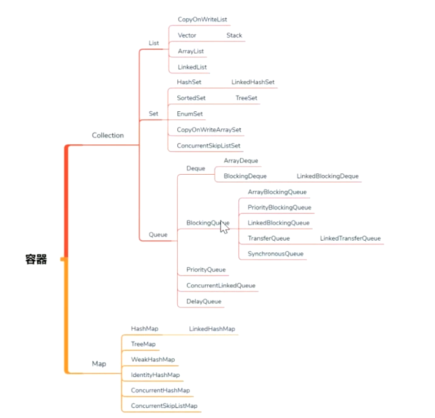

# 容器

> 为线程池做准备；

## `Collection` 容器

### `List`

#### `Vetor`

自带锁；

#### `CopyOnWriteList`

#### `ArrayList`

#### `LinkedList`

### `Set`

#### `HashSet`

#### `SortedSet`

#### `EnumSet`

#### `CopyOnWriteArrayList`

读不加锁，写的时候，拷贝原始内容并新增写入的内容；

#### `CopyOnWriteArraySet`

### `Queue` *用于高并发*

> `List` vs `Queue`
> 
> 提供了对线程友好的 API : `offer` `peek` `poll`
> BlockingQueue: 添加 `put` `take` 提供阻塞，支持生产者消费者模型；

* `offer()` : 类似于 `add` ；添加成功返回 `true` ，失败返回 `false` ；
* `peek()` : 获取元素不移除元素；
* `poll()` : 获取元素并且移除；
* `remove()` : 移除元素；

#### `Deque` 双端队列

#### `BlockingQueue`

阻塞队列；

* `put()` : 添加元素；如果集合满，阻塞；
* `take()` : 获取元素；如果集合空，阻塞；

##### `ArrayBlockingQueue`

有界阻塞队列

##### `LinkedBlockingQueue`

链表实现的无界阻塞队列；

* `put()` : 添加元素；如果集合满，阻塞；
* `take()` : 获取元素；如果集合空，阻塞；

> 通过使用 `ReentrantLock` 实现阻塞；

##### `DelayQueue`

实现在等待时间上的排序；时间短的优先得到执行；
一般用于按时间进行任务调度；本质上是一个 `PriorityQueue` ；

##### `SynchronousQueue`

线程间传递任务；容量为 `0` ；
用于线程池；

##### `TransferQueue`

支持线程之间传递； `SynchronousQueue` 增强版本，支持多个线程取；

* `transfer()` : 阻塞等待添加内容被取走；

#### `PriorityQueue`

内部是有序二叉树；

#### `ConcurrentLinkedQueue`

## `Map` 容器

##### `Hashtable`

自带锁；

##### `HashMap`

##### `TreeMap`

红黑树；

##### `WeakHashMap`

##### `IdentityHashMap`

##### `ConcurrentHashMap` 

线程安全；

> 读优势，插入效率低；

##### `ConcurrentSkipListMap` 

线程安全；通过跳表实现有序；

> 跳表
>
> 存储为链表，在链表中提供了区间索引；

## `Collections` 工具类

* `synchronized*` 将无锁容器转换为线程安全容器，锁的粒度相对小；

