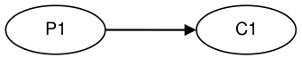
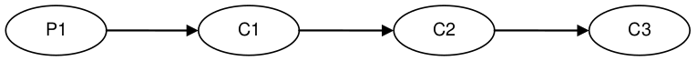
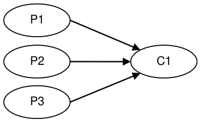
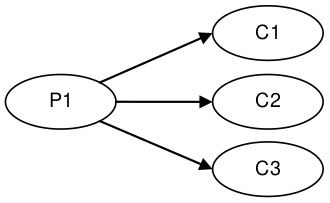
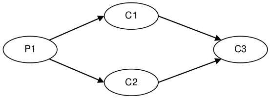

# [LMAX Disruptor: High performance alternative to bounded queues for exchanging data between concurrent threads 用于在并发线程之间交换数据的有界队列的高性能替代品](https://lmax-exchange.github.io/disruptor/disruptor.html)

>  **Martin Thompson** · **Dave Farley** · **Michael Barker** · **Patricia Gee** · **Andrew Stewart** - Version 4.0.0.RC2-SNAPSHOT, May 2011 

[https://github.com/LMAX-Exchange/disruptor](https://github.com/LMAX-Exchange/disruptor)

> **Abstract** **摘要**
> 
> 
> LMAX was established to create a very high performance financial exchange. 
> As part of our work to accomplish this goal we have evaluated several approaches to the design of such a system, but as we began to measure these we ran into some fundamental limits with conventional approaches.
> 
> LMAX 的成立是为了创建一个非常高性能的金融交易所。
> 作为我们实现这一目标的工作的一部分，我们评估了设计这种系统的几种方法，但是当我们开始测量这些方法时，我们遇到了传统方法的一些基本限制。
> 
> 
> Many applications depend on queues to exchange data between processing stages. 
> Our performance testing showed that the latency costs, when using queues in this way, were in the same order of magnitude as the cost of IO operations to disk (RAID or SSD based disk system) – dramatically slow. 
> If there are multiple queues in an end-to-end operation, this will add hundreds of microseconds to the overall latency. 
> There is clearly room for optimisation.
> 
> 许多应用程序依赖队列在处理阶段之间交换数据。
> 我们的性能测试表明，以这种方式使用队列时，延迟成本与磁盘（基于 RAID 或 SSD 的磁盘系统）的 IO 操作成本处于同一数量级 - 非常缓慢。
> 如果端到端操作中有多个队列，这将增加数百微秒的整体延迟。
> 显然存在优化的空间。
> 
> 
> Further investigation and a focus on the computer science made us realise that the conflation of concerns inherent in conventional approaches, (e.g. queues and processing nodes) leads to contention in multi-threaded implementations, suggesting that there may be a better approach.
> 
> 进一步的调查和对计算机科学的关注使我们意识到传统方法（例如队列和处理节点）中固有的关注点的混合导致了多线程实现中的争用，这表明可能有更好的方法。
> 
> 
> Thinking about how modern CPUs work, something we like to call “mechanical sympathy”, using good design practices with a strong focus on teasing apart the concerns, we came up with a data structure and a pattern of use that we have called the Disruptor.
> 
> 考虑到现代 CPU 的工作方式，我们喜欢称之为“**机械同情**”，使用良好的设计实践，强调分离关注点，我们提出了一个数据结构和使用模式，我们称之为 Disruptor。
> 
> 
> Testing has shown that the mean latency using the Disruptor for a three-stage pipeline is 3 orders of magnitude lower than an equivalent queue-based approach. 
> In addition, the Disruptor handles approximately 8 times more throughput for the same configuration.
> 
> 测试结果显示，使用 Disruptor 处理三级管道的平均延迟比等效的基于队列的方法低 3 数量级。
> 此外，Disruptor 处理相同配置的大约 8 倍以上的吞吐量。
> 
> 
> These performance improvements represent a step change in the thinking around concurrent programming. 
> This new pattern is an ideal foundation for any asynchronous event processing architecture where high-throughput and low-latency is required.
> 
> 这些性能改进代表了围绕并发编程的思想的一个进步。
> 这种新模式是任何需要高吞吐量和低延迟的异步事件处理架构的理想基础。
> 
> 
> At LMAX we have built an order matching engine, real-time risk management, and a highly available in-memory transaction processing system all on this pattern to great success. 
> Each of these systems has set new performance standards that, as far as we can tell, are unsurpassed.
> 
> 在 LMAX，我们基于这种模式构建了一个订单匹配引擎、实时风险管理和一个高可用的内存交易处理系统，并取得了巨大的成功。
> 这些系统中的每一个都设定了新的性能指标，据我们所知，是无与伦比的。
> 
> 
> However this is not a specialist solution that is only of relevance in the Finance industry. 
> The Disruptor is a general-purpose mechanism that solves a complex problem in concurrent programming in a way that maximizes performance, and that is simple to implement. 
> Although some of the concepts may seem unusual it has been our experience that systems built to this pattern are significantly simpler to implement than comparable mechanisms.
> 
> 然而，这并不是一个只与金融业相关的专业解决方案。
> Disruptor 是一种通用机制，它以最大化性能的方式解决并发编程中的一个复杂问题，并且易于实现。
> 虽然有些概念看起来不太寻常，但我们的经验是，根据这种模式构建的系统比可比机制实现起来要简单得多。
> 
> 
> The Disruptor has significantly less write contention, a lower concurrency overhead and is more cache friendly than comparable approaches, all of which results in greater throughput with less jitter at lower latency. 
> On processors at moderate clock rates we have seen over 25 million messages per second and latencies lower than 50 nanoseconds. 
> This performance is a significant improvement compared to any other implementation that we have seen. 
> This is very close to the theoretical limit of a modern processor to exchange data between cores.
> 
> Disruptor 具有明显较少的写争用，较低的并发开销，并且比同类方法更加友好的缓存，所有这些都导致更大的吞吐量和更低的延迟抖动。
> 在中等时钟频率的处理器上，我们已经看到每秒超过2500万条消息，延迟低于50纳秒。
> 与我们已经看到的任何其他实现相比，这个性能是一个显著的改进。
> 这非常接近现代处理器在内核之间交换数据的理论极限。


## 1. Overview 概述


The Disruptor is the result of our efforts to build the world’s highest performance financial exchange at LMAX. 
Early designs focused on architectures derived from SEDA [1] and Actors [2] using pipelines for throughput. 
After profiling various implementations it became evident that the queuing of events between stages in the pipeline was dominating the costs. 
We found that queues also introduced latency and high levels of jitter. 
We expended significant effort on developing new queue implementations with better performance. 
However it became evident that queues as a fundamental data structure are limited due to the conflation of design concerns for the producers, consumers, and their data storage. 
The Disruptor is the result of our work to build a concurrent structure that cleanly separates these concerns.

Disruptor 是我们努力在 LMAX 建立世界上性能最高的金融交易所的结果。
早期的设计侧重于源自 SEDA [1]和 Actors [2]的体系结构，使用管道来提高吞吐量。
在分析了各种实现之后，很明显，管道中各阶段之间的事件排队占据了成本的主导地位。
我们发现队列还引入了延迟和高水平的抖动。
我们在开发性能更好的新队列实现方面投入了大量精力。
然而，由于生产者、消费者及其数据存储的设计关注点混为一谈，显然队列作为基本数据结构是有限的。
Disruptor 是我们构建一个并发结构的结果，该结构可以清楚地分离这些关注点。


## 2. The Complexities of Concurrency 并发的复杂性


In the context of this document, and computer science in general, concurrency means not only that two or more tasks happen in parallel, but also that they contend on access to resources. 
The contended resource may be a database, file, socket or even a location in memory.

在本文以及一般的计算机科学的上下文中，并发不仅意味着两个或多个任务并行发生，而且还意味着它们争夺对资源的访问权。
争用的资源可能是数据库、文件、套接字，甚至是内存中的一个位置。


Concurrent execution of code is about two things, mutual exclusion and visibility of change. 
Mutual exclusion is about managing contended updates to some resource. 
Visibility of change is about controlling when such changes are made visible to other threads. 
It is possible to avoid the need for mutual exclusion if you can eliminate the need for contended updates. 
If your algorithm can guarantee that any given resource is modified by only one thread, then mutual exclusion is unnecessary. 
Read and write operations require that all changes are made visible to other threads. 
However only contended write operations require the mutual exclusion of the changes.

代码的并发执行包括两个方面，互斥锁和变更的可见性。
互斥锁是关于管理对某些资源的争用更新。
变更的可见性是关于控制何时使这些变更对其他线程可见。
如果你能消除争用更新的需要，就有可能避免使用互斥锁。
如果您的算法可以保证任何给定的资源只被一个线程修改，那么互斥锁就是不必要的。
读写操作要求所有更改都对其他线程可见。
然而，只有争用写操作才需要更改的互斥锁。


The most costly operation in any concurrent environment is a contended write access. 
To have multiple threads write to the same resource requires complex and expensive coordination. 
Typically this is achieved by employing a locking strategy of some kind.

在任何并发环境中，开销最大的操作是争用写访问。
让多个线程写入同一资源需要复杂而昂贵的协调。
这通常是通过使用某种锁策略来实现的。


### 2.1. The Cost of Locks 锁开销


Locks provide mutual exclusion and ensure that the visibility of change occurs in an ordered manner. 
Locks are incredibly expensive because they require arbitration when contended. 
This arbitration is achieved by a context switch to the operating system kernel which will suspend threads waiting on a lock until it is released. 
During such a context switch, as well as releasing control to the operating system which may decide to do other house-keeping tasks while it has control, execution context can lose previously cached data and instructions. 
This can have a serious performance impact on modern processors. 
Fast user mode locks can be employed but these are only of any real benefit when not contended.

锁提供了互斥锁，并确保变更的可见性以有序的方式发生。
锁是难以置信的昂贵，因为他们在竞争时需要仲裁。
这种仲裁是通过上下文切换到操作系统内核来实现的，操作系统内核将挂起等待锁的线程，直到锁被释放。
在这样的上下文切换过程中，以及将控制权释放给操作系统(操作系统可能决定在其拥有控制权的情况下执行其他内部管理任务)时，执行上下文可能会丢失以前缓存的数据和指令。
这会对现代处理器的性能产生严重影响。
可以使用快速用户模式锁，但这些锁只有在不争用时才有真正的好处。


We will illustrate the cost of locks with a simple demonstration. 
The focus of this experiment is to call a function which increments a 64-bit counter in a loop 500 million times. 
This can be executed by a single thread on a 2.4Ghz Intel Westmere EP in just 300ms if written in Java. 
The language is unimportant to this experiment and results will be similar across all languages with the same basic primitives.

我们将通过一个简单的演示来说明锁的成本。
这个实验的重点是调用一个函数，它在一个循环中将一个 64-bit 计数器递增 5 亿次。
如果使用 Java 编写，这可以在 2.4 Ghz Intel Westmere EP 上通过单个线程在 300 毫秒内执行。
语言对于这个实验来说并不重要，并且使用相同的基本原语的所有语言的结果都是相似的。


Once a lock is introduced to provide mutual exclusion, even when the lock is as yet un-contended, the cost goes up significantly. 
The cost increases again, by orders of magnitude, when two or more threads begin to contend. 
The results of this simple experiment are shown in the table below:

一旦引入一个锁来提供互斥，即使当锁还没有竞争时，成本也会显著上升。
当两个或更多线程开始竞争时，成本再次数量级增加。
这一简单实验的结果如下表所示:


_Table 1. Comparative costs of contention_ _竞争开销比较_

| Method                            | Time(ms) |
|-----------------------------------|----------|
| Single thread                     | 300      |
| Single thread with lock           | 10,000   |
| Two threads with lock             | 224.000  |
| Single thread with CAS            | 5,700    |
| Two threads with CAS              | 30,000   |
| Single thread with volatile write | 4,700    |


### 2.2. The Costs of "CAS" "CAS" 开销


A more efficient alternative to the use of locks can be employed for updating memory when the target of the update is a single word. 
These alternatives are based upon the atomic, or interlocked, instructions implemented in modern processors. 
These are commonly known as CAS (Compare And Swap) operations, e.g. “lock cmpxchg” on x86. 
A CAS operation is a special machine-code instruction that allows a word in memory to be conditionally set as an atomic operation. 
For the “increment a counter experiment” each thread can spin in a loop reading the counter then try to atomically set it to its new incremented value. 
The old and new values are provided as parameters to this instruction. 
If, when the operation is executed, the value of the counter matches the supplied expected value, the counter is updated with the new value. 
If, on the other hand, the value is not as expected, the CAS operation will fail. 
It is then up to the thread attempting to perform the change to retry, re-reading the counter incrementing from that value and so on until the change succeeds. 
This CAS approach is significantly more efficient than locks because it does not require a context switch to the kernel for arbitration. 
However CAS operations are not free of cost. 
The processor must lock its instruction pipeline to ensure atomicity and employ a memory barrier to make the changes visible to other threads. 
CAS operations are available in Java by using the `java.util.concurrent.Atomic*` classes.

当更新的目标是单个字时，可以使用更有效的锁替代方法来更新内存。
这些替代方案基于在现代处理器中实现的原子指令或互锁指令。
这些操作通常称为 CAS (Compare And Swap)操作，例如 x86 上的 "lock cmpxchg" 。
CAS 操作是一种特殊的机器码指令，它允许有条件地将内存中的字设置为原子操作。
对于“计数器递增实验”，每个线程都可以循环读取计数器，然后尝试以原子方式将其设置为新的递增值。
新旧值都作为此指令的参数提供。
如果在执行操作时，计数器的值与提供的预期值相匹配，则计数器将使用新值进行更新。
另一方面，如果该值与预期不符，则 CAS 操作将失败。
然后由尝试执行更改的线程重试，重新读取从该值递增的计数器，以此类推，直到更改成功。
这种 CAS 方法明显比锁更有效，因为它不需要上下文切换到内核进行仲裁。
然而，CAS 操作并不是免费的。
处理器必须锁定自己的指令流水线以确保原子性，并使用内存屏障使更改对其他线程可见。
CAS 操作在 Java 中可以通过使用 `java.util.concurrent.Atomic*` 类。


If the critical section of the program is more complex than a simple increment of a counter it may take a complex state machine using multiple CAS operations to orchestrate the contention. 
Developing concurrent programs using locks is difficult; developing lock-free algorithms using CAS operations and memory barriers is many times more complex and it is very difficult to prove that they are correct.

如果程序的关键部分比计数器的简单增量更复杂，则可能需要使用多个 CAS 操作的复杂状态机来协调争用。
使用锁开发并发程序是困难的; 使用 CAS 操作和内存屏障开发无锁算法要复杂许多倍，而且很难证明它们是正确的。


The ideal algorithm would be one with only a single thread owning all writes to a single resource with other threads reading the results. 
To read the results in a multi-processor environment requires memory barriers to make the changes visible to threads running on other processors.

理想的算法是只有一个线程拥有对单个资源的所有写操作，其他线程读取结果。
要在多处理器环境中读取结果，需要有内存屏障，以使运行在其他处理器上的线程可以看到更改。


### 2.3. Memory Barriers 内存屏障


Modern processors perform out-of-order execution of instructions and out-of-order loads and stores of data between memory and execution units for performance reasons. 
The processors need only guarantee that program logic produces the same results regardless of execution order. 
This is not an issue for single-threaded programs. 
However, when threads share state it is important that all memory changes appear in order, at the point required, for the data exchange to be successful. 
Memory barriers are used by processors to indicate sections of code where the ordering of memory updates is important. 
They are the means by which hardware ordering and visibility of change is achieved between threads. 
Compilers can put in place complimentary software barriers to ensure the ordering of compiled code, such software memory barriers are in addition to the hardware barriers used by the processors themselves.

出于性能原因，现代处理器执行指令乱序执行和无序加载，并在内存和执行单元之间存储数据。
处理器只需要保证程序逻辑产生相同的结果，而不管执行顺序如何。
这不是单线程程序的问题。
但是，当线程共享状态时，为了使数据交换成功，所有内存更改按照所需的顺序出现是非常重要的。
处理器使用内存屏障来指示代码中内存更新顺序很重要的部分。
它们是在线程之间实现硬件排序和变更可见性的手段。
编译器可以设置互补的软件壁垒来确保编译代码的顺序，这种软件内存屏障是处理器本身使用的硬件屏障之外的。


Modern CPUs are now much faster than the current generation of memory systems. 
To bridge this divide CPUs use complex cache systems which are effectively fast hardware hash tables without chaining. 
These caches are kept coherent with other processor cache systems via message passing protocols. 
In addition, processors have “store buffers” to offload writes to these caches, and “invalidate queues” so that the cache coherency protocols can acknowledge invalidation messages quickly for efficiency when a write is about to happen.

现代 CPU 现在比当前的内存系统要快得多。
为了弥合这种差异，CPU 使用复杂的缓存系统，这些系统是有效的快速硬件哈希表，而不需要链接。
这些缓存通过消息传递协议与其他处理器缓存系统保持一致。
此外，处理器还有 “store buffers” 来卸载写到这些缓存的数据，并 “invalidate queues” ，以便在即将发生写操作时，缓存一致性协议能够快速确认失效消息，从而提高效率。


What this means for data is that the latest version of any value could, at any stage after being written, be in a register, a store buffer, one of many layers of cache, or in main memory. 
If threads are to share this value, it needs to be made visible in an ordered fashion and this is achieved through the coordinated exchange of cache coherency messages. 
The timely generation of these messages can be controlled by memory barriers.

对于数据来说，这意味着任何值的最新版本在写入后的任何阶段都可能位于寄存器、存储缓冲区、多层缓存中的一层或主存中。
如果线程要共享此值，则需要以有序的方式使其可见，这是通过缓存一致性消息的协调交换来实现的。
这些消息的及时生成可以通过内存屏障来控制。


A read memory barrier orders load instructions on the CPU that executes it by marking a point in the invalidate queue for changes coming into its cache. 
This gives it a consistent view of the world for write operations ordered before the read barrier.

读取内存屏障命令 CPU 上的加载指令，通过在无效队列中标记一个点来执行加载指令，以便更改进入其缓存。
这为在读屏障之前排序的写操作提供了一致的视图。


A write barrier orders store instructions on the CPU that executes it by marking a point in the store buffer, thus flushing writes out via its cache. 
This barrier gives an ordered view to the world of what store operations happen before the write barrier.

写屏障命令将指令存储在 CPU 上，CPU 通过在存储缓冲区中标记一个点来执行指令，从而通过其缓存刷新写出。
这个屏障提供了一个有序的视图，可以看到在写屏障之前发生了哪些存储操作。


A full memory barrier orders both loads and stores but only on the CPU that executes it.

一个完整的内存屏障对加载和存储都进行排序，但是只在执行它的 CPU 上排序。


Some CPUs have more variants in addition to these three primitives but these three are sufficient to understand the complexities of what is involved. 
In the Java memory model the read and write of a `volatile` field implements the read and write barriers respectively. 
This was made explicit in the Java Memory Model [3] as defined with the release of Java 5.

除了这三个原语之外，一些 CPU 还有更多的变体，但是这三个原语足以理解所涉及内容的复杂性。
在 Java 内存模型中， `volatile` 字段的读和写分别实现读和写屏障。
这一点在 Java 5 发布时定义的 Java Memory Model [3] 中已经明确说明。


### 2.4. Cache Lines 缓存行


The way in which caching is used in modern processors is of immense importance to successful high performance operation. 
Such processors are enormously efficient at churning through data and instructions held in cache and yet, comparatively, are massively inefficient when a cache miss occurs.

在现代处理器中使用缓存的方式对于成功的高性能操作非常重要。
这样的处理器在处理缓存中保存的数据和指令时非常有效，但是相对而言，当发生缓存未命中时处理器的效率非常低。


Our hardware does not move memory around in bytes or words. 
For efficiency, caches are organised into cache-lines that are typically 32-256 bytes in size, the most common cache-line being 64 bytes. 
This is the level of granularity at which cache coherency protocols operate. 
This means that if two variables are in the same cache line, and they are written to by different threads, then they present the same problems of write contention as if they were a single variable. 
This is a concept know as “false sharing”. 
For high performance then, it is important to ensure that independent, but concurrently written, variables do not share the same cache-line if contention is to be minimised.

我们的硬件不会以字节或单词的形式移动内存。
为了提高效率，缓存被组织成通常 32 - 256 字节大小的缓存行，最常见的缓存行是 64 字节。
这是缓存一致性协议操作的粒度级别。
这意味着如果两个变量在同一个缓存行中，并且它们由不同的线程写入，那么它们就会出现相同的写入争用问题，就好像它们是单个变量一样。
这是一个被称为 “false sharing” 的概念。
因此，为了获得高性能，如果要最大限度地减少争用，就必须确保独立但并发编写的变量不共享相同的缓存行。


When accessing memory in a predictable manner CPUs are able to hide the latency cost of accessing main memory by predicting which memory is likely to be accessed next and pre-fetching it into the cache in the background. 
This only works if the processors can detect a pattern of access such as walking memory with a predictable “stride”. 
When iterating over the contents of an array the stride is predictable and so memory will be pre-fetched in cache lines, maximizing the efficiency of the access. 
Strides typically have to be less than 2048 bytes in either direction to be noticed by the processor. 
However, data structures like linked lists and trees tend to have nodes that are more widely distributed in memory with no predictable stride of access. 
The lack of a consistent pattern in memory constrains the ability of the system to pre-fetch cache-lines, resulting in main memory accesses which can be more than 2 orders of magnitude less efficient.

当以可预测的方式访问内存时， CPU 能够通过预测下一步可能访问哪些内存并将其预取到后台缓存中来隐藏访问主内存的延迟成本。
这仅在处理器能够检测到访问模式（例如具有可预测的 "stride" 的行走内存）时才有效。
当迭代数组的内容时，步长是可预测的，因此内存将在缓存线路中预取，最大限度地提高访问效率。
步长通常必须小于 2048 字节在任一方向才能被处理器注意。
但是，像链表和树这样的数据结构往往有更广泛分布在内存中的节点，而且访问的步长不可预测。
内存中缺乏一致的模式限制了系统预取缓存行的能力，从而导致主存访问的效率降低了 2 数量级以上。


### 2.5. The Problems of Queues 队列的问题


Queues typically use either linked-lists or arrays for the underlying storage of elements. 
If an in-memory queue is allowed to be unbounded then for many classes of problem it can grow unchecked until it reaches the point of catastrophic failure by exhausting memory. 
This happens when producers outpace the consumers. 
Unbounded queues can be useful in systems where the producers are guaranteed not to outpace the consumers and memory is a precious resource, but there is always a risk if this assumption doesn’t hold and queue grows without limit. 
To avoid this catastrophic outcome, queues are commonly constrained in size (bounded). 
Keeping a queue bounded requires that it is either array-backed or that the size is actively tracked.

队列通常使用链表或数组作为元素的底层存储。
如果允许内存中的队列是无界的，那么对于许多类型的问题，它可以不受检查地增长，直到通过耗尽内存而达到灾难性故障的点。
当生产者超过消费者时，就会出现这种情况。
无界队列在生产者保证不超过消费者并且内存是宝贵资源的系统中很有用，但是如果这个假设不成立，队列无限制地增长，总是存在风险。
为了避免这种灾难性的结果，队列通常在大小上受到限制(有界)。
保持队列有界需要它是数组支持的，或者主动跟踪其大小。


Queue implementations tend to have write contention on the head, tail, and size variables. 
When in use, queues are typically always close to full or close to empty due to the differences in pace between consumers and producers. 
They very rarely operate in a balanced middle ground where the rate of production and consumption is evenly matched. 
This propensity to be always full or always empty results in high levels of contention and/or expensive cache coherence. 
The problem is that even when the head and tail mechanisms are separated using different concurrent objects such as locks or CAS variables, they generally occupy the same cache-line.

队列实现倾向于在头、尾和大小变量上有写竞争。
在使用时，由于消费者和生产者之间的速度不同，队列通常总是接近满或接近空。
它们很少在生产率和消费率均衡匹配的平衡中间地带运作。
这种总是满的或总是空的倾向会导致高级别的争用 / 昂贵的缓存一致性。
问题是，即使使用不同的并发对象(如锁或 CAS 变量)将头和尾机制分开，它们通常也占用相同的缓存行。


The concerns of managing producers claiming the head of a queue, consumers claiming the tail, and the storage of nodes in between make the designs of concurrent implementations very complex to manage beyond using a single large-grain lock on the queue. 
Large grain locks on the whole queue for `put` and `take` operations are simple to implement but represent a significant bottleneck to throughput. 
If the concurrent concerns are teased apart within the semantics of a queue then the implementations become very complex for anything other than a single producer – single consumer implementation.

管理要求队列头的生产者、要求队列尾的消费者以及介于两者之间的节点存储的问题使得并发实现的设计非常复杂，无法在队列上使用单个大粒度锁进行管理。
在整个队列上执行 `put` 和 `take` 操作的大粒度锁很容易实现，但对吞吐量来说是一个重要瓶颈。
如果在队列的语义中将并发关注点被分开，那么对于单个生产者-单个消费者实现之外的任何东西来说，实现都会变得非常复杂。


In Java there is a further problem with the use of queues, as they are significant sources of garbage. 
Firstly, objects have to be allocated and placed in the queue. 
Secondly, if linked-list backed, objects have to be allocated representing the nodes of the list. 
When no longer referenced, all these objects allocated to support the queue implementation need to be re-claimed.

在 Java 中，队列的使用还有一个问题，因为它们是重要的垃圾源。
首先，对象必须分配和放置在队列中。
其次，如果支持链表，则必须分配代表链表节点的对象。
当不再引用时，分配给支持队列实现的所有这些对象都需要被重新声明。


### 2.6. Pipelines and Graphs 管道与图(管道组织成的图形拓扑)


For many classes of problem it makes sense to wire together several processing stages into pipelines. 
Such pipelines often have parallel paths, being organised into graph-like topologies. 
The links between each stage are often implemented by queues with each stage having its own thread.

对于许多类型的问题，将几个处理阶段连接到管道中是有意义的。
这样的管道通常有并行的路径，被组织成图的拓扑。
每个阶段之间的链接通常由队列实现，每个阶段都有自己的线程。


This approach is not cheap - at each stage we have to incur the cost of en-queuing and de-queuing units of work. 
The number of targets multiplies this cost when the path must fork, and incurs an inevitable cost of contention when it must re-join after such a fork.

这种方法并不便宜 —— 在每个阶段，我们都必须承使工作单元入队和出队的成本。
当路径必须分叉时，目标的数量会使这个成本成倍增加，并且当路径必须在分叉之后重新联接时，会不可避免地产生争用成本。


It would be ideal if the graph of dependencies could be expressed without incurring the cost of putting the queues between stages.

如果依赖关系图能够表示出来，而不会产生在不同阶段之间放置队列的成本，那将是理想的。


## 3. Design of the LMAX Disruptor LMAX Disruptor 的设计


While trying to address the problems described above, a design emerged through a rigorous separation of the concerns that we saw as being conflated in queues. 
This approach was combined with a focus on ensuring that any data should be owned by only one thread for write access, therefore eliminating write contention. 
That design became known as the "Disruptor". 
It was so named because it had elements of similarity for dealing with graphs of dependencies to the concept of "Phasers" [4] in Java 7, introduced to support Fork-Join.

在尝试解决上面描述的问题时，通过严格分离我们认为被合并在队列中的关注点，出现了一种设计。
这种方法的重点是确保任何数据只能由一个线程拥有，以便进行写访问，从而消除写争用。
这个设计后来被称为 "Disruptor" 。
之所以这样命名，是因为它在处理依赖关系图时有一些元素与用于处理 Java 7中为支持 Fork-Join 而引入的 "Phaser"[4] 概念相似。


The LMAX disruptor is designed to address all of the issues outlined above in an attempt to maximize the efficiency of memory allocation, and operate in a cache-friendly manner so that it will perform optimally on modern hardware.

LMAX disruptor 旨在解决上述所有问题，以最大限度地提高内存分配的效率，并以缓存友好的方式操作，以便在现代硬件上实现最佳性能。


At the heart of the disruptor mechanism sits a pre-allocated bounded data structure in the form of a ring-buffer. 
Data is added to the ring buffer through one or more producers and processed by one or more consumers.

disruptor 机制的核心是以环形缓冲区的形式预先分配的有界数据结构。
数据通过一个或多个生产者添加到环缓冲区，并由一个或多个使用者处理。


### 3.1. Memory Allocation 内存分配


All memory for the ring buffer is pre-allocated on start up. 
A ring-buffer can store either an array of pointers to entries or an array of structures representing the entries. 
The limitations of the Java language mean that entries are associated with the ring-buffer as pointers to objects. 
Each of these entries is typically not the data being passed itself, but a container for it. 
This pre-allocation of entries eliminates issues in languages that support garbage collection, since the entries will be re-used and live for the duration of the Disruptor instance. 
The memory for these entries is allocated at the same time and it is highly likely that it will be laid out contiguously in main memory and so support cache striding. 
There is a proposal by John Rose to introduce "value types" [5] to the Java language which would allow arrays of tuples, like other languages such as C, and so ensure that memory would be allocated contiguously and avoid the pointer indirection.

环缓冲区的所有内存在启动时都是预先分配的。
环形缓冲区可以存储指向条目的指针数组，也可以存储表示条目的结构数组。
Java 语言的局限性意味着条目作为指向对象的指针与环形缓冲区相关联。
这些条目中的每一个通常都不是要传递的数据本身，而是它的容器。
这种条目的预分配消除了支持垃圾收集的语言中的问题，因为这些条目将被重用，并在 Disruptor 实例期间保持活动状态。
这些条目的内存是同时分配的，它很可能会连续地布局在主内存中，因此支持缓存步进。
John Rose 提议在 Java 语言中引入 "value types" [5] ，这将允许元组数组，就像其他语言一样，比如 C 语言，从而确保连续分配内存，避免指针间接。


Garbage collection can be problematic when developing low-latency systems in a managed runtime environment like Java. 
The more memory that is allocated the greater the burden this puts on the garbage collector. 
Garbage collectors work at their best when objects are either very short-lived or effectively immortal. 
The pre-allocation of entries in the ring buffer means that it is immortal as far as garbage collector is concerned and so represents little burden.

在像 Java 这样的托管执行期函式库中开发低延迟系统时，垃圾收集可能是个问题。
分配的内存越多，垃圾收集器的负担就越重。
当对象非常短命或者实际上是不朽的时候，垃圾收集器可以发挥最佳作用。
环形缓冲区中条目的预分配意味着，就垃圾收集器而言，它是不朽的，因此代表的负担很小。


Under heavy load queue-based systems can back up, which can lead to a reduction in the rate of processing, and results in the allocated objects surviving longer than they should, thus being promoted beyond the young generation with generational garbage collectors. 
This has two implications: first, the objects have to be copied between generations which cause latency jitter; second, these objects have to be collected from the old generation which is typically a much more expensive operation and increases the likelihood of “stop the world” pauses that result when the fragmented memory space requires compaction. 
In large memory heaps this can cause pauses of seconds per GB in duration.

在重负载情况下，基于队列的系统可以进行备份，这会导致处理速率降低，并导致所分配的对象存活的时间超过应该存活的时间，从而通过分代垃圾收集器超越年轻一代。这有两个含义: 第一，对象必须在不同代之间复制，这会导致延迟抖动; 第二，这些对象必须从旧代收集，这通常是一个更昂贵的操作，并增加了 “stop the world” 暂停的可能性，当支离破碎的内存空间需要压缩时，会导致暂停。
在大型内存堆中，这可能会导致每 GB 的持续暂停几秒钟时间。


### 3.2. Teasing Apart the Concerns 梳理不同的关注点


We saw the following concerns as being conflated in all queue implementations, to the extent that this collection of distinct behaviours tend to define the interfaces that queues implement:

在所有队列实现中，我们看到以下问题被混合在一起，以至于这些不同行为的集合倾向于定义队列实现的接口:

1. Storage of items being exchanged 交换存储的内容
2. Coordination of producers claiming the next sequence for exchange 协调生产者间对队列下一个可用位置的争用
3. Coordination of consumers being notified that a new item is available 协调消费者间对于新的可消费事件的通知


When designing a financial exchange in a language that uses garbage collection, too much memory allocation can be problematic. 
So, as we have described linked-list backed queues are a not a good approach. 
Garbage collection is minimized if the entire storage for the exchange of data between processing stages can be pre-allocated. 
Further, if this allocation can be performed in a uniform chunk, then traversal of that data will be done in a manner that is very friendly to the caching strategies employed by modern processors. 
A data-structure that meets this requirement is an array with all the slots pre-filled. 
On creation of the ring buffer the Disruptor utilises the abstract factory pattern to pre-allocate the entries. 
When an entry is claimed, a producer can copy its data into the pre-allocated structure.

当用一种使用垃圾收集的语言设计金融交易所时，过多的内存分配可能会产生问题。
因此，正如我们所描述的，链表支持的队列不是一个好方法。
如果可以预先分配用于在处理阶段之间交换数据的整个存储空间，则可以最大限度地减少垃圾收集。
此外，如果这种分配可以在一个统一的块中执行，那么对数据的遍历将以一种对现代处理器使用的缓存策略非常友好的方式进行。
满足这一要求的数据结构是一个预先填充了所有槽的数组。
在创建环形缓冲区时， Disruptor 使用抽象工厂模式来预先分配条目。
当声明一个条目时，生产者可以将其数据复制到预分配的结构中。


On most processors there is a very high cost for the remainder calculation on the sequence number, which determines the slot in the ring. 
This cost can be greatly reduced by making the ring size a power of 2. 
A bit mask of size minus one can be used to perform the remainder operation efficiently.

在大多数处理器上，序列号的余数计算成本非常高，序列号决定了环中的槽位。
通过将环尺寸设为 2 的幂，可以大大降低此成本
可以使用大小减 1 的位掩码有效地执行余数运算。


As we described earlier bounded queues suffer from contention at the head and tail of the queue. 
The ring buffer data structure is free from this contention and concurrency primitives because these concerns have been teased out into producer and consumer barriers through which the ring buffer must be accessed. 
The logic for these barriers is described below.

正如我们前面所描述的，有界队列会在队列的头部和尾部发生争用。
环缓冲区数据结构不受这种争用和并发原语的限制，因为这些关注点已经被分解为生产者和消费者屏障，必须通过这些屏障访问环缓冲区。
这些障碍的逻辑如下所述。


In most common usages of the Disruptor there is usually only one producer. 
Typical producers are file readers or network listeners. 
In cases where there is a single producer there is no contention on `sequence`/`entry` allocation. 
In more unusual usages where there are multiple producers, producers will race one another to claim the next `entry` in the ring-buffer. 
Contention on claiming the next available `entry` can be managed with a simple CAS operation on the sequence number for that slot.

在 Disruptor 的最常见用法中，通常只有一个生产者。
典型的生产者是文件阅读器或网络侦听器。
在只有一个生产者的情况下， `sequence`/`entry` 分配不存在争用。
在有多个生产者的更不寻常的用法中，生产者将相互竞争以获得环形缓冲区中的下一个 `entry` 。
关于声明下一个可用 `entry` 的争用可以通过对该插槽的序列号执行简单的 CAS 操作来管理。


Once a producer has copied the relevant data to the claimed `entry` it can make it public to consumers by committing the sequence. 
This can be done without CAS by a simple busy spin until the other producers have reached this sequence in their own commit. 
Then this producer can advance the cursor signifying the next available `entry` for consumption. 
Producers can avoid wrapping the ring by tracking the sequence of consumers as a simple read operation before they write to the ring buffer.

一旦生产者将相关数据复制到声称的 `entry` 中，就可以通过提交序列将其公开给消费者。
在其他生产者在自己的提交中到达这个序列之前，可以通过一个简单的繁忙的自旋操作在不使用 CAS 的情况下完成这项工作。
然后，这个生成器可以提前指示下一个可用 `entry` 以供消费的光标。
生产者可以通过在写入环缓冲区之前将消费者序列作为一个简单的读操作进行跟踪，从而避免包装环。


Consumers wait for a sequence to become available in the ring buffer before they read the `entry`. 
Various strategies can be employed while waiting. 
If CPU resource is precious they can wait on a condition variable within a lock that gets signalled by the producers. 
This obviously is a point of contention and only to be used when CPU resource is more important than latency or throughput. 
The consumers can also loop checking the cursor which represents the currently available sequence in the ring buffer. 
This could be done with or without a thread yield by trading CPU resource against latency. 
This scales very well as we have broken the contended dependency between the producers and consumers if we do not use a lock and condition variable. 
Lock free multi-producer – multi-consumer queues do exist but they require multiple CAS operations on the head, tail, size counters. 
The Disruptor does not suffer this CAS contention.

消费者在读取 `entry` 之前等待序列在环形缓冲区中可用。
在等待的过程中可以采用多种策略。
如果 CPU 资源是宝贵的，它们可以在锁中等待生产者发出信号的条件变量。
这显然是一个争用点，只有当 CPU 资源比延迟或吞吐量更重要时才会使用。
消费者还可以循环检查代表环形缓冲区中当前可用序列的游标。
这可以通过交换 CPU 资源和延迟来实现，不管有没有线程收益。
如果我们不使用锁和条件变量，那么我们已经打破了生产者和消费者之间的依赖关系。
无锁多生产者 —— 多消费者队列确实存在，但它们需要对头部、尾部、大小计数器进行多次 CAS 操作。
Disruptor 不会遇到这种 CAS 争用。


### 3.3. `Sequencing` 序列


`Sequencing` is the core concept to how the concurrency is managed in the Disruptor. 
Each producer and consumer works off a strict `sequencing` concept for how it interacts with the ring buffer. 
Producers claim the next slot in `sequence` when claiming an entry in the ring. 
This sequence of the next available slot can be a simple counter in the case of only one producer or an atomic counter updated using CAS operations in the case of multiple producers. 
Once a sequence value is claimed, this entry in the ring buffer is now available to be written to by the claiming producer. 
When the producer has finished updating the entry it can commit the changes by updating a separate counter which represents the cursor on the ring buffer for the latest entry available to consumers. 
The ring buffer cursor can be read and written in a busy spin by the producers using memory barrier without requiring a CAS operation as below.

`Sequencing` 是在 Disruptor 中如何管理并发的核心概念。
每个生产者和消费者都对如何与环形缓冲区交互有一个严格的 `sequencing` 概念。
生产者在要求进入环时要求 `sequencing` 中的下一个插槽。
对于只有一个生产者的情况，下一个可用槽的序列可以是一个简单的计数器，对于多个生产者的情况，可以是使用 CAS 操作更新的原子计数器。
一旦声明了一个序列值，环缓冲区中的这个条目现在可以被声明生产者写入。
当生产者完成更新条目后，它可以通过更新一个单独的计数器来提交更改，该计数器表示消费者可用的最新条目的环形缓冲区上的游标。
生产者可以使用内存屏障以繁忙的旋转方式读取和写入环形缓冲区游标，而不需要如下所示的 CAS 操作。


```jshelllanguage
long expectedSequence = claimedSequence - 1;
while (cursor != expectedSequence)
{
  // busy spin
}

cursor = claimedSequence;
```


Consumers wait for a given sequence to become available by using a memory barrier to read the cursor. 
Once the cursor has been updated the memory barriers ensure the changes to the entries in the ring buffer are visible to the consumers who have waited on the cursor advancing.

消费者通过使用内存屏障读取游标来等待给定的序列变为可用。
一旦游标被更新，内存屏障确保环形缓冲区中条目的更改对等待游标前进的消费者可见。


Consumers each contain their own sequence which they update as they process entries from the ring buffer. 
These consumer sequences allow the producers to track consumers to prevent the ring from wrapping. 
Consumer sequences also allow consumers to coordinate work on the same entry in an ordered manner

每个消费者都包含它们自己的序列，当他们处理来自环形缓冲区的条目时，它们会更新这些序列。
这些消费者序列允许生产者跟踪消费者以防止环回卷。
消费者序列还允许消费者以有序的方式协调同一条目上的工作


In the case of having only one producer, and regardless of the complexity of the consumer graph, no locks or CAS operations are required. 
The whole concurrency coordination can be achieved with just memory barriers on the discussed sequences.

在只有一个生产者的情况下，无论消费者图的复杂程度如何，都不需要锁或 CAS 操作。
整个并发协调可以通过讨论序列上的内存屏障来实现。


### 3.4. Batching Effect 有效的批处理


When consumers are waiting on an advancing cursor sequence in the ring buffer an interesting opportunity arises that is not possible with queues. 
If the consumer finds the ring buffer cursor has advanced a number of steps since it last checked it can process up to that sequence without getting involved in the concurrency mechanisms. 
This results in the lagging consumer quickly regaining pace with the producers when the producers burst ahead thus balancing the system. 
This type of batching increases throughput while reducing and smoothing latency at the same time. 
Based on our observations, this effect results in a close to constant time for latency regardless of load, up until the memory sub-system is saturated, and then the profile is linear following Little’s Law [6]. 
This is very different to the "J" curve effect on latency we have observed with queues as load increases.

当使用者在循环缓冲区中等待一个提前的游标序列时，会出现一个有趣的机会，这是队列所不能提供的。
如果消费者发现环形缓冲区游标自上次检查以来已经提前了许多步骤，那么它可以处理到该序列，而不必参与并发机制。
这导致当生产者突然领先时，落后的消费者迅速恢复了与生产者的步伐，从而平衡了系统。
这种类型的批处理增加了吞吐量，同时减少和平滑了延迟。
根据我们的观察，这种效应导致无论负载如何，延迟时间接近于恒定时间，直到内存子系统饱和，然后根据 Little’s Law [6] ，轮廓是线性的。
这与我们在队列中观察到的随着负载增加的 "J" 曲线对延迟的影响截然不同。


### 3.5. Dependency Graphs （消费者）依赖关系图


A queue represents the simple one step pipeline dependency between producers and consumers. 
If the consumers form a chain or graph-like structure of dependencies then queues are required between each stage of the graph. 
This incurs the fixed costs of queues many times within the graph of dependent stages. 
When designing the LMAX financial exchange our profiling showed that taking a queue based approach resulted in queuing costs dominating the total execution costs for processing a transaction.

队列表示生产者和消费者之间简单的一步管道依赖关系。
如果消费者形成依赖关系的链或类似图的结构，则图的每个阶段之间都需要队列。
这会在图中的相关阶段多次产生队列的固定成本。
在设计 LMAX 金融交换所时，我们的分析表明，采用基于队列的方法会导致队列成本主导处理事务的总执行成本。


Because the producer and consumer concerns are separated with the Disruptor pattern, it is possible to represent a complex graph of dependencies between consumers while only using a single ring buffer at the core. 
This results in greatly reduced fixed costs of execution thus increasing throughput while reducing latency.

因为生产者和消费者关注点通过 Disruptor 模式分离，所以可以在核心仅使用单个环形缓冲区时表示消费者之间的复杂依赖关系图。
这会大大降低执行的固定成本，从而在减少延迟的同时提高吞吐量。


A single ring buffer can be used to store entries with a complex structure representing the whole workflow in a cohesive place. 
Care must be taken in the design of such a structure so that the state written by independent consumers does not result in false sharing of cache lines.

可以使用单个环形缓冲区存储具有复杂结构的条目，该结构在一个内聚的位置表示整个工作流。
在设计这种结构时必须小心，以使独立消费者写入的状态不会导致缓存行的错误共享。


### 3.6. Disruptor Class Diagram Disruptor 类图


The core relationships in the Disruptor framework are depicted in the class diagram below. 
This diagram leaves out the convenience classes which can be used to simplify the programming model. 
After the dependency graph is constructed the programming model is simple. 
Producers claim entries in sequence via a `ProducerBarrier`, write their changes into the claimed entry, then commit that entry back via the `ProducerBarrier` making them available for consumption. 
As a consumer all one needs do is provide a `BatchHandler` implementation that receives call backs when a new entry is available. 
This resulting programming model is event based having a lot of similarities to the Actor Model.

Disruptor 框架中的核心关系在下面的类图中描述。
此图省略了可用于简化编程模型的便利类。
在构建了依赖图之后，编程模型变得简单。
生产者通过 `ProducerBarrier` 按顺序声明条目，将它们的更改写入声明的条目，然后通过 `ProducerBarrier` 提交该条目，使其可供消费。
作为消费者，所有需要做的就是提供一个在有新条目可用时接收回调的 `BatchHandler` 实现。
由此产生的编程模型是基于事件的，与 Actor 模型有很多相似之处。


Separating the concerns normally conflated in queue implementations allows for a more flexible design. 
A `RingBuffer` exists at the core of the Disruptor pattern providing storage for data exchange without contention. 
The concurrency concerns are separated out for the producers and consumers interacting with the `RingBuffer`. 
The `ProducerBarrier` manages any concurrency concerns associated with claiming slots in the ring buffer, while tracking dependant consumers to prevent the ring from wrapping. 
The `ConsumerBarrier` notifies consumers when new entries are available, and Consumers can be constructed into a graph of dependencies representing multiple stages in a processing pipeline.


### 3.7. Code Example


The code below is an example of a single producer and single consumer using the convenience interface BatchHandler for implementing a consumer. 
The consumer runs on a separate thread receiving entries as they become available.

```jshelllanguage
// Callback handler which can be implemented by consumers
final BatchHandler<ValueEntry> batchHandler = new BatchHandler<ValueEntry>()
{
public void onAvailable(final ValueEntry entry) throws Exception
{
// process a new entry as it becomes available.
}

    public void onEndOfBatch() throws Exception
    {
        // useful for flushing results to an IO device if necessary.
    }

    public void onCompletion()
    {
        // do any necessary clean up before shutdown
    }
};

RingBuffer<ValueEntry> ringBuffer =
    new RingBuffer<ValueEntry>(ValueEntry.ENTRY_FACTORY, SIZE,
                               ClaimStrategy.Option.SINGLE_THREADED,
                               WaitStrategy.Option.YIELDING);
ConsumerBarrier<ValueEntry> consumerBarrier = ringBuffer.createConsumerBarrier();
BatchConsumer<ValueEntry> batchConsumer =
    new BatchConsumer<ValueEntry>(consumerBarrier, batchHandler);
ProducerBarrier<ValueEntry> producerBarrier = ringBuffer.createProducerBarrier(batchConsumer);

// Each consumer can run on a separate thread
EXECUTOR.submit(batchConsumer);

// Producers claim entries in sequence
ValueEntry entry = producerBarrier.nextEntry();

// copy data into the entry container

// make the entry available to consumers
producerBarrier.commit(entry);
```

## 4. Throughput Performance Testing


As a reference we choose Doug Lea’s excellent `java.util.concurrent.ArrayBlockingQueue`[7] which has the highest performance of any bounded queue based on our testing. 
The tests are conducted in a blocking programming style to match that of the Disruptor. 
The tests cases detailed below are available in the Disruptor open source project.

> running the tests requires a system capable of executing at least 4 threads in parallel.



_Figure 1. Unicast: 1P - 1C_



_Figure 2. Three Step Pipeline: 1P - 3C_



_Figure 3. Sequencer: 3P - 1C_



_Figure 4. Multicast: 1P - 3C_



_Figure 5. Diamond: 1P - 3C_


For the above configurations an ArrayBlockingQueue was applied for each arc of data flow compared to barrier configuration with the Disruptor. 
The following table shows the performance results in operations per second using a Java 1.6.0_25 64-bit Sun JVM, Windows 7, Intel Core i7 860 @ 2.8 GHz without HT and Intel Core i7-2720QM, Ubuntu 11.04, and taking the best of 3 runs when processing 500 million messages. 
Results can vary substantially across different JVM executions and the figures below are not the highest we have observed.


_Table 2. Comparative throughput (in ops per sec)_

|                    | Nehalem 2.8Ghz - Windows 7 SP1 64-bit |            | Sandy Bridge 2.2Ghz - Linux 2.6.38 64-bit |            |
|--------------------|---------------------------------------|------------|-------------------------------------------|------------|
|                    | ABQ                                   | Disruptor  | ABQ                                       | Disruptor  |
| Unicast: 1P - 1C   | 5,339,256                             | 25,998,336 | 4,057,453                                 | 22,381,378 |
| Pipeline: 1P - 3C  | 2,128,918                             | 16,806,157 | 2,006,903                                 | 15,857,913 |
| Sequencer: 3P - 1C |                                       |            |                                           |            |
|                    |                                       |            |                                           |            |
|                    |                                       |            |                                           |            |

## 5. Latency Performance Testing


To measure latency we take the three stage pipeline and generate events at less than saturation. 
This is achieved by waiting 1 microsecond after injecting an event before injecting the next and repeating 50 million times. 
To time at this level of precision it is necessary to use time stamp counters from the CPU. 
We chose CPUs with an invariant TSC because older processors suffer from changing frequency due to power saving and sleep states. 
Intel Nehalem and later processors use an invariant TSC which can be accessed by the latest Oracle JVMs running on Ubuntu 11.04. 
No CPU binding has been employed for this test. 
For comparison we use the ArrayBlockingQueue once again. 
We could have used ConcurrentLinkedQueueviii which is likely to give better results but we want to use a bounded queue implementation to ensure producers do not outpace consumers by creating back pressure. 
The results below are for 2.2Ghz Core i7-2720QM running Java 1.6.0_25 64-bit on Ubuntu 11.04. 
Mean latency per hop for the Disruptor comes out at 52 nanoseconds compared to 32,757 nanoseconds for ArrayBlockingQueue. 
Profiling shows the use of locks and signalling via a condition variable are the main cause of latency for the ArrayBlockingQueue.

_Table 3. Comparative Latency in three stage pipeline_

|              | Array Blocking Queue (ns) | Disruptor (ns) |
|--------------|---------------------------|----------------|
| Min Latency  | 145                       | 29             |
| Mean Latency |                           |                |
|              |                           |                |
|              |                           |                |
|              |                           |                |

## 6. Conclusion


The Disruptor is a major step forward for increasing throughput, reducing latency between concurrent execution contexts and ensuring predictable latency, an important consideration in many applications. 
Our testing shows that it out-performs comparable approaches for exchanging data between threads. 
We believe that this is the highest performance mechanism for such data exchange. 
By concentrating on a clean separation of the concerns involved in cross-thread data exchange, by eliminating write contention, minimizing read contention and ensuring that the code worked well with the caching employed by modern processors, we have created a highly efficient mechanism for exchanging data between threads in any application.


The batching effect that allows consumers to process entries up to a given threshold, without any contention, introduces a new characteristic in high performance systems. 
For most systems, as load and contention increase there is an exponential increase in latency, the characteristic “J” curve. 
As load increases on the Disruptor, latency remains almost flat until saturation occurs of the memory sub-system.


We believe that the Disruptor establishes a new benchmark for high-performance computing and is very well placed to continue to take advantage of current trends in processor and computer design.


View the original PDF of this paper here.

---

1. Staged Event-Driven Architecture – https://en.wikipedia.org/wiki/Staged_event-driven_architecture
2. Actor model – http://dspace.mit.edu/handle/1721.1/6952
3. Java Memory Model - https://jcp.org/en/jsr/detail?id=133
4. Phasers - https://docs.oracle.com/en/java/javase/11/docs/api/java.base/java/util/concurrent/Phaser.html
5. Value Types - https://blogs.oracle.com/jrose/tuples-in-the-vm
6. Little’s Law - https://en.wikipedia.org/wiki/Little%27s_law
7. ArrayBlockingQueue - https://docs.oracle.com/en/java/javase/11/docs/api/java.base/java/util/concurrent/ArrayBlockingQueue.html 
