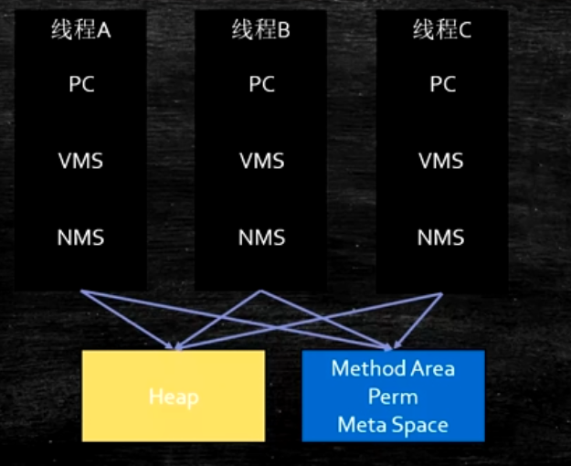

# JVM Runtime Data Area

## Run-time data areas

* `ProgramCounter`

    程序计数器（下一条指令的位置）；

* `JVM stacks`

    栈;

    每个线程对应一个栈，栈中存放栈帧 (stake frame) （**每个方法对应一个栈帧**）；

    * `stake frame`
  
        栈帧；

        包含的内容：
        * `Local Variable Table` 局部变量表
        * `Operand Stacks` 操作数栈
        * `Dynamic Linking` 动态链接
      
            指向运行时常量池中的符号链接；如果没有解析，动态解析，如果已经解析，可以直接使用；
      
        * `return address` 返回地址
  
            方法执行完成后，返回的位置地址；

* `native method stacks`

    JNI(C/C++ 方法)对应的栈；

* `Direct Memory`

    直接内存，主要用于 `I/O` ，实现零拷贝 (zero copy) 有操作系统管理；

* `method area`

    方法区（逻辑概念）；

    * `run-time constant pool`
  
        存放类常量池内容

    存放每个 class 对象结构；有两种实现 `method area` 的方式：
    * `Perm Space`
    
        （JDK 1.8 之前）字符串常量位于 `Perm Space` ， FGC 不会清理（bug,匿名内部类？）；启动是指定，不能变；

    * `Meta Space`

        （JDK 1.8 新增）字符串常量位于**堆**，会触发 FGC 清理；如果不设定，最大就是物理内存；

    > 如何证明： 1.7 字符串位于 Perm Space ，而 1.8 位于 Heap ?
    > 
    > 结合 GC ，一直创建字符串常量，观察堆和报错信息

* `Heap`

    堆；

    JVM 所有线程共享；

# JVM Instructions

* `bipush` : Push `byte`

    当前 `byte` 按符号扩展为 `int` 值；该值被推送到 `operand stack` 顶；

* `istore_<n>` : Store `int` into local variable

    

* `iload_<n>` : Load `int` from local variable

* `<init>` 构造方法
* `<clinit>` 静态语句块
* `invokestatic` 调用静态方法
* `invokevirtual` （支持多态）调用方法
* `invokespecial` 不需要多态调用的方法（包括构造方法和私有方法）
* `invokeinterface` 调用接口方法
* `invokedynamic` 调用 Lambda 表达式或者反射或者动态语言特性或者动态产生 class

> 指令集设计的两种不同方式：
> 
> 1. 基于栈的指令集(JVM, hotspot 的 local variable table 类似于寄存器
> 2. 基于寄存器的指令集
