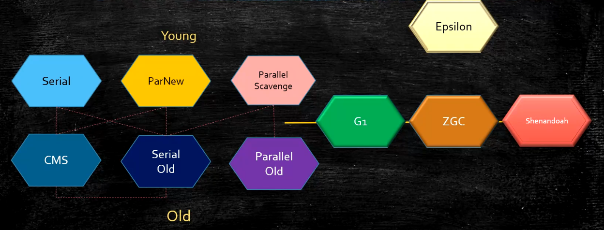
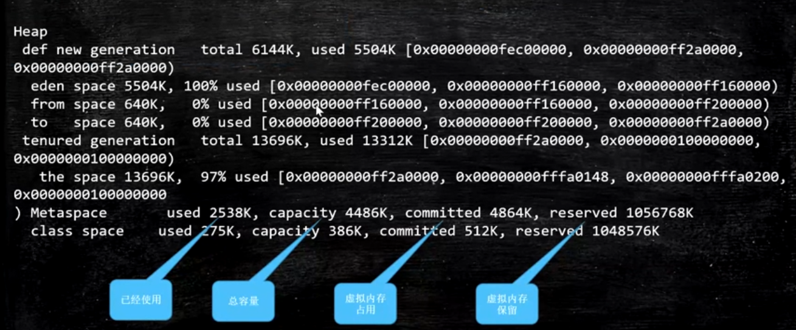

# Garbage Collector(GC) _垃圾回收器_

Java GC 自动垃圾回收，开发效率高，执行效率相对低；

## Garbage _垃圾_

没有被引用的对象归为**垃圾**(Garbage)；

## 定位 Garbage 算法

* reference count _引用计数_

    引用计数不能处理**循环引用**；

* root searching _根可达_(Hotspot)

    GC `roots` (根对象): 线程栈变量、静态变量、常量池、 `JNI` 指针 (GC `roots` : JVM stack, native method stack, run-time-constant pool, static references in method area, Clazz)

## 清理 Garbage 算法

* mark-sweep _标记清除_

    通过 `root searching` 根可达算法，将垃圾做标记，然后清除释放空间；

    > **优点**：
    > 
    > * 算法相对简单，存活对象比较多的情况下（清理的对象少）效率比较高；
    > 
    > **缺点**：
    > 
    > * 两遍扫描（第一遍（**标记**）根据**根可达算法**确定不可回收对象内存，第二遍（**清除**）在第一遍的基础上确定可回收对象）效率偏低；
    > * 容易产生碎片；

* copying _拷贝_

    将不可回收对象移动拷贝在到一块新的区域，逻辑上分成两块内存区域（在垃圾回收前占用的空间和垃圾回收后存放拷贝的不可回收对象的区域），清理过程直接释放掉整个旧的内存区域；

    > **优点**：
    > 
    > * 适用于存活对象较少的情况，只扫描一次，效率提高，没有内存碎片；
    > 
    > **缺点**：
    > 
    > * 空间浪费（需要将当前内存中的不可回收对象拷贝到一块新的内存区域）；
    > * 移动空间，调整对象引用；

* mark-compact _标记压缩_

    将存活对象整理到内存区域的一端；

    > **优点**：
    >
    > * 不会产生碎片，方便对象分配；
    > * 不会产生可用内存减半；
    >
    > **缺点**：
    >
    > * 扫描两次；
    > * 需要移动对象，效率偏低；

## 堆内存逻辑分区

**不适用不分代垃圾收集器**；

> Hotspot 内部使用的是**分代算法**；

> 除 `Epsilon` `ZGC` `Shenandoah` 之外的 GC 都是使用逻辑分代模型；
> 
> `G1` 仅实现了逻辑分代；
> 其他 GC 不仅逻辑分代，并且物理分代；

### 逻辑分代模型

> 除了 `G1` 的其他逻辑分代模型 GC 默认： `new/young : old/tenured = 1 : 2`

新生代对象大量死去，少量存活，适合**复制算法**；
老年代存活率高，回收较少，适合**标记清除**或者**标记压缩**；

* `new` / `young`: `1` _新生代_ **Coping**

    实例化的新对象，首先位于**新生代**；
    * `eden`: `8` _伊甸_
        
        实例化对象栈 stack 上分配不下时，分配到当前区域；

        > （一）栈上分配：
        >
        > * 线程私有小对象
        > * 无逃逸：局部代码内使用
        > * 支持标量替换：可以用普通类型的组合代替整个对象（比如：类T包含两个**非对象属性**，此时可以用两个对应的类型相同的变量代替当前对象）；
        > * **无需调整**

        > （二）线程本地分配 `TLAB`(Thread Local Allocation Buffer) ：
        >
        > * 占用 `edon` ，默认 `1%`
        > * 多线程的时候不用竞争 `edon` 就可以申请空间，提高效率
        > * 小对象
        > * **无需调整**

        > （三）老年代：
        >
        > * 大对象

        > （四） `edon`：
        >
        > * 其他

    * `survivor`: `1` //S1
    * `survivor`: `1` //S2

        `survivor` 一共分为两个相同的区域： S1 S2 ；

        `eden` 中对象经过一次 `GC` 没有被回收，归属到当前区域；

        `servivor` 每个区中的对象经过一次 `GC` 没有被回收，年龄自增，归属到另外一个 `survivor` 区域；

    > `servivor` 两个区中对象进入 `old` 区的年龄通过参数： `--XX:MaxTenuringThreshold` 配置
    > 
    > * Parallel Scavenge 垃圾回收器默认： `15`
    > * CMS 垃圾回收器： `6`
    > * G1 垃圾回收器： `15`
    > 
    > 动态年龄：
    > 
    > * `survivor` 两个区域垃圾会后完后（edon+survivor），当前 `survivor` 空间使用超过 `50%` ，将年龄最大的移动到 `Old`

* `old` / `tenured`: `2` _老年代_ **mark-sweep**/**mark-compact**

    经过多次 GC 没有被回收的对象位于**老年代**；

* `Metaspace` 元数空间（1.8+），JDK 1.7 叫做 `PermGen` 永久代

    > `PermGen` JDK 1.7 时（通过命令）必须指定大小限制，类多的情形下容易内存溢出；
    > 
    > **字符串常量**：
    > * JDK 1.7： 永久代 `PermGen`
    > * JDK 1.8+：堆

    元数据空间没有大小限制，受限于物理内存；存放 `Class` 信息JNI

    > **`MethodArea`** : 
    > 
    > 方法区，逻辑概念（永久代、元数据）
    > 所有线程共享；
    > 
    > 

> `MinorGC`/`YGC`: 年轻代空间耗尽是触发的 GC ；
> 
> `MajorGC`/`FullGC`: 老年代空间耗尽时触发，新生代、老年代同时 GC ；

> 年轻代空间大小控制参数： `-Xmn`
> 
> 老年代空间大小控制参数： `-Xms` `-Xmx`


> `java -XX:+PrintFlagsFinal -version` 非标值，所有 JVM 参数

> **分配担保**
> 
> `YGC` 期间，新的对象进入 `survivor` 区空间不够了，直接进入老年代；

## 常见垃圾回收器

* `Serial` 年轻代（串行回收）

    a stop-the-word(STW), copying collector which uses a **single** GC thread.

    > safe point : 应用线程可以安全暂停的点

    单核CPU效率最高，虚拟机是 `Client` 模式的默认垃圾回收器；

* `PS(ParallelScavenge)` 年轻代（并行回收）

    a stop-the-world, copying collector which uses **multiple** GC threads.

* `PN(ParNew/ParallelNew)` 年轻代（配合 `CMS`(ConcurrentMarkSweep) 的并行回收）

    a stop-the-word, copying collector which uses multiple GC threads.

    It differs form "Parallel Scavenge" in that it has **enhancements** that make it usable with CMS.

    For example, "ParNew" does the **synchronization** needed so that it can **run during the concurrent phases of CMS**.

    默认线程数为 CPU 核数；

* `SO(SerialOld)` 老年代

    a stop-the-world mark-sweep-compact collector that uses a **single** GC thread.

* `PO(ParallelOld)` 老年代

    a compacting collector that uses **multiple** GC threads.

    mark-compact

* `CMS(ConcurrentMarkSweep)` 老年代（并发回收，**垃圾回和应用程序同时运行**，降低 **STW** 的时间(200ms) ）

    a mostly concurrent, low-pause collector.

    使用的**算法**：三色标记 + `Incremental Update`

    4 phases:
    * initial mark 初始标记(STW)（单线程），指标及根对象
    * concurrent mark 并发标记（多线程），于应用程序同时运行
    * remark 重新标记(STW)（多线程），多是已经并发标记完成，对新产生的垃圾进行标记
    * concurrent sweep 并发清理，清理过程也会产生新的垃圾，这种叫做浮动垃圾，需要下次CMS运行的时候进行清理；

    > CMS 问题：
    > 
    > * Mamory Fragmentation 内存碎片
    > * Float Garbage 浮动垃圾
    >     * ConcurrentModeFailure
    >         
    >         降低触发 CMS 的阈值
    >         
    >         `-XX:CMSInitiatingOccupancyFraction 92%` 默认 `92%` 将阈值降低 `68%` 保证有 FGC 过程中老年代有空间可以提供分配；
    >         
    >     * PromotionFailed
    >         
    >         保持老年代有足够的空间；
    > 
    > 
    > CMS 一旦有问题，需要使用 `SerialOld` 做标记压缩

    CMS 问题比较多，所以现在没有版本默认 CMS ，只能手工指定；
    CMS 既然是 MarkSweeep 一定会有内存碎片问题，达到一定成都后 CMS 老年代分配对象分贝不下的时候，使用 `SerialOld` 进行老年代回收；

    > PS + PO 加内存 换垃圾回收器 PN + CMS + SerialOld（几小时-几天的 STW）
    > 几十 G 内存，单线程回收 G1 + FGC 几十个 G 上 T 内存的服务器 ZGC

* `G1`(10ms)

    使用算法： 三色标记 + `SATB`

* `ZGC`(1ms, C++) 不分代

    使用算法：颜色指针 (colour pointers) + 写屏障

* `Shenandoah` 不分代

    使用算法：颜色指针 (colour pointers) + 读屏障

* `Eplison` Debug 使用

> **到目前位置还没有不会产生 `stop-the-word(STW)` 的垃圾回收器；**
> 
> JDK 诞生 `Serial` 追随，提高效率，产生了 PS ，为了配合 CMS ，诞生了 PN ，CMS 引入于 JDK 1.4 后期；
> 
> CMS 是里程碑式的 GC， 开启了并发回收的过程，问题较多，目前没有任何发行版本默认使用 CMS 。

JDK 1.8 默认垃圾回收器： `PS` + `PO`

常用的 GC 组合：
* `Serial` + `SerialOld`
* `ParallelScavenge` + `ParallelOld`
* `ParNew` + `ConcurrentMarkSweep`

> FGC
> 
> 整体内存需要回收；
> 触发条件：老年代没有足够的内存空间可用，默认是 `PS` + `PO` ，可以修改成 `PN` + `CMS` ，`PO`/`CMS` 来执行 FGC



> `ParNew` vs `ParallelScavenge`
> 
> PN 响应时间优先（配合CMS)
> PS 吞吐量优先
> 
> [HotSpot Virtual Machine Garbage Collection Tuning Guide](https://docs.oracle.com/en/java/javase/13/gctuning/ergonomics.html#GUID-DB4CAE94-2041-4A16-90EC-6AE3D91EC1F1)

> 垃圾回收器与内存大小关系：
> 
> * Serial : n0 MB
> * PS : n00 MB ~ n GB
> * CMS : 20 GB
> * G1 : n00 GB
> * ZGC : 4 TB

### Concurrent Remark （并发标记）阶段的算法；

* 三色扫描算法
    * 黑 自己已经标记， `fields` 都标记完成
    * 白 自己已经标记， `fields` 还未来得及标记
    * 灰 没有遍历到的节点
  
    > 在并发标记时，引用可能产生变化，白色对象有可能被错误回收；
* SATB(Snapshot At The Beginning)
    * 
* IncrementalUpdate

### GC 组合参数设定

* `-XX:+UseSerialGC` : SerialNew(DefNew) + SerialOld

    小型程序，默认情况下不适用此选项；Hotspot 会根据计算配置和JDK版本自动先择收集器；

* `-XX:+UseParNewGC` : ParNew + SerialOld

    组合已经很少使用（部分版本已经废弃）；

* `UseConc[urrent]MarkSweepGC` : ParNew + CMS + SerialOld
* `UseParallelGc` : ParallelScavenge + ParallelOld （JDK 1.8 默认）
* `UseParallelOldGC` : ParallelScavenge + ParallelOld
* `UseG1GC` : G1

> Windows 查看 GC 方法： 
> 
> * `java +XX:+PrintCommandLineFlags -version`
> * 通过 GC 日志分辨
> 
> Linux 查看 GC 方法

## GC 日志

参数：
* `-XX:+PrintGC`
* `-XX:+PrintGCDetails`
* `-XX:+PrintGCStamps`
* `-XX:+PrintGCCauses`

GC 日志解析：
* GC类型： 

    `GC`: YGC / `FUll GC`: FullGC

* GC 原因： `(xxxx)`
* GC 年代： 回收前后内存变化，年代总大小，回收耗时，回收前后堆的大小，堆总大小，整体 GC 耗时
* (linux) time ls: user 用户空间耗时， sys 内核空间耗时， real 总体耗时

#### Heap dump

内存溢出 GC 打印堆信息；

`eden space 5504K, 100% used [0x00000000fec00000,0x00000000ff160000, 0x00000000ff160000)`
内存地址含义：**起始地址**，**使用空间结束地址**，**整体空间结束地址**；



* `reserved` 虚拟机内存保留
* `committed` 虚拟内存占用
* `capacity` 总容量
* `used` 已经使用

> `total = edon + survivor[from or to]`

## GC tuning _GC 调优_

> **概念：**
> 
> * **吞吐量**：**用户代码执行时间**/(**用户代码执行时间**+**垃圾回收时间**)
> * **响应时间**：**STW**越短，响应时间越好

调优的目标： 
* 吞吐量优先需求
* 响应时间需求

> 问题：
> 
> * 科学计算：吞吐量优先；一般是： `PS + PO` ；（数据挖掘，任务处理）
> * 用户交互类： 响应时间优先；JDK 1.8 一般是 `G1` ；（网站）

**GC 调优范畴**

1. JVM 规划和预调优；
2. JVM 运行时优化；
3. 解决 JVM 运行时问题；

### JVM 规划和预调优

* 调优，从**业务场景**开始；
* 压力测试前后变化；
* 调优步骤；
    1. 熟悉业务场景（没有最好的垃圾回收器，只有最合适的垃圾回收器）
       1. 响应时间：停顿时间[`CMS`、`G1`、`ZGC`]
       2. 吞吐量：用户时间/(用户时间+GC时间) [PS]
    2. 选择垃圾回收器组合
    3. 计算内存需求（经验值 1.5G 16G）
    4. 选定 CPU （越高越好）
    5. 设定年代大小、升级年龄
    6. 设定日志参数
       1. `-Xloggc:/opt/xxx/logs/xx-xx-gc-%t.log -XX:+UseGCLogFileRotation -XX:NumberOfGCLogFiles=5 -XX:GCLogFileSize=20M -XX:+PrintGCDetails -XX:+PrintGCDetailStramps -XX:+PrintGCGause`
          1. `loggc` 日志文件名称（按系统时间）
          1. `UseGCLogFileRotation` 循环使用
          1. `NumberOfGCLogFiles` 5个日志文件
          1. `GCLogFileSize` 日志文件大小
          1. `PrintGCDetails` 打印日志文件详情
          1. `PrintGCCause` 打印 GC Case
       2. 或者每天生成一个日志文件

> 案例1. 垂直电商，最高每日百万订单，处理订单系统需要什么样的服务器配置？
> 
> 问题比较业余，因为很多不同的服务器配置都能支撑（`1.5G` ~ `6G`）；
> 找一个小时内的高峰期，假设 1000 订单/秒；
> 经验值，做压测；
> 
> 计算：一个订单产生需要多少内存？（1~2M） `512K * 1000 = 500M` 内存
> 
> 要求响应时间在多少毫秒，经过压测计算；

> 案例2. 12306 遭遇春节大规模抢票应该如何支撑？
> 
> 网上得知： 100W 最高。
> 
> CDN -> LVS -> NGINX -> 业务系统 -> 每台及其 1W 并发 100 台机器；
> 
> 12306 的一种可能模型：下单 -> 减库存 和 订单(redis kafka)同时异步进行 -> 等付款
> 
> 减库存最后还会把压力压到一台服务器。
> 
> 可以做分布式本地库存 + 单独服务器做库存均衡。

> 大流量的处理方法：**分而治之**

### JVM 运行时优化

> 响应时间慢，卡顿。

> 有一个 50 万PV的资料类网站（从磁盘提取文档到内存）原服务器 32位，1.5G的堆，用户返回网站比较慢，因此公司决定升级；
> 新服务器 64位，16G 的堆内存，结果用户反馈卡顿十分严重，反而比以前效率更低了。
> 
> 1. 为什么原网站慢？
> 
>     很多用户浏览，需要加载到内存，内存不足，频繁 GC 响应时间慢；
> 
> 2. 为什么更卡顿？
> 
>     内存更大， FGC 时间 （STW） 更长；
> 
> 3. 如何优化？
> 
>     PS 换成 `PN + CMS` 或者 G1

1. 系统 CPU 经常 100%，如何调优？

    产生原因：有线程在占用系统资源：
    1. 查找出占用高的进程(`top` `jps`)；
    2. 定位该进程中的哪些线程占用高(`tp -Hp PID`)；
    3. 导出该进程的堆栈(`jstack PID`, 当前进程下的所有线程堆栈信息，`nid`对应 PID 的十六进制)；
   
    `jstack`:
        * `WAITING` 等待
        * `BLOCKED` 阻塞

        `waiting on <0xxxxx>(a java.lang.Object)` 等待锁释放；要找到是哪个线程持有这把锁，导致死锁；
   
    4. 查找那些方法（栈帧）占用高(`jstack`)；

    > **工作线程** vs **垃圾回收线程**
    > 
    > 

3. 系统内存飙高，如何查找问题？

    1. 查找出占用高的进程(`top`)；
    2. 定位该进程中的哪些线程占用高(`tp -Hp`)；
    3. 导出该线程的堆栈(`jstack`)；
    4. 导出堆内存(`jmap`)；
    5. 分析(`jhat` `jvisualvm` `mat` `jprofiler`)

4. 监控 JVM
   
    1. jstack
    2. jvisualvm
    3. jprofiler
    4. arthas

> 自定义**线程池名称**： 自定义 `ThreadFactory`


> `JMX`(Java Management Extensions) Java 远程扩展
> 
> * 开启设定： `java -Djava.rmi.server.hostname= -Dcom.sun.mamagement.jmxremote -Dcom.sun.management.jmxremote.port= -Dcom.sun.management.jmxremote.authenticate=false -Dcom.sun.management.jmxremote.ssl=false application_name`


### 解决 JVM 运行时问题 (OOM)

> `jinfo PID`: 列出进程详细信息
> `jstat -gc PID` 打印进程 GC 信息

#### 如何定位 OOM 问题的？

1. 使用什么工具？ (cmdline arthas)

    * `jmap`

        添加运行配置参数： `-XX:+HeapDumpOnOutOfMemoryError`

        查找内存有多少对象产生： `jmap -histo PID` / `jmap -histo PID | head -20` `jmap -dump:format=b,file=fileName PID` （ `jmap` 转储，轻易不用）

        > * 在没有设置参数： `HeapDumpOnOutOfMemoryError` 时，线上系统，内存特别大， `jmap -dump:format=b,file=fileName PID` 执行期间会对进程产生很大影响，甚至卡顿；
        > 
        > * 设定了参数： `HeapDumpOnOutOfMemoryError` 在系统 OOM 时会自动产生转储文件；
        > 
        > * 如果服务间高可用，没有设置暂时 `HeapDumpOnOutOfMemoryError` 时，某个服务不可用对其他不会产生影响；
    
        查找相应的业务逻辑和代码位置；

    * `arthas`

        * 启动 arthas ： `./as.sh` / `java -jar arthas-boot.jar`
        * 

        * `help` 获取 arthas 帮助信息
        * `jvm` 获取 JVM 详细信息（类似于 `jinfo` ），可以看到垃圾回收器类型
        * `thread` 列出向前进程的所有线程，以及资源使用情况
        * `thread ID` 查看线程内堆栈信息
        * `dashboard` 类似于 Linux top 命令，观察系统情况
        * `heapdump` 导出堆内存（类似于 `jmap` ）
        * `jad` **反编译**
      
            `jad cleaa_name` 反编译类文件；
            * 动态代理生成类的问题定位
            * 第三方的类（观察代码）
            * 版本问题（确定代码为对应提交版本）
   
        * `redefine` **热替换**
      
            目前有些限制条件：只能改方法实现（方法已经运行完成），不能改方法名和类属性；
      
            `redefine class_path.class_name.class` 热替换 class 文件
      
        * `sc` search class 搜索类
        * `watch` watch method 观察方法信息

3. 图形界面到底用在什么地方？

    **测试**

#### 分析堆文件：

* 使用 `jhat` 分析 `heapdump` 文件

    * `jhat -J-max512M dump_file_name.hprof`
  
        `-J-max512M` 指定内存大小；
  
    * 分析完毕启动一个 web 提供分析结果： `http://ip:port`
    * Link `Instance Counts for All Classes (including platform)` 获取类似于 `jmap` 结果，对象数量
    * Link `Object Query Langugage (OQL) query` 提供基于 `OQL` 对对象的查询；点击查询结果可以获取对象的详细信息（对象大小、实例对象数量，引用信息等）

* 使用 `mat` 分析 `heapdump` 文件
* 使用 jvisualvm 分析 `heapdump` 文件

    * `文件` `装入` 选择转储文件载入
    * 同样提供了 `OQL` 查询语句控制台

#### OOM 案例汇总

> OOM 产生的原因多种多样，有些程序未必产生 OOM 但是会不断 FGC （CPU 占用高，内存回收得到的回收内存少）。

1. 硬件升级系统反而卡顿的问题。
2. 线程池不当运用产生 OOM 问题。
3. jira 特别卡顿问题。
    
    通过定位，系统再不断 FGC ，扩大内存， FGC 时间延长，没有排查出原因，换用 G1 。

4. tomcat `http-header-size` 设置扩大

    `server.max-http-header-size=10000000` 默认 `4096` ，每个请求占用设置大小的内存，通过 `jmap` 查看到 http 对象 `Http11OutputBuffer` 占用内存高。

5. Lambda 表达式导致方法区 (`MethodArea`: `Pern` / `MetaSpace` ) 溢出问题。

    Lambda 表达式：每个 Lambda 对象都会再内存(`methodarea`)之中生成一个新的 `class` 对象

   `methodarea` 的清理，每个垃圾回收器都不同，有的甚至不会清理； `Class` 没有对应的对象才有可能被回收等条件；

6. 直接内存溢出问题

    《深入理解Java虚拟机》 p59 使用 `Unsafe` 分配直接内存，或者使用 NIO 的问题。

7. 栈溢出问题

    `-Xss` 设定太小。或者方法递归调用深度过深。

8. 比较一下这两段程序的异同，分析哪一个更优的写法：

    ```text
    Object o = null;
    for (int i = 0; i < 100; i++ ) {
        o = new Object(); // God
    }
    ```
    
    ```text
    for (int i = 0; i < 100; i++) {
        Object o = new Object(); // Bad
    }
    ```

    方式二：每次循环都会生成新的引用本身；循环没有结束对象和对应的引用不会被回收。涉及到 hotspot 优化是否再循环内释放垃圾。

9. 重写 `finalize` 引发频繁 GC 

    小米云， HBase 同步系统，系统通过 nginx 访问超时报警，最后排查， C++ 程序员（转 Java）重写 `finalize` 引发频繁 GC 问题。

    C++ 需要从写 `finalize` 用于手动内存回收，

    `finalize` 方法中做了耗时操作，导致频繁 GC 。

10. 如果有一个系统，内存一直消耗不超过 10% 但是观察 GC 日志，发现 FGC 总是频繁产生，会是什么引起的？

    有人显示调用了 `System.gc();` 。

11. Disruptor 可以设置链的长度，如果过大，然后对象大，消费完不主动释放，会溢出。
12. 用 JVM 都会溢出， MyCat 崩溃，临时版本解析 SQL 子查询算法有问题， 9 个 exit 的联合sql 导致生成了几百万的对象。
