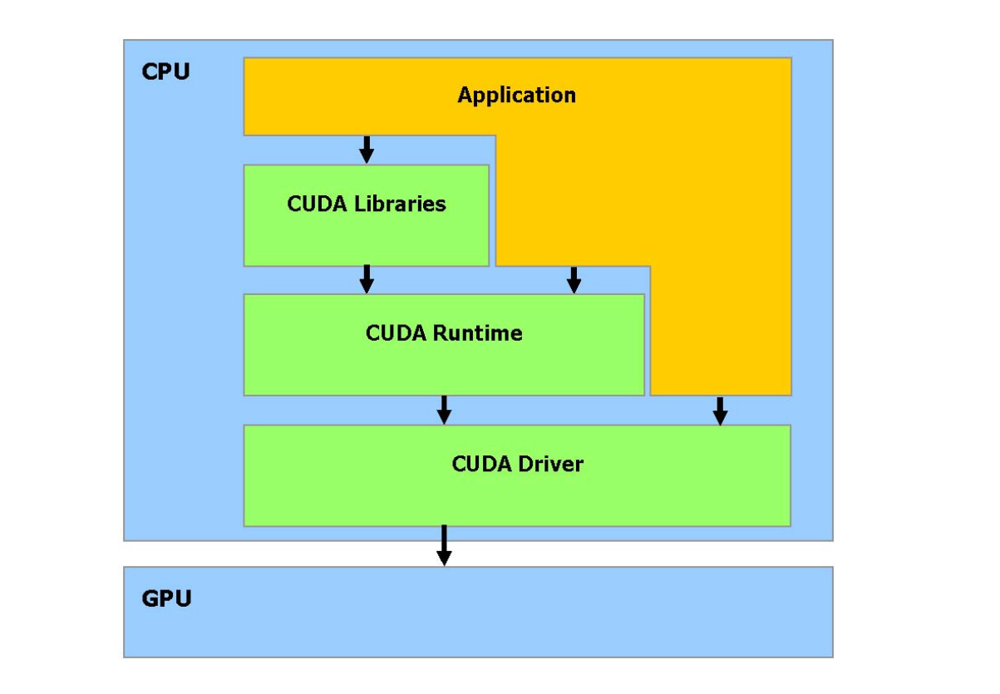

# 介绍 CUDA

GPU 被设计用于高密度和并行计算（更确切说是：图形渲染），因此更多的晶体管被投入到数据处理而不是数据缓存和流量控制。

> 并行数据运算问题
>
> 同一个程序在许多并行数据元素，并带有高运算密度（算数运算与内存操作的比例））。
> 由于同一个程序要执行每个数据元素，降低了对复杂的流量控制要求；并且，因为它执行许多数据元素并且具有**高运算密度**，内存访问的延迟可以被忽略；

CUDA： 一个在 GPU 上计算的新架构 CUDA(Compute Unified Device Architecture) 统一计算设备架构，在 GPU 上发布的一个新的硬件和软件架构，不需要映射到一个图形 API 便可在 GPU 上管理和进行并行数据计算。

CUDA 软件堆栈组成：
1. 硬件驱动程序
2. 应用编程接口 API
3. Runtime
4. 两个高级的通用数学库： CUFFT 和 CUBLAS

硬件设计成支持轻量级的驱动和 Runtime 。

