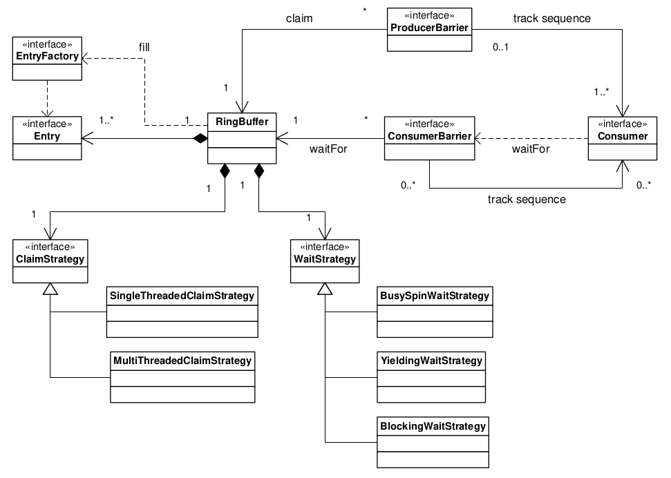
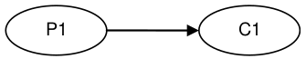
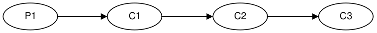
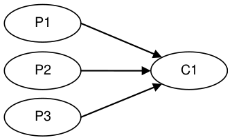
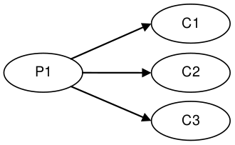
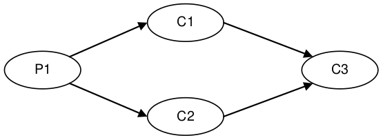

# LMAX Disruptor：用于在并发线程之间交换数据的有界队列的高性能替代方案 (High performance alternative to bounded queues for exchanging data between concurrent threads)

> Martin Thompson · Dave Farley · Michael Barker · Patricia Gee · Andrew Stewart - Version 4.0.0.RC2-SNAPSHOT, May 2011

## 摘要 Abstract

LMAX 的成立是为了创造一个非常高性能的金融交易所。
作为实现这一目标的工作的一部分，我们评估了设计此类系统的几种方法，但是当我们开始测量这些方法时，我们遇到了传统方法的一些基本限制。

许多应用进程依赖队列在处理阶段之间交换数据。
我们的性能测试表明，以这种方式使用队列时，延迟成本对磁盘（基于 RAID 或 SSD 的磁盘系统）的 IO 操作成本处于同一数量级 —— 非常慢。
如果端到端操作中有多个队列，这将增加数百微妙的整体延迟。
显然还有优化的空间。

进一步调查对计算机科学的关注使我们意识到传统方法（例如队列和处理节点）中固有的关注点的混论导致多线程实现中的争用，这表明可能有更好的方法。

考虑现在 CPU 的工作方式，我们喜欢称之为”机械同情“("mechanical sympathy")，使用良好的设计实践，重点关注梳理问题，我们提出了一种数据结构和一种我们称之为 Disruptor 的使用模式。

测试表明，将 Disruptor 用于三级管道的平均延迟比等效的基于队列的方法低 3 个数量级。
此外，对于相同的配置， Disruptor 处理的吞吐量大约高出 8 倍。

这些性能改进代表了围绕并发编程的思想发生了重大变化。
这种新模式是任何需要高吞吐量和低延迟的异步事件处理框架的理想基础。

在 LMAX ，我们创建了一个订单匹配引擎、实施风险管理和一个高可用的内存交易处理系统，所有这些都是在这个模式上取得了巨大的成功。
这些系统中的每一个都设定了新的性能指标，据我们所知，这些标准是无与伦比的。

然而，这不仅与金融行业相关的专业解决方案。
Disruptor 是一种通用机制，它以最大化性能的方式解决并发编程中的复杂问题，并且易于实现。
尽管一些概念可能看起来不寻常，但根据我们的经验，构建这种模式的系统比类似的机制更容易实现。

与同类方法相比， Disruptor 具有更少的写入争用、更低的并发开销并且对缓存更友好，所有这些都导致更高的吞吐量以及更低的延迟和更少的抖动。
在中等时钟速率的处理器上，我们已经看到每秒超过 2500 万消息和低于 50 纳秒的延迟。
与我们见过的任何其他实现相比，这种性能是一个显著的改进。
这非常接近处理器在内核之间交换数据的理论极限。

## 1. 概述 Overview

Disruptor 是我们努力在 LMAX 创建世界上最高性能的金融交易所的结果。
早期的设计侧重于 `SEDA` 和 `Actor` 派生的架构，使用管道来提高吞吐量。
在分析各种实现之后，很明显，管道中各个阶段之间的事件队列主导了成本。
我们发现队列还引入了延迟和高抖动。
我们花费了大量精力来开发具有更好性能的新队列实现。
然而，很明显，由于生产者、消费者及其数据存储设计问题混为一谈，队列作为一种基本数据结构是有限的。
Disruptor 是我们努力创建一个并发结构的结果，该结构可以干净地分离这些问题。

## 2. 并发的复杂性 The Complexities of Concurrency

在本文档和一般计算机科学的上下文中，并发不仅意味着两个或多个任务并行发生，而且还意味他们争夺资源访问权。
争用的资源可能是数据库、文档、套接字甚至是内存中的某个位置。

代码的并发执行与两件事有关，**互斥**和**变化的可见性**。
**互斥**是关于管理对某些资源的竞争更新。
**更改的可见性**是关于控制何时使这些更改对其他线程可见。
如果您可以消除竞争更新的需要，则可以避免互斥的需要。
如果你的算法可以保证任何给定资源只被一个线程修改，那么互斥就没有必要了。
读写操作要求所有更改对其他线程可见。
然而，只有争用的写操作需要更改的互斥。

在任何并发环境中，成本最高的操作是竞争写访问。
让多个线程写入同一资源需要复杂且昂贵的协调。
通常这是通过采用某种锁定策略来实现的。

## 2.1. 锁的成本 The Cost of Locks

**锁**提供互斥并确保更改的可见性以及有序的方式发生。
锁是非常昂贵的，因为它们在争用时需要仲裁。
这种仲裁是通过上下文切换到操作系统内核来实现的，操作系统内核将挂起等待锁的线程，直到它被释放。
在这样的上下文切换期间，以及将控制权释放给操作系统，操作系统可能决定在它拥有控制权的同时执行其他内务处理任务。执行上下文可能会丢失先前缓存的数据和指令。
这对现代处理器产生严重的性能影响。
可以使用**快速用户模式锁**，但这些只有在不争用时才有真正的好处。

我们将通过一个简单的演示来说明锁的成本。
本实验的重点是调用了一个函数，该函数在循环中将 64 位计数器递增 5 亿次。
如果用 Java 编写，这可以由 2.4Ghz Intel Westmere EP 上的单个线程执行，只需 300 毫秒。
语言对于这个实验并不重要，所有具有相同基本原语的结果都是相似的。

一旦引入锁来提供互斥，即使锁尚未竞争，成本也会显著上升。
当两个或更多线程开始竞争时，成本会再次增加，数量级会增加。
这个简单实验的结果如下表所示：

_Table 1. 争用的比较成本 Comparative costs of contention_

| Method                            | Time(ms) |
|-----------------------------------|---------:|
| Single thread                     |      300 |
| Single thread with lock           |   10,000 |
| Two threads with lock             |  224,000 |
| Single thread with CAS            |    5,700 |
| Two threads with CAS              |   30,000 |
| Single thread with volatile write |    4,700 |

## 2.2. "CAS" 的成本 The Costs of "CAS"

当更新的目标时单个字时，可以采用一种比使用锁更有效的替代方法来更新内存。
这些替代方案基于在现代处理器中实现的原子或互锁指令。
这些通常称为 CAS（比较和交换）操作，例如 x86 上的 `lock cmpxchg` 。
CAS 操作是一种特殊的机器代码指令，它允许将内存中的一个字有条件地设置为原子操作。
对于**"增加计数器实验"**，每个线程都可以在循环中旋转读取计数器，然后尝试以原子方式将其设置为新的增量值。
旧值和新值作为参数提供给该指令。
如果在执行操作时，计数器的值与提供的预期值匹配，则用新值更新计数器。
另一方面，如果该值不符合预期，则 CAS 操作将失败。
然后由尝试执行更改的线程重试，重新读取从该值递增的计数器，以此类推，直到更改成功。
这种 CAS 方法比锁更有效，因此它不需要上下文切换到内核进行仲裁。
然而， CAS 操作不是免费的。
处理器必须锁定其指令管道以确保原子性，并使用内存屏障使更改对其它线程可见。
通过使用 `java.util.concurrent.Atomic*` 类， CAS 操作在 Java 中可用。

如果进程的关键部分比简单的计数器增量更复杂，则可能需要使用多个 CAS 操作的复杂状态机来协调争用。
使用锁开发并发进程是困难的；使用 CAS 操作和内存屏障开发无锁算法要复杂很多倍，而且很难证明它们是正确的。

理想的算法是只有一个线程拥有对单个资源的所有写入，而其他线程读取结果。
要在多处理器环境中读取结果，需要内存屏障以使更改对在其他处理器上运行的线程可见。

## 2.3. 内存屏障 Memory Barriers

处于性能原因，现代处理器执行指令的乱序执行以及内存和执行单元之间数据的乱序加载和存储。
处理器只需要保证进程逻辑产生相同的结果，而不管执行顺序如何。
这不是单线程进程的问题。
然而，当线程共享状态时，重要的是所有内存更改在所需要的时间点按顺序出现，以便数据交换成功。
处理器使用内存屏障来指示内存更新顺序很重要的代码部分。
它们是在线程之间实现硬件排序和更改可见性的方法。
编译器可以设置补充的软件屏障来确保编译代码的顺序，这样的软件内存屏障是处理器本身使用的硬件屏障的补充。

现代的 CPU 现在比当前一代的内存系统快得多。
为了弥合这种鸿沟， CPU 使用复杂的缓存熊，这些系统实际上是没有链接的快速硬件哈希表。
这些缓存通过消息传递协议与其他处理器缓存系统保持一致。
此外，处理器有“存储缓冲区”来卸载对这些缓存的写入，以及“无效队列”，以便缓存一致性协议可以在写入即将发生时快速确认无效消息以提高效率。

这对数据意味着任何值的最新版本都可以在写入后的任何阶段位于寄存器、存储缓冲区、多级缓存之一或主存中。
如果线程要共享此值，则需要以有序的方式使其可见，这是通**过缓存一致性消息**的协调交换来实现的。
这些消息的及时生成可以通过内存屏障来控制。

读取内存屏障在 CPU 上命令加载指令， CPU 通过在无效队列中标记一个点来为进入其缓存的更改执行它。
这为它提供了一个一致的领域视图，用于在读取屏障之前有序的写入操作。

写屏蔽命令将指令存储在 CPU 上， CPU 通过在存储缓冲区中标记一个点来执行它，从而通过其缓存刷新写出。
这个屏障为领域提供了一个有序的视图，即在写屏障之前发生了什么存储操作。

完整的内存屏障对加载和存储进行排序，但仅在执行它的 CPU 上进行排序。

出了这三个原语之外，一些 CPU 还有更多变体，但这三个足以理解所涉及的复杂性。
在 Java 内存模型中， `volatile` 字段的读写分别实现了读写屏障。
这在 Java 5 发布时定义的 Java 内存模型^[3]中明确说明。

## 2.4. 缓存行 Cache Lines

在现代处理器中使用缓存的方式对于成功的高性能操作非常重要。
此类处理器在高速缓存中处理数据和指令时非常高效，但相对而言，当发生高速缓存未命中时效率非常低。

我们的硬件不会以字节或字为单位移动内存，为了提高效率，缓存被组织成大小通常为 32-256 字节的缓存行，最常见的缓存行是 64 字节。
这是缓存一致性协议运行的粒度级别。
这意味着如果两个变量在同一个缓存行中，并且它们由不同的线程写入，那么它们会出现与单个变量相同的写争用问题。
这是一个被称为“**虚假共享**”("false sharing")的概念。
因此，为了获得高性能，如果要最大限度地减少争用，则必须确保独立但并发写入的变量不共享相同的缓存行。

当以可预测的方式访问内存时， CPU 能够通过预测下一个可能访问的内存并将其后台预取到缓存中来隐藏访问主内存的延迟成本。
这只有在处理器可以检测到访问模式时才有效，例如具有可预测“**步幅**”的行走内存，当遍历数组的内容时，步幅可预测的，因此内存将被预取到缓存行中，从而最大限度地提高访问效率。
步幅通常必须在任意方向上都小于 2048 字节才能被处理器注意到。
然而，像链表和树这样的数据结构往往有更广泛地分布在内存中的节点，没有可预测的访问步幅。
内存中缺乏一致的模式限制了预取缓存行的能力，导致主内存访问效率降低 2 个数量级以上。

## 2.5. 队列的问题 The Problems of Queues

队列通常使用链表或数组作为元素的底层存储。
如果允许内存中队列不受限制，那么对于许多类问题，它可以不受控制地增长，直到它通过耗尽内存达到灾难性故障点。
当生产者超过消费者时，就会发生这种情况。
无界队列在保证生产者不会超过消费者并且内存是宝贵的资源的系统中很有用，但如果这个假设不成立并且队列无限制地增长，那么总会有风险。
为了避免这种灾难性的结果，队列的大小通常受到限制（有界）。
保持队列有界要求它是数组支持的或者主动跟踪大小。

队列实现往往会在头、尾和大小变量上发生写入争用。
在使用时，由于消费者和生产者之间的速度差异，队列通常总是接近满或接近空。
它们很少在生产率与消费率势均力敌的平衡中间地带运行。
这种总是满或总是空的倾向会导致高水平的争用和/或昂贵的缓存一致性。
问题在于，即时头尾机制使用不同的并发对象（如锁或 CAS 变量）分开，它们通常也会占用相同的缓存行。

管理生产者声明队列头部、消费者声明队列尾部以及中间节点存储的问题使得并发实现的设计非常复杂，难以管理，而不仅仅是在队列上使用单个大粒度锁。
用于放置和获取操作的整个队列上的大粒度实现起来很简单，但代表了吞吐量的重大瓶颈。
如果并发关注点在队列的语义中被分开，那么除了单个生产者-单个消费者实现外，实现变得非常复杂。

在 Java 中，队列的使用还有一个问题，因为它们是垃圾的重要来源。
首先，必须分配对象并将其放入队列中。
其次，如果支持链表，则必须分配代表链表节点的对象。
当不再被引用时，所有这些为支持队列实现而分配的对象都需要被回收。

## 2.6. 管道与图 Pipelines and Graphs

对于许多类别的问题，将几个处理阶段连接到管道中是有意义的。
此类管道通常具有并行路径，被组织成类似图的拓扑。
每个阶段之间的链接通常由队列实现，每个阶段都有自己的线程。

这种方法并不廉价——在每个阶段，我们都必须承担排队和取消排队工作单元的成本。
当路径必须分叉时，目标的数量会成倍增加此成本，并且在路径分叉后必须重新加入时，会产生不可避免的争用成本。

如果可以表达依赖关系图而不会产生在阶段之间放置的成本，那将是理想的。

# 3. LMAX Disruptor 的设计 Design of the LMAX Disruptor

在尝试解决上述问题时，通过严格分离我们认为在队列中混为一谈的问题，出现了一种设计。
这种设计与确保任何数据仅由一个线程拥有以进行写入访问相结合，从而消除了写入争用。
这种设计被称为 "Disruptor" 。
之所以如此命名，是因为它与 Java 7 中为支持 Fork-Join 而引入的 "Phasers" 概念[4]具有处理依赖关系图的相似元素。

LMAX disruptor 旨在解决上述所有问题，以最大限度地提高内存分配的效率，并以缓存友好的方式运行，以便在现代硬件上发挥最佳性能。

中断器机制的核心是环形缓冲区形成的预分配有界数据结构。
数据通过一个或多个生产者添加到环形缓冲区，并由一个或多个消费者处理。

## 3.1. 内存分配 Memory Allocation

环形缓冲区的所有内存都是启动时预先分配的。
环形缓冲区可以存储指向条目的指针数组或表示条目的结构数组。
Java 语言的局限性意味着条目作为指向对象的指针与环形缓冲区相关联。
这些条目中的每一个通常不是传递的数据本身，而是它的容器。
这种条目的预分配消除了支持垃圾收集的语言中的问题，因为条目将在 Disruptor 实例的持续时间内被重新使用和存活。
这些条目的内存是同时分配的，很可能它们会在主内存中连续布局，因此支持缓存跨步。
John Rose 提议将 "value types"[5] 引入 Java 语言，这将允许元素数组，就像其他语言（例如 C ）一样，从而确保内存将被连续分配并避免指针间接寻址。

在 Java 等托管运行时环境中开发低延迟系统时，垃圾收集可能会出现问题。
分配的内存越多，垃圾收集器的负担就越大。
当对象非常短暂或实际上不朽时，垃圾收集器会发挥最佳作用。
环形缓冲区中条目的预分配意味着就垃圾收集器而言它是不朽的，因此几乎没有负担。

在重负载下，基于队列的系统可以备份，这会导致处理速度降低，并导致分配的对象存活时间超过它们应有的时间，从而通过分代垃圾收集器提升到年轻代之外。
这有两个含义：首先，对象必须在各代之间复制，这回导致延迟抖动；其次，这些对象必须从老一代收集，这通常是一个更昂贵的操作，并且增加了碎片内存空间需要压缩时导致 "stop the world" 暂停的可能性。
在大内存堆中，这可能会导致持续时间为每 GB 数秒的暂停。

## 3.2. 梳理顾虑 Teasing Apart the Concerns

我们看到以下问题在所有队列实现中都被混为一谈，以至于这些不同行为的集合倾向于定义队列实现的接口：

1. 存储被交换的数据
2. 协调要求下一个交换序列的生产者
3. 协调通知消费者由新的数据可用

当使用一种使用垃圾收集的语言设计金融交易所时，过多的内存分配可能会出现问题。
所以，正如我们所描述的，链表支持的队列不是一个好的方法。
如果可以预先分配处理阶段之间数据交换的整个存储空间，则可以最大限度地减少垃圾收集。
此外，如果剋在统一块中执行此分配，则将以对现代处理器所采用的缓存策略非常友好的方式完成该数据的遍历。
满足此要求的数据机构是预先填充了所有槽的数组。
在创建环形缓冲区时， Disruptor 利用抽象工厂模式来预分配条目。
当一个条目被声明时，生产者可以将其数据复制到预分配的结构中。

在大多数处理器上，序列号的余数计算有很高的成本，它决定了环中的槽。
这个成本可以通过使环的大小为 2 的幂而大大降低。
一个大小为减一的位掩码来有效地执行余数运算。

正如我们之前描述的，有界队列会在队列的头部和尾部发生争用。
环形缓冲区数据结构不受这种争用和并发原语的影响，因为这写问题已被梳理成必须通过其访问环形缓冲区的生产者和消费者屏障。
这些屏障的逻辑如下所述。

在 Disruptor 的大多数常见用法中，通常只有一个生产者。
典型的生产者是文档阅读器或网络监视器。
在只有一个生产者的情况下，不会争用序列/条目分配。
在有多个生产者的更不常用的用法中，生产者将相互竞争以获取环形缓冲区中的下一个条目。
可以通过对该槽的序列号进行简单的 CAS 操作来管理关于声明下一个可用条目的争用。

一旦生产者将相关数据复制到声明的条目中，它就可以通过提交序列号将其公开给消费者。
这可以在没有 CAS 的情况下通过简单的繁忙自选来完成，指导其他生产者在自己的提交中达到此序列。
然后，这个生产者可以前进光标，表示下一个可用与消费的条目。
生产者可以通过在写入环形缓冲区之前跟踪消费者的序列作为简单的读取操作来避免包装环。

消费者在读取条目之前等待一个序列在环形缓冲区中变得可用。
在等待时可以采用各种策略。
如果 CPU 资源很宝贵，它们可以在生产者发出信号的锁中等待一个条件变量。
这显然是一个争论点，只有在 CPU 资源比延迟和吞吐量更重要是才会使用。
消费者也可以循环检查代表表示环形缓冲区中当前可用序列的游标。
这可以通过交换 CPU 资源与延迟来在有或没有线程产量的情况下完成。
这扩展非常好，因为如果我们不适用锁和条件变量，我们已经打破了生产者和消费者之间的相互依赖关系。
无锁多生产者——多消费者队列确实存在，但它们需要在头部、尾部、大小计数器上进行多个 CAS 操作。
Disruptor 不会受到这种 CAS 争用的影响。

## 3.3. 序列 Sequencing

序列是 Disruptor 中如何管理并发的核心概念。
每个生产者和消费者都对它如何与环形缓冲区交互制定了严格的排序概念。
生产者在要求换种的每一个条目时，按顺序申索下一个槽。
对于只有一个生产者，这个下一个空位的序列可以是简单的计数器，在多个生产者的情况下，可以是一个使用 CAS 操作更新的原子计数器。
当生产者完成条目更新后，它可以通过更新一个单独计数器来提交更改，该计数器表示环形缓冲区上的游标，用于向消费者提供最新条目。
环形缓冲区游标可以由生产者使用内存屏障在繁忙的自选中读取和写入，而无需 CAS 操作， 如下所示：

```jshelllanguage
long expectedSequence = cliaimedSequence - 1;
while ( cursor != expectedSequence) {
    // busy spin
}

cursor = cliaimedSequence;
```

消费者通过使用内存屏障读取游标来等待给定序列变得可用。
更新游标后，内存屏障可确保对环形缓冲区中条目的变化对更待游标前进的消费者是可见的。

每个消费者都有自己的序列，当它们处理缓冲区的条目时，它们会更新这些序列。
这些消费者序列允许生产者跟踪消费者，以放置环的包裹。
消费者序列还允许消费者以一种有序的方式协调对同一条目的工作。

在只有一个生产者的情况下，无论消费者图的复杂性如何，都不需要锁或 CAS 操作。
整个并发协调可以通过讨论的序列上的内存屏障来实现。

## 3.4. 批处理效果 Batching Effect

当消费者在环形缓冲区中等待一个正在前进的游标序列时，出现了一个有趣的机会，这在队列中是不可能的。
如果消费者发现环形缓冲区游标自上次检查依赖已前进了许多步骤，则可以处理该该序列而无需参与并发机制。
这导致滞后的消费者在生产者突飞猛进时迅速恢复与生产者的步伐，从而平衡系统。
这种类型的批处理增加了吞吐量，同时减少和平滑了延迟。
根据我们的观察，无论负载如何，这种效应都会导致延迟时间恒定，直到内存子系统饱和，然后曲线时线性的，遵循**利特尔定律**( Little’s Law [6])。
这与我们在负载增加时观察到的队列延迟的 "**J**" 曲线效应非常不同。

## 3.5. 依赖图 Dependency Graphs

队列代表了生产者和消费者之间简单的一步管道依赖关系。
如果消费者形成了一个链式或图式依赖结构，那么在图的每个阶段之间都需要队列。
这会在依赖阶段图中多次产生队列的固定成本。
在设计 LMAX 金融交易所时，我们分析表明，采用基于队列的方法导致排队成本在处理交易的总执行成本中占主导地位。

因为生产者和消费者的关注点是通过 Disruptor 模式分离的，所以可以在核心仅使用单个环形缓冲区的同时表示消费者之间的复杂依赖关系图。
这会大大降低固定执行成本，从而提高吞吐量，同时减少延迟。

单个环形缓冲区可用于存储具有复杂结构的条目，将整个工作流聚和在一起。
在设计这种结构时必须注意，以便独立消费者写入的状态不会导致缓存行的错误共享。

## 3.6. Disruptor 类图 Disruptor Class Diagram

Disruptor 框架中的核心关系在下面的类图中得到了描述。
该图省略了可用于简化编程模型的便利类。
构建依赖图后，编程模型就很简单了。
生产者通过 `ProducerBarrier` 按顺序声明条目，将它们的更改写入声明的条目，然后通过 `ProducerBarrier` 提交回去，使其可供消费。
作为消费者，所有需要做的就是提供一个 `BatchHandler` 实现，该实现在新条目可用时接收回调。
由此产生的编程模型是基于事件的，与 Actor 模型有很多相似之处。

分离通常在队列实现中混杂的关注点允许更灵活的设计。
`RingBuffer` 存在于 Disruptor 模型的核心，为无争用的数据交换提供存储。
对于与 `RingBuffer` 交互的生产者和消费者，并发问题是分开的。
`ProducerBarrier` 管理与在环缓冲区中声明插槽相关的任何并发问题，同时跟踪依赖的消费者以防止环回绕。
`ConsumerBarrier` 会在新条目可用时通知消费者，并且消费者可以构建为表示处理管道中多个阶段的依赖关系图。



## 3.7. 代码示例 Code Example

下面的代码是单个生产者和单个消费者的例子，它使用方便的接口 `BatchHandler` 来实现一个消费者。
消费者在一个单独的线程上运行，在条目可用时接收它们。

```jshelllanguage
// Callback handler which can be implemented by consumers
final BatchHandler<ValueEntry> batchHandler = new BatchHandler<ValueEntry>() {
    public void onAvailable(final ValueEntry entry) throws Exception {
        // process a new entry as it becomes available.
    }
    public void onEndOfBatch() throws Exception {
        // useful for flushing results to an IO device if necessary.
    }
    public void onCompletion() {
        // do any necessary clean up before shutdown
    }
};
RingBuffer<ValueEntry> ringBuffer = new RingBuffer<ValueEntry>(
        ValueEntry.ENTRY_FACTORY, 
        SIZE, 
        ClaimStrategy.Option.SINGLE_THREADED, 
        WaitStrategy.Option.YIELDING);
ConsumerBarrier<ValueEntry> consumerBarrier = ringBuffer.createConsumerBarrier();
BatchConsumer<ValueEntry> batchConsumer = new BatchConsumer<ValueEntry>(consumerBarrier, batchHandler);
ProducerBarrier<ValueEntry> producerBarrier = ringBuffer.createProducerBarrier(batchConsumer);

// Each consumer can run on a separate thread
EXECUTOR.submit(batchConsumer);

// Producers claim entries in sequence
ValueEntry entry = producerBarrier.nextEntry();

// copy value into the entry container

// make the entry available to consumers
producerBarrier.commit(entry);
```

# 4. 吞吐量性能测试 Throughput Performance Testing

作为参考，我们选择了 Doug Lea 优秀的 `java.util.concurrent.ArrayBlockingQueue`[7] ，根据我们的测试，它具有所有有界队列最高的性能。
测试以阻塞编程风格进行，以匹配 Disruptor 的风格。
下面详述的测试用例可在 Disruptor 开源项目中找到。

> 运行测试需要一个能够并行执行至少 4 个线程的系统。



_Figure 1. Unicast: 1P - 1C_



_Figure 2. Three Step Pipeline: 1P - 3C_



_Figure 3. Sequencer: 3P - 1C_



_Figure 4. Multicast: 1P - 3C_



_Figure 5. Diamond: 1P - 3C_

对于上述配置，与 Disruptor 的屏障配置相比，对数据流的每个弧线都应用了 `ArrayBlockingQueue` 。
下表显示了使用 Java 1.6.0_25 64-bit Sun JVM ， Windows 7 ， 不带 HT 的 Intel Core i7 860 @ 2.8 GHz 和 Intel Core i7-2720QM ， Ubuntu 11.04 的每秒操作数的洗呢能结果，并在处理 5 亿条消息时充分利用 3 次运行。
在不同 JVM 执行时，结果可能会有很大差异，下面的数据并不是我们观察到的最高数据。

_Table 2. Comparative throughput(in ops per sec)_

| | Nehalem 2.8Ghz – Windows 7 SP1 64-bit | | Sandy Bridge 2.2Ghz – Linux 2.6.38 64-bit| |

| ENV                                           | Framework     | Unicast: 1P – 1C | Pipeline: 1P – 3C | Sequencer: 3P – 1C | Multicast: 1P – 3C | Diamond: 1P – 3C |
|-----------------------------------------------|---------------|-----------------:|------------------:|-------------------:|-------------------:|-----------------:| 
| **Nehalem 2.8Ghz – Windows 7 SP1 64-bit**     | **ABQ**       |        5,339,256 |         2,128,918 |          5,539,531 |          1,077,384 |        2,113,941 |
| **Nehalem 2.8Ghz – Windows 7 SP1 64-bit**     | **Disruptor** |       25,998,336 |        16,806,157 |         13,403,268 |          9,377,871 |       16,143,613 |
| **Sandy Bridge 2.2Ghz – Linux 2.6.38 64-bit** | **ABQ**       |        4,057,453 |         2,006,903 |          2,056,118 |            260,733 |        2,082,725 |
| **Sandy Bridge 2.2Ghz – Linux 2.6.38 64-bit** | **Disruptor** |       22,381,378 |        15,857,913 |         14,540,519 |         10,860,121 |       15,295,197 |


# 5. 延迟性能测试 Latency Performance Testing

为了测量延迟，我们采用三级管道并在低于饱和度的情况下生成事件。
这是通过在注入事件之后等待 1 微妙，然后再注入下一个事件并重复 5000 万次来实现。
为了达到这种精度水平，必须使用 CPU 的时间戳计数器。
我们选择具有不变 TSC 的 CPU ，因为较旧的处理器会因省电和睡眠状体而发生频率变化。
Intel Nehalem 及更高版本的处理器使用不变的 TSC ，可由 Ubuntu 11.04 上运行的最新 Oracle JVM 访问。
此测试未使用 CPU 绑定，
为了进行比较，我们再次使用 `ArrayBlockingQueue` 。
我们本可以使用 `ConcurrentLinkedQueue` ，它可能会提供更好的结果，但我们希望使用有界队列实现来确保生产者不会因产生被压而超过消费者。
以下结果是在 Ubuntu 11.04 上运行 Java 1.6.0_25 64-bit 的 2.2Ghz Core i7-2720QM 。
Disruptor 的每跳平均延迟为 52ns ，而 `ArrayBlockingQueue` 的平均延迟为 32,757ns 。
分析显示，使用锁和通过条件变量发送信号是造成 `ArrayBlockingQueue` 延迟的主要原因。

_Table 3. Comparative Latency in three stage pipeline_

|                               | Array Blocking Queue(ns) | Disruptor(ns) |
|-------------------------------|-------------------------:|--------------:|
| Min Latency                   |                      145 |            29 |
| Mean Latency                  |                   32,757 |            52 |
| 99% observations less than    |                2,097,152 |           128 |
| 99.99% observations less than |                4,194,304 |         8,192 |
| Max Latency                   |                5,069,086 |       175,567 |

# 6. 结论 Conclusion

Disruptor 是提高吞吐量，减少并发执行上下文之间延迟并确保可预测的延迟（许多应用进程中的一个重要考虑因素）方面迈出的重要一步。
我们的测试表明，它的性能优于在线程之间交换数据的同类方法。
我们相信这是此类数据交换的最高性能机制。
通过专注于跨线程数据交换所涉及的问题的彻底分离，通过消除写入争用、最小化读取争用并确保代码与现代处理器所使用的缓存配合良好，我们建立了一种任何应用进程中的线程之间高效的数据的交换机制。

批处理效应允许消费者在没有任何争用的情况下处理达到给定阈值的条目，这在高性能系统中引入了一个新特性，
对于大多数系统，随着负载和争用的增加，延迟呈指数增长，即特征 "J" 曲线。
随着 Disruptor 上的负载增加，延迟几乎保持不变，直到内存子系统发生饱和。

我们相信 Disruptor 为高性能计算树立了新的基准，并且非常有能力继续利用处理器和计算机设计的当前趋势。

请在[此处](https://lmax-exchange.github.io/disruptor/files/Disruptor-1.0.pdf)查看本文的原始 PDF 。

---

1. Staged Event-Driven Architecture – https://en.wikipedia.org/wiki/Staged_event-driven_architecture
2. Actor model – http://dspace.mit.edu/handle/1721.1/6952
3. Java Memory Model - https://jcp.org/en/jsr/detail?id=133
4. Phasers - https://docs.oracle.com/en/java/javase/11/docs/api/java.base/java/util/concurrent/Phaser.html
5. Value Types - https://blogs.oracle.com/jrose/tuples-in-the-vm
6. Little’s Law - https://en.wikipedia.org/wiki/Little%27s_law
7. ArrayBlockingQueue - https://docs.oracle.com/en/java/javase/11/docs/api/java.base/java/util/concurrent/ArrayBlockingQueue.html
