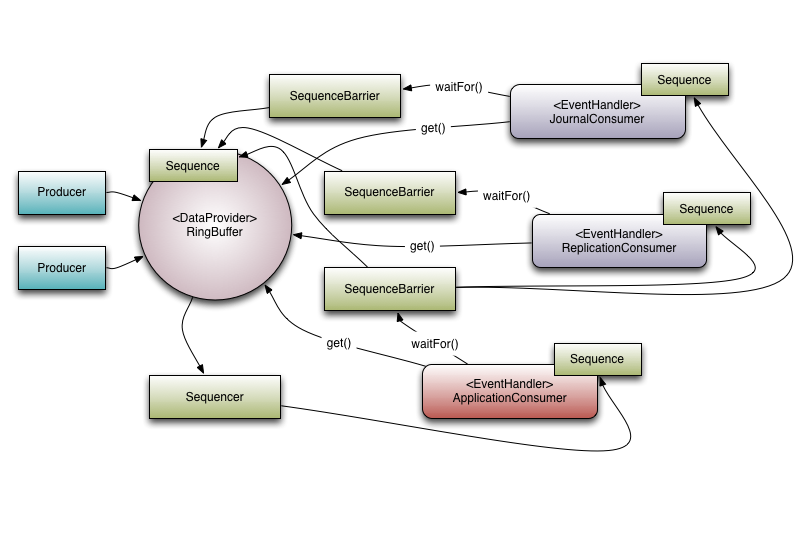

# LMAX Disruptor User Guide

LMAX Disruptor 是一个高性能线程间消息传递库。
Disruptor 是一个提供并发**环形缓冲区**数据结构的库。
旨在为异步事件处理体系结构提供低延迟、高吞吐量的工作队列。

## 核心概念 Core Concepts

Disruptor 工作原理相关术语（对于 DDD 倾向的人来说，可以视作 Disruptor 域中无处不在的语言）：

* **Ring Buffer**:

    环形缓冲区(Ring Buffer)通常被认为是中断器的主要方面。
    但是，从 3.0 开始，环形缓冲区仅负责**存储**和**更新**通过 Disruptor 移动的数据(事件(`Event`))。
    对于某些高级用例，它甚至可以由用户替换。

* **Sequence**:

    Disruptor 使用 `Sequence` 作为一种方法标识特定组件的位置。
    每个消费者(Event Processor)都会像 Disruptor 本身一样维护一个 `Sequence` 。
    大多数的并发代码依赖于 `Sequence` 的移动，因此 `Sequence` 支持 `AtomicLong` 的许多当前功能。
    事实上，两者之间唯一真正的区别是 `Sequence` 包含额外的功能，防止 `Sequence` 和其他值之间的错误共享。

* **Sequencer**:

    `Sequencer`(序列器)是 Disruptor 的**核心**。
    此接口的两个实现（单生产者、多生产者）了所有并发算法，以便在生产者和消费者之间快速、正确的传递数据。

* **Sequence Barrier**:

    `Sequencer` 生成一个 Sequence Barrier(序列屏障) ，其中包含对来自 `Sequencer` 的主要已发布 `Sequence` 和任何依赖消费者的 `Sequence` 的引用。
    它包含用来确定是否有任何事件可供消费者处理的逻辑。    

* **Wait Strategy**:

    等待策略确定用户将如何等待生产者将事件放入 Disruptor 。
    更多细节可以在可选无锁部分找到。

* **Event**:

    从生产者传递到消费者的数据单位。
    事件没有特定的代码表示形式，由用户定义。

* **Event Processor**:

    用来处理来自 Disruptor 事件的主事件循环，并拥有消费者的 `Sequence` 的所有权。
    有一个名为 `BatchEventProcessor` 的单一表示形式，它包含了事件循环的有效实现，并将回调到一个使用过的 `EventHandler` 接口的实现。

* **Event Handler**:

    由用户实现的接口，代表 Disruptor 的一个消费者

* **Producer**:

    这是调用 Disruptor 以将事件排队的用户代码。
    此概念在代码中没有体现。

下面是 LMAX 如何在其高性能核心服务中使用 Disruptor 的示例。


_Figure 1. Disruptor with a set of dependent consumers._

### 多播事件 Multicast Events

这是队列和 Disruptor 之间最大的行为差异。

当有多个消费者监听同一个 Disruptor 时，它将所有事件发布给所有消费者。
相比之下，队列只会向单个消费者发送的那个事件。
当需要对同一数据进行独立的多个并行操作时，可以使用 Disruptor 的这种行为。

> **示例用例**
> 
> _Figure 1_ 有三个监听操作的地方：
> 
> * journal(日志): 将数据写入持久日志文档
> * replication(复制): 将输入数据发送到另一台计算机
> * application(业务逻辑): 真正的处理工作
> 
> 这些消费者中的每一个会接收到 Disruptor 中所有的消息。
> 这使得这些消费者中的每一个人的工作都可以并行地进行。

### 消费者依赖图 Consumer Dependency Graph

为了支持并行处理行为的实现应用。
有必要支持消费者之间的协调。
我们把这个概念称为“**门控**”（或者正确地说，这个功能是**门控**之间的一种形式）。

> _Figure 1_ 中有必要阻止业务逻辑(application)消费者取得进展，直到日志(journal)和复制(replication)完成。

“**门控**”发生的两个位置：
* 确保生产者不会超支消费者

    通过将相关消费者添加到 Disruptor 来处理: `RingBuffer.addGatingConsumers()`
* 维护消费者之间的消费依赖关系

    通过构造一个 `SequenceBarrier` 来实现，其中包含来自必须首先完成其处理的组件的序列

> _Figure 1_ 有3个消费者侦听来自环形缓冲区的事件。
> application 依赖于 journal 和 replication 。

### 事件预分配 Event Pre-allocation

Disruptor 的目标之一是在低延迟环境中使用。
在低延迟系统中，有必要减少或删除内存分配。
在基于 Java 的系统中，目的是为了减少由于垃圾收集而造成的停顿。

为了支持这一点，用户能够预先分配 Disruptor 内事件所需的存储空间。
在构建期间由用户提供，并将为 Disruptor 环形缓冲区中的每个条目调用。
当向 Disruptor 发布新数据时， API 将允许用户获取构造的对象，以便它们可以调用该存储对象上的方法或更新字段。
Disruptor 保证这些操作只要正确的实现，就将是并发安全的。

### 可选无锁 Optionally Lock-free

对低延迟的渴望所推动的另一个关键实施细节是广泛使用无锁算法来实现 Disruptor 。
所有的内存可见性和正确性保证都是通过**内存屏障**和/或**compare-and-swap**(cas)操作实现的。

> 只有一个用例需要实际的锁，即： `BlockingWaitStrategy`
> 
> 这样做的目的仅仅是为了使用一个条件，以便在等待新的事件到来时可以释放一个消耗线程。
> 许多低延迟系统会使用忙等待，以避免使用条件可能产生的抖动；
> 然而，在许多系统中，忙等待操作会导致性能的显著下降，特别是在 CPU 资源受到严重限制的情况下，例如虚拟化环境中的网络服务器。

## 入门 Getting Started

依赖：
```xml
<dependency>
    <groupId>com.lmax</groupId>
    <artifactId>disruptor</artifactId>
    <version>4.0.0.RC1</version>
</dependency>
```

目前，生产者与消费者有几种使用风格，虽然本质上时相似的，但每种方法中可能存在细微差别。

### Single Value

* `Event`: `LongEvent`

```java
public class LongEvent {
    private long value;

    public void setValue(long value) {
        this.value = value;
    }

    @Override
    public String toString() {
        return "LongEvent{" + "value=" + value + '}';
    }
}
```

* `EventFactory`: `LongEventFactory`

    为了让 Disruptor 能够预分配事件对象，需要一个将执行该构造的方法。
	* `EventFactory` 接口实现类
    * 方法引用: `LongEvent::new`

```java
import com.lmax.disruptor.EventFactory;

public class LongEventFactory implements EventFactory<LongEvent> {
    @Override
    public LongEvent newInstance() {
        return new LongEvent();
    }
}
```

* `EventHandler`
```java
import com.lmax.disruptor.EventHandler;
import org.apache.logging.log4j.LogManager;
import org.apache.logging.log4j.Logger;
import org.hui.basic.event.LongEvent;

public class LongEventHandler implements EventHandler<LongEvent> {
    private static final Logger LOGGER = LogManager.getLogger(LongEventHandler.class);
    @Override
    public void onEvent(LongEvent event, long sequence, boolean endOfBatch) throws Exception {
        LOGGER.info("Event: " + event);
    }
}
```

* `publishEvent()`: Disruptor 3.0 开始首选使用 Lambda 风格AIP 来编写发布者
    * `EventTranslator`
    * `EventTranslatorOneArg`
    * `EventTranslatorTwoArg`
    * `EventTranslatorThreeArg`
    * `EventTranslatorVararg`

```jshelllanguage // example-1
ByteBuffer bb = ByteBuffer.allocate(8);
for(long l = 0; true; l++) {
    bb.putLong(0,l);
    ringBuffer.publishEvent((event, sequence, buffer) -> event.set(buffer.getLong(0)), bb);
    Thread.sleep(1000);
}
```

> **注意**
> 
> ```jshelllanguage // example-2
> ByteBuffer bb = ByteBuffer.allocate(8);
> for(long l = 0;true;l++) {
>     bb.putLong(0,l);
>     ringBuffer.publishEvent((event,sequence) -> event.set(bb.getLong(0)));
>     Thread.sleep(1000);
> }
> ```
> 
> 这将创建一个捕获的 Lambda ，意味着当它将 Lambad 传递给调用时，它需要实例化一个对象来保存变量。
> 这将创建额外的（不必要的）垃圾，因此如果需要低 GC 压力，则应首选将参数传递给 Lambda 调用。

* RingBufferSize: 大小必须是2的幂
* ProducerType
* WaitStrategy
