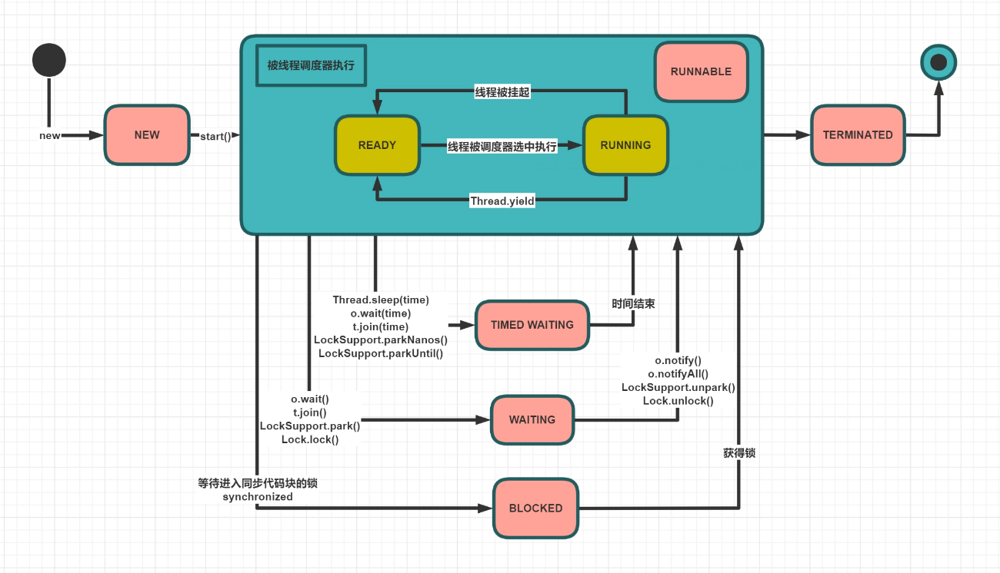

# 线程的状态

Java 的 6 种线程状态：

* `NEW`: 线程刚刚创建，未运行；
* `RUNNABLE`: 可运行状态；线程调度器可以安排执行i；
  * `READY`: 等待被调度执行；
  * `RUNNING`: 调度执行中；
* `WAITING`: 等待被唤醒；
* `TIMED WAITING`: 隔一段时间后自动唤醒；
* `BLOCKED`: 被阻塞，正在等待锁（经过系统调用，只有 `synchronized()`）；
* `TERMINATED`: 线程结束；

