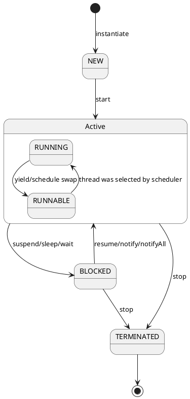

# JavaConcurrencyProgramming

## 线程(Thread)概念

线程(Thread)是操作系统进行运算调度的最小单位。
在每一个进程内部至少要有一个线程是在运行中，有时线程也称为轻量级的进程。

每个线程有自己独立的局部变量表、程序计数器，以及声明周期等。

## 生命周期

线程的生命周期大体可以分为如下 5 个主要阶段：

* `NEW`

  尚未启动的线程的线程状态。
  只是一个在内存中的 `Thread` 对象。

  通过 `start` 进入 `RUNNABLE` 状态

* `RUNNABLE`

  线程对象进入 `RUNNABLE` 状态必需调用 `start` 方法，在 JVM 进程中创建一个线程，把具备执行的资格等待被 CPU 调度的线程称为可执行状态(`RUNNABLE`)。

* `RUNNING`
* `BLOCKED`
* `TERMINATED`

一个正在 `RUNNING` 状态的线程事实上也是 `RUNNABLE` 的，但是反过来不成立。
