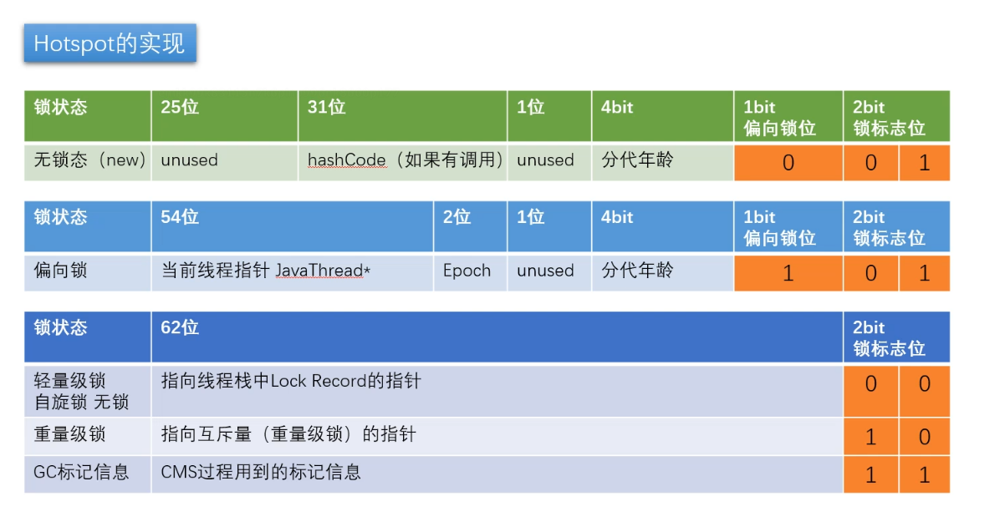
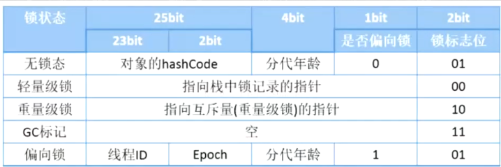
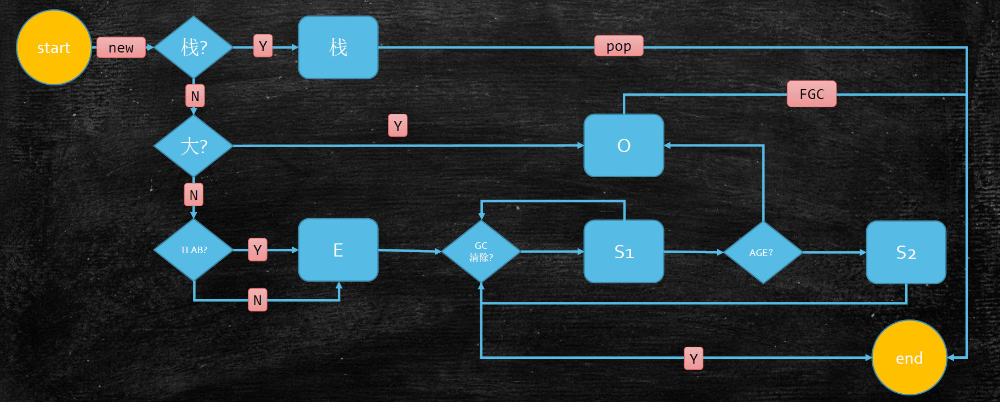

# JMM java memory model

## 硬件层的并发优化

### 总线锁

旧的 CPU 支持 **总线锁** (bus lock) 锁住内存总线，保证一致性；
使的其他 CPU 甚至不能访问内存中的其他的地址，因而效率低

### 缓存锁

缓存锁，通过**一致性协议**实现，保证 CPU 间缓存行的一致性；
一致性协议包括： `MSI` `MESI` `Synapse` `Firefly` `Dragon` 等；

一般以 MESI （Intel CPU）介绍；
CPU 为每个 cache line 标记四种状态（额外两位）：
`Modified`(修改) 、 `Exclusive`(独享) 、 `Shared`(共享) 、 `Invalid`(无效；当前CPU读取到的值已经被其他CPU修改) ：

对于**无法被缓存**的数据或者跨越**多个缓存行**的数据依然必须使用**总线锁**；

> 现代 CPU 的数据一致性硬件实现： **缓存锁** + **总线锁**；

> 缓存行 cache line
> 
> 主存与缓存行交换数据的最小单位，目前一般为 `64 Byte` ；

> **伪共享**
> 
> 位于同一个缓存行的两个数据，被不同的 CPU 锁定，产生互相影响的伪共享问题；
> 使用**缓存行的对齐**解决伪共享问题；

## 内存屏障指令

乱序执行（打乱指令顺序），提高效率；

> 读指令的同时可以同时执行不影响的其他指令，而写的同时可以进行**合并写**(WC Buffer 比 L1 速度还要快，只有 4 个位置);

CPU 提供内存屏障指令来保证有序性；

> Intel 内存屏障指令：
> 
> `sfence`: 写屏障，在 `sfence` 指令前的写操作当必须在 `sfence` 指令后的写操作前完成；
> `lfence`: 读屏障，在 `lfence` 指令前的读操作当必须在 `lfence` 指令后的读操作前完成；
> `mfence`: 读写屏障，在 `mfence` 指令前的读写操作当必须在 `mfence` 指令后的读写操作前完成；
> 
> `lock` 汇编指令，原子指令； 
> `lock ...` 指令是一个 Full Barrier 执行是会锁住内存子系统来确保执行顺序，甚至跨多个 CPU ；
> Software Locks 通常使用了内存屏障或原子指令来实现变量可见性和保持程序顺序；

## JVM 内存管理规范

### Jva 并发内存模型

Java线程有自己独立的**工作内存**；
`store` `load` 操作发生在主内存中； 


### JSR 内存屏障(JSR-133)：

* `LoadLoad`

    `Load1; LoadLoad; Load2;`

    在 `Load2` 及后续指令操作前，保证 `Load1` 读取指令执行完毕；

* `StoreStore`

    `Store1; StoreStore; Store2;`

    在 `Store2` 及后续指令完成前，保证 `Store1` 写入指令指向完毕；

* `LoadStore`

    `Load1; LoadStore; Store2;`

    在 `Store2` 及后续指令完成前，保证 `Load1` 读取指令执行完毕；

* `StoreLoad`

    `Store1; StoreLoad; Load2;`

    在 `Load2` 及后续指令完成前，保证 `Store1` 写入指令执行完毕；

> `volatile` 实现细节
> 
> * 字节码层面
> 
>     添加： `ACC_VOLATILE` 标记；
> 
> * JVM 层面
> 
>     `volatile` 内存区的读写都加屏障；
>     * `volatile` 写操作
>         `StoreStoreBarrier; volatile write operation; StoreLoadBarrier;`
>     * `volatile` 读操作
>         `LoadLoadBarrier; volatile read operation; LoadStoreBarrier;`
> * 硬件指令集层面
> 
>     使用 `hsdis`(hotspot dis assembler) 工具用于观察汇编指令；
> 
>     * Windows 环境下使用： `lock` 指令实现；

> `synchronized` 实现细节
>
> * 字节码层面
> 
>     `ACC_SYNCHRONIZED` 指令实现；
> 
>     `monitorenter` `montorexit`
> 
>     将同步块转变为： `monitorenter; synchronized operation; montorexit; catche exception; montorexit;`
> 
> * JVM 层面
> 
>     （平台相关）调用 C/C++ 实现的操作系统的同步机制；
> 
> * 硬件指令集层面
> 
>     通过 `lock` 指令实现；
>     
>     x86: `lock comxchg ...` 

### ~~Java 原子操作~~ 

> 最新的 JSR-133 已弃用

* `lock` 主内存，标识变量为线程独占
* `unlock` 主内存，解锁线程独占变量
* `read` 主内存，读取内存到工作内存
* `load` 工作内存， `read` 后的值放入线程本地变量副本
* `use` 工作内存，传值给执行引擎
* `assign` 工作内存，执行引擎结果赋值给线程本地变量
* `store` 工作内存，存值到主内存给 `write` 备用
* `write` 主内存，写变量值

### Happens-before Order

JVM 规定重排序必须遵守的原则：
* 程序次序规则：同一个线程内，按照代码出现的顺序，前面的代码先行于后面的代码，准确说是控制流顺序，以内要考虑到分支和循环结构；
* 管程锁定规则：一个 `unlock` 操作先行发生于后面（时间上）对同一个锁的 `lock` 操作；
* `volatile` 变量规则：对一个 `volatile` 变量的写操作先行发生于后面（时间上）对这个变量的读操作；
* 线程启动规则： `Thread` 的 `start()` 方法先行于当前线程的每一个操作；
* 线程终止规则：线程的所有操作都要先行于此线程的终止检测；可以通过 `Thread.join()` `Thread.isAlive()` 的返回值等手段检测线程的状态；
* 线程中断规则：对线程 `interrupt()` 方法的调用先行发生于被中断线程的代码检测到中断时间的发生，可以通过 `Thread.interrupt()` 方法检测线程是否中断；
* 对象终结规则：一个对象的初始化完成先行于发生它的 `finalize()` 方法的开始；
* 传递性：如果操作 `A` 先行于操作 `B` ，操作 `B` 先行于操作 `C` ，那么操作 `A` 先行于操作 `C`

> **as if serial**
> 
> 不管线程如何乱序执行，单线程执行结果不会改变；

### 对象的内存布局


> 1. 请解释一下对象的创建过程？
> 
>     * class loading
>     * class linking(verification, preparation, resolution)
>     * class initializing
>     * 分配对象内存
>     * 成员便令赋默认值
>     * 调用构造方法 `<init>`
>         * 成员变量顺序赋初始值
>         * 执行构造方法语句
> 
> 2. 对象在内存中的存储布局？
>
>     hotspot 中使用（C++实现） `oopDesc` 数据结构代表一个 Java 对象（最终大小要符合 `8 Byte` 对齐；
>
>     * **普通对象**由四部分构成： `markword` 标记字、 `class pointer` 类型指针（指向 `*.class` ，对象在内存中的类型Class对象地址）、 `instance data` 实例数据（包括**类型引用** `Oops` ）、 `padding` 对齐
>     * **数组对象**由五部分构成： `markword` 标记字、 `class pointer` 类型指针（指向 `*.class` ，数组类型在内存中类型Class对象地址）、 `length`(4Byte) 数组 长度、 `instance data` 实例数据、 `padding` 对齐
> 
>     > `class pointer`
>     >
>     > 虚拟机参数 `UseCompressedClassPointers`: 开启 `4 Byte` ，关闭 `8 Byte`
> 
>     > 类型引用
>     >
>     > 虚拟机参数 `UseCompressedOops`: 开启 `4 Byte` ，关闭 `8 Byte`
> 
>     > `Oops`
>     >
>     > Ordinary object pointers 普通对象指针
> 
> 3. 对象头具体包括什么？
>
>     对象头包括两部分： `markword` `class pointer`
>
>     ```text
>     java.lang.Object object internals:
>      OFFSET  SIZE   TYPE DESCRIPTION                               VALUE
>           0     4        (object header)                           01 00 00 00 (00000001 00000000 00000000 00000000) (1)
>           4     4        (object header)                           00 00 00 00 (00000000 00000000 00000000 00000000) (0)
>           8     4        (object header)                           e5 01 00 f8 (11100101 00000001 00000000 11111000) (-134217243)
>          12     4        (loss due to the next object alignment)
>     Instance size: 16 bytes
>     Space losses: 0 bytes internal + 4 bytes external = 4 bytes total
>     ```
>
>     * `markword`: `[0, 8)Byte`
>         
>         
>         
>         * 锁信息
>         * `hashCode` ： Identity Hashcode(是独一无二的 hashCode)
>             * 未重写：只有调用过对象的 `hashCode` (`System.identityHashCode()`) 后才会记录在此位置
>             * 重写过：不存放在 `markword` 中
>         * gc 信息
>     * `klass pointer` `[8, 12)Byte`
> 
> 4. 对象怎么定位？
>
>     * 直接指针 （hotspot 实现方式；优点：直接访问；缺点：GC需要移动对象的时候麻烦；）
>    
>         引用直接**指向实例化对象（堆）**，实例化对象包含**类型指针（方法区）**；
>    
>     * 句柄方式 （优点：对象体积小，垃圾回收时不用频繁改动引用本身；缺点：两次访问；）
>         
>         引用指向一个包含实例数据指针（指向堆空间实际对象）和类型指针（指向方法区）的结构体（堆）
> 
> 5. 对象怎么分配？
>
>     > 多个线程相同一块内存空间分配对象需要经历**同步sync**的过程；
>     > TLAB： 线程启动时在线程Edon中分配一块线程独占区域（空间比较小）；
>
>     * 首先尝试在**栈**上分配（栈帧弹出自动清理对象，不需要垃圾回收机制，效率极高）；
>         * 对象需要符合：逃逸分析
>         * 对象需要符合：标量替换
>     * 如果体积够大，分配在 Old 老年代（通过 `FGC` 实现对象回收）；
>     * 否则在 TLAB(Thread Local Allocation Buffer, 线程本地分配缓冲区) 中分配；
>     * 如果 TLAB 分配不下分配在 Edon 区（经过GC清理，如果回收释放内存，没有回收放入 S1 ，之后再经过GC清理年龄够了进入 Old 老年代，不够进入 S2，S2再经过GC清理）；
> 
>     
> 
> 6. `Object o = new Object()` 在内存中占用多少字节？
