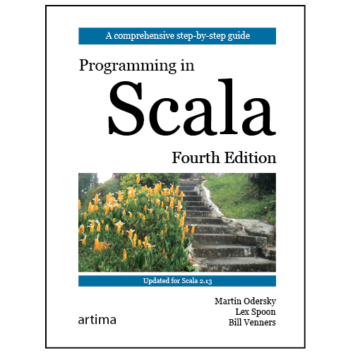

# [How to Write an Equality Method in Java](https://www.artima.com/articles/how-to-write-an-equality-method-in-java) _如何用 Java 编写相等方法_


> by Martin Odersky, Lex Spoon, and Bill Venners
> 
> June 1, 2009


> 作者：Martin Odersky、Lex Spoon 和 Bill Venners
> 
> 2009 年 6 月 1 日


> **Summary** _概括_
>
>
> This article describes a technique for overriding the `equals` method that preserves the contract of `equals` even when subclassses of concrete classes add new fields.
> 
> 
> 本文描述了一种覆盖 `equals` 方法的技术，该方法即使在具体类的子类添加新字段时也能保留 `equals` 的约定。


In Item 8 of [Effective Java](), Josh Bloch describes the difficulty of preserving the `equals` contract when subclassing as a “fundamental problem of equivalence relations in object-oriented languages.” Bloch writes:


在 [Effective Java]() 的第 8 条中，Josh Bloch 将子类化时保持 `equals` 契约的困难描述为“面向对象语言中等价关系的基本问题”。布洛赫写道：


_There is no way to extend an instantiable class and add a value component while preserving the `equals` contract, unless you are willing to forgo the benefits of object-oriented abstraction._


_除非您愿意放弃面向对象抽象的好处，否则无法在保留 `equals` 约定的同时扩展可实例化类并添加值组件。_


Chapter 28 of [Programming in Scala]() shows an approach that allows subclasses to extend an instantiable class, add a value component, and nevertheless preserve the `equals` contract. 
Although in the technique is described in the book in the context of defining Scala classes, it is also applicable to classes defined in Java. 
In this article, we present the technique using text adapted from the relevant section of Programming in Scala, but with the code examples translated from Scala into Java.


[Programming in Scala]() 的第 28 章展示了一种方法，它允许子类扩展一个可实例化的类，添加一个值组件，但仍然保留 `equals` 约定。
尽管该技术在本书中是在定义 Scala 类的上下文中描述的，但它也适用于在 Java 中定义的类。
在本文中，我们使用改编自 Scala 编程相关部分的文本来介绍该技术，但将代码示例从 Scala 翻译成 Java。


## Commmon equality pitfalls _常见的相等陷阱_


Class `java.lang.Object` defines an `equals` method, which subclasses may override. 
Unfortunately, it turns out that writing a correct equality method is surprisingly difficult in object-oriented languages. 
In fact, after studying a large body of Java code, the authors of a 2007 paper concluded that almost all implementations of `equals` methods are faulty.


类 `java.lang.Object` 定义了一个 `equals` 方法，子类可以覆盖该方法。
不幸的是，事实证明在面向对象的语言中编写正确的相等方法是非常困难的。
事实上，在研究了大量 Java 代码后，2007 年一篇论文的作者得出结论，几乎所有 `equals` 方法的实现都是错误的。


This is problematic, because **equality** is at the basis of many other things. 
For one, a faulty equality method for a type `C` might mean that you cannot reliably put an object of type `C` in a collection. 
You might have two elements `elem1`, `elem2` of type `C` that are equal, i.e., `elem1.equals(elem2)` yields `true`. 
Nevertheless, with commonly occurring faulty implementations of the `equals` method, you could still see behavior like the following:


这是有问题的，因为**相等**是许多其他事物的基础。
首先，类型 `C` 的错误相等方法可能意味着您不能可靠地将 `C` 类型的对象放入集合中。
你可能有两个类型为 `C` 的元素 `elem1` 和 `elem2` ，它们是相等的，即， `elem1.equals(elem2)` 产生 `true`。
尽管如此，对于 `equals` 方法的常见错误实现，您仍然可以看到如下行为：


```text
Set<C> hashSet = new java.util.HashSet<C>();
hashSet.add(elem1);
hashSet.contains(elem2);    // returns false!(but I get true)
```


Here are four common pitfalls3 that can cause inconsistent behavior when overriding `equals`:


以下是在覆盖 `equals` 时可能导致不一致行为的四个常见陷阱：


1. Defining `equals` with the wrong signature.
2. Changing `equals` without also changing `hashCode`.
3. Defining `equals` in terms of mutable fields.
4. Failing to define `equals` as an equivalence relation.


1. 用错误的签名定义 `equals` 。
2. 更改 `equals` 而不更改 `hashCode` 。
3. 根据可变字段定义`equals`。
4. 未能将 `equals` 定义为等价关系。


These four pitfalls are discussed in the remainder of this section.


这四个陷阱将在本节的其余部分讨论。


## Pitfall #1: Defining `equals` with the wrong signature. _陷阱 1：用错误的签名定义 `equals` 。_


Consider adding an equality method to the following class of simple `point`s:


考虑向以下类简单 `point` 添加一个相等方法：


```java
public class Point {

    private final int x;
    private final int y;

    public Point(int x, int y) {
        this.x = x;
        this.y = y;
    }

    public int getX() {
        return x;
    }

    public int getY() {
        return y;
    }

    // ...
}
```


A seemingly obvious, but wrong way would be to define it like this:


一个看似显而易见但错误的方法是这样定义它：


```text
// An utterly wrong definition of equals
public boolean equals(Point other) {
  return (this.getX() == other.getX() && this.getY() == other.getY());
}
```


What's wrong with this method? 
At first glance, it seems to work OK:


这种方法有什么问题？
乍一看，它似乎工作正常：


```text
Point p1 = new Point(1, 2);
Point p2 = new Point(1, 2);

Point q = new Point(2, 3);

System.out.println(p1.equals(p2)); // prints true

System.out.println(p1.equals(q)); // prints false
```


However, trouble starts once you start putting `point`s into a collection:


但是，一旦您开始将 `point` 放入集合中，麻烦就来了：


```text
import java.util.HashSet;

HashSet<Point> coll = new HashSet<Point>();
coll.add(p1);

System.out.println(coll.contains(p2)); // prints false
```


How can it be that `coll` does not contain `p2`, even though `p1` was added to it, and `p1` and `p2` are equal objects? 
The reason becomes clear in the following interaction, where the precise type of one of the compared `point`s is masked. 
Define `p2a` as an alias of `p2`, but with type `Object` instead of `Point`:


怎么可能 `coll` 不包含 `p2` ，即使添加了 `p1` ，并且 `p1` 和 `p2` 是相等的对象？
原因在以下交互中变得清晰，其中一个被比较的 `point` 的精确类型被屏蔽了。
将 `p2a` 定义为 `p2` 的别名，但使用类型 `Object` 而不是 `Point` ：


```text
Object p2a = p2;
```


Now, were you to repeat the first comparison, but with the alias `p2a` instead of `p2`, you would get:


现在，如果您重复第一次比较，但使用别名 `p2a` 而不是 `p2` ，你会得到：


```text
System.out.println(p1.equals(p2a)); // prints false
```


What went wrong? 
In fact, the version of `equals` given previously does not `override` the standard method `equals`, because its type is different. 
Here is the type of the `equals` method as it is defined in the root class `Object`:


什么地方出了错？
事实上，之前给出的 `equals` 版本并没有 `override` 标准方法 `equals` ，因为它的类型不同。
这里是根类 `Object` 中定义的 `equals` 方法的类型：


```text
public boolean equals(Object other)
```


Because the `equals` method in `Point` takes a `Point` instead of an `Object` as an argument, it does not override `equals` in `Object`. 
Instead, it is just an **overloaded** alternative. 
Overloading in Java is resolved by the static type of the argument, not the run-time type. 
So as long as the static type of the argument is `Point`, the `equals` method in `Point` is called. 
However, once the static argument is of type `Object`, the `equals` method in `Object` is called instead. 
This method has not been overridden, so it is still implemented by comparing object identity. 
That's why the comparison `p1.equals(p2a)` yields `false` even though `point`s `p1` and `p2a` have the same `x` and `y` values. 
That's also why the `contains` method in `HashSet` returned `false`. 
Since that method operates on generic sets, it calls the generic `equals` method in `Object` instead of the overloaded variant in `Point`.


因为 `Point` 中的 `equals` 方法以`Point` 而不是`Object` 作为参数，所以它不会覆盖`Object` 中的`equals`。
相反，它只是一个**重载**的替代方案。
Java 中的重载由参数的静态类型决定，而不是运行时类型。
所以只要参数的静态类型是 `Point` ，就会调用 `Point` 中的 `equals` 方法。
但是，一旦静态参数的类型为 `Object` ，则会调用 `Object` 中的 `equals` 方法。
这个方法没有被覆盖，所以还是通过比较对象标识来实现的。
这就是为什么比较 `p1.equals(p2a)` 会产生 `false` ，即使 `point` 的 `p1` 和 `p2a` 具有相同的 `x` 和 `y` 值。
这也是 `HashSet` 中的 `contains` 方法返回 `false` 的原因。
由于该方法对泛型集进行操作，因此它调用 `Object` 中的泛型 `equals` 方法，而不是 `Point`中的重载变体。


A better `equals` method is the following:


更好的 `equals` 方法如下：


```text
// A better definition, but still not perfect
@Override public boolean equals(Object other) {
    boolean result = false;
    if (other instanceof Point) {
        Point that = (Point) other;
        result = (this.getX() == that.getX() && this.getY() == that.getY());
    }
    return result;
}
```


Now `equals` has the correct type. 
It takes a value of type `Object` as parameter and it yields a `boolean` result. 
The implementation of this method uses `instanceof` and a cast. 
It first tests whether the other object is also of type `Point`. 
If it is, it compares the coordinates of the two `point`s and returns the result. 
Otherwise the result is `false`.


现在 `equals` 有正确的类型。
它采用 `Object` 类型的值作为参数，并产生 `boolean` 结果。
这个方法的实现使用了 `instanceof` 和一个强制转换。
它首先测试另一个对象是否也是 `Point` 类型。
如果是，则比较两个 `point` 的坐标并返回结果。
否则结果为 `false` 。


## Pitfall #2: Changing `equals` without also changing `hashCode` _陷阱 2：更改 `equals` 而不更改 `hashCode`_


If you repeat the comparison of `p1` and `p2a` with the latest definition of `Point` defined previously, you will get `true`, as expected. 
However, if you repeat the `HashSet.contains` test, you will probably still get `false`:


如果你重复比较 `p1` 和 `p2a` 与之前定义的 `Point` 的最新定义，你会得到 `true`，正如预期的那样。
然而，如果你重复 `HashSet.contains` 测试，你可能仍然会得到 `false` ：


```text
Point p1 = new Point(1, 2);
Point p2 = new Point(1, 2);

HashSet<Point> coll = new HashSet<Point>();
coll.add(p1);

System.out.println(coll.contains(p2)); // prints false (probably)
```


In fact, this outcome is not 100% certain. 
You might also get `true` from the experiment. 
If you do, you can try with some other `point`s with coordinates 1 and 2. 
Eventually, you'll get one which is not contained in the set. 
What goes wrong here is that `Point` redefined equals without also redefining `hashCode`.


事实上，这个结果并不是 100% 确定的。
你也可能从实验中得到 `true` 。
如果这样做，您可以尝试使用其他坐标为 1 和 2 的 `point` 。
最终，你会得到一个不包含在集合中的。
这里的错误在于，重新定义的 `Point` 等于没有重新定义 `hashCode` 。


Note that the collection in the example above is a `HashSet`. 
This means elements of the collection are put in “hash buckets” determined by their hash code. 
The contains test first determines a hash bucket to look in and then compares the given elements with all elements in that bucket. 
Now, the last version of class `Point` did redefine `equals`, but it did not at the same time redefine `hashCode`. 
So `hashCode` is still what it was in its version in class `Object`: some transformation of the address of the allocated object. 
The hash codes of `p1` and `p2` are almost certainly different, even though the fields of both `point`s are the same. 
Different hash codes mean with high probability different hash buckets in the set. 
The `contains` test will look for a matching element in the bucket which corresponds to `p2`'s hash code. 
In most cases, `point` `p1` will be in another bucket, so it will never be found. 
`p1` and `p2` might also end up by chance in the same hash bucket. 
In that case the test would return `true`.


请注意，上面示例中的集合是一个 `HashSet` 。
这意味着集合的元素被放在由它们的哈希码确定的“哈希桶”中。
contains 测试首先确定要查找的哈希桶，然后将给定元素与该桶中的所有元素进行比较。
现在，类 `Point` 的最后一个版本确实重新定义了 `equals` ，但它没有同时重新定义 `hashCode` 。
所以 `hashCode` 仍然是它在类 `Object` 中的版本：分配对象的地址的一些转换。
`p1` 和 `p2` 的哈希码几乎肯定是不同的，即使这两个 `point` 的字段是相同的。
不同的哈希码意味着集合中很有可能有不同的哈希桶。
`contains` 测试将在桶中寻找与 `p2` 的哈希码对应的匹配元素。
在大多数情况下， `point` `p1` 将在另一个桶中，因此永远不会被找到。
`p1` 和 `p2` 也可能偶然出现在同一个哈希桶中。
在这种情况下，测试将返回 `true` 。


> `p1` 与 `p2` 出现 Hash 碰撞的时候，进入同一个哈希桶中。


The problem was that the last implementation of `Point` violated the contract on `hashCode` as defined for class `Object`:


问题是 `Point` 的最后一个实现违反了为 `Object` 类定义的 `hashCode` 契约：


_If two objects are equal according to the `equals(Object)` method, then calling the `hashCode` method on each of the two objects must produce the same integer result._


_如果两个对象根据 `equals(Object)` 方法相等，则对这两个对象中的每一个调用 `hashCode` 方法必须产生相同的整数结果。_


In fact, it's well known in Java that `hashCode` and `equals` should always be redefined together. 
Furthermore, `hashCode` may only depend on fields that `equals` depends on. 
For the `Point` class, the following would be a suitable definition of `hashCode`:


事实上，在 Java 中众所周知， `hashCode` 和 `equals` 应该总是一起重新定义。
此外， `hashCode` 可能只依赖于 `equals` 所依赖的字段。
对于 `Point` 类，以下是 `hashCode` 的合适定义：


```java
public class Point {

    private final int x;
    private final int y;

    public Point(int x, int y) {
        this.x = x;
        this.y = y;
    }

    public int getX() {
        return x;
    }

    public int getY() {
        return y;
    }

    @Override public boolean equals(Object other) {
        boolean result = false;
        if (other instanceof Point) {
            Point that = (Point) other;
            result = (this.getX() == that.getX() && this.getY() == that.getY());
        }
        return result;
    }

    @Override public int hashCode() {
        return (41 * (41 + getX()) + getY());
    }
}
```


This is just one of many possible implementations of `hashCode`. 
Adding the constant `41` to one integer field `x`, multiplying the result with the prime number 41, and adding to that result the other integer field `y` gives a reasonable distribution of hash codes at a low cost in running time and code size.


这只是 `hashCode` 的众多可能实现之一。
将常数 `41` 添加到一个整数字段 `x`，将结果与素数 41 相乘，然后将另一个整数字段 `y` 添加到该结果中，以较低的运行时间和代码大小提供合理的哈希码分布.


Adding `hashCode` fixes the problems of equality when defining classes like `Point`. 
However, there are still other trouble spots to watch out for.


添加 `hashCode` 解决了在定义像 `Point` 这样的类时相等的问题。
但是，还有其他问题需要注意。


## Pitfall #3: Defining equals in terms of mutable fields _陷阱 3：根据可变字段定义 equals_


Consider the following slight variation of class `Point`:


考虑类 `Point` 的以下轻微变化：


```java
public class Point { 

    private int x;
    private int y;

    public Point(int x, int y) {
        this.x = x;
        this.y = y;
    }

    public int getX() {
        return x;
    }

    public int getY() {
        return y;
    }

    public void setX(int x) { // Problematic
        this.x = x;
    }

    public void setY(int y) {
        this.y = y;
    }

    @Override public boolean equals(Object other) {
        boolean result = false;
        if (other instanceof Point) {
            Point that = (Point) other;
            result = (this.getX() == that.getX() && this.getY() == that.getY());
        }
        return result;
    }

    @Override public int hashCode() {
        return (41 * (41 + getX()) + getY());
    }
}
```


The only difference is that the fields `x` and `y` are no longer `final`, and two `set` methods have been added that allow clients to change the `x` and `y` values. 
The `equals` and `hashCode` methods are now defined in terms of these mutable fields, so their results change when the fields change. 
This can have strange effects once you put `point`s in collections:


唯一的区别是字段`x` 和`y` 不再是`final`，并且添加了两个`set` 方法，允许客户端更改`x` 和`y` 值。
`equals` 和 `hashCode` 方法现在是根据这些可变字段定义的，因此它们的结果会随着字段的变化而变化。
一旦将 `point` 放入集合中，这可能会产生奇怪的效果：


```text
Point p = new Point(1, 2);

HashSet<Point> coll = new HashSet<Point>();
coll.add(p);

System.out.println(coll.contains(p)); // prints true
```


Now, if you change a field in `point` `p`, does the collection still contain the `point`? 
We'll try it:


现在，如果您更改 `point` `p` 中的一个字段，该集合是否仍然包含该 `point` ？
我们来试试：


```text
p.setX(p.getX() + 1);

System.out.println(coll.contains(p)); // prints false (probably)
```


This looks strange. 
Where did `p` go? 
More strangeness results if you check whether the iterator of the set contains `p`:


这看起来很奇怪。
`p` 去哪儿了？
如果检查集合的迭代器是否包含 `p`，则会产生更多奇怪的结果：


```text
Iterator<Point> it = coll.iterator();
boolean containedP = false;
while (it.hasNext()) {
    Point nextP = it.next();
    if (nextP.equals(p)) {
        containedP = true;
        break;
    }
}

System.out.println(containedP); // prints true
```


So here's a set that does not contain `p`, yet `p` is among the elements of the set! 
What happened, of course, is that after the change to the `x` field, the point `p` ended up in the wrong hash bucket of the set `coll`. 
That is, its original hash bucket no longer corresponded to the new value of its hash code. 
In a manner of speaking, the `point` `p` “dropped out of sight” in the set `coll` even though it still belonged to its elements.


所以这里有一个不包含 `p` 的集合，但是 `p` 是集合的元素之一！
当然，发生的事情是在更改了 `x` 字段之后，点 `p` 最终出现在集合 `coll` 的错误哈希桶中。
也就是说，它的原始哈希桶不再对应于它的哈希码的新值。
从某种意义上说， `point` `p` 在集合 `coll` 中“消失了”，即使它仍然属于它的元素。


The lesson to be drawn from this example is that when `equals` and `hashCode` depend on mutable state, it may cause problems for users. 
If they put such objects into collections, they have to be careful never to modify the depended-on state, and this is tricky. 
If you need a comparison that takes the current state of an object into account, you should usually name it something else, not `equals`. 
Considering the last definition of `Point`, it would have been preferable to omit a redefinition of `hashCode` and to name the comparison method `equalContents`, or some other name different from `equals`. 
`Point` would then have inherited the default implementation of `equals` and `hashCode`. 
So `p` would have stayed locatable in `coll` even after the modification to its `x` field.


从这个例子中得到的教训是，当 `equals` 和 `hashCode` 依赖于可变状态时，可能会给用户带来问题。
如果他们将这些对象放入集合中，他们必须小心永远不要修改依赖状态，这很棘手。
如果您需要一个考虑对象当前状态的比较，您通常应该**将其命名为其他名称**，而不是 `equals` 。
考虑到 `Point` 的最后定义，最好省略对 `hashCode` 的重新定义，并将比较方法命名为 `equalContents` ，或与 `equals` 不同的其他名称。
`Point` 将继承 `equals` 和 `hashCode` 的默认实现。
所以即使在修改了它的 `x` 字段之后， `p` 也会在 `coll` 中保持可定位。


## Pitfall #4: Failing to define `equals` as an equivalence relation _陷阱 4：未能将 `equals` 定义为等价关系_


The contract of the `equals` method in `Object` specifies that `equals` must implement an equivalence relation on non-null objects:


`Object` 中 `equals` 方法的契约规定 `equals` 必须在非空对象上实现等价关系：


* It is reflexive: for any non-null value `x`, the expression `x.equals(x)` should return `true`.
* It is symmetric: for any non-null values `x` and `y`, `x.equals(y)` should return `true` if and only if `y.equals(x)` returns `true`.
* It is transitive: for any non-null values `x`, `y`, and `z`, if `x.equals(y)` returns `true` and `y.equals(z)` returns `true`, then `x.equals(z)` should return `true`.
* It is consistent: for any non-null values `x` and `y`, multiple invocations of `x.equals(y)` should consistently return `true` or consistently return `false`, provided no information used in `equals` comparisons on the objects is modified.
* For any non-null value `x`, `x.equals(null)` should return `false`.


* 它是自反的：对于任何非空值 `x` ，表达式 `x.equals(x)` 应该返回 `true` 。
* 它是对称的：对于任何非空值 `x` 和 `y` ，当且仅当 `y.equals(x)` 返回 `true` 时， `x.equals(y)` 应该返回 `true` 。
* 它是可传递的：对于任何非空值 `x` 、`y` 和 `z` ，如果 `x.equals(y)` 返回 `true` 并且 `y.equals(z)` 返回 `true`，那么 `x.equals(z)` 应该返回 `true` 。
* 它是一致的：对于任何非空值 `x` 和 `y` ， `x.equals(y)` 的多次调用应该一致地返回 `true` 或一致地返回 `false` ，前提是 `equals` 中没有使用任何信息对象上的比较被修改。
* 对于任何非空值 `x` ， `x.equals(null)` 应该返回 `false` 。


The definition of `equals` developed so far for class `Point` satisfies the contract for `equals`. 
However, things become more complicated once **subclasses** are considered. 
Say there is a subclass `ColoredPoint` of `Point` that adds a field `color` of type `Color`. 
Assume `Color` is defined as an `enum`:


迄今为止为类 `Point` 开发的 `equals` 的定义满足 `equals` 的约定。
然而，一旦考虑**子类**，事情就会变得更加复杂。
假设有一个 `Point` 的子类 `ColoredPoint` ，它添加了一个 `Color` 类型的字段 `color` 。
假设 `Color` 被定义为 `enum` ：


```java
public enum Color {
    RED, ORANGE, YELLOW, GREEN, BLUE, INDIGO, VIOLET;
}
```


`ColoredPoint` overrides `equals` to take the new `color` field into account:


`ColoredPoint` 覆盖 `equals` 以考虑新的 `color` 字段：


```java
public class ColoredPoint extends Point { // Problem: equals not symmetric

    private final Color color;

    public ColoredPoint(int x, int y, Color color) {
        super(x, y);
        this.color = color;
    }

    @Override public boolean equals(Object other) {
        boolean result = false;
        if (other instanceof ColoredPoint) {
            ColoredPoint that = (ColoredPoint) other;
            result = (this.color.equals(that.color) && super.equals(that));
        }
        return result;
    }
}
```


This is what many programmers would likely write. 
Note that in this case, class `ColoredPoint` need not override `hashCode`. 
Because the new definition of `equals` on `ColoredPoint` is stricter than the overridden definition in `Point` (meaning it equates fewer pairs of objects), the contract for `hashCode` stays valid. 
If two colored points are equal, they must have the same coordinates, so their hash codes are guaranteed to be equal as well.


这是许多程序员可能会写的内容。
请注意，在这种情况下，类 `ColoredPoint` 不需要覆盖 `hashCode` 。
因为 `ColoredPoint` 上 `equals` 的新定义比 `Point` 中覆盖的定义更严格（意味着它等同于更少的对象对）， `hashCode` 的契约保持有效。
如果两个颜色点相等，则它们必须具有相同的坐标，因此它们的哈希码也保证相等。


Taking the class `ColoredPoint` by itself, its definition of `equals` looks OK. 
However, the contract for `equals` is broken once `point`s and colored `point`s are mixed. 
Consider:


单独使用类 `ColoredPoint` ，它对 `equals` 的定义看起来没问题。
但是，一旦 `point` 和彩色 `point` 混合在一起， `equals` 的合同就会被破坏。
考虑：


```text
Point p = new Point(1, 2);

ColoredPoint cp = new ColoredPoint(1, 2, Color.RED);

System.out.println(p.equals(cp)); // prints true

System.out.println(cp.equals(p)); // prints false
```


The comparison “`p` equals `cp`” invokes `p`'s `equals` method, which is defined in class `Point`. 
This method only takes into account the coordinates of the two `point`s. 
Consequently, the comparison yields `true`. 
On the other hand, the comparison “`cp` equals `p`” invokes `cp`'s `equals` method, which is defined in class `ColoredPoint`. 
This method returns `false`, because `p` is not a `ColoredPoint`. 
So the relation defined by `equals` is not symmetric.


比较“ `p` 等于 `cp` ”调用 `p` 的 `equals` 方法，该方法在 `Point` 类中定义。
这个方法只考虑了两个 `point` 的坐标。
因此，比较产生 `true` 。
另一方面，比较“ `cp` 等于 `p` ”调用 `cp` 的 `equals` 方法，该方法定义在 `ColoredPoint` 类中。
此方法返回 `false` ，因为 `p` 不是 `ColoredPoint`。
所以 `equals` 定义的关系不是对称的。


The loss in symmetry can have unexpected consequences for collections. 
Here's an example:


对称性的丧失会对集合产生意想不到的后果。
下面是一个例子：


```text
Set<Point> hashSet1 = new java.util.HashSet<Point>();
hashSet1.add(p);
System.out.println(hashSet1.contains(cp));    // prints false

Set<Point> hashSet2 = new java.util.HashSet<Point>();
hashSet2.add(cp);
System.out.println(hashSet2.contains(p));    // prints true
```


So even though `p` and `cp` are equal, one contains test succeeds whereas the other one fails.


因此，即使 `p` 和 `cp` 相等，一个包含测试成功而另一个失败。


How can you change the definition of `equals` so that it becomes symmetric? 
Essentially there are two ways. 
You can either make the relation **more general** or **more strict**. 
Making it more general means that a pair of two objects, `a` and `b`, is taken to be `equal` if either comparing `a` with `b` or comparing `b` with `a` yields `true`. 
Here's code that does this:


你怎么能改变 `equals` 的定义，使它变得对称？
本质上有两种方式。
您可以使关系**更一般**或**更严格**。
使其更通用意味着如果将 `a` 与 `b` 进行比较或将 `b` 与 `a` 进行比较产生 `true` ，则将 `a` 和 `b` 这对两个对象视为 `equal` .
这是执行此操作的代码：


```java
public class ColoredPoint extends Point { // Problem: equals not transitive

    private final Color color;

    public ColoredPoint(int x, int y, Color color) {
        super(x, y);
        this.color = color;
    }

    @Override public boolean equals(Object other) {
        boolean result = false;
        if (other instanceof ColoredPoint) {
            ColoredPoint that = (ColoredPoint) other;
            result = (this.color.equals(that.color) && super.equals(that));
        }
        else if (other instanceof Point) {
            Point that = (Point) other;
            result = that.equals(this);
        }
        return result;
    }
}
```


The new definition of `equals` in `ColoredPoint` checks one more case than the old one: 
If the other object is a `Point` but not a `ColoredPoint`, the method forwards to the `equals` method of `Point`. 
This has the desired effect of making equals symmetric. 
Now, both “`cp.equals(p)`” and “`p.equals(cp)`” result in `true`. 
However, the contract for `equals` is still broken. 
Now the problem is that the new relation is no longer transitive! 
Here's a sequence of statements that demonstrates this. 
Define a `point` and two colored `point`s of different colors, all at the same position:


The new definition of `equals` in `ColoredPoint` checks one more case than the old one: 
If the other object is a `Point` but not a `ColoredPoint`, the method forwards to the `equals` method of `Point`. 
This has the desired effect of making equals symmetric. 
Now, both “`cp.equals(p)`” and “`p.equals(cp)`” result in `true`. 
However, the contract for `equals` is still broken. 
Now the problem is that the new relation is no longer transitive! 
Here's a sequence of statements that demonstrates this. 
Define a `point` and two colored `point`s of different colors, all at the same position:


```text
ColoredPoint redP = new ColoredPoint(1, 2, Color.RED);
ColoredPoint blueP = new ColoredPoint(1, 2, Color.BLUE);
```


Taken individually, redp is equal to `p` and `p` is `equal` to bluep:


Taken individually, redp is equal to `p` and `p` is `equal` to bluep:


```text
System.out.println(redP.equals(p)); // prints true

System.out.println(p.equals(blueP)); // prints true
```


However, comparing `redP` and `blueP` yields `false`:


However, comparing `redP` and `blueP` yields `false`:


```text
System.out.println(redP.equals(blueP)); // prints false
```


Hence, the transitivity clause of `equals`'s contract is violated.


Hence, the transitivity clause of `equals`'s contract is violated.


Making the `equals` relation more general seems to lead to a dead end. 
We'll try to make it stricter instead. 
One way to make `equals` stricter is to always treat objects of different classes as different. 
That could be achieved by modifying the `equals` methods in classes `Point` and `ColoredPoint`. 
In class `Point`, you could add an extra comparison that checks whether the run-time class of the other `Point` is exactly the same as this `Point`'s class, as follows:


Making the `equals` relation more general seems to lead to a dead end. 
We'll try to make it stricter instead. 
One way to make `equals` stricter is to always treat objects of different classes as different. 
That could be achieved by modifying the `equals` methods in classes `Point` and `ColoredPoint`. 
In class `Point`, you could add an extra comparison that checks whether the run-time class of the other `Point` is exactly the same as this `Point`'s class, as follows:


```java
// A technically valid, but unsatisfying, equals method
public class Point {

    private final int x;
    private final int y;

    public Point(int x, int y) {
        this.x = x;
        this.y = y;
    }

    public int getX() {
        return x;
    }

    public int getY() {
        return y;
    }

    @Override public boolean equals(Object other) {
        boolean result = false;
        if (other instanceof Point) {
            Point that = (Point) other;
            result = (this.getX() == that.getX() && this.getY() == that.getY()
                    && this.getClass().equals(that.getClass()));
        }
        return result;
    }

    @Override public int hashCode() {
        return (41 * (41 + getX()) + getY());
    }
}
```


You can then revert class `ColoredPoint`'s implementation back to the version that previously had violated the symmetry requirement:


You can then revert class `ColoredPoint`'s implementation back to the version that previously had violated the symmetry requirement:


```java
public class ColoredPoint extends Point { // No longer violates symmetry requirement

    private final Color color;

    public ColoredPoint(int x, int y, Color color) {
        super(x, y);
        this.color = color;
    }

    @Override public boolean equals(Object other) {
        boolean result = false;
        if (other instanceof ColoredPoint) {
            ColoredPoint that = (ColoredPoint) other;
            result = (this.color.equals(that.color) && super.equals(that));
        }
        return result;
    }
}
```


Here, an instance of class `Point` is considered to be equal to some other instance of the same class only if the objects have the same coordinates and they have the same run-time class, meaning `.getClass()` on either object returns the same value. 
The new definitions satisfy symmetry and transitivity because now every comparison between objects of different classes yields `false`. 
So a colored point can never be equal to a point. 
This convention looks reasonable, but one could argue that the new definition is too strict.


Consider the following slightly roundabout way to define a point at coordinates (1, 2):


```text
Point pAnon = new Point(1, 1) {
    @Override public int getY() {
        return 2;
    }
};
```


Is `pAnon` equal to `p`? The answer is no because the `java.lang.Class` objects associated with `p` and `pAnon` are different. 
For `p` it is `Point`, whereas for `pAnon` it is an anonymous subclass of `Point`. 
But clearly, `pAnon` is just another point at coordinates (1, 2). It does not seem reasonable to treat it as being different from p.


## The `canEqual` method

So it seems we are stuck. 
Is there a sane way to redefine equality on several levels of the class hierarchy while keeping its contract? 
In fact, there is such a way, but it requires one more method to redefine together with equals and hashCode. 
The idea is that as soon as a class redefines equals (and hashCode), it should also explicitly state that objects of this class are never equal to objects of some superclass that implement a different equality method. 
This is achieved by adding a method canEqual to every class that redefines equals. Here's the method's signature:

```text
public boolean canEqual(Object other)
```

The method should return `true` if the `other` object is an instance of the class in which `canEqual` is (re)defined, `false` otherwise. 
It is called from `equals` to make sure that the objects are comparable both ways. 
Here is a new (and final) implementation of class `Point` along these lines:

```java
public class Point {

    private final int x;
    private final int y;

    public Point(int x, int y) {
        this.x = x;
        this.y = y;
    }

    public int getX() {
        return x;
    }

    public int getY() {
        return y;
    }

    @Override public boolean equals(Object other) {
        boolean result = false;
        if (other instanceof Point) {
            Point that = (Point) other;
            result = (that.canEqual(this) && this.getX() == that.getX() && this.getY() == that.getY());
        }
        return result;
    }

    @Override public int hashCode() {
        return (41 * (41 + getX()) + getY());
    }

    public boolean canEqual(Object other) {
        return (other instanceof Point);
    }
}
```

The `equals` method in this version of class `Point` contains the additional requirement that the other object can equal this one, as determined by the `canEqual` method. 
The implementation of `canEqual` in `Point` states that all instances of `Point` can be equal.

Here's the corresponding implementation of `ColoredPoint`:

```java
public class ColoredPoint extends Point { // No longer violates symmetry requirement

    private final Color color;

    public ColoredPoint(int x, int y, Color color) {
        super(x, y);
        this.color = color;
    }

    @Override public boolean equals(Object other) {
        boolean result = false;
        if (other instanceof ColoredPoint) {
            ColoredPoint that = (ColoredPoint) other;
            result = (that.canEqual(this) && this.color.equals(that.color) && super.equals(that));
        }
        return result;
    }

    @Override public int hashCode() {
        return (41 * super.hashCode() + color.hashCode());
    }

    @Override public boolean canEqual(Object other) {
        return (other instanceof ColoredPoint);
    }
}
```

It can be shown that the new definition of Point and `ColoredPoint` keeps the contract of equals. 
Equality is symmetric and transitive. 
Comparing a `Point` to a `ColoredPoint` always yields `false`. 
Indeed, for any point p and colored point cp, “p.equals(cp)” will return false because “cp.canEqual(p)” will return false. 
The reverse comparison, “`cp.equals(p)`”, will also return false, because p is not a `ColoredPoint`, so the first instanceof check in the body of equals in `ColoredPoint` will fail.

On the other hand, instances of different subclasses of `Point` can be equal, as long as none of the classes redefines the equality method. 
For instance, with the new class definitions, the comparison of p and `pAnon` would yield `true`. 
Here are some examples:

```text
Point p = new Point(1, 2);

ColoredPoint cp = new ColoredPoint(1, 2, Color.INDIGO);

Point pAnon = new Point(1, 1) {
    @Override public int getY() {
        return 2;
    }
};

Set<Point> coll = new java.util.HashSet<Point>();
coll.add(p);

System.out.println(coll.contains(p)); // prints true

System.out.println(coll.contains(cp)); // prints false

System.out.println(coll.contains(pAnon)); // prints true
```

These examples demonstrate that if a superclass equals implementation defines and calls canEqual, then programmers who implement subclasses can decide whether or not their subclasses may be equal to instances of the superclass. 
Because ColoredPoint overrides canEqual, for example, a colored point may never be equal to a plain-old point. 
But because the anonymous subclass referenced from `pAnon` does not override `canEqual`, its instance can be `equal` to a `Point` instance.

One potential criticism of the `canEqual` approach is that it violates the Liskov Substitution Principle (LSP). 
For example, the technique of implementing equals by comparing run-time classes, which led to the inability to define a subclass whose instances can equal instances of the superclass, has been described as a violation of the LSP.5 
The reasoning is that the LSP states you should be able to use (substitute) a subclass instance where a superclass instance is required. 
In the previous example, however, “coll.contains(cp)” returned false even though cp's x and y values matched those of the point in the collection. 
Thus it may seem like a violation of the LSP, because you can't use a ColoredPoint here where a Point is expected. 
We believe this is the wrong interpretation, though, because the LSP doesn't require that a subclass behaves identically to its superclass, just that it behaves in a way that fulfills the contract of its superclass.

The problem with writing an `equals` method that compares run-time classes is not that it violates the LSP, but that it doesn't give you a way to create a subclass whose instances can equal superclass instances. 
For example, had we used the run-time class technique in the previous example, “coll.contains(pAnon)” would have returned false, and that's not what we wanted. 
By contrast, we really did want “coll.contains(cp)” to return false, because by overriding equals in `ColoredPoint`, we were basically saying that an indigo-colored point at coordinates (1, 2) is not the same thing as an uncolored point at (1, 2). 
Thus, in the previous example we were able to pass two different `Point` subclass instances to the collection's contains method, and we got back two different answers, both correct.

## End Notes

1. Bloch, Joshua. Effective Java Second Edition. Addison-Wesley, 2008.

2. Vaziri, Mandana, Frank Tip, Stephen Fink, and Julian Dolby. “Declarative Object Identity Using Relation Types.&rdquo In Proc. ECOOP 2007, pages 54–78. 2007.

3. All but the third of these pitfalls are described in the book, Effective Java Second Edition, by Joshua Bloch.
   Bloch, Joshua. Effective Java Second Edition. Addison-Wesley, 2008.

4. Given the new implementation of equals in Point, this version of ColoredPoint no longer violates the symmetry requirement.

5. Bloch, Joshua. Effective Java Second Edition. Addison-Wesley, 2008. page 39.

## Resources



This article is adapted from a section of chapter 28 of the book Programming in Scala:
[http://www.artima.com/shop/programming_in_scala](http://www.artima.com/shop/programming_in_scala)

### Talk back!

Have an opinion? Readers have already posted [47 comments]() about this article. Why not [add yours]()?

### About the authors

**Bill Venners** is president of Artima, Inc., publisher of the Artima Developer website (www.artima.com). 
He is author of the book, Inside the Java Virtual Machine, a programmer-oriented survey of the Java platform's architecture and internals. 
His popular columns in JavaWorld magazine covered Java internals, object-oriented design, and Jini. 
Active in the Jini Community since its inception, Bill led the Jini Community's ServiceUI project, whose ServiceUI API became the de facto standard way to associate user interfaces to Jini services. 
Bill is also the lead developer and designer of ScalaTest, an open source testing tool for Scala and Java developers.

**Lex Spoon** is a software engineer at Google, Inc. 
He worked on Scala for two years as a post-doc at EPFL. 
He has a Ph.D. in computer science from Georgia Tech, where he worked on static analysis of dynamic languages. 
In addition to Scala, he has worked on a wide variety of programming languages, ranging from the dynamic language Smalltalk to the scientific language X10. 
He and his wife currently live in Atlanta with two cats, a chihuahua, and a turtle.

Martin Odersky is the creator of the Scala language. 
As a professor at EPFL in Lausanne, Switzerland he is working on programming languages, more specifically languages for object-oriented and functional programming. 
His research thesis is that the two paradigms are two sides of the same coin, to be identified as much as possible. 
To prove this, he has experimented with a number of language designs, from Pizza to GJ to Functional Nets. He has also influenced the development of Java as a co-designer of Java generics and as the original author of the current javac reference compiler. 
Since 2001 he has concentrated on designing, implementing, and refining the Scala programming language.
