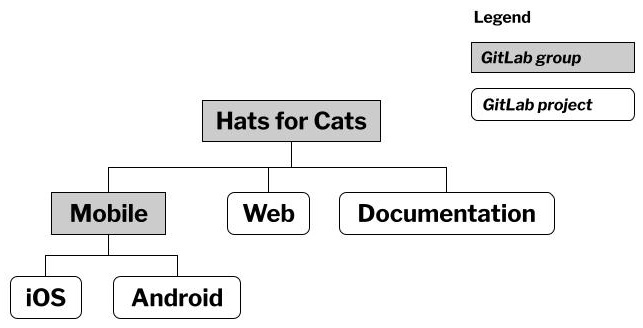

= GitLab 组件

GitLab 包含三个产品级别：

* 免费版——开源免费供所有人使用，具有优先的功能集
* 高级版——在免费版基础上添加了一些额外功能
* 旗舰版——包含 GitLab 的所有功能集

GitLab 是 GitLab 公司开发的一个 Web 应用程序；是工具、数据库、队列和将它们组合在一起的粘合代码的复杂集合。

== 软件开发生命周期__阶段__

GitLab 将软件开发生命周期识别为 10 个阶段：

. **Manage**(管理)：创建审核和合规报告，并限制对资源的访问；
. **Plan**(计划)：将工作划分为可行的块，可以确定每个块的优先级、权重并分配给团队成员；
. **Create**(创建)：提交、审查和批准文件编辑（代码、配置信息或其他资产）；
. **Verify**(验证)：运行**自动化测试**确保软件执行其应有的功能；
. **Package**(打包)：将软件打包成可部署格式；
. **Secure**(安全)：查找软件或其依赖项中的任何安全漏洞；
. **Release**(发布)：部署软件，可以选择使用复杂的技术（例如：功能标记、金丝雀发布等）；
. **Configure**(配置)：设置部署环境；
. **Monitor**(监控)：报告性能指标、事件或错误；
. **Protect**(保护)：检测 Kubernetes 集群等部署环境中的潜在安全问题

[TIP]
--
**验证、安全和发布阶段：**

GitLab 用来解决**验证**、**安全**和**发布**阶段的问题的功能是 *CI/CD 管道*。
--

== GitLab 项目(project)和组(group)

**项目**是 GitLab 的基本构建块。
GitLab 项目代表正在处理的**单个软件产品**或**单个非软件项目**。
项目是存储文档的地方，是浏览 GitLab 不同功能的起点。

可以使用项目来计划、管理和跟踪**任何类型的工作**的进度。

GitLab 使用组(group)来收集管理相关项目，以便它们存在于 GitLab 内的一个位置。
可以将 GitLab 组视为类似于保存项目集合或文件夹。

GitLab 组最多可以有 20 个级别的子组。

**组**不仅仅是收集项目的一种方式。
还可以使用它们家里**角色**和**权限**。

组支持的操作：

* 邀请其他 GitLab 用户成为组成员
* 为组成员分配角色
* 授予用户、组或角色查看或编辑该组内任何项目的权限

[TIP]
--
**组**提供了一个简单的一次管理多个用户的访问控制方法。
--

=== 示例：组织你的 `Hats for Cats` 工作

假设 Hats for Cats 网上商店需要以三种不同的形式存在： Web 应用内程序、iOS 应用程序和 Android 应用程序。
这三个产品之间的某些逻辑相似，但存在足够的实现差异，因此每个产品应该有自己的项目。

iOS 和 Android 都属于移动端，将这些平台在一个致力于移动开发的小组(**Mobile**)下是有意义的。
移动开发组(*Mobile*)、 Web 应用程序项目和文档(*Documentation*)一起在 Hats for Cats 项目下。

== GitLab 问题(Issues)

在 GitLab 项目中每个**问题(Issues)**只属于一个**项目**；
但是可以在项目之间移动。

=== GitLab 问题(Issues) 的结构

GitLab Issues 包括四个重要部分：

* ``Title`` 标题
+
标题是对问题内容的剪短描述。
无需在标题中提供有关功能的所有详细信息。

* ``Description`` 描述
+
描述可以包含任意数量的文本。
可以包含屏幕截图或链接，并且可以充分利用 Markdown 格式化功能。

* ``Metadata`` 可选的元数据
** ``Assignee`` *指派人*
+
标识拥有该问题的一个或多个人员，从某种意义上说，他们负责推动问题前进，其他人员对问题有疑问或评论是充当联系点。

** ``Due date`` *截止日期*
+
在 GitLab 中使用截止日期的方法有很多种，最简单的是将截止日期直接分配给问题。

** ``Labels`` *标记*
+
用于确定问题的优先级、路线或报告问题的进展情况。

** ``Weight`` *权重*
+
描述预计问题需要多少工作。
类似于 Scrum 中的**故事点**概念。
+
为问题分配权重时，可以使用具体指标(例如：人时)或更抽象的指标(例如：高、中、低)

* 线程**讨论**，团队成员可以在其中对问题发表评论

=== 问题(Issues)可以代表的任务类型

可以通过 GitLab 问题描述和跟踪广泛的任务：

* 添加一个功能。
* 修复一个错误。
* 编写自动化测试。
* 建立数据库。
* 配置一个供整个团队使用的工具。
* 研究技术选项。
* 集体讨论问题的解决方案。
* 计划一个活动。
* 就编码标准的偏好向团队进行民意调查。
* 报告和管理安全事件。
* 提出新产品或新功能的想法。
* 提出一个任何人都可以提供意见的问题。
* 为即将到来的公司郊游索取 T 恤设计

=== 标签

标签是包含一小段文本的彩色标记。

标签应用于**问题**或其它 GitLab 组件(例如：合并请求)；
并且支持在不再需要时删除它们。

常用示例：

* **High Priority**：表示需要立刻解决的问题
* **QA**：表示质量保证团队的问题
* **Status::Healthy**：表示问题正在按照计划进行
* **Status::At Risk**：表示问题已落后，需要为其分配额外的资源

[TIP]
--
标签中 ``::`` 含义

将标签转换为**作用域标签**，它们直接是互斥的，即不能同事选择。
--

=== 问题(Issues)工作流

典型的问题工作流：

. 提出需要完成的工作，并弄清楚该工作属于哪个项目。
+
例如，作为 Hats for Cats iOS 项目的一部分，需要研究 Object-C 核 Swift 编程语言，确定应该使用那种语言来编写 iOS 应用程序。

. 在项目中创建一个问题并描述该问题中的工作。
+
例如，创建标题为**研究 iOS 语言**的问题，并添加了对可能的语言的描述以及对那种语言可能是最佳实践的初步感受。

. 给问题增加权重。
+
例如：决定使用到的预期总人日的指标，并为此问题指定权重为 2。

. 为问题设定一个截至日期。
+
例如：将问题设置为 3 天内到期。

. 分配标签来确定问题的优先级并确定问题的路线。
+
例如：为问题分配**iOS**和**高优先级**标签。
**iOS**标签确确保有合适的人对其进行监控，**高优先级**标签表示需要立即开始解决该问题。

. 讨论问题。
+
例如：开发 Hats of Cats iOS 应用程序的人分享他们过去使用 iOS 语言的经验。
其他人提出澄清问题。
有人添加了问题相关文章链接等。

. 分配问题。
+
例如：在讨论中询问最有经验的开发人员是否愿意解决此任务。
当同意时，将问题分配给他们。
以便每个人都直到他们负责该问题并更新其进度。

. 更新标签。随着工作的进展，被分配到问题的人员会更新其标签。
+
例如：可能会在研究开始后删除**高优先级**标签，并在意识到不太可能在问题截止日期前完成时添加**状态::处于风险**标签。

. 完成后关闭问题。
+
分配问题的研究人员完成他们的研究并将他们的发现**发布在问题的讨论部分**。
然后他们关闭它，即当前问题没有更多工作需要做。

如果不创建和使用大量问题，就很难成为一名**高效的 GitLab 用户**。

== 使用提交、分支和合并请求安全地编辑文件

GitLab 某种意义上是 Git 存储库的包装器。
GitLab 中经常使用**合并请求(merge request)**——通常称为 MR 来替代完成提交、分支和合并三个 Git 中的概念。

=== 问题、分支和合并请求

GitLab 为这三个组件推荐了特定的工作流程：

. 建议在**确定**要完成的工作后**立刻创建问题**。
. 一旦将该问题**分配**给开发人员，开发人员应该**立刻创建**一个要处理的**分支**。
. 为该分支**创建合并请求**。

问题、分支和合并请求都**应该具有相似(或相同)的标题**，以表明它们彼此相关。

一个好的经验法则是：**确保在编写任何代码之前将三个组建排好队**。

=== 问题和合并请求的区别

问题组件和合并请求组件之间存在哲学差异。
将问题视为**展示和讨论想法**的场所。
合并请求视为**展示和讨论代码**的场所。

问题组建和合并请求组件之间另一个的区别具有不同的状态值：

* 问题组建： **open** **closed**
* 合并请求组建： **open** **closed** **merged**

[TIP]
--
**GitLab flow**:

问题、分支和合并请求组合在一起构成了 GitLab 的 **GitLab flow**。
--
