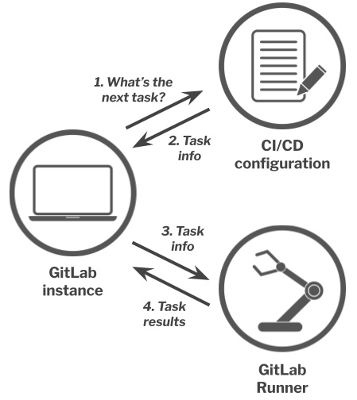

= GitLab CI/CD 管道概述

GitLab 的 CI/CD 管道帮助解决软件开发生命周期中的**验证**、**打包**和**发布**问题。

持续集成(CI) 持续交付(CD)

== 管道、 CI 和 CD 的含义

=== 管道

GitLab CI/CD 管道是每当向 GitLab 托管的存储库副本提交编辑的文件执行的**一系列步骤**。

**一系列步骤**：可以将这些步骤视为对文件执行的任务。

GitLab 的默认行为是每次将编辑后的文件**提交**到 GitLab 托管的项目存储库副本时**运行完整的管道**。
提交并不是触发管道的唯一方法，即使它是迄今为止最常见的方法。

**管道**只是项目一系列步骤的蓝图，应用于项目的文件。
执行管道构成**管道实例**。

每个 GitLab 项目**仅**定义一个 GitLab CI/CD 管道。
一个项目一次可以运行多个管道实例。

几乎每个管道包含两半： CI 和 CD 。

=== CI 持续集成

CI (持续集成) 聚焦于项目质量，确保正在进行的任何文件编辑都能与项目的稳定代码库良好集成。

管道的 CI 部分通过在将代码提交到 GitLab 项目存储库时运行**测试**、**扫描**和其他检查来实现。

以 CI 为中心的管道步骤：

* **功能测试**: 确定功能是否实现的测试、 QA 编写的回归测试
* **安全扫描**: 确定是否有安全漏洞
* **代码质量扫描**: 确定代码是否符合规范
* **性能测试**: 确定是否满足性能要求
* **许可证扫描**: 确定代码依赖项的软件许可证是否与项目许可证兼容
* **模糊测试**: 通过向代码传递超长字符串、超出范围的数字或其他各种数据作为输入来验证程序是否正常

CI 优势：

* 尽早运行测试，尽早发现问题，降低解决问题的负担；
* 促进协作，通过项目状态，相关人员可以直接对问题提供帮助；

=== CD 持续部署

多数软件开发团队设置多个部署代码环境(功能测试、性能测试、模拟生产环境)。

GitLab CI/CD 管道的 CD 负责决定将代码部署到哪个环境。

根据配置项目管道的方式，执行 CD 持续部署可以使用 **Git 分支**或 **Git 标签**进行。

[TIP]
--
GitLab 对所有测试环境都有一个特殊的**审查环境**：

每个非默认 Git 分支都有一个专门用于该分支的审查环境；
一旦该分支合并到拥有稳定代码库的默认分支中， GitLab 会销毁不再需要的审查环境。
--

每当在 GitLab 托管的项目存储库中创建分支时，都会自动创建审查环境，准备好 CI/CD 管道。
当完成分支并删除或将其合并到稳定分支时，审查环境会自动销毁。

.GitLab CI/CD 管道架构图

== 管道组成 —— 阶段、作业和命令

=== 阶段

每一条管道**由一个或多个阶段**组成。
**阶段**是主题相关的管道**任务的集合**。

例如：

. *Build*: 包含将源码**编译**、**打包**为可部署格式任务
. *Test*: 包含**运行测试**、**代码质量扫描和 linter** 任务
. *Deploy*: 将制品发送到相应环境（具体取决于管道运行的 Git 分支和 Git 标签）

GitLab 无法检查阶段中包含的任务是否在主题上相关。
如何将管道划分为阶段以及在每个阶段放置哪些任务取决于使用者。
**偶尔检查阶段结构并根据需要重构它以实现清晰度和一致性被认为是最佳实践**。

=== 作业

GitLab 中执行的任务被称为 jobs 。
每个作业必须有一个描述其执行的任务的**名称**。
每个**阶段**包括一个或多个作业，每个作业又包含在某个阶段中。

每个作业通常执行一项任务。

GitLab 无法检查作业中的内容。

=== 命令

GitLab 中任务由 GitLab CI/CD 管道中的最终构建块：**命令**构成。
每个作业都包含一个或多个让作业执行某些操作的命令。

作业包含的命令与在终端中输入的命令是一样的。

== 运行 GitLab CI/CD 管道

管道的目的是**在每次更改代码时检查代码的状态，然后部署给代码**。

=== 分支管道

运行管道最常见的方法是将更改提交到分支。
每当执行提交操作时， GitLab 都会针对该提交重存在的项目文档的任何版本自动运行管道。

GitLab 允许针对任何 Git 分支手动运行管道，即使它不是您提交的最后一个分支。

=== 标签管道

GitLab 允许针对任意 Git 标签运行管道，即使该标签不指向分支上的最后一次提交。

=== 其他类型管道

还有其他三种比较常见类型的管道

* **合并请求管道** 针对合并请求的源分支进行
* **合并结果管道** 特殊类型的合并请求管道；是确保分支能够很好地集成到稳定的代码库中的好方法
+
每当对源分支进行提交时，**合并结果管道**针对合并请求的缘分支的临时合并到其目标分支中运行。

* **串行合并** 将多个合并请求排入队列，然后对队列中的每个合并请求执行单独的并发合并结果管道。

=== 跳过管道

不触发管道运行只需要在提交消息中包含两个短语中的任意一个：

* ``[skip ci]``
* ``[ci skip]``

此管道暂停仅用于单个提交。
提交内容不包含这两个短语时将恢复触发管道运行。

== GitLab CI/CD 管道状态

每个管道实例都用**通过**/**失败**状态；
管道实例中的每个阶段都有**通过**/**失败**状态；
任何阶段的作业也有**通过**/**失败**状态。

GitLab CI/CD 管道状态：

* `running`: 运行中
* `pending`: 暂停，等待资源可用
* `skipped`: 跳过，当前阶段失败时，默认跳过后面所有阶段
* `canceled`: 取消

== 配置 GitLab CI/CD 管道

所有 CI/CD 管道配置都在 `.gitlab-ci.yml` 的文件中，该文件存在项目存储库的根目录中。

`.gitlab-ci.yml` 文件中约有 30 个可用关键字。
