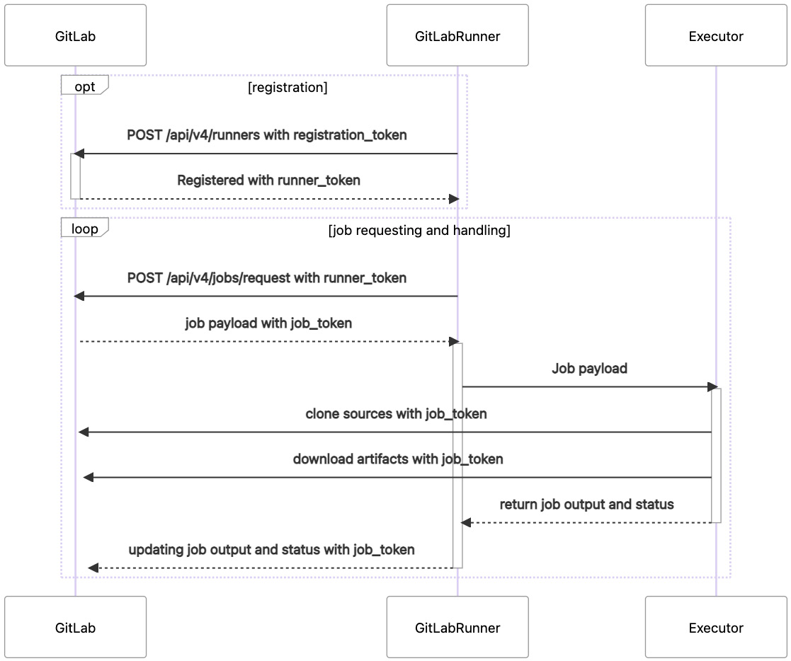

= GitLab Runner

[TIP]
--
**GitLab Runner**

GitLab Runner 是使用 Go 语言编写的开源程序。
https://gitlab.com/gitlab-org/gitlab-runner

GitLab Runner 通常与 GitLab 具有相同的主要和次要版本，但不保证始终如此。
--

GitLab Runner 与 GitLab 独立安装；
GitLab Runner 是从 GitLab 接受 CI / CD 作业，在适当的执行环境中运行作业任务，然后将结果报告给 GitLab 的程序。

== GitLab Runner 与 CI / CD 关系

GitLab CI/CD 管道包括的阶段和作业在 `.gitlab-ci.yml` 中定义。

可以通过 GitLab UI 实时监控管道状态和作业执行。
Runner 不断与 GitLab 通信，可以从 UI 中查看可用的 Runner、修改 Runner 设置、干预管道和作业执行、查看上传的工件等。

== GitLab Runner 的架构

单个 GitLab Runner 机器可以注册多个 Runner。
GitLab Runner 应用程序负责启动、停止和管理各个 Runner 进程，并从 GitLab 获取 CI/CD 作业。

.GitLab Runner 通信和作业执行

可以在**项目**、**组**或**实例级别**组织 Runner 的可用性。

* 特定的 Runner 分配到特定的项目：
+
使项目所有者和开发人员能够设置他们所需的运行程序基础设施。
安全和合规性政策可能要求某些项目使用专用的与其他基础设施分开的基础设施组织的。
注册到一个特定项目的运行程序将仅运行该项目内部的管道代码。

* 特定的 Runner 分配到特定的组：
+
在组级别注册 Runner 可使该 Runner 可用于该组及子组内所有项目中的所有管道。
+
群组所有者可以创建和管理**组** Runner，以先进先出的方式接受并运行 CI/CD 作业。

* 用于所有项目的共享 Runner
+
GitLab 实例管理员可以选择注册

== 安装&注册 GitLab Runner

=== Red Hat Linux Enterprise 兼容版本 Linux 安装

. 添加 GitLab Runner 存储库到包管理器：
+
[source,shell]
----
sudo curl -L "https://packages.gitlab.com/install/repositories/runner/gitlab-runner/script.rpm.sh" | sudo bash
----

. 安装 GitLab Runner 包：
+
[source,shell]
----
sudo dnf install –y gitlab-runner
----

. 查看 GitLab Runner 代理状态：
+
[source,shell]
----
sudo gitlab-runner status
----

=== 注册 GitLab Runner

设置 Runner 与 GitLab 通信并运行 CI/CD 作业的方式注册一个或多个 Runner 。

注册令牌由 GitLab 生成。

. 从 GitLab 中将**注册令牌**复制到粘贴板
. 在安装了 GitLab Runner 的计算机终端中运行：
+
[source,shell]
----
sudo gitlab-runner register
----

. 要求输入 GitLab 应用程序实例的 URL： 例如 ``https://gitlab.com``

. 要求输入注册令牌

. 提供可选描述，将显示在 GitLab UI 中 Runner 的元数据中。
+
[source,shell]
----
Enter a description for the runner:

[localhost] Linux dev server
----

. 提示输入任何可选的 Runner 标签
+
标签是分配给 Runner 的元数据；
标签 Runner 能够选择具有相同的 CI/CD 作业。

. Runner 要求提供用于运行 CI/CD 作业的执行环境
+
Runner 取决于是否有必要的工具可用：例如，选择 Docker 要求 Docker 引擎已在服务器上安装并可用。

. 最后将追踪确认 Runner 注册已成功
