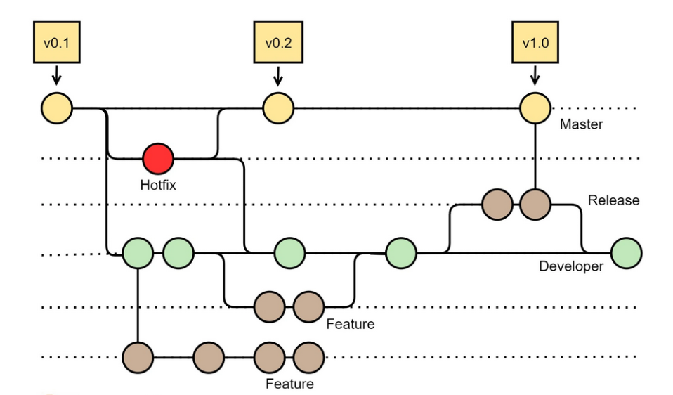
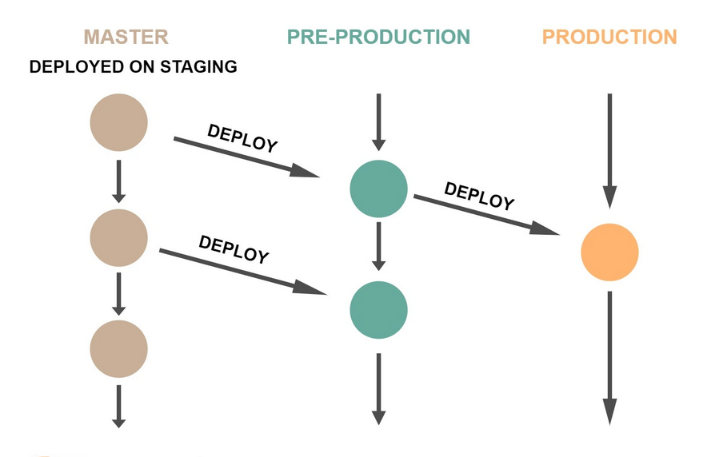
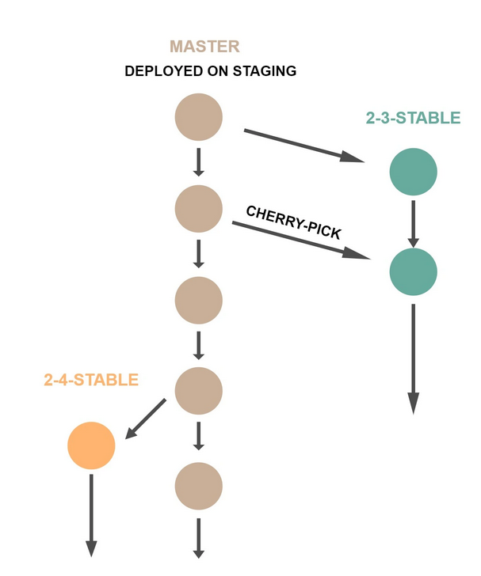

# Best Practice

> idea 版本控制菜单快捷键: `alt` + <code>`</code>

1. 使用 `git stash` 暂存当前进度，切换分支处理问题，使用 `git stash pop` 释放暂存的进度；
2. 使用 `git cherry-pick` 有选择的合并提交
    * `git cherry-pick <commit-hash>` 合并一个commit
    * `git cherry-pick <commit-hash-1> <commit-hash-2>` 合并多个 commit
    * `git cherry-pick <commit-hash-s>...<commit-hash-e>` 合并连读的多个 commit
3. 使用 `git add -p` 挑选改动提交
4. 使用 `git grep $regexp $(git rev-list --all)` 从所有的提交中查找代码
5. 使用**功能分支**(`xxx-feature`)协同工作流开发过程：
   1. 使用 `git checkout -b <new-feature>` 创建 `<new-feature>` 分支；
   2. 当前功能开发使用创建的 `<new-feature>` 分支（包括 `add` `commit` 等）；
   3. 使用 `git push -u origin <new-feature>` 将分支提交推送到服务器；
   4. 其他程序员可以通过 `git pull --rebase` 获取分支最新代码；
   5. 通过 Pull Request 的方式做完 **Code Review** 后合并到 Master 分支；

> **功能分支**vs**项目分支**
> 
> **功能分支**：Git 的最佳实践希望在开发过程中，快速提交、快速合并、快速完成，可以较少尽可能多的冲突；

## GitFlow

### 需求：

1. 有一个分支非常干净，上面是可以发布的代码；
    
    该分支的所有改动都是可以发布到生产环境中的；这个分支上不可能有中间开发过程中不可以上限的代码提交。
2. 当代码可以上线时(`alpha` `bata` `release`)，在测试和交付的过程中，依然可以开发下一个版本的代码；
3. 对于已经发布的代码，一些 Bug-fix 的改动，不会将正在开发的代码提交到生产线上去；

### GitFlow 方案

一共有五种分支：
* `Master` 分支：即主干分支，用作发布环境，上面的每一次提交都可以发布
* `Feature` 分支：即功能分支，用于开发功能，其对应的是开发环境
* `Developer` 分支：即开发分支，一旦功能开发完成，就向 `Developer` 分支合并，合并完成后，删除功能分支；这个分支对应的是**集成测试环境**
* `Release` 分支：当 `Developer` 分支测试达到可以发布状态时，开出一个 `Release` 分支作为发布前的准备工作，作为预发布环境

   一旦当 `Release` 分支达到可以上线的状态，向 `Master` 和 `Developer` 分支同事合并；然后删除 `Release` 分支。
* `Hotfix` 分支：用于处理生产线上代码的 Bug-fix

   每个线上代码的 Bug-fix 都需要开一个 `Hotfix` 分支，完成后向 `Developer` 与 `Master` 分支上合并；
   合并完成后，删除 `Hotfix` 分支。

> **特点**：
> 
> 1. 长期维护 `Master` `Developer` 分支
> 2. 复杂度： `Release` 和 `Hotfix` 分支需要同时向两个长期分支合并，容易导致代码不一致
> 3. 几乎可以应对所有公司的各种开发流程

> **缺点**：
> 
> 1. 分支太多 git log 混乱：使用 `git merge --no-ff` 合并分支，在 GitFlow 这样多个分支的环境下分支管理的 log 变得很难看。
> 
>     `--no-ff`: no fast forward 即合并的方法是不要把这个分支的提交以前置合并的方式，而是留下一个 merge 的提交。
>  
>     > 建议：只有 `feature` 合并到 `developer` 分支时，使用 `--no-ff` 参数，其他的分支都不使用 `--no-ff` 参数做合并。
> 2. 开发足够快的情形下， Master 与 Developer 以及 Release 分支大多数情况下是一样的。
> 3. 提交回滚不容易操作。工作过程中时常需要切换分支，存在误操作风险。

## GitHub Flow / Forking Flow

* 每个开发人员都把 **官方库** 的代码 `fork` 到自己的仓库中。
* 开发人员在自己的代码仓库中做开发。
* 开发人员仓库中需要配置两个远程仓库：自己 `fork` 的库（用于提交代码修改）、官方库（用于同步代码）
* 在本地建**功能分支**，实现功能开发
* 功能完成 push 到开发人员自己 `fork` 的仓库中
* 向**官方库**发起 `pull request` 并做 Code Review

> 需要自动化 CI/CD 工具辅助

> **缺点**：
> 
> 没有把代码与运行环境联系在一起。

## GitLab Flow

引入环境分支，包含：**预发布 `Pre-Production` 分支** **生产 `Production` 分支**。
需要有各种 `release` 的分支， `Master` 分支是一个 `roadmap` 分支，然后一旦稳定构建稳定版本分支（如 `2.3.stable` `2.4.stable`);
其中可以 `cherry-pick` `master` 分支上的一些改动到稳定分支

> **优点**：
> 
> * 解决了环境和代码分支对应问题
> * 解决了版本和代码分支对应问题
