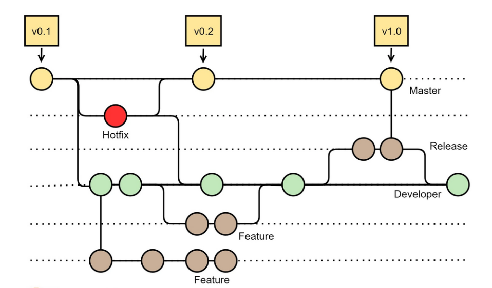

# Best Practice

> idea 版本控制菜单快捷键: `alt` + <code>`</code>

1. 使用 `git stash` 暂存当前进度，切换分支处理问题，使用 `git stash pop` 释放暂存的进度；
2. 使用 `git cherry-pick` 有选择的合并提交
    * `git cherry-pick <commit-hash>` 合并一个commit
    * `git cherry-pick <commit-hash-1> <commit-hash-2>` 合并多个 commit
    * `git cherry-pick <commit-hash-s>...<commit-hash-e>` 合并连读的多个 commit
3. 使用 `git add -p` 挑选改动提交
4. 使用 `git grep $regexp $(git rev-list --all)` 从所有的提交中查找代码
5. 使用**功能分支**(`xxx-feature`)协同工作流开发过程：
   1. 使用 `git checkout -b <new-feature>` 创建 `<new-feature>` 分支；
   2. 当前功能开发使用创建的 `<new-feature>` 分支（包括 `add` `commit` 等）；
   3. 使用 `git push -u origin <new-feature>` 将分支提交推送到服务器；
   4. 其他程序员可以通过 `git pull --rebase` 获取分支最新代码；
   5. 通过 Pull Request 的方式做完 **Code Review** 后合并到 Master 分支；

> **功能分支**vs**项目分支**
> 
> **功能分支**：Git 的最佳实践希望在开发过程中，快速提交、快速合并、快速完成，可以较少尽可能多的冲突；

## GitFlow

### 需求：

1. 有一个分支非常干净，上面是可以发布的代码；
    
    该分支的所有改动都是可以发布到生产环境中的；这个分支上不可能有中间开发过程中不可以上限的代码提交。
2. 当代码可以上线时(`alpha` `bata` `release`)，在测试和交付的过程中，依然可以开发下一个版本的代码；
3. 对于已经发布的代码，一些 Bug-fix 的改动，不会将正在开发的代码提交到生产线上去；

### GitFlow 方案

一共有五种分支：
* `Master` 分支：即主干分支，用作发布环境，上面的每一次提交都可以发布
* `Feature` 分支：即功能分支，
