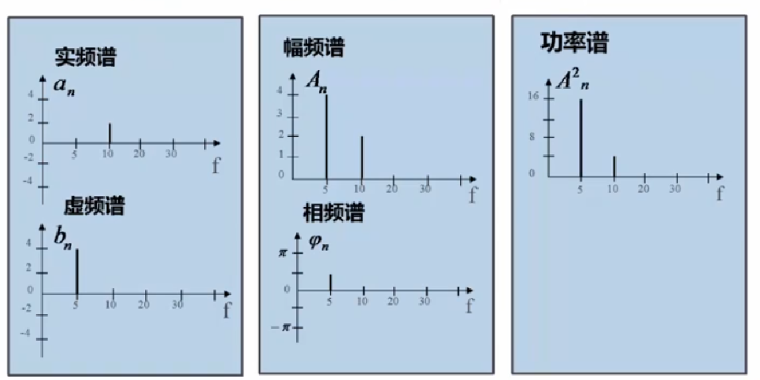
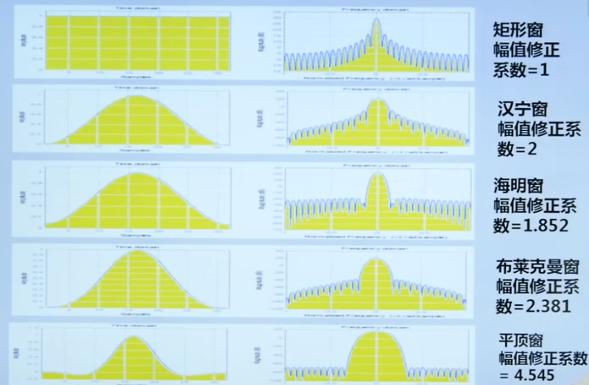

= 数字信号处理
Hui.Liu <mexn-0808@outlook.com>
:toc: left
:toclevels: 5
:toc-title: 目录

== 1. 计算机测量仪器系统

=== 计算机测量仪器

**计算机测量仪器**(虚拟仪器)是通过计算机作为仪器主体。
传感器经过放大和信号采集后，通过数据总线传输到计算机中，再由计算机软件进行分析、显示。

=== A/D 转换(ADC)

A/D 转换即模数转换，将模拟信号转换成数字信号。

ADC 类型：

* 积分型
* 逐次逼近型
* 并行比较型
* 串并型

ADC 主要参数：

. 转换器位数(精度)
. 转换时间(采样频率)
. 电压输入范围： `0~5v` `0~10v` `+/-5v` `+/-10v`

=== D/A 转换(DAC)

D/A 转换即数模转换，将数字信号转换成模拟信号。

DAC 主要参数：

. 转换器位数(精度)
. 转换时间(频率)
. 电压输出范围： `0~5v` `0~10v` `+/-5v` `+/-10v`

=== 采样定理

在计算机化测量系统中，**采样**就是将连续的传感器模拟信号，通过 ADC 转换为计算机能够分析的离散数字量。

**采样**是将离散**脉冲序列**与信号**相乘**，取离散点值的过程：

``p(t) * x(t)``

* 脉冲信号 p(t)
* 连续信号 x(t)

采样定理(Nyquist-Shannon)：
为保证采集后信号能真实地保留原始模拟信号信息，信号采样频率必须至少为原信号中最高频率成分的 2 倍，即 ``Fs > 2 Fmax`` 。

在工程领域，为保证采样信号质量： ``Fs > 5 Fmax``

[TIP]
--
**采样过程中的频率混叠**

频率混叠是采样频率不满足采样定理时，信号中的高频成分被不正确的采样成低频成分。

频率混叠是信号离散采样所引起的一个特有现象和重要概念。

例如： 1.5KHz 采样频率对 2KHz 的正弦信号进行采样时，输出是一个 500Hz 正弦信号。
--

当采样信号没有发生频率混叠时，采样信号频谱不发生重叠；
当采样信号发生频谱混叠时，采样信号频谱发生重叠。

在实际工程应用中为了放置发生频率混叠，通常在 ADC 采样前添加**低通滤波器(``0~Fs/2``)**实现添加抗混迭滤波。

.Example: 声卡采集信号——AD变换
[source,matlab]
--
Fs = 11025;             % 采样频率
N= 44100;               % 采样长度
t = [0:N-1]/N;          % 采样时长
x = wavrecord(N, Fs);   % 声卡采样
plot(t, x);             % 图形绘制
set(gca,'color',[0.95, 0.95, 0.95]);
--

.Example: 声卡食输出标准信号——DA变换
[source,matlab]
--
Fs = 44100;                             % 信号采样频率
dt = 1.0 / Fs;                          % 采样间隔
T = 2;                                  % 采样时长
N = T / dt;                             % 采样点数
t = [0: N - 1]/N;                       %
x = 0.3*sin(2*pi*600*t);                % 按照采样点数生成 600Hz 正弦信号
plot(t,x);                              %
axis([0, 0.01, -0.5, 0.5]);             % 绘制波形
wavplay(x,Fs);                          %
set(gca,'color',[0.95,0.95,0.95]);      %
--

== 2. 信号函数与标准信号

信号发生器是一种产生电信号的仪器，按信号波形或函数可分为正弦波信号、方波信号、三角波信号、脉冲信号和随机噪声信号等。

=== 信号函数与标准信号

==== 正弦波

正弦波是一种单一频率成分的基本信号，在后续信号的频谱分析理论中将会学到，任何复杂信号都可以看成一组不同频率、幅值、相位的正弦波信号的组合。

``y(t)=Asin(2πft+φ)``

. A 幅值
. f 频率
. φ 初始相位

正弦波的离散采样公式： ``y(nΔt) = Asin(2πfnΔt+φ)``

. Fs = 1 / Δt
. n = 0,1,2,...,N

.离散采样案例：
[source,matlab]
--
Fs = 11025;
a = 10;
f = 50;
q = 60;
T = 1;
dt = 1.0/Fs;
N = T/dt;
t = linspace(0,T,N);
y = a*sin(2*pi*f*t+q);
plot(x,y);
--

应用实例： DTMF信令(Dual Tone Multi-Frequency)

DTMF 双音多频信号是电话系统中电话机与交换机之间的一种用户信令，通常用于发送被叫号码

应用案例： 摩尔电码

==== 方波

[math,file="math.svg"]
--
y(t)=\begin\{cases}
A, \quad & 0 > t \ge T/2 \\
-A,\quad & -T/2 > t \ge 0
\end\{cases}
--

离散采样公式：

[source]
----
y(nΔt)= ...
Fs = 1/Δt, n = 0,1,2,...,N
----

方波信号函数：

* ``square(t)``
** 频率：``t``
** 占空比(默认：``50%``)
* ``square(t, duty)``

.方波信号
[source,matlab]
--
Fs=11025;
f = 5;                              % 频率
T= 1;
dt = 1.0/Fs;
N = T/dt;
t = linspace(0,T,N);
y1 = square(2*pi*f*t);              % 默认 50% 占空比
y2 = square(2*pi*f*t,75);           % 设置 75% 占空比
plot(t,y1);
hold on;
plot(t,y2);
--

==== 三角波

[math,file="math.svg"]
--
y(t)=\begin\{cases}
A - 2A*2t/T, \quad & 0 > t > T/2 \\
-A+2A*2(t-T/2)/T,\quad & T/2 < t < T
\end\{cases}
--

离散采样公式：

[source]
--
y(nΔt)= ...
Fs = 1/Δt, n = 0,1,2,...,N
--

==== 锯齿波

[math,file="jcb.svg"]
--
\begin{align}
\ y(t) = -A + 2A*t/T  ,\quad & 0 > t > T
\end{align}
--

离散采样公式：

[source]
--
y(nΔt)= ...
Fs = 1/Δt, n = 0,1,2,...,N
--

Matlab函数：

* ``sawtooth(t)``
* ``sawtooth(t,width``

.锯齿波与三角波
[source,matlab]
--
Fs=11050;
f=4;
T=1;
dt = 1.0/Fs;
N=T/dt;
t=linspace(0,T,N);
y1=sawtooth(2*pi*f*t);
y2=sawtooth(2*pi*f*t,1/2);
y3=sawtooth(2*pi*f*t,0);
plot(t,y1);
hold on;
plot(t,y2);
plot(t,y3);
--

==== 噪声信号

* 白噪声 : ``x=randn(1,n)``(1:表示一维数据，n:表示生成 n 个点)

* 均匀噪声 : ``x=rand(1,n)``(1:表示一维数据，n:表示生成 n 个点)

[TIP]
----
工程应用中**白噪声**居多。
----

.噪声
[source,matlab]
--
y1=randn(1,256);
y2=rand(1,256);
plot(y1);
hold on;
plot(y2);
--

==== 其他信号

* 脉冲信号
* 阶跃信号(脉冲信号积分)
* 斜坡信号(阶跃信号积分)
* 加速度信号(斜坡信号积分)

.其他信号demo
[source,matlab]
--
% 脉冲信号
t = linspace(0,1,101)
y=[zeros(1,50),1,zeros(1,50)];
plot(t,y)

% 阶跃信号
t = linspace(0,1,101);
y=[zeros(1,50),ones(1,51)];
plot(t,y);
ylim([0 1.25])

% 斜坡信号
y = linspace(0,10,101)
plot(y);
--

=== 信号发生器设计··

信号的包络、泛音；

* 信号的幅值调制（包络）**反映高频信号幅度变化的曲线**
+
**基音**：一般的声音都是由发音体发出的一系列频率、振幅各不相同的振动复合而成的。
这些振动中有一个频率**最低**的振动，由它发出的音就是**基音**。
乐器的按键频率是多少，指的就是基音的频率，基音决定了音高。
+
**泛音**：乐器振动时，其振动频率并不是单一的。只有基音的声音，听起来有强烈的人工感觉。
琴弦发声时，除基音外，还有不同的**基音频率倍数的成分**，称为**泛音**。

== 3. 信号的时域分析

**波形分析**是对直接记录的信号**幅值**随时间变化曲线进行分析。
因在时间域进行，也称为**时域分析**。

=== 信号波形参数识别

. 周期(``T``)|频率(``f=1/T``)
. 峰值(``P``)|双峰值(``Pp-p``)
. 初始相位(``φ``)
. *均值*：反应信号变化的中心趋势（绕 ``0`` 值的偏移程度），也称为**直流分量**
+
[math,file="jz.svg"]
--
\begin{align}
\ \mu_x=E[x(t)]= \lim_{T \rightarrow \infty }\frac{1}{T}\int_{0}^{T}x(t)dt
\end{align}
--
. *均方值*：反映信号**强度**（能量的强弱）；其平方根称为**有效值(RMS)**(一种常用的信号能量表达方式)
+
[math,file="jfz.svg"]
--
\begin{align}
\ \psi^2_x = E[x^2(t)] = \lim_{T \rightarrow \infty } \frac{1}{T} \int_{0}^{T} x^2(t) dt
\end{align}
--
. *方差*：反映信号**绕均值的波动程度**，一般用来衡量信号强度
+
[math,file="fc.svg"]
--
\begin{align}
\ \delta^2_x = E[(x(t)-E[x(t)])^2] = E[(x(t) - \mu_x)^2] = \lim_{T \rightarrow \infty } \frac{1}{T} \int_{0}^{T} (x(t) - \mu_x)^2 dt
\end{align}
--

==== 周期(频率)、相位：*过零点检测法*

> 过零点位置通常来说拥有最大斜率，所以测量精度相对高。

上升沿过零点条件：

[math,file="fc.svg"]
--
\begin{align}
\ x(k) \le 0 \lt x(k+1)
\end{align}
--

零点精确位置：零线和 ``k`` 点与 ``k+1`` 点的交点：

[math,file="fc.svg"]
--
\begin{align}
\ t_0 = k * \Delta t + \Delta t
\end{align}
--

.过零检测：
[source,matlab]
--
p = max(x);
q = min(x);
n = 1;
at = 0.8*(p-q)+q;

for k = 2:1:N
    if (x(k-1)<at && x(k) <= at && x(k+1) > at && x(k+2) > at)
        ti(n) = k;
        n = n+1;
    end
end
T = (ti(2) - ti(1))*dt; % 未做过零点精确位置计算
F = 1.0/T;
Q = 360*(T-ti(1)*dt)/T;
--

Matlab 标准函数：

* `max` 最大值
* `min` 最小值
* `mean` 均值
* `RMS` 有效值
* `std` 标准差

相邻两个过零点时间差就是**周期**，第一个过零点位置与周期的**比例**可算出**初相位**

=== 信号的数字微分和数字积分算法

> PID（比例-积分-微分）

==== 数字微分(中值法)

[math,file="wf.svg"]
--
\begin{align}
\ x'(t) = \frac{dx(t)}{dt}
\ \Rightarrow
\ x'(n) \approx \frac{x(n+1) - x(n)}{2* \Delta t}
\end{align}
--

.微分：中值法
[source,matlab]
--
for k = 1:1:N-1
    x1(k) = (x(k+1) - x(k-1))/(2*dt);
end
x(0) = x(1); % 起点 特殊处理
x(N) = x(N-1); % 终点 特殊处理
--

==== 数字积分(梯形法)

[math,file="jf.svg"]
--
\begin{align}
\ y(t) = \int_{0}^{t}x(t)dt
\ \Rightarrow
\ y(n) \approx y(n-1) + \Delta t * [x(n) + x(n-1)] /2
\end{align}
--

.积分：梯形法
[source,matlab]
--
y(0) = 0;
for k = 1:1:N
    y(k) = y(k+1)+dt*(x(k) + x(k-1))/2;
end
--

[TIP]
--
图像边缘监测：二维数字微分 ``Sobel``

二维图像数组横向微分、纵向微分；
--

.从摄像头获取图像
[source,matlab]
--
vid = videoinput('winvideo',1,'YUY2_540x480');
set(vid, 'ReturnedColorSpace','rgb');
preview();
pause();
start(vid);

for(i=1:10)
    getpic = getsnapshot(vid);
    filename = int2Str(i);
    filename = [filename,'.jpg']
    imwrite(getpic, filename);
    pause(0.5);
end
stop(vid);
closepreview(vid);
delete(vid);
clear;
--

.读取图像
[source,matlab]
--
[FileName,PathName] = uigetfile('*.jpg','Select Jpg File');
jpgFile = fullfile(PathName,FileName);
i = imread(jpgFile);
imshow(i);
i1=rgb2gray(i);
figure;
imshow(i1);
bw2 = edge(i1,'sobel');
figure;
imshow(bw2);
--

== 应用

. 汽车速度监测：周期识别
. 钢丝线缆断丝监测：峰值检测

== 4. 信号的频谱分析

=== 频谱分析的概念

> **谱**概念来自于光学领域；一束光白光通过三棱镜，会按照光的波长，分解称为**光谱**。

**频谱分析**借助于傅里叶变换，将信号转换到频率域，揭示出构成信号的不同频率成分，各频率分量的贡献曲线就称为**信号的频谱分析**。

(频域)频谱图(频率-幅值)

时域(波形图(时间-幅值))分析只能反映信号的幅值随时间的变化情况。

频域(频谱图(频率-幅值))分析：

* 可以直观看出信号的频率组成成分；

* 抗干扰能力强；

* 频谱分析有明确的物理意义

=== 周期信号频谱分析

**周期信号**经过一定时间可以重复出现，满足条件：

[math,file="jf.svg"]
--
\begin{align}
\ x(t) = x(t+nT); \quad & n = 1,2,3,4,...
\end{align}
--

T: 信号周期(``F=1/T``:信号频率)

==== 信号的正交分解与合成

**正交函数集**定义：任意两个信号相乘积分为零

[math,file="zjhs.svg"]
--
\begin\{cases}
\int_{t_2}^{t_1} f_i(t)f_j(t)dt = 0 ,       \quad &i=j \\
\int_{t_2}^{t_1} f_i(t)f_j(t)dt = K_{ij} ,  \quad &i \neq j
\end\{cases}
--

信号的正交函数**分解与合成**：

[math,file="zjhs.svg"]
--
\begin{align}
x(t) = c_1 f_1(t) + c_2 f_2(t) + \cdots + c_n f_n(t) ,       \quad &t_1 \lt t \le t_2
\end{align}
--

[TIP]
--
用正交函数集可以合成任何信号。
--

===== 三角正交函数集:

[math,file="zjhs.svg"]
--
\begin{align}
\{ cos(2 \pi i f_0 t), sin(2 \pi i f_0 t) \} ;  \quad &i = 1,2,3,4,5, \cdots \\
x(t) = x(t+nT) ;                                \quad & (F_0 = 1/T)
\end{align}
--

其中**正弦函数集**之间满足**正交函数集**定义；**余弦函数集**之间满足**正交函数集**定义：

[math,file="zjhs.svg"]
--
\begin{align}
\int_{-\infty}^{\infty} sin(2 \pi f_0 t) * sin(3 \pi i f_0 t) dt = 0 \\
\int_{-\infty}^{\infty} cos(2 \pi f_0 t) * cos(3 \pi i f_0 t) dt = 0
\end{align}
--

针对信号使用三角函数集进行分解与合成变换：傅里叶变换

===== 沃尔什正交函数集

> 计算机领域使用沃尔什正交函数集比较多。

沃尔什函数集： ``Walsh(i,t); i = 1,2,....,n``

将信号进行频谱变换(Walsh-Hadamard变换)得到的 Walsh 频谱物理含义不是很明确。

===== 周期信号的三角函数分解和合成(傅里叶级数展开)

[math,file="zjhs.svg"]
--
\begin{align}
x(t) = \frac{a_0}{2} + \sum_{n-1}^{\infty} (a_n cos n 2 \pi f_0 t + b_n sin n 2 \pi f_0 t) ; (n = 1,2,3, \cdots )    \\
\frac{a_0}{2} : 直流分量
\end{align}
--

傅里叶级数计算公式：
[math,file="zjhs.svg"]
--
\begin{align}
a_0 = \frac{2}{T} \int_{-T/2}^{T/2} x(t)dt ; 直流分量 \\
a_n = \frac{2}{T} \int_{-T/2}^{T/2} x(t)cos(2 \pi f_0 t)dt, n = 1,2,3, \dots ; 正弦分量 \\
b_n = \frac{2}{T} \int_{-T/2}^{T/2} x(t)sin(2 \pi f_0 t)dt, n = 1,2,3, \dots ; 余弦分量
\end{align}
--

[TIP]
--
**三角函数辅助角公式**

[math,file="zjhs.svg"]
--
\begin{align}
Asin \alpha + B sin \beta = \sqrt{A^2 + B^2} sin(\alpha + \varphi) \\
\varphi = arctg \frac{A}{B}
\end{align}
--

--

工程应用中的傅里叶一般形式：

[math,file="zjhs.svg"]
--
\begin{align}
x(t) = \frac{a_0}{2} + \sum_{n-1}^{\infty} A cos(n 2 \pi f_0 t - \varphi_n) \\
A_n = \sqrt{a_n^2 + b_n^2} \\
\varphi = arctg \frac{b_n}{a_n}
\end{align}
--

.方波 Matlab 合成案例
[source,matlab]
--
N = 1024;
T = 2;
x = linspace(0,T,N);
y1 = sin(2*pi*x);
subplot(4,1,1);
plot(x,y1);

y2 = y1 + 1/3 *sin(3*2*pi*x);
subplot(4,1,2);
plot(x,y2);

y3 = y2 + 1/5*sin(5*2*pi*x);
subplot(4,1,3);
plot(x,y3);

y4 = y3+ 1/7*sin(7*2*pi*x);
subplot(4,1,4);
plot(x,y4);
--

.三角波 Matlab 合成案例
[source,matlab]
--
N = 1024;
T = 4;
x = linspace(0,T,N);
y = sin(2*pi*x)
    + 1/2*sin(2*2*pi*x)
    + 1/3*sin(3*2*pi*x)
    + 1/4*sin(4*2*pi*x)
    + 1/5*sin(5*2*pi*x)
    + 1/6*sin(6*2*pi*x);
plot(x,y);
--

=== 频谱图

工程上习惯用图形方式来表示信号各频率成分的能量大小情况，称为频谱图。

[math,file="zjhs.svg"]
--
\begin{align}
x(t) = \frac{a_0}{2} + \sum_{n-1}^{\infty} (a_n cos n \omega_0 t + b_n sin n \omega_0 t) =  \frac{a_0}{2} + \sum_{n-1}^{\infty} A cos(n 2 \pi f_0 t - \varphi_n)
\end{align}
--

频谱图类型

. 实频谱——虚频谱：数学分析领域
.. 实频谱: an 关于 f 的函数
.. 虚频谱: bn 关于 f 的函数
. 幅频谱——相频谱：
.. 幅频谱: An 关于 f 的函数
.. 相频谱: φn 关于 f 的函数
. 功率谱：*工程应用最多*(幅频谱An取平方)
+
直接反应每个频率分量的能量大小。

=== 周期信号频谱特性

* *离散性*：每条谱线代表一个频率分量
* *谐波性*；谱线出现在基波的整数信号频率上
* *收敛性*：谐波次数越高，谐波分量越小

=== 用快速傅里叶变换(FFT)计算频谱

对 A/D 采样后的数字信号，无法给出函数表达式。
因此很难导出其傅里叶级数展开式，可以用数字积分方法求出傅里叶级数。

积分公式转换为求和公式：
[math,file="zjhs.svg"]
--
\begin{align}
x(t) = \frac{a_0}{2} + \sum_{n-1}^{\infty} (a_n cos n \omega_0 t + b_n sin n \omega_0 t) =  \frac{a_0}{2} + \sum_{n-1}^{\infty} A cos(n 2 \pi f_0 t - \varphi_n) \\
a_n = \frac{2}{T} \int_{-T/2}^{T/2} x(t)cos(2 \pi f_n t)dt \\
\Rightarrow a_n = \sum_{0}^{N-1} x(n \Delta t)cos(2 \pi f_n n \Delta t) \\
b_n = \frac{2}{T} \int_{-T/2}^{T/2} x(t)sin(2 \pi f_n t)dt \\
\Rightarrow b_n = \sum_{0}^{N-1} x(n \Delta t)sin(2 \pi f_n n \Delta t)
\end{align}
--

Matlab 中傅里叶变换函数： ``Y = fft(X,n)`` 数据长度 n 必须是 2 的幂方；结果 ``Yn = an + jbn`` 实部对应 cons 部分， 虚部对应 sin 部分。

.傅里叶变化案例
[source,matlab]
--
Fs = 5120;
N = 1024;
dt = 1.0/Fs;
T = dt*N;
t = linspace(0,T,N);
x = 10*sin(2*pi*100*t) + 10/3*sin(3*2*pi*100*t);
plot(t,xy);
y = fft(x,N);
a = real(y);
b = image(y);
figure;
subplot(2,1,1);
% 实频图
plot(a);
subplot(2,1,2);
% 虚频图
plot(b);

A1 = abs(y); % 幅值
Q1 = angle(y)*180/pi; % 相角
figure;
subplot(2,1,1);
plot(A1);
subplot(2,1,2);
plot(Q1);

% 数据矫正
f = linspace(0,Fs/2,N/2);
A11 = abs(y)/(N/2);
Q11 = angle(y)*180/pi;
figure;
subplot(2,1,1);
plot(A11);
plot(f,A11(1:N/2));
subplot(2,1,2);
plot(f,Q11(1:N/2));
--

[TIP]
--
FFT 谱需要注意的问题：

. 不显示负频率部分（中线对称：左边为正频率，右边为负频率）
. X 坐标换为频率
. 幅值量纲还原
--

[TIP]
--
**功率谱喝对数功率谱**

工程应用上，通常对功率谱做取对数处理。

分贝： ``dB=20log(P)``
--

.对数功率谱案例：
[source,matlab]
--
Fs = 5120;
N = 1024;
dt = 1.0/Fs;
T = dt*N;
t = linspace(0,T,N);
x = 10*sin(2*pi*100*t) + sin(3*2*pi*100*t);

subplot(4,1,1)
plot(t,x)

y = fft(x,N);
f = linspace(0,Fs/2,N/2);

A1 = abs(y)/(N/2);
subplot(4,1,2);
plot(f,A1(1:N/2));

A2=A1.^2;
subplot(4,1,3);
plot(f,A2(1:N/2));

P = 20*log10(A2);
subplot(4,1,4);
plot(f,P(1:N/2));
--

=== 数字吸纳后的频谱计算方法

==== 1. 信号的截断

用计算机进行测试信号处理时，不可能对无限长的信号进行测量和运算，而是取其有限的时间片段进行分析，这个过程称为**信号截断**。

为了便于数学处理，对截断信号做周期延拓（重复），得到虚拟无限长信号。
不管原始信号是否为周期信号，都转变为以采集窗口为周期的周期信号。

==== 2. 截断信号的能量泄露

周期延拓后的信号与真是信号是不同的，接头处信号会有**跳变**。

信号跳变导致在频谱上的现象称为能量泄露误差，即频谱信号围绕主信号周围都有能量，即能量泄露，

[TIP]
--
**数学角度看信号截断**：

相当于用一个**矩形窗**与正弦信号相乘，按傅里叶变换性质，时域相乘等价于频域**卷积**。
而弦信号的谱是脉冲信号此，因此，截断信号的谱就是将矩形窗的谱搬移到脉冲的位置，从而谱的能量形成泄露。
泄露的形状等于矩形窗频谱的形状。

--

工程实际中克服能量泄露的方法：**信号的整周期截断**。

[NOTE]
--
旋转机械振动信号的键相信号整周期采样：通过保证截断信号为键槽信号的整数周期保证信号整周期截断。
--

==== 3. 离散傅里叶变换(DFT)

Discrete Fourier Transform(DFT)一词是为适应计算机作傅里叶变换运算而引出的一个专用名词。

离散信号 ``x(t)`` 按照 T 截断，周期延拓得到 ``x_T(t)

转变为周期信号 ``x_T(t)`` 的傅里叶级数分解：

[math,file="zjhs.svg"]
--
\begin{align}
x_T(t) = \frac{a_0}{2} + \sum_{ n = 1 }^{ \infty } (a_n cos n 2 \pi f_0 t + b_n sin n 2 \pi f_0 t) , n=1,2,3, \dots
\end{align}
--

展开为以周期 T 为基频(``f_0``)的一组谐波的和；
谐波系数被称为**傅里叶系数**，得到系数即完成了离散傅里叶变换。

离散化处理：
[math,file="zjhs.svg"]
--
\begin{align}
a_0 = \frac{2}{T} \int_{-T/2}^{T/2} x(t)dt, n = 1,2,3, \dots    \\
\Rightarrow a_0 = \sum_{0}^{N-1} x(n \Delta t) \\
a_n = \frac{2}{T} \int_{-T/2}^{T/2} x(t)cos(2 \pi n f_0 t)dt, n = 1,2,3, \dots \\
\Rightarrow a_n = \sum_{0}^{N-1} x(n \Delta t)cos(2 \pi f_n n \Delta t), n = 1,2,3, \dots \\
b_n = \frac{2}{T} \int_{-T/2}^{T/2} x(t)sin(2 \pi n f_0 t)dt, n = 1,2,3, \dots \\
\Rightarrow b_n = \sum_{0}^{N-1} x(n \Delta t)sin(2 \pi f_n n \Delta t), n = 1,2,3, \dots
\end{align}
--

==== 4. 快速傅里叶变换(FFT)

Fast Fourier Transform 是 DFT 的一种有效算法，通过选择和排列中间结果，可有效减少运算量，其计算结果与 DFT 是相同的。

不同频率点 DFT 计算公式中的冗余：

FFT 的作用就是用技巧减少 cos sin 项重复计算：

Coookey-Tukey 算法：利用蝶形运算，减少重复计算。

FFT 约束条件：*数据长度必须是 2 的幂次*。否则不能进行蝶形运算。

==== 5. FFT 谱的栅栏效应

为提高效率，通常采用 FFT 算法计算信号频谱，设采样频率为 Fs ，采样数据点数为 N ，则信号的截断周期和基频为：

`T = N/Fs; f0=Fs/N`

FFT 计算的各傅里叶级数的频率位置为：

[math,file="zjhs.svg"]
--
\begin{align}
f_n = i \cdot Fs /N; i = 0,1,2,3, \dots
\end{align}
--

如果信号的频率分量与频率取样点不重合，则只能取相邻频率取样点谱线值代替，这称为栅栏效应。

==== 6. 能量泄露与栅栏效应的关系

频率的离散取样造成了栅栏效应，*谱峰越尖锐*，产生的**误差的可能性就越大**。

  例如：余弦信号的频谱为线谱，当信号频率与频谱离散取样点不等时，栅栏效应的误差为无穷大。

实际中，由于信号的截断的原因，产生了能量泄露，即使信号频率与频谱离散取样点不相等，也能得到该频率分量的一个近似值。

从这个意义上说，能量泄露误差不完全是有害的。如果没有信号截断产生的能量泄露，频谱离散取样造成的栅栏效应误差将是不能接受的。

==== 7. 信号截断函数(窗函数)

能量泄露分主瓣泄露和旁瓣泄露，主瓣泄露可以减少因栅栏效应带来的谱峰**幅值**估计误差，是有益的一面，而旁瓣泄露则是有害的。

因此可以通过控制截断信号的形状控制能量泄露的情况。进一步减少栅栏效应的误差。

信号**加窗截断**就是用窗函数与信号相乘，然后截断，这样可以减少周期延拓时边界的跳变；从频谱角度看，则可以抑制旁瓣能量泄露。

例如：汉宁窗-- 截断处被压缩为零；周期延拓后相当于在频谱上压缩了旁瓣。

由于加窗截断会导致信号衰减，所以要进行**幅值系数矫正**。

* 矩形窗： `1`
* 汉宁窗： `2`
* 海明窗： `1.852`
* 布莱克曼窗： `2.381`
* 平顶窗： `4.545`  (*效果最好*)

Matlab 窗函数：

* ``hamming(N)`` 汉宁窗
* ``blackman(N)`` 布莱克曼窗
* ``flattopwin(N)`` 平定窗

.信号的加窗谱分析
[source,matlab]
--
Fs = 5120;
N = 1024;
dt = 1.0/Fs;
T = dt*N;
t = linspace(0,T,N);
x = 10*sin(2*pi*102*t);
subplot(4,1,1);
plot(t,x);

w = hamming(N);
w1 = w';
subplot(4,1,2);
plot(t,w1);

z= 2*w1.*x;
subplot(4,1,3);
plot(t,z);

y = fft(z,N);
f = linspace(0, Fs/2,N/2);
A1 = abs(y)/(N/2);
subplot(4,1,4);
plot(f,A1(1:N/2));
--

=== 非周期信号的频谱分析

非周期信号是指在时间上不具有重复性的信号。
非周期信号的频谱分析工具是傅里叶积分：

由于采样信号截断，无论信号是周期信号，还是非周期信号，采样后都变为以截断窗口为周期的周期信号。

=== 其他频谱相关知识

. FFT Zero Padding: 改进频率分析精度的方法
+
通过补零的方式提高信号精度；例如只有 1024 点，可以补 1024 个零，提高信号分析精度。

. ZOOM-FFT: 频谱细化
+
产看局域频谱，将观测视角集中在频谱的局部。

. 谱平均技术: 针对受噪声干扰的信号
+
通过把多次的频谱进行累加取平均值。

. FFT 谱插值修正技术: 修正栅栏误差

. 实信号 FFT 计算技术:
+
传感器信号都是实信号，通过实信号计算技术可以节约一倍的计算。

=== 频谱分析的应用

. 使用 fft 实现机器齿轮箱故障诊断
. 螺旋桨设计
+
可以通过频谱分析确定螺旋桨的固有频率和临界转速，确定螺旋桨转速工作范围。

. 旋转机械临界转速确定
. 蝉的品种识别

== 5. 信号的时差域相关分析

== 6. 信号的幅值域分析

== 7. 信号的数字滤波技术

== 8. 信号的时-频分析技术
