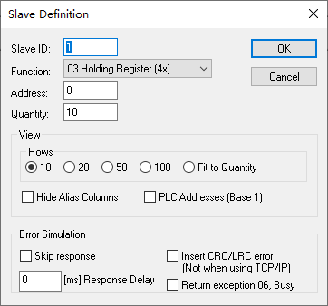
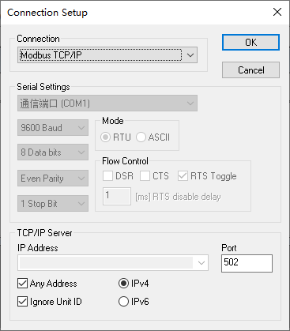

# Modbus Slavel 

## 1. `F8`: 打开 Slave Definition (从属定义) 窗口

> 当前配置模拟：在 Slave ID 为 1 中模拟 10 个 Holding Registers
> 
> **在协议描述中地址为 `40001`**

设备和 Modbus 地址范围：

| Device address | Modbus address  | Description       | Function | R/W        |
|----------------|-----------------|-------------------|----------|------------|
| 1...10000      | address - 1     | Coils(outputs)    | 01       | Read/Write |
| 10001...20000  | address - 10001 | Discrete Inputs   | 02       | Read       |
| 40001...50000  | address - 40001 | Holding Registers | 03       | Read/Write |
| 30001...4000   | address - 30001 | Input Registers   | 04       | Read       |

## 2. `F3`: 打开 Connection Setup (连接设置) 窗口

